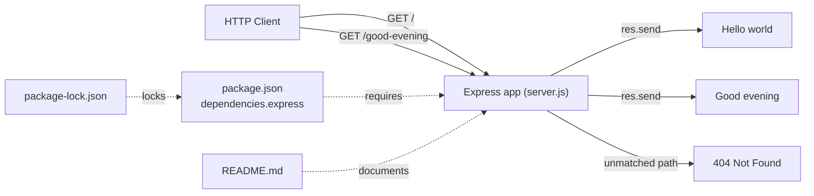

# Technical Specification

# 0. Agent Action Plan

## 0.1 Intent Clarification

The user's request targets a Node.js tutorial server and asks for the Express.js framework to be introduced alongside a new HTTP endpoint. Based on the prompt, the Blitzy platform understands that the refactoring objective is to **introduce the Express.js web framework into the Artifact8 Node.js project and expose a second HTTP endpoint that returns the exact response `Good evening`, while preserving the originally described endpoint that returns the exact response `Hello world`.**

> **User Request (verbatim):** "add feature to a existing product / this is a tutorial of node js server hosting one endpoint that returns the response "Hello world". Could you add expressjs into the project and add another endpoint that return the reponse of "Good evening"?"

### 0.1.1 Core Refactoring Objective

The request is interpreted as a combined **tech-stack migration** (replacing direct use of Node's native `http` module with the Express.js framework) and **feature addition** (introducing a second route). The defining attributes are summarized below.

| Attribute | Determination |
|-----------|---------------|
| Refactoring type | Tech-stack migration (native Node.js `http` → Express.js) combined with a feature addition (new route) |
| Target repository | Same repository — Artifact8, tracked on branch `main` |
| Primary runtime | Node.js (server-side JavaScript) |
| Net-new dependency | `express` (sole production dependency) |
| Delivery model | Single-process HTTP server, delivered in one phase |

Refactoring goals, each restated with enhanced clarity:

- **Adopt Express.js as the HTTP framework** — instantiate an Express application (`const app = express()`) that serves as the central request dispatcher, superseding any hand-written request handling on the native `http` module.
- **Preserve the existing `Hello world` endpoint** — a GET route must continue to return the plain response `Hello world` so that no previously described behavior is lost.
- **Add a new `Good evening` endpoint** — a second GET route must return the plain response `Good evening`.
- **Keep the server runnable and self-contained** — provide a dependency manifest, an install path, and a start command so the project runs with a single command.

Implicit requirements surfaced (not stated outright but necessary for a correct result):

- The `express` package must be declared as a runtime dependency in a `package.json` and installed (producing `node_modules/` and a committed `package-lock.json`).
- The server must continue to **listen on an HTTP port**; the platform standardizes on port `3000` (the Express convention) and makes it overridable via `process.env.PORT`.
- The `Hello world` response must be preserved **byte-for-byte**; the response body string is treated as a literal contract.
- A documented, single-command run path (`npm start` → `node server.js`) must exist so the tutorial remains reproducible.

**Repository State Reconciliation (flagged ambiguity).** Direct repository inspection reveals that the described native Node.js "Hello world" server **does not yet exist** in the codebase: the only tracked file is `README.md`, whose entire content is the single line `# Artifact8` [README.md:L1]. There is no `package.json`, no `.js` source, and no dependency manifest of any kind. The Blitzy platform therefore reconciles the prompt's premise ("an existing server") with the verified empty state by interpreting the request as a **bootstrap-and-extend** operation: the Express-based target — including the preserved `Hello world` endpoint and the new `Good evening` endpoint — is created directly, rather than edited in place over a pre-existing native server. This interpretation fully honors the user's intended end state while remaining faithful to the actual repository contents.

### 0.1.2 Technical Interpretation

This refactoring translates to the following technical transformation strategy: replace the imperative, single-callback request model of Node's native `http` module with Express's declarative routing model, and express each desired response as a discrete route handler. The mapping from the described baseline to the target architecture is as follows.

| Concern | Described baseline (native `http`) | Target (Express.js) |
|---------|------------------------------------|---------------------|
| Server creation | `http.createServer(handler)` | `const app = express()` |
| Request routing | Manual inspection of `req.url` / `req.method` inside one callback | Discrete `app.get(path, handler)` declarations |
| Response write | `res.writeHead(200, …)` + `res.end('Hello world')` | `res.send('Hello world')` |
| Server start | `server.listen(PORT)` | `app.listen(PORT)` (internally wraps `http.createServer`) |
| Unmatched paths | Hand-coded fallback (if any) | Express default `404 Not Found` |

Transformation rules applied during the migration:

- `http.createServer(cb)` ⇒ an `express()` application instance.
- Per-path branching inside the request callback ⇒ one `app.get('<path>', handler)` per endpoint.
- `res.end('<text>')` ⇒ `res.send('<text>')` (Express response helper).
- `server.listen(PORT, …)` ⇒ `app.listen(PORT, …)`, preserving the HTTP listening contract.

## 0.2 Scope Boundaries

Because the repository currently contains only `README.md` [README.md:L1], the in-scope set consists of that single file (to be updated) plus the new files required for a runnable Express project. The project is small and flat, so explicit paths are enumerated rather than broad wildcards.

### 0.2.1 Exhaustively In Scope

**Source transformations:**

- `server.js` (CREATE) — the Express application entry point: requires `express`, instantiates the app, declares `GET /` → `Hello world` and `GET /good-evening` → `Good evening`, and calls `app.listen(PORT)`.

**Dependency management & configuration:**

- `package.json` (CREATE) — npm manifest declaring the `express` dependency, the `start` script, the `main` entry, and the Node `engines` constraint.
- `package-lock.json` (CREATE — generated by `npm install`) — the resolved, locked dependency tree, committed for reproducible installs.
- `.nvmrc` (CREATE) — pins the Node.js version line (`22`) used by the project.
- `.gitignore` (CREATE) — excludes `node_modules/` and common Node artifacts from version control.

**Documentation updates:**

- `README.md` (UPDATE) — expands the current single-line title [README.md:L1] with an overview, prerequisites, install/run instructions, and an endpoint reference table.

**Import corrections:**

- `server.js` — introduces `const express = require('express')`. There are no other files containing import statements to correct (the project is a single-file server), so no repository-wide import sweep is required.

**Rule-mandated files:**

- None. The user supplied no implementation rules, so there are no rule-mandated migration scripts, fixtures, or configuration files to force into scope.

### 0.2.2 Explicitly Out of Scope

- Automated tests and test frameworks (e.g., Jest, Mocha, Supertest) — not requested.
- TypeScript adoption or any transpilation/bundling toolchain (Babel, ts-node, webpack, esbuild).
- Any HTTP endpoints beyond the two specified (`Hello world` and `Good evening`).
- Databases, persistence layers, ORMs, caching, or message queues.
- Authentication, authorization, sessions, cookies, or security-hardening middleware.
- Frontend/UI, templating/view engines, and static asset pipelines (the deliverable is a headless plain-text API).
- Containerization (Docker), orchestration (Kubernetes), CI/CD pipelines, and cloud/deployment infrastructure.
- Logging, monitoring, observability, and rate-limiting frameworks.
- Environment/configuration management beyond the single `PORT` override.
- Any modification to Git history, the `main` branch lineage, or the Blitzy platform source tree.

## 0.3 Target Design

The target is a minimal, idiomatic Express.js project that is runnable with a single command. The structure is intentionally lean to match the explicit "tutorial" framing while still applying sound conventions.

### 0.3.1 Refactored Structure Planning

The complete target layout, rooted at the repository root (branch `main`), is shown below. Every file is enumerated explicitly.

```
Artifact8/
├── .gitignore            (CREATE) — ignores node_modules/, npm-debug.log*, .env
├── .nvmrc                (CREATE) — "22" (pins Node 22 LTS line)
├── README.md             (UPDATE) — overview, prerequisites, install/run, endpoint table
├── package.json          (CREATE) — manifest: express dependency, start script, engines
├── package-lock.json     (CREATE, generated) — locked dependency tree
└── server.js             (CREATE) — Express app: two GET routes + app.listen
```

The single-file `server.js` houses both route handlers inline. This is the most faithful realization of a tutorial server. A modular evolution is described in the design-pattern notes below but is intentionally **not** materialized as separate files, to keep the deliverable unambiguous.

### 0.3.2 Web Search Research Conducted

Research was performed to confirm current versions and idiomatic structure before finalizing the design:

- **Express current version and runtime floor** — the npm registry lists Express `5.2.1` as the latest stable release, and the project documentation states that Node.js 18 or higher is required (npmjs.com / expressjs.com). The target therefore pins `express` at `^5.2.1` and standardizes on the Node 22 LTS line.
- **Canonical Express server pattern** — the official Express "Hello world" guide and the `expressjs/express` README confirm the minimal shape: instantiate `const app = express()`, declare `app.get('/', (req, res) => res.send('Hello World'))`, and start with `app.listen(3000, …)`; the app responds at the root URL and returns `404 Not Found` for unmatched paths.
- **Migration safety (behavior preservation)** — reference material confirms that Express's `app.listen()` encapsulates Node's `http.createServer()`, i.e., Express is built on the same core `http` module; migrating from native `http` to Express therefore preserves the underlying HTTP transport semantics.
- **Installation flow** — the standard bootstrap is `npm init` to create `package.json`, then `npm install express` to add the dependency (which also generates `package-lock.json`).

### 0.3.3 Design Pattern Applications

- **Application / front-controller object** — a single `express()` instance centralizes request dispatch, replacing a hand-written `req.url` switch in a native `http` handler.
- **Declarative routing** — each endpoint is a discrete `app.get(path, handler)` declaration rather than imperative branching on method/URL.
- **Middleware pipeline (chain of responsibility)** — Express's core execution model; kept minimal here because two static text routes require no additional middleware.
- **Externalized configuration (twelve-factor)** — the listening port is read from `process.env.PORT` with a `3000` fallback, avoiding a hardcoded port.
- **Separation of concerns (documented evolution, not in current scope)** — at larger scale the routing layer would move to `src/routes/index.js` using `express.Router()`, with an app factory in `src/app.js` and a thin bootstrap in `server.js`. This is recorded as guidance only and adds no files to the present plan.

### 0.3.4 User Interface Design

Not applicable. The deliverable is a headless HTTP API that returns plain-text responses (`Hello world`, `Good evening`). There is no frontend, no templating/view layer, and no component library or design system involved, so no UI design, design-system alignment, or token mapping is required.

## 0.4 Transformation Mapping

This subsection provides the exhaustive source-to-target mapping. Every target file is listed; where a corresponding source file exists in the repository it is named, otherwise the file is created fresh (no equivalent source exists because the repository is empty apart from `README.md` [README.md:L1]).

### 0.4.1 File-by-File Transformation Plan

| Target File | Transformation | Source File | Key Changes |
|-------------|----------------|-------------|-------------|
| `server.js` | CREATE | (no source — described native server absent) | Express entry point: `require('express')`; `app.get('/', (req,res)=>res.send('Hello world'))`; `app.get('/good-evening', (req,res)=>res.send('Good evening'))`; `app.listen(process.env.PORT \|\| 3000)` |
| `package.json` | CREATE | (no source) | Manifest: `name`, `version`, `main: "server.js"`, `scripts.start: "node server.js"`, `engines.node: ">=18"`, `dependencies.express: "^5.2.1"` |
| `package-lock.json` | CREATE (generated) | (no source) | Locked dependency tree produced by `npm install`; committed for reproducible builds |
| `.nvmrc` | CREATE | (no source) | Single line `22` pinning the Node LTS line |
| `.gitignore` | CREATE | (no source) | Ignore `node_modules/`, `npm-debug.log*`, `.env` |
| `README.md` | UPDATE | `README.md` (current content `# Artifact8` [README.md:L1]) | Retain title; add overview, prerequisites (Node 22 LTS), install (`npm install`), run (`npm start`), and an endpoint table |

### 0.4.2 Cross-File Dependencies

- **Import change in `server.js`** — FROM `const http = require('http')` (the described native baseline) TO `const express = require('express')`.
- **Manifest → entry wiring** — `package.json` `main` and `scripts.start` both reference `server.js`; the `dependencies.express` declaration is consumed by the `require('express')` call in `server.js`.
- **Documentation → behavior wiring** — the `README.md` install/run instructions depend on `package.json` scripts, and its endpoint table mirrors the routes and `PORT` defined in `server.js`.
- **No internal module graph** — the server is single-file, so there are no inter-module import statements to rewrite. (If the documented modular evolution were adopted later, the chain would be `server.js` → `require('./src/app')` → `require('./src/routes')`.)

The request-handling and file-dependency relationships are illustrated below.



### 0.4.3 Wildcard Patterns

No wildcard patterns are required. The project is small and flat, and every in-scope file is enumerated by an explicit path, which is more precise than any pattern. Should patterns ever be needed, only trailing forms (for example `src/**/*.js`) would be used — never leading patterns.

### 0.4.4 One-Phase Execution

The entire refactor executes in a **single Blitzy phase**. All six files (five CREATE, one UPDATE) together with the `npm install` step that materializes `node_modules/` and `package-lock.json` are delivered at once. The work is not split across multiple phases.

## 0.5 Dependency Inventory

### 0.5.1 Key Packages

The table lists every package and runtime relevant to this refactor. Versions are taken from the public npm registry (verified during research) and the project's intended runtime; no placeholder versions are used.

| Registry | Name | Version | Purpose |
|----------|------|---------|---------|
| npm (public) | `express` | `^5.2.1` | Web framework providing declarative routing (`app.get`) and response helpers (`res.send`); the sole production dependency, replacing native `http` request handling |
| Node.js runtime | `node` | 22 LTS (Express requires `>=18`) | JavaScript runtime executing `server.js`; verified environment runtime is v22.22.2, pinned via `.nvmrc` (`22`) and `package.json` `engines.node` (`>=18`) |
| npm (transitive) | `express` dependency tree | resolved & locked in `package-lock.json` | Express's transitive dependencies, installed automatically by `npm install`; not hand-authored |

### 0.5.2 Dependency Updates and Import Refactoring

- **Additions** — `express ^5.2.1` is added as the only production dependency.
- **Updates / removals** — none. The repository has no pre-existing dependency manifest, so there are no dependencies to upgrade or remove.
- **Dev dependencies** — none (no test framework, linter, or build tool is in scope).
- **Import refactoring** — `server.js` introduces `const express = require('express')` (CommonJS). There is **no** repository-wide import sweep: the server is a single file, so the wildcard import-update patterns commonly used in larger refactors (for example `src/**/*.js`) do not apply here.

### 0.5.3 External Reference Updates

- **Build / manifest** — `package.json` (CREATE) declares the dependency and the `start` script; `package-lock.json` (CREATE) locks the resolved tree.
- **Documentation** — `README.md` (UPDATE) documents install/run commands and the endpoint table.
- **CI/CD, additional `*.config.*`, `*.json`, `*.yaml`/`*.yml`** — none present and none added; these remain out of scope.

## 0.6 Special Analysis

This subsection captures migration-specific nuances of moving from the native `http` model to Express, plus the concrete criteria that confirm the result is correct.

### 0.6.1 Migration Semantics and Nuances

- **Transport-layer behavior is preserved.** Express's `app.listen()` encapsulates Node's `http.createServer()`, so the HTTP server semantics are unchanged. The `Hello world` body is preserved exactly through `res.send('Hello world')`.
- **Response Content-Type nuance.** A native `http` server commonly sends `res.writeHead(200, { 'Content-Type': 'text/plain' })` followed by `res.end('Hello world')`. Express's `res.send(string)` instead defaults the `Content-Type` to `text/html; charset=utf-8` and auto-adds `Content-Length` and `ETag`. The **response body is identical**, but the header differs. If strict parity with a plain-text server is desired, the handler should use `res.type('text/plain').send('Hello world')`; otherwise the Express default is acceptable for a tutorial. This is a documented nuance, not a blocker.
- **Routing model and 404 behavior.** Native `http` requires manual `req.url`/`req.method` inspection; Express matches declared routes and returns its default `404 Not Found` for unmatched paths. The target scopes `Hello world` to `GET /` and `Good evening` to `GET /good-evening`; every other path yields a `404`. If the described baseline returned `Hello world` for *every* path, this is a minor, idiomatic behavior refinement worth noting.
- **Port acquisition.** The port is resolved as `process.env.PORT || 3000`. Under Express 5, `app.listen` surfaces an error if the port is already in use; this is acceptable default operational behavior for the tutorial.
- **Statelessness / cross-cutting concerns.** Both handlers are pure, stateless, idempotent string responders. There is no shared mutable state, no persistence, and a single process — so no cross-cutting concerns (authentication, logging, CORS) are introduced or required.

### 0.6.2 Validation Criteria

The implementation is considered correct when all of the following hold:

- `npm install` completes successfully; `express` is present under `node_modules/`; `package-lock.json` is generated.
- `npm start` (equivalently `node server.js`) starts the process and logs the listening port.
- `GET http://localhost:3000/` returns HTTP `200` with the body exactly `Hello world`.
- `GET http://localhost:3000/good-evening` returns HTTP `200` with the body exactly `Good evening`.
- A request to an undeclared path (for example `GET /missing`) returns `404 Not Found` (Express default).
- The `README.md` install and run instructions execute exactly as written.

## 0.7 Refactoring Rules & Constraints

The user supplied no explicit implementation rules (the rules set is empty). The constraints below are therefore derived from the prompt itself and from sound refactoring practice; they are binding on the implementation.

### 0.7.1 Behavior and Compatibility Rules

- **Preserve the existing response contract** — the originally described endpoint must continue to return the exact string `Hello world`, unchanged.
- **Preserve a listening HTTP server** — the server must bind and listen over HTTP (default port `3000`, overridable via `process.env.PORT`).
- **Additive change** — introducing Express and the new endpoint must not remove or alter the described `Hello world` behavior; the new `Good evening` route is purely additive.
- **Single-command runnability** — the project must install with `npm install` and start with `npm start`, with no hidden manual steps.

### 0.7.2 Special Instructions and Constraints

- **Exact response strings (preserve verbatim).** The two response bodies are literal contracts and must be reproduced character-for-character:
  - **User Example:** `Hello world` (existing endpoint, preserved)
  - **User Example:** `Good evening` (new endpoint)
- **Same-repository refactor.** No migration to a new repository was requested; all work occurs in Artifact8 on branch `main`.
- **Bootstrap reconciliation.** Because the described native server is absent from the repository (only `README.md` exists [README.md:L1]), the implementation creates the Express target directly while honoring the preserved-behavior constraints above.
- **Route-path assumption (flagged).** The prompt does not specify URL paths. The plan assigns `Hello world` to `GET /` (conventional root) and `Good evening` to `GET /good-evening`. If the user prefers different paths, only the route strings in `server.js` and the `README.md` endpoint table need adjustment.
- **No over-engineering.** Given the explicit tutorial framing, the implementation stays minimal (single-file server, no extra middleware, no test/build tooling) unless the user requests otherwise.

## 0.8 Attachments

- **File attachments:** None. No PDFs, images, or other files were provided with this request.
- **Figma screens:** None. No Figma frames or URLs were provided; consequently, no design-system alignment, component mapping, or design-token mapping applies to this refactor.

