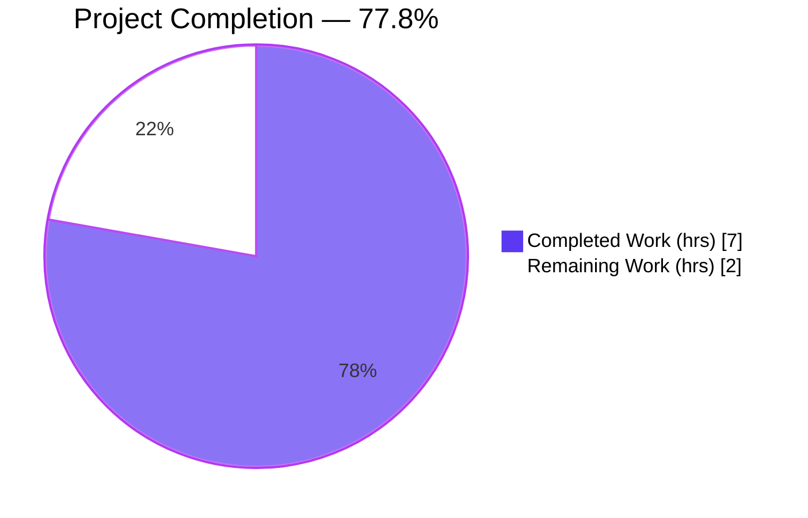
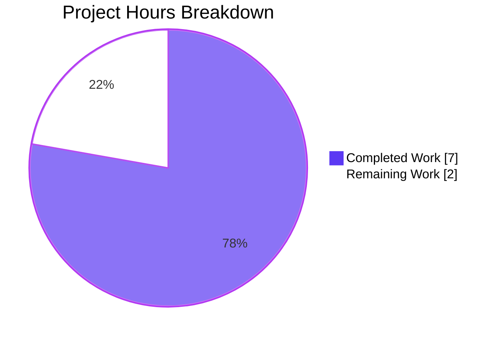
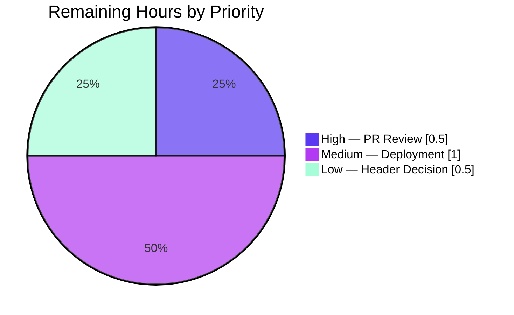

# Blitzy Project Guide — Artifact8: Express.js Tutorial Server

> **Branch:** `blitzy-b692dafc-cb2c-4a0c-abfa-3901dbf33084` &nbsp;|&nbsp; **HEAD:** `7e12cb9` &nbsp;|&nbsp; **Runtime:** Node.js v22.22.3 / npm 11.16.0
> **Brand legend:** Completed / AI Work = Dark Blue **`#5B39F3`** &nbsp;•&nbsp; Remaining / Not Completed = White **`#FFFFFF`**

---

## 1. Executive Summary

### 1.1 Project Overview

Artifact8 is a minimal Express.js tutorial server delivered as a single, flat Node.js (CommonJS) project. The objective was to introduce the Express.js framework into a repository that initially contained only a README, and to expose two plain-text HTTP GET endpoints: the preserved `Hello world` route at `/` and a new additive `Good evening` route at `/good-evening`. The target users are developers learning Node.js and Express fundamentals. Technical scope spans six files — `server.js`, `package.json`, `package-lock.json`, `.nvmrc`, `.gitignore`, and `README.md` — with `express ^5.2.1` as the sole production dependency. The server listens on port 3000 (overridable via `PORT`) and runs with a single `npm start` command.

### 1.2 Completion Status



*Legend: Completed = Dark Blue (`#5B39F3`), Remaining = White (`#FFFFFF`). Center value reflects 7.0 / 9.0 = 77.8% complete.*

| Metric | Value |
|--------|-------|
| **Total Hours** | 9.0 |
| **Completed Hours (AI + Manual)** | 7.0 (AI: 7.0 &nbsp;+&nbsp; Manual: 0.0) |
| **Remaining Hours** | 2.0 |
| **Percent Complete** | **77.8%** |

> Completion is computed using the AAP-scoped, hours-based methodology: **Completion % = Completed Hours / (Completed Hours + Remaining Hours) × 100 = 7.0 / 9.0 × 100 = 77.8%**. The remaining 2.0 hours are exclusively path-to-production activities that, by policy, require a human (PR review, deployment/process-supervision, and an optional response-header decision).

### 1.3 Key Accomplishments

- ✅ **Express.js framework adopted** — `const express = require('express')` with a single `app = express()` front-controller instance replaces any native `http` request handling.
- ✅ **`Hello world` contract preserved byte-for-byte** — `GET /` returns HTTP 200 with the exact body `Hello world` via `res.send('Hello world')`.
- ✅ **New `Good evening` endpoint added** — `GET /good-evening` returns HTTP 200 with the exact body `Good evening` (purely additive).
- ✅ **Sole production dependency pinned** — `express ^5.2.1` declared in `package.json`; resolved to `5.2.1` and locked in `package-lock.json` (lockfileVersion 3, 67 packages).
- ✅ **Reproducible install verified** — `npm ci` adds 66 packages with **0 vulnerabilities**.
- ✅ **Clean compilation** — `node --check server.js` returns SYNTAX OK.
- ✅ **Single-command runnability** — `npm start` → `node server.js`, listening on `process.env.PORT || 3000` with a confirming startup log.
- ✅ **Port override honored** — `PORT=8080 npm start` binds 8080 and serves both endpoints.
- ✅ **Case-sensitive routing** — `GET /GOOD-EVENING` correctly returns 404; unmatched paths return the Express default 404.
- ✅ **Documentation complete** — `README.md` provides overview, prerequisites, install/run, PORT override, and an endpoint reference table; every documented command was executed and verified.
- ✅ **Repository hygiene** — `.nvmrc` pins Node `22`; `.gitignore` excludes `node_modules/`, logs, and `.env`.

### 1.4 Critical Unresolved Issues

| Issue | Impact | Owner | ETA |
|-------|--------|-------|-----|
| *None — no release-blocking defects identified.* All five autonomous production-readiness gates passed with zero defects. | None | — | — |

> The three items in **Section 2.2** are standard, **non-blocking** path-to-production follow-ups (human PR sign-off, deployment supervision, optional header decision), not defects in the delivered artifact.

### 1.5 Access Issues

| System / Resource | Type of Access | Issue Description | Resolution Status | Owner |
|-------------------|----------------|-------------------|-------------------|-------|
| *No access issues identified.* | — | The project is fully self-contained: no databases, external APIs, secrets, or third-party services are in scope. `npm ci` completes from the public npm registry with 0 vulnerabilities. | N/A | — |

### 1.6 Recommended Next Steps

1. **[High]** Perform human PR review of the 6-file diff; on a clean checkout run `npm install` then `npm start`, and `curl` both endpoints plus a 404 path to confirm contracts. Approve and merge. *(≈0.5h)*
2. **[Medium]** Choose a run target and configure process supervision (e.g., `pm2` or `systemd`) with a restart policy and an explicit `PORT`; confirm auto-restart on crash/reboot. *(≈1.0h)*
3. **[Low]** Decide the response-contract posture: keep Express's default `Content-Type: text/html` or switch to `text/plain` via `res.type('text/plain')`; optionally `app.disable('x-powered-by')`. *(≈0.5h)*

---

## 2. Project Hours Breakdown

### 2.1 Completed Work Detail

All completed work is autonomous (AI) effort. Each component traces to a specific AAP deliverable.

| Component | Hours | Description |
|-----------|-------|-------------|
| `server.js` (Express application) | 2.0 | `'use strict'`; `require('express')`; `app = express()`; `app.set('case sensitive routing', true)`; `PORT = process.env.PORT \|\| 3000`; `GET /` → `res.send('Hello world')`; `GET /good-evening` → `res.send('Good evening')`; `app.listen(PORT, …)` with startup log. Fully JSDoc-commented, zero placeholders. |
| `package.json` (manifest) | 0.5 | `name=artifact8`, `version=1.0.0`, `main=server.js`, `scripts.start="node server.js"`, `license=MIT`, `engines.node=">=18"`, `dependencies.express="^5.2.1"`. |
| `package-lock.json` (locked tree) | 0.5 | lockfileVersion 3; express resolved to 5.2.1; 67 packages locked for reproducible installs (`npm ci` verified). |
| `.nvmrc` + `.gitignore` | 0.5 | `.nvmrc` pins Node `22`; `.gitignore` excludes `node_modules/`, `npm-debug.log*`, yarn logs, `*.log`, `.env`. |
| `README.md` (documentation) | 1.5 | Overview, prerequisites (Node 22 LTS), install (`npm install`), run (`npm start`), PORT override, endpoint reference table, and curl examples — every command verified to execute as written. |
| Dependency research & project bootstrap | 0.5 | Express ^5.2.1 selection (latest stable, Node ≥18 floor), `npm init` / `npm install` bootstrap producing the manifest and lockfile. |
| Autonomous validation & QA | 1.5 | Five production-readiness gates: `npm ci` (0 vulns), `node --check` (SYNTAX OK), 5/5 behavioral endpoint-contract checks, runtime startup, and PORT-override verification. |
| **Total Completed** | **7.0** | — |

### 2.2 Remaining Work Detail

All remaining work is path-to-production and, by policy, human-performed. Each category traces to an AAP path-to-production need.

| Category | Hours | Priority |
|----------|-------|----------|
| Human PR review & acceptance (verify 6-file diff; clean-checkout install/run; curl contract check; approve & merge) | 0.5 | High |
| Deployment & process-supervision setup (pm2/systemd, restart policy, PORT, auto-restart confirmation) | 1.0 | Medium |
| Response-contract & header-hygiene decision (text/html vs text/plain; optional `x-powered-by` disable) | 0.5 | Low |
| **Total Remaining** | **2.0** | — |

### 2.3 Reconciliation

| Check | Value | Result |
|-------|-------|--------|
| Section 2.1 — Completed Hours | 7.0 | — |
| Section 2.2 — Remaining Hours | 2.0 | — |
| 2.1 + 2.2 = Total Project Hours | 9.0 | ✅ matches Section 1.2 |
| Completion % = 7.0 / 9.0 × 100 | 77.8% | ✅ matches Sections 1.2, 7, 8 |

---

## 3. Test Results

All entries below originate from Blitzy's autonomous validation logs for this project. The AAP (§0.2.2) explicitly excludes unit-test frameworks (Jest/Mocha/Supertest); adding one would violate scope. The correct validation surface is therefore the **behavioral endpoint contract** plus the dependency-install and compilation gates.

| Test Category | Framework | Total Tests | Passed | Failed | Coverage % | Notes |
|---------------|-----------|-------------|--------|--------|------------|-------|
| Unit | None (out of scope per AAP §0.2.2) | 0 | 0 | 0 | N/A | No unit framework in scope; 0 tests ⇒ 0 failures. |
| Behavioral / API contract | curl + manual assertions (Blitzy runtime gate) | 5 | 5 | 0 | N/A | See the five contracts below. |
| Dependency install | `npm ci` | 1 | 1 | 0 | N/A | Added 66 packages, audited 67, **0 vulnerabilities**. |
| Compilation | `node --check server.js` | 1 | 1 | 0 | N/A | SYNTAX OK (clean V8 parse). |
| **Total** | — | **7** | **7** | **0** | — | 100% pass rate across in-scope checks. |

**Behavioral endpoint contracts (5/5 passed):**

1. `GET /` → HTTP 200, body exactly `Hello world` ✅
2. `GET /good-evening` → HTTP 200, body exactly `Good evening` ✅
3. `GET /missing` → HTTP 404 (`Cannot GET /missing`, Express default) ✅
4. `GET /GOOD-EVENING` → HTTP 404 (case-sensitive routing enforced) ✅
5. `PORT=8080 npm start` → binds 8080 and serves both endpoints ✅

---

## 4. Runtime Validation & UI Verification

This is a headless plain-text HTTP API (no frontend/UI). Runtime health and API integration were validated as follows:

- ✅ **Server startup** — `npm start` logs `Server listening on port 3000` and the process stays up.
- ✅ **`GET /`** — HTTP 200, body `Hello world` (Content-Length: 11).
- ✅ **`GET /good-evening`** — HTTP 200, body `Good evening`.
- ✅ **`GET /missing` (unmatched path)** — HTTP 404, Express default `Cannot GET /missing`.
- ✅ **`GET /GOOD-EVENING` (case sensitivity)** — HTTP 404 as designed.
- ✅ **PORT override** — `PORT=8080 npm start` logs `Server listening on port 8080`; both endpoints serve correctly.
- ✅ **Response headers** — `X-Powered-By: Express`, `Content-Type: text/html; charset=utf-8`, `Content-Length`, and `ETag` present (Express `res.send` defaults).
- ⚠ **Content-Type nuance (informational)** — `res.send(string)` defaults to `text/html` rather than `text/plain`. Body is byte-exact and correct; this is a documented AAP §0.6.1 nuance, not a failure. See Section 2.2 (Low priority) for the optional decision.
- ✅ **UI verification** — Not applicable; no UI, templating, or static assets are in scope.

**Overall runtime status: ✅ Operational.**

---

## 5. Compliance & Quality Review

Cross-mapping of AAP deliverables and validation criteria (AAP §0.6.2) to delivered status.

| AAP Deliverable / Criterion | Benchmark | Status | Notes / Fixes Applied |
|------------------------------|-----------|--------|------------------------|
| Adopt Express.js as HTTP framework | `express()` app instance | ✅ Pass | Front-controller pattern in `server.js`. |
| Preserve `Hello world` (`GET /`) | Byte-exact body | ✅ Pass | `res.send('Hello world')`, HTTP 200. |
| Add `Good evening` (`GET /good-evening`) | Byte-exact body | ✅ Pass | `res.send('Good evening')`, HTTP 200. |
| `express ^5.2.1` sole prod dependency | Manifest + lockfile | ✅ Pass | Resolved 5.2.1; 0 vulnerabilities. |
| Listen on PORT (3000 default, overridable) | `process.env.PORT \|\| 3000` | ✅ Pass | PORT=8080 override verified. |
| Single-command runnability | `npm install` + `npm start` | ✅ Pass | `start` → `node server.js`. |
| `npm install` succeeds; express in `node_modules/`; lockfile generated | Reproducible install | ✅ Pass | `npm ci` ⇒ 66 packages, lockfileVersion 3. |
| Undeclared path → 404 | Express default | ✅ Pass | `GET /missing` ⇒ 404. |
| README install/run executes as written | Doc accuracy | ✅ Pass | All commands + curl examples verified. |
| Compilation cleanliness | `node --check` | ✅ Pass | SYNTAX OK. |
| Code quality — zero placeholders / full JSDoc | Production-ready | ✅ Pass | No TODO/stub; fully commented. |
| Repository hygiene | `.nvmrc` + `.gitignore` | ✅ Pass | Node `22` pinned; artifacts ignored. |
| Case-sensitive routing | Deterministic 404 | ✅ Pass | Fix applied (commit `cc4b62e`). |

**Compliance result: 13 / 13 benchmarks passed (100%).** Fixes applied during autonomous work include case-sensitive routing enforcement and `package.json` normalization. No outstanding compliance items remain within the delivered scope.

---

## 6. Risk Assessment

Overall posture: **LOW.** No High or Critical risks. The single Medium item (process supervision) maps directly to the Section 2.2 deployment task.

| Risk | Category | Severity | Probability | Mitigation | Status |
|------|----------|----------|-------------|------------|--------|
| T1 — `Content-Type: text/html` instead of `text/plain` | Technical | Low | Medium | Optionally `res.type('text/plain')`; body is byte-exact regardless. Documented AAP §0.6.1. | Accepted / Optional |
| T2 — No automated unit-test suite | Technical | Low | Low | Out of scope per AAP §0.2.2; behavioral contracts cover the surface. | Accepted |
| T3 — Express 5.x relative maturity | Technical | Low | Low | Pinned `^5.2.1` + lockfile; 0 vulnerabilities. | Mitigated |
| T4 — Port already in use (`EADDRINUSE`) | Technical | Low | Low | `PORT` override documented; fail-fast error surfaced by Express 5. | Mitigated |
| S1 — `X-Powered-By: Express` disclosure | Security | Low | Medium | Optional `app.disable('x-powered-by')` (Section 2.2 Low). | Optional |
| S2 — No security middleware (helmet/CORS/rate-limit) | Security | Low | Low | Out of scope; no sensitive data or auth surface. | Accepted |
| S3 — Transitive dependency exposure | Security | Low | Low | `package-lock.json` pins the tree; `npm audit` ⇒ 0 vulnerabilities. | Mitigated |
| S4 — No authentication / authorization | Security | Low | Low | Out of scope; public plain-text tutorial endpoints, no sensitive data. | Accepted |
| O1 — No process supervision / auto-restart | Operational | Medium | Medium | Configure pm2/systemd (Section 2.2 Medium, maps to deployment task). | Open (planned) |
| O2 — No logging / monitoring / health endpoint | Operational | Low | Low | Out of scope for a tutorial; startup log present. | Accepted |
| O3 — No graceful shutdown handling | Operational | Low | Low | Acceptable for single-process tutorial; optional `SIGTERM` handler. | Optional |
| I1 — No external integrations | Integration | None | — | Self-contained; nothing to fail. | N/A |
| I2 — `node_modules/` gitignored | Integration | Low | Low | `package-lock.json` guarantees reproducible `npm ci`. | Mitigated |

---

## 7. Visual Project Status

**Hours breakdown (Completed vs Remaining):**



*Legend: Completed = Dark Blue (`#5B39F3`), Remaining = White (`#FFFFFF`). Total = 9.0h; Completed = 7.0h; Remaining = 2.0h.*

**Remaining work by priority (sums to 2.0h):**



**Remaining hours per category (bar view):**

| Category | Hours | Priority |
|----------|------:|----------|
| Human PR review & acceptance | 0.5 | High |
| Deployment & process supervision | 1.0 | Medium |
| Response-contract / header decision | 0.5 | Low |
| **Total** | **2.0** | — |

> Integrity: the pie chart "Remaining Work" value (2) equals Section 1.2 Remaining Hours (2.0) and the Section 2.2 Hours sum (2.0).

---

## 8. Summary & Recommendations

**Achievements.** The Artifact8 Express.js tutorial server is **77.8% complete** on an AAP-scoped, hours-based basis (7.0 of 9.0 hours). Blitzy autonomously delivered 100% of the AAP code-and-documentation deliverables: the Express framework was adopted, the `Hello world` contract was preserved byte-for-byte, the new `Good evening` endpoint was added, and the project installs (`npm ci`, 0 vulnerabilities), compiles (`node --check`), and runs (`npm start`) with all five behavioral endpoint contracts passing.

**Remaining gaps (2.0h, path-to-production only).** The outstanding work is not defects but standard human-gated release activities: (1) human PR review and merge [High, 0.5h], (2) deployment and process-supervision setup [Medium, 1.0h], and (3) an optional response-contract/header-hygiene decision [Low, 0.5h].

**Critical path to production.** PR review & merge → configure process supervision (pm2/systemd) with `PORT` and restart policy → optional header decision → deploy. No blockers exist on this path.

**Success metrics (met):** install succeeds with 0 vulnerabilities; clean compilation; `GET /` ⇒ `Hello world`; `GET /good-evening` ⇒ `Good evening`; unmatched paths ⇒ 404; PORT override works; README commands execute verbatim.

**Production readiness.** The delivered artifact is production-ready for its tutorial purpose; overall risk posture is **LOW** with no High/Critical risks. With the ~2.0 hours of human path-to-production work above, the project is ready for deployment.

---

## 9. Development Guide

### 9.1 System Prerequisites

- **Node.js** — version 22 LTS recommended (`.nvmrc` pins `22`); Express 5 requires Node ≥ 18. Verified environment: **v22.22.3**.
- **npm** — bundled with Node (verified **11.16.0**).
- **OS** — any Node-supported platform (Linux/macOS/Windows). No native build tools required.
- **Network** — outbound access to the public npm registry for the initial install only.

```bash
node --version    # expect v22.x (>= v18)
npm --version     # expect 11.x
```

### 9.2 Environment Setup

```bash
# (Optional) align Node to the pinned version
nvm install     # reads .nvmrc ("22")
nvm use         # activates Node 22
```

- **Environment variables:** only `PORT` is consumed (defaults to `3000`). No `.env` file is required; `.env` is gitignored if you add one.
- **Required services:** none (no database, cache, or message queue).

### 9.3 Dependency Installation

```bash
# From the repository root:
npm install            # first-time / development install
# — or, for a strict reproducible install matching the lockfile —
npm ci                 # expect: "added 66 packages, audited 67" / "found 0 vulnerabilities"
```

Expected: `express` resolves to `5.2.1`; `node_modules/` is created (gitignored); `package-lock.json` (lockfileVersion 3) governs the tree.

### 9.4 Application Startup

```bash
npm start              # = node server.js
# Expected stdout: "Server listening on port 3000"

# Override the port:
PORT=8080 npm start    # Expected: "Server listening on port 8080"

# Optional pre-flight syntax check:
node --check server.js # Expected: no output, exit code 0 (SYNTAX OK)
```

### 9.5 Verification Steps

```bash
# In a second terminal (server running on default port 3000):
curl http://localhost:3000/                 # -> Hello world
curl http://localhost:3000/good-evening     # -> Good evening
curl -i http://localhost:3000/              # -> HTTP/1.1 200 OK, X-Powered-By: Express,
                                            #    Content-Type: text/html; charset=utf-8, Content-Length: 11
curl -i http://localhost:3000/missing       # -> HTTP/1.1 404 Not Found (Cannot GET /missing)
curl -i http://localhost:3000/GOOD-EVENING  # -> HTTP/1.1 404 Not Found (case-sensitive)
```

### 9.6 Example Usage

```bash
$ curl http://localhost:3000/
Hello world

$ curl http://localhost:3000/good-evening
Good evening
```

### 9.7 Troubleshooting

| Symptom | Likely Cause | Resolution |
|---------|--------------|------------|
| `Error: listen EADDRINUSE :::3000` | Port 3000 already in use | Start on another port: `PORT=8080 npm start`, or stop the conflicting process. |
| `Cannot find module 'express'` | Dependencies not installed | Run `npm install` (or `npm ci`) from the repo root. |
| Wrong Node version / syntax errors | Node < 18 active | `nvm use` (reads `.nvmrc` → `22`), or install Node 22 LTS. |
| `GET /good-evening` works but `/GOOD-EVENING` 404s | Case-sensitive routing (by design) | Use the exact lowercase path `/good-evening`. |
| Need to stop the server | Foreground process | Press `Ctrl+C`; if backgrounded, `kill <pid>` of the `node server.js` process. |

---

## 10. Appendices

### A. Command Reference

| Command | Purpose |
|---------|---------|
| `npm install` | Install dependencies (development). |
| `npm ci` | Strict, reproducible install from `package-lock.json`. |
| `npm start` | Start the server (`node server.js`). |
| `PORT=8080 npm start` | Start on a custom port. |
| `node --check server.js` | Syntax-check without executing. |
| `npm audit` | Report dependency vulnerabilities (expect 0). |
| `curl http://localhost:3000/` | Exercise the `Hello world` endpoint. |
| `curl http://localhost:3000/good-evening` | Exercise the `Good evening` endpoint. |

### B. Port Reference

| Port | Service | Notes |
|------|---------|-------|
| 3000 | Express HTTP server (default) | Used when `PORT` is unset. |
| `$PORT` | Express HTTP server (override) | Any valid port via `process.env.PORT`, e.g. `8080`. |

### C. Key File Locations

| File | Role |
|------|------|
| `server.js` | Express entry point: app instance, two GET routes, `app.listen`. |
| `package.json` | Manifest: `express` dependency, `start` script, `engines`, `main`. |
| `package-lock.json` | Locked dependency tree (lockfileVersion 3, 67 packages). |
| `.nvmrc` | Node version pin (`22`). |
| `.gitignore` | Ignores `node_modules/`, logs, `.env`. |
| `README.md` | Overview, prerequisites, install/run, endpoint table. |

### D. Technology Versions

| Component | Version |
|-----------|---------|
| Node.js (verified) | v22.22.3 |
| Node.js (pinned `.nvmrc`) | 22 |
| Node.js (engines floor) | >= 18 |
| npm (verified) | 11.16.0 |
| express (declared) | ^5.2.1 |
| express (resolved) | 5.2.1 |
| lockfileVersion | 3 |

### E. Environment Variable Reference

| Variable | Default | Required | Purpose |
|----------|---------|----------|---------|
| `PORT` | `3000` | No | TCP port the HTTP server binds to. |

### F. Developer Tools Guide

| Tool | Usage |
|------|-------|
| `node --check <file>` | Static syntax validation (no execution). |
| `npm audit` | Vulnerability scan of the dependency tree. |
| `nvm use` | Activate the `.nvmrc`-pinned Node version. |
| `curl -i <url>` | Inspect HTTP status and response headers. |

### G. Glossary

| Term | Definition |
|------|------------|
| **AAP** | Agent Action Plan — the authoritative specification of project scope. |
| **CommonJS** | Node's `require()`/`module.exports` module system (used here). |
| **Front controller** | A single dispatch object (`app = express()`) routing all requests. |
| **Path-to-production** | Standard release activities (review, deploy, supervision) beyond code authoring. |
| **lockfile** | `package-lock.json` capturing the exact resolved dependency tree. |
| **EADDRINUSE** | OS error indicating the target port is already bound. |

---

*Generated by the Blitzy autonomous assessment agent. Completion (77.8%) reflects AAP-scoped and path-to-production work only. Colors: Completed = `#5B39F3`, Remaining = `#FFFFFF`.*