# Technical Specification

# 1. Introduction

This Technical Specification documents the **Artifact8** project. This Introduction section establishes the foundational context for the document, defining the project identity, the verifiable current state of the codebase, and the boundaries of what can and cannot be authoritatively described at this point in the project's lifecycle.

A critical disclosure governs the entirety of this Introduction: the Artifact8 repository, at the time this specification was authored, exists exclusively as a stub. It contains a single tracked file — `README.md` — whose entire content is the eleven-byte string `# Artifact8`. No source code, dependency manifests, configuration files, build descriptors, infrastructure-as-code, API specifications, database schemas, test suites, or supplementary documentation are present in any branch, at any depth, in the repository. Consequently, the standard Introduction subsections (Executive Summary, System Overview, Scope) are populated with the verifiable facts that exist and explicitly mark all other expected attributes as **Not Documented in Current Repository State**. This approach preserves the document's authoritative integrity and avoids the fabrication of business context, stakeholders, capabilities, or scope that the codebase does not yet substantiate.

## 1.1 EXECUTIVE SUMMARY

### 1.1.1 Project Overview

The project is identified as **"Artifact8"**, derived directly and exclusively from the H1 heading in the repository's sole tracked file, `README.md`. The repository was initialized on **June 1, 2026** via a single Git commit titled "Initial commit" (hash `4cdb1ff7d5c4423fb475c9c2707d5d83abba3bf2`) and currently exists in a pre-implementation, placeholder state. No descriptive text, architectural intent, problem statement, or domain definition accompanies the project name in the repository.

| Attribute | Documented Value | Evidence Source |
|-----------|------------------|-----------------|
| Project Name | Artifact8 | `README.md` (H1 heading) |
| Repository Initialization Date | June 1, 2026 | Git commit metadata |
| Default Branch | `main` (with `origin/main` remote) | Git branch listing |
| Tracked Files in History | 1 (`README.md` only) | Git log inspection |

### 1.1.2 Core Business Problem

| Attribute | Status |
|-----------|--------|
| Business Problem Statement | Not Documented in Current Repository State |
| Domain Description | Not Documented in Current Repository State |
| Problem Validation Artifacts | Not Documented in Current Repository State |

No business problem, market need, technical pain point, or domain hypothesis has been recorded within the repository. The single-heading README provides no narrative content from which a problem statement could be derived.

### 1.1.3 Key Stakeholders and Users

| Stakeholder Category | Identified Party | Source |
|----------------------|------------------|--------|
| Repository Author/Contributor | shalini690 (shalini@blitzy.io) | Git commit author metadata |
| End Users / User Personas | Not Documented in Current Repository State | — |
| Business Sponsors | Not Documented in Current Repository State | — |
| Operational Owners | Not Documented in Current Repository State | — |

The sole identifiable party with any documented relationship to the repository is the author of the initial commit. No personas, roles, user groups, sponsors, or operational owners are documented.

### 1.1.4 Expected Business Impact and Value Proposition

| Attribute | Status |
|-----------|--------|
| Value Proposition | Not Documented in Current Repository State |
| Expected Business Outcomes | Not Documented in Current Repository State |
| Revenue / Cost / Efficiency Targets | Not Documented in Current Repository State |
| Strategic Alignment Statements | Not Documented in Current Repository State |

No value proposition, outcome statements, financial projections, or strategic alignment content is available in the repository.

## 1.2 SYSTEM OVERVIEW

### 1.2.1 Project Context

#### Business Context and Market Positioning

| Attribute | Status |
|-----------|--------|
| Market Positioning | Not Documented in Current Repository State |
| Competitive Landscape | Not Documented in Current Repository State |
| Target Market Segment | Not Documented in Current Repository State |
| Regulatory or Compliance Context | Not Documented in Current Repository State |

The repository contains no description of business context, target market, or competitive positioning.

#### Current System Limitations

The repository contains no reference to any predecessor system, legacy platform, or existing tooling that Artifact8 is intended to replace, upgrade, or supersede. There are no migration notes, deprecation references, or comparative descriptions of any incumbent solution.

| Attribute | Status |
|-----------|--------|
| Existing System Being Replaced | None Documented |
| Known Limitations to Address | Not Documented in Current Repository State |
| Migration / Transition Notes | Not Documented in Current Repository State |

#### Integration with Existing Enterprise Landscape

| Attribute | Status |
|-----------|--------|
| Enterprise Systems Identified for Integration | Not Documented in Current Repository State |
| External APIs or Services | Not Documented (no dependency manifests present) |
| Authentication / Identity Provider Integration | Not Documented in Current Repository State |
| Data Source / Sink Integrations | Not Documented in Current Repository State |

The repository contains no `package.json`, `requirements.txt`, `pom.xml`, `Cargo.toml`, `go.mod`, `pyproject.toml`, or any other dependency manifest that could indicate intended integrations. No environment configuration files, infrastructure-as-code, or API client definitions are present.

### 1.2.2 High-Level Description

#### Primary System Capabilities

| Attribute | Status |
|-----------|--------|
| Functional Capabilities | Not Documented in Current Repository State |
| User-Facing Features | Not Documented in Current Repository State |
| Administrative / Operational Capabilities | Not Documented in Current Repository State |

No functional capabilities are described in the repository. With no source files, no capability set can be inferred from implementation.

#### Major System Components

| Attribute | Status |
|-----------|--------|
| Frontend / Client Components | Not Documented in Current Repository State |
| Backend / Service Components | Not Documented in Current Repository State |
| Data Storage Components | Not Documented in Current Repository State |
| Cross-Cutting / Platform Components | Not Documented in Current Repository State |

No source code directories, modules, services, packages, or component boundaries exist in the repository to support a component decomposition.

#### Core Technical Approach

| Attribute | Status |
|-----------|--------|
| Programming Languages | Not Documented (no source files present) |
| Frameworks / Runtimes | Not Documented (no manifests present) |
| Architectural Style | Not Documented in Current Repository State |
| Deployment Model | Not Documented in Current Repository State |

The absence of source files, build descriptors, and dependency declarations means no technical stack can be authoritatively asserted.

#### Current Repository State (Visual Summary)

The following diagram illustrates the verifiable state of the Artifact8 repository as evidenced by direct inspection.

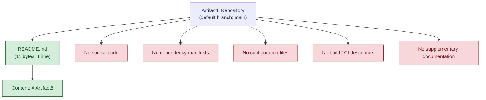

### 1.2.3 Success Criteria

#### Measurable Objectives

| Attribute | Status |
|-----------|--------|
| Quantitative Objectives | Not Documented in Current Repository State |
| Qualitative Objectives | Not Documented in Current Repository State |
| Target Delivery Milestones | Not Documented in Current Repository State |

#### Critical Success Factors

| Attribute | Status |
|-----------|--------|
| Technical Success Factors | Not Documented in Current Repository State |
| Organizational Success Factors | Not Documented in Current Repository State |
| External Dependencies for Success | Not Documented in Current Repository State |

#### Key Performance Indicators (KPIs)

| KPI Category | Defined KPIs | Status |
|--------------|--------------|--------|
| Business KPIs | — | Not Documented in Current Repository State |
| Operational KPIs | — | Not Documented in Current Repository State |
| Technical / Quality KPIs | — | Not Documented in Current Repository State |
| User Experience KPIs | — | Not Documented in Current Repository State |

No measurable objectives, success factors, or KPIs are defined in any artifact within the repository.

## 1.3 SCOPE

The scope of the Artifact8 project cannot be authoritatively defined from the current repository contents. The subsections below enumerate the expected scope categories and explicitly mark them as undefined where the repository provides no evidence. These placeholders are intended to be replaced with substantive content as the project's authoritative artifacts are committed to the repository.

### 1.3.1 In-Scope Elements

#### Core Features and Functionalities

| Category | In-Scope Items | Status |
|----------|----------------|--------|
| Must-Have Capabilities | — | Not Documented in Current Repository State |
| Primary User Workflows | — | Not Documented in Current Repository State |
| Essential Integrations | — | Not Documented in Current Repository State |
| Key Technical Requirements | — | Not Documented in Current Repository State |

#### Implementation Boundaries

| Boundary Dimension | Defined Boundary | Status |
|--------------------|------------------|--------|
| System Boundaries | — | Not Documented in Current Repository State |
| User Groups Covered | — | Not Documented in Current Repository State |
| Geographic / Market Coverage | — | Not Documented in Current Repository State |
| Data Domains Included | — | Not Documented in Current Repository State |

### 1.3.2 Out-of-Scope Elements

| Category | Excluded Items | Status |
|----------|----------------|--------|
| Excluded Features / Capabilities | — | Not Documented in Current Repository State |
| Future Phase Considerations | — | Not Documented in Current Repository State |
| Integration Points Not Covered | — | Not Documented in Current Repository State |
| Unsupported Use Cases | — | Not Documented in Current Repository State |

### 1.3.3 Scope Determination Constraint

Because the repository contains no functional, architectural, or domain artifacts, no element can be authoritatively categorized as either in-scope or out-of-scope. The single observable scope-relevant fact is that the project is currently named **Artifact8** and is tracked in a Git repository on the `main` branch. Any further scope assertion would constitute fabrication and is therefore deliberately omitted from this specification until substantive artifacts are introduced into the repository.

## 1.4 EVIDENCE BASE AND DOCUMENT INTEGRITY

### 1.4.1 Verifiable Facts Summary

The following table consolidates every fact in this Introduction that is supported by direct evidence in the repository.

| # | Fact | Evidence Source |
|---|------|-----------------|
| 1 | Project name is "Artifact8" | `README.md` — sole H1 heading |
| 2 | Repository contains exactly one tracked file | Git log; root directory listing |
| 3 | Default branch is `main` with `origin/main` remote | Git branch listing |
| 4 | Repository was initialized via a single "Initial commit" | Git commit log |
| 5 | Initial commit date is June 1, 2026 | Git commit timestamp metadata |
| 6 | Initial commit author is shalini690 (shalini@blitzy.io) | Git commit author metadata |
| 7 | `README.md` total size is 11 bytes | Direct file inspection |

### 1.4.2 Document Authoring Constraints

| Constraint | Rationale |
|------------|-----------|
| No business context fabricated | Repository contains no domain or problem descriptions |
| No stakeholders inferred beyond the commit author | Repository contains no persona or role documentation |
| No technical stack asserted | Repository contains no source files or dependency manifests |
| No KPIs or success criteria proposed | Repository contains no objectives or measurement artifacts |
| No integrations described | Repository contains no manifests or configuration files |
| No scope items enumerated | Repository contains no scope, roadmap, or backlog artifacts |

### 1.4.3 Recommended Next Steps for Project Authoring

While outside the strict factual scope of this specification, the absence of substantive content suggests that subsequent contributions to the repository should introduce, at minimum: a descriptive README narrative beyond the project name, a dependency manifest establishing the chosen technology stack, an initial source directory structure reflecting intended components, and a scope or roadmap document enabling the in-scope/out-of-scope tables of this Introduction to be populated with verifiable content.

#### References

#### Files Examined

- `README.md` — The sole tracked file in the repository. Its entire content (`# Artifact8`, 11 bytes) provided the only piece of evidence-based content used in this section: the project name.

#### Folders Explored

- `""` (repository root) — Contains exactly one child (`README.md`) and no subdirectories beyond the standard `.git/` metadata directory. Confirmed empty of any source, configuration, or documentation artifacts.

#### Repository Metadata Inspected

- Git commit history (`git log --all`, `git log -p`) — Confirmed a single "Initial commit" (`4cdb1ff7d5c4423fb475c9c2707d5d83abba3bf2`) authored by shalini690 on June 1, 2026, introducing only `README.md`.
- Git branch listing — Confirmed `main` as the sole local branch with an `origin/main` remote tracking reference.
- OS-level filesystem inspection — Confirmed the absence of `.gitignore`, `.blitzyignore`, dependency manifests, configuration files, build descriptors, and any other commonly expected project artifacts.

#### Cross-Referenced Specification Sections

- None. The list of potentially relevant sections supplied to this authoring task was empty, indicating no sibling sections were available for cross-reference at the time of authoring.

# 2. Product Requirements

The Artifact8 repository is in a pre-implementation, placeholder state in which no functional, architectural, or domain artifacts have been committed beyond a single-line `README.md` containing only the project name. Consequently, this section cannot enumerate discrete features, functional requirements, acceptance criteria, dependencies, or implementation considerations from evidence. In strict adherence to the authoring constraints established in **Section 1.4.2 (Document Authoring Constraints)** and the scope determination constraint stated in **Section 1.3.3 (Scope Determination Constraint)**, this section documents the absence of authoritative product requirement inputs rather than fabricating them. The subsection structure below preserves the canonical Product Requirements schema (Feature Catalog, Functional Requirements Table, Feature Relationships, Implementation Considerations, Traceability Matrix) so that future contributions to the repository can populate each placeholder with verifiable content without restructuring the specification.

## 2.1 REQUIREMENTS ENUMERATION CONSTRAINT

### 2.1.1 Pre-Requisite Inputs and Repository Evidence

Authoritative requirements enumeration depends on the presence of identifiable artifacts in the source repository. The following table maps each canonical Product Requirements input to the corresponding evidence (or absence of evidence) in the Artifact8 repository.

| Required Input | Repository Evidence | Status |
|----------------|---------------------|--------|
| Discrete Features | No source code, design documents, or backlog artifacts present | Absent |
| Feature Priorities | No roadmap, backlog, or priority annotations present | Absent |
| Functional Requirements | No requirements documents, user stories, or specifications present | Absent |
| Acceptance Criteria | No test files, behavioural specifications, or BDD artifacts present | Absent |

| Required Input | Repository Evidence | Status |
|----------------|---------------------|--------|
| Dependencies | No `package.json`, `requirements.txt`, `pom.xml`, `Cargo.toml`, `go.mod`, or `pyproject.toml` present | Absent |
| Integration Points | No API client code, service definitions, or contract specifications present | Absent |
| Performance Criteria | No SLA documents, benchmarks, or performance test artifacts present | Absent |
| Security & Compliance Requirements | No authentication code, security configuration, policy documents, or audit artifacts present | Absent |

### 2.1.2 Applicable Authoring Constraints

The Product Requirements section is authored under the same evidence-only authoring discipline established in earlier introduction sections. The constraints summarized below are restated for traceability within this section.

| Constraint | Source / Cross-Reference |
|------------|--------------------------|
| Do not invent feature identifiers, names, or priorities | Section 1.4.2 — "No business context fabricated" |
| Do not infer requirements from project name alone | Section 1.4.2 — "No technical stack asserted" |
| Do not enumerate scope items absent supporting artifacts | Section 1.3.3 — Scope Determination Constraint |
| Do not propose KPIs or measurable acceptance thresholds | Section 1.2.3 — KPIs marked Not Documented |
| Do not assert integrations or external dependencies | Section 1.2.1 — Integration with Existing Enterprise Landscape |
| Only document feature relationships clearly evidenced | Section 2 authoring prompt (explicit instruction) |

### 2.1.3 Verified Repository State (Cross-Reference)

The verifiable facts that bound this section's authorship are inherited from the evidence base catalogued in **Section 1.4.1 (Verifiable Facts Summary)**. The single piece of evidence with any bearing on product requirements is the project name "Artifact8", derived from the H1 heading in `README.md`. No further evidence is available from which feature definitions could be authoritatively extracted.

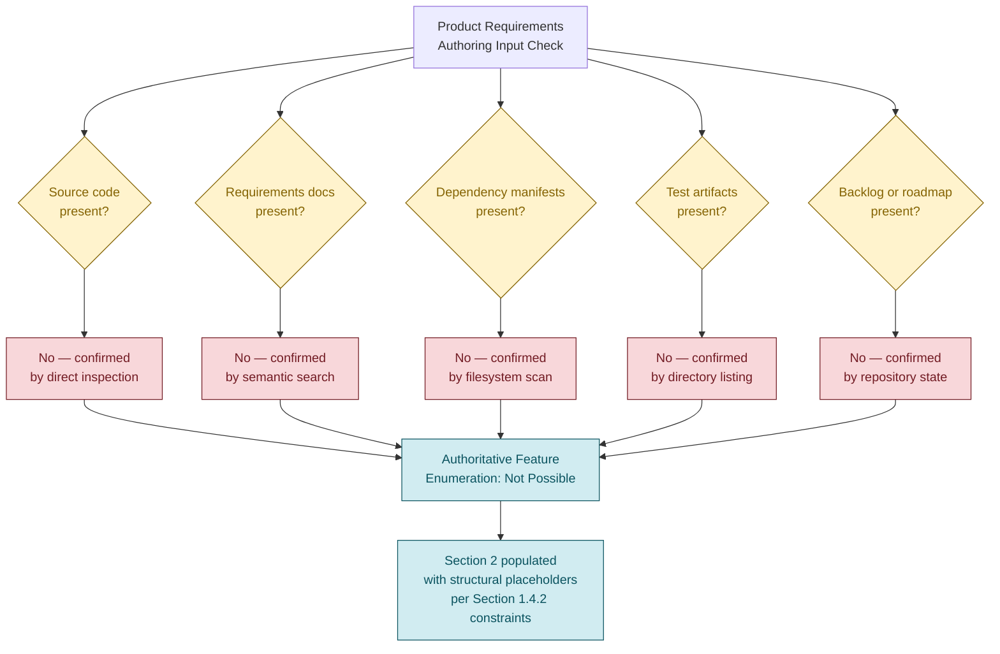

## 2.2 FEATURE CATALOG

### 2.2.1 Feature Inventory Summary

No features have been identified, proposed, designed, or implemented in the Artifact8 repository. The placeholder inventory below is reserved for future population once feature-bearing artifacts are introduced.

| Attribute | Value |
|-----------|-------|
| Total Identified Features | 0 |
| Highest Assigned Feature ID | None |
| Feature Categories Represented | Not Documented in Current Repository State |
| Priority Levels Distribution | Not Documented in Current Repository State |

### 2.2.2 Feature Metadata Schema (Reserved for Future Population)

The following schema is preserved as a contract for future contributors. No row currently satisfies the schema because no feature evidence exists. Feature identifiers conform to the format `F-XXX` per the section authoring prompt.

| Metadata Field | Permitted Values | Current Entries |
|----------------|------------------|-----------------|
| Unique ID | `F-XXX` (zero-padded sequence) | None — no features identified |
| Feature Name | Free-text descriptor | None — no features identified |
| Feature Category | Free-text classification | None — no features identified |
| Priority Level | Critical / High / Medium / Low | None — no features identified |

| Metadata Field | Permitted Values | Current Entries |
|----------------|------------------|-----------------|
| Status | Proposed / Approved / In Development / Completed | None — no features identified |

### 2.2.3 Feature Description Schema (Reserved for Future Population)

| Description Field | Purpose | Current Entries |
|-------------------|---------|-----------------|
| Overview | Concise feature summary | Not Documented in Current Repository State |
| Business Value | Value contribution rationale | Not Documented in Current Repository State |
| User Benefits | End-user impact narrative | Not Documented in Current Repository State |
| Technical Context | Implementation context summary | Not Documented in Current Repository State |

### 2.2.4 Feature Dependencies Schema (Reserved for Future Population)

| Dependency Field | Purpose | Current Entries |
|------------------|---------|-----------------|
| Prerequisite Features | Internal feature predecessors | Not Documented in Current Repository State |
| System Dependencies | Internal subsystem dependencies | Not Documented in Current Repository State |
| External Dependencies | Third-party libraries or services | Not Documented in Current Repository State |
| Integration Requirements | Required integration contracts | Not Documented in Current Repository State |

## 2.3 FUNCTIONAL REQUIREMENTS TABLE

### 2.3.1 Functional Requirements Inventory Summary

No functional requirements have been documented for the Artifact8 system. Because no features exist (Section 2.2.1) and no requirements artifacts (specifications, user stories, BDD scenarios, or design documents) are present in the repository, no requirement identifiers of the form `F-XXX-RQ-YYY` can be assigned without violating the authoring constraints recorded in **Section 1.4.2**.

| Attribute | Value |
|-----------|-------|
| Total Documented Requirements | 0 |
| Requirements with Acceptance Criteria | 0 |
| Must-Have Requirements | 0 |
| Should-Have / Could-Have Requirements | 0 |

### 2.3.2 Requirement Details Schema (Reserved for Future Population)

The following schema is preserved for future authoring. All entries are marked as unpopulated until requirement-bearing artifacts are introduced into the repository.

| Schema Field | Permitted Format | Current Entries |
|--------------|------------------|-----------------|
| Requirement ID | `F-XXX-RQ-YYY` | None — no requirements documented |
| Description | Free-text requirement statement | None — no requirements documented |
| Acceptance Criteria | Testable pass/fail conditions | None — no requirements documented |
| Priority | Must-Have / Should-Have / Could-Have | None — no requirements documented |

| Schema Field | Permitted Format | Current Entries |
|--------------|------------------|-----------------|
| Complexity | High / Medium / Low | None — no requirements documented |

### 2.3.3 Technical Specifications Schema (Reserved for Future Population)

| Specification Field | Purpose | Current Entries |
|---------------------|---------|-----------------|
| Input Parameters | Required inputs and formats | Not Documented in Current Repository State |
| Output / Response | Output shape and format | Not Documented in Current Repository State |
| Performance Criteria | Latency, throughput, resource targets | Not Documented in Current Repository State |
| Data Requirements | Data model and persistence needs | Not Documented in Current Repository State |

### 2.3.4 Validation Rules Schema (Reserved for Future Population)

| Validation Field | Purpose | Current Entries |
|------------------|---------|-----------------|
| Business Rules | Domain-specific rule constraints | Not Documented in Current Repository State |
| Data Validation | Input/output validation logic | Not Documented in Current Repository State |
| Security Requirements | AuthN/AuthZ, encryption, audit | Not Documented in Current Repository State |
| Compliance Requirements | Regulatory or policy obligations | Not Documented in Current Repository State |

## 2.4 FEATURE RELATIONSHIPS

### 2.4.1 Dependency Map

No feature-to-feature dependencies can be documented because no features have been identified (Section 2.2.1). The section prompt's explicit directive — that feature relationships must be "clearly evident in the requirements or source code" — combined with the absence of both requirements and source code, precludes any dependency assertion.

| Relationship Attribute | Value |
|------------------------|-------|
| Documented Feature-to-Feature Dependencies | 0 |
| Documented Upstream Dependencies | 0 |
| Documented Downstream Dependents | 0 |
| Dependency Graph | Not Applicable — no nodes available |

### 2.4.2 Integration Points

| Integration Attribute | Value | Source / Cross-Reference |
|-----------------------|-------|--------------------------|
| Internal Integration Points | None Documented | Section 1.2.2 — no components identified |
| External Integration Points | None Documented | Section 1.2.1 — no dependency manifests present |
| Identified APIs Consumed | None Documented | No API client code present |
| Identified APIs Exposed | None Documented | No service definitions present |

### 2.4.3 Shared Components and Common Services

No shared components, common services, or cross-cutting concerns are documented in the repository. The component inventory in **Section 1.2.2 (Major System Components)** confirms that frontend, backend, data storage, and cross-cutting component categories are all marked "Not Documented in Current Repository State."

| Shared Asset Category | Documented Instances | Status |
|-----------------------|----------------------|--------|
| Shared Libraries | 0 | Not Applicable |
| Common Services | 0 | Not Applicable |
| Cross-Cutting Concerns | 0 | Not Applicable |
| Reusable Utilities | 0 | Not Applicable |

## 2.5 IMPLEMENTATION CONSIDERATIONS

Implementation considerations articulate the constraints, performance expectations, scalability concerns, security implications, and maintenance obligations that govern each feature. Because no features exist (Section 2.2) and no implementation artifacts have been committed to the repository, no implementation considerations can be documented from evidence. The schema below is preserved for future per-feature population.

### 2.5.1 Technical Constraints

| Constraint Dimension | Documented Constraint | Status |
|----------------------|------------------------|--------|
| Programming Language Constraints | None | Not Documented — see Section 1.2.2 |
| Framework / Runtime Constraints | None | Not Documented — see Section 1.2.2 |
| Platform / Deployment Constraints | None | Not Documented — see Section 1.2.2 |
| License or Legal Constraints | None | Not Documented in Current Repository State |

### 2.5.2 Performance Requirements

| Performance Dimension | Target Value | Status |
|-----------------------|--------------|--------|
| Latency Targets | — | Not Documented in Current Repository State |
| Throughput Targets | — | Not Documented in Current Repository State |
| Resource Utilization Targets | — | Not Documented in Current Repository State |
| Availability / SLA Targets | — | Not Documented in Current Repository State |

### 2.5.3 Scalability Considerations

| Scalability Dimension | Approach / Target | Status |
|-----------------------|-------------------|--------|
| Horizontal Scaling Strategy | — | Not Documented in Current Repository State |
| Vertical Scaling Strategy | — | Not Documented in Current Repository State |
| Data Volume Growth Assumptions | — | Not Documented in Current Repository State |
| Concurrent User Assumptions | — | Not Documented in Current Repository State |

### 2.5.4 Security Implications

| Security Dimension | Approach / Control | Status |
|--------------------|---------------------|--------|
| Authentication Mechanism | — | Not Documented in Current Repository State |
| Authorization Model | — | Not Documented in Current Repository State |
| Data Protection (At-Rest / In-Transit) | — | Not Documented in Current Repository State |
| Audit and Logging Requirements | — | Not Documented in Current Repository State |

### 2.5.5 Maintenance Requirements

| Maintenance Dimension | Approach / Cadence | Status |
|------------------------|--------------------|--------|
| Operational Runbooks | — | Not Documented in Current Repository State |
| Patching / Upgrade Cadence | — | Not Documented in Current Repository State |
| Observability and Monitoring | — | Not Documented in Current Repository State |
| Disaster Recovery Procedures | — | Not Documented in Current Repository State |

## 2.6 TRACEABILITY MATRIX

### 2.6.1 Matrix Schema and Current Population State

The traceability matrix establishes bidirectional linkage between features (`F-XXX`), functional requirements (`F-XXX-RQ-YYY`), acceptance criteria, and supporting test or implementation artifacts. With zero features and zero requirements documented, the matrix is structurally empty. The schema below is preserved for future population.

| Feature ID | Requirement ID | Acceptance Criterion | Verification Artifact |
|------------|----------------|----------------------|------------------------|
| — | — | — | — |

*The matrix currently contains zero rows. Each subsequent feature introduced into the repository should add one row per requirement, with explicit linkage to the artifact that demonstrates compliance.*

### 2.6.2 Coverage Summary

| Coverage Metric | Value |
|-----------------|-------|
| Features with at Least One Requirement | 0 of 0 (n/a) |
| Requirements with Acceptance Criteria | 0 of 0 (n/a) |
| Requirements with Verification Artifacts | 0 of 0 (n/a) |
| Overall Traceability Coverage | Not Calculable |

### 2.6.3 Related Process Flowcharts and Specification Cross-References

No process flowcharts have been authored in upstream sections of this specification that depict feature-level processes, because no features exist. The only diagram authored to date is the repository state visual summary in **Section 1.2.2 (Major System Components)**, which depicts the empty state of the repository rather than any feature flow. Cross-references applicable to this section are:

| Reference Target | Purpose | Section |
|------------------|---------|---------|
| Verifiable Facts Summary | Bounds the evidence base for all sections | Section 1.4.1 |
| Document Authoring Constraints | Enumerates fabrication prohibitions | Section 1.4.2 |
| Scope Determination Constraint | Establishes precedent for documenting absence | Section 1.3.3 |
| Major System Components | Confirms absence of component inventory | Section 1.2.2 |

## 2.7 ASSUMPTIONS, CONSTRAINTS, AND VERSION TRACKING

### 2.7.1 Documented Assumptions

| Assumption Category | Stated Assumption | Status |
|---------------------|-------------------|--------|
| Business Assumptions | None | Not Documented in Current Repository State |
| Technical Assumptions | None | Not Documented in Current Repository State |
| Operational Assumptions | None | Not Documented in Current Repository State |
| User Assumptions | None | Not Documented in Current Repository State |

### 2.7.2 Documented Constraints

| Constraint Category | Stated Constraint | Source |
|---------------------|-------------------|--------|
| Authoring Constraints | All requirements content must be evidence-based; no fabrication permitted | Section 1.4.2 |
| Scope Constraints | No in-scope or out-of-scope item may be asserted absent supporting evidence | Section 1.3.3 |
| Schema Constraints | Feature IDs follow `F-XXX`; requirement IDs follow `F-XXX-RQ-YYY` | Section 2 authoring prompt |
| Evidence Constraints | Sole evidence available is the project name "Artifact8" | Section 1.4.1 |

### 2.7.3 Requirement Version Tracking

| Tracking Attribute | Value |
|--------------------|-------|
| Current Specification Version | Initial — derived from Initial commit `4cdb1ff7d5c4423fb475c9c2707d5d83abba3bf2` |
| Requirements Baseline Established | No — zero requirements documented |
| Change History | None — single Initial commit in repository |
| Next Review Trigger | Introduction of feature-bearing artifacts (source code, requirements documents, backlog) |

## 2.8 RECOMMENDED NEXT STEPS FOR REQUIREMENTS AUTHORING

Consistent with the recommendation pattern established in **Section 1.4.3 (Recommended Next Steps for Project Authoring)**, the following minimum contributions are required to enable substantive population of this Product Requirements section. These are recommendations only and do not themselves constitute requirements.

| Recommended Contribution | Section(s) Enabled |
|--------------------------|--------------------|
| Feature definitions or user stories committed to repository | Section 2.2 (Feature Catalog) |
| Functional requirements documents with acceptance criteria | Section 2.3 (Functional Requirements Table) |
| Source code or design artifacts revealing feature dependencies | Section 2.4 (Feature Relationships) |
| Performance, security, and operational requirements documentation | Section 2.5 (Implementation Considerations) |

| Recommended Contribution | Section(s) Enabled |
|--------------------------|--------------------|
| Test artifacts or BDD scenarios linking features to verification | Section 2.6 (Traceability Matrix) |
| Explicit assumptions and constraints documentation | Section 2.7 (Assumptions, Constraints, and Version Tracking) |

#### References

#### Files Examined

- `README.md` — The sole tracked file in the repository, containing a single H1 heading (`# Artifact8`, 11 bytes). Confirmed via direct content inspection to contain no feature descriptions, requirements, acceptance criteria, or implementation details. This file's only contribution to Section 2 is the project name.

#### Folders Explored

- `""` (repository root, depth 0) — Confirmed via directory listing to contain exactly one child (`README.md`) and no subdirectories beyond `.git/` metadata. No source folders, configuration directories, test directories, or documentation folders are present.

#### Repository-Wide Verifications Performed

- Semantic file search for "feature requirements specifications functional capabilities" — 0 results.
- Semantic file search for "source code modules implementation business logic" — 0 results.
- Semantic file search for "configuration dependencies manifests build files" — 0 results.
- Semantic folder search for "application source code components features" — 0 results.
- Filesystem inspection — Confirmed absence of `.gitignore`, `.blitzyignore`, dependency manifests, configuration files, build descriptors, test files, and supplementary documentation.

#### Cross-Referenced Specification Sections

- **Section 1.1 (Executive Summary)** — Confirms project name "Artifact8" and the documented absence of business problem, stakeholders, and value proposition that would otherwise inform feature priorities.
- **Section 1.2 (System Overview)** — Confirms the absence of functional capabilities, system components, technical stack, and integration points; provides the repository state visual summary referenced in Section 2.6.3.
- **Section 1.3 (Scope)** — Establishes the Scope Determination Constraint (Section 1.3.3) that governs the absence-documentation pattern applied throughout Section 2.
- **Section 1.4 (Evidence Base and Document Integrity)** — Provides the seven-fact verifiable evidence base (Section 1.4.1) and the authoring constraints (Section 1.4.2) that bound this section's content; provides the recommended-next-steps pattern (Section 1.4.3) emulated in Section 2.8.

# 3. Technology Stack

The Artifact8 repository is in a pre-implementation, placeholder state in which no source code, dependency manifests, configuration files, infrastructure-as-code descriptors, container definitions, or CI/CD workflow files have been committed. As established verbatim in **Section 1.2.2 (Core Technical Approach)**, "the absence of source files, build descriptors, and dependency declarations means no technical stack can be authoritatively asserted." Consequently, this section cannot enumerate adopted programming languages, frameworks, libraries, third-party services, persistence stores, or deployment tooling from evidence. In strict adherence to the **"No technical stack asserted"** constraint ratified in **Section 1.4.2 (Document Authoring Constraints)** and to the evidence-only authoring discipline applied throughout this specification, this section documents the absence of authoritative technology inputs rather than fabricating them. The subsection structure below preserves the canonical Technology Stack schema (Programming Languages, Frameworks & Libraries, Open Source Dependencies, Third-Party Services, Databases & Storage, Development & Deployment) as the contractual placeholder for future, evidence-bearing contributions to the repository.

## 3.1 AUTHORING CONSTRAINT FOR TECHNOLOGY STACK

### 3.1.1 Binding Authoring Constraint

The Technology Stack section is authored under the same evidence-only authoring discipline established and ratified in earlier sections of this specification. The constraints below are restated for traceability within this section.

| Constraint | Source / Cross-Reference |
|------------|--------------------------|
| No technical stack asserted | Section 1.4.2 — Document Authoring Constraints |
| Programming Languages marked "Not Documented (no source files present)" | Section 1.2.2 — Core Technical Approach |
| Frameworks / Runtimes marked "Not Documented (no manifests present)" | Section 1.2.2 — Core Technical Approach |
| Architectural Style and Deployment Model marked "Not Documented" | Section 1.2.2 — Core Technical Approach |
| Programming Language, Framework/Runtime, and Platform/Deployment constraints marked "Not Documented" | Section 2.5.1 — Technical Constraints |
| No integrations described | Section 1.4.2 — Document Authoring Constraints |
| External APIs or Services marked "Not Documented (no dependency manifests present)" | Section 1.2.1 — Integration with Existing Enterprise Landscape |
| Internal and External Integration Points marked "None Documented" | Section 2.4.2 — Integration Points |
| Sole evidence available is the project name "Artifact8" | Section 2.7.2 — Documented Constraints |

### 3.1.2 Verified Absence of Technology Evidence

Authoritative documentation of a technology stack depends on the presence of identifiable artifacts in the source repository. The following table maps each canonical Technology Stack input category to the corresponding evidence (or absence of evidence) in the Artifact8 repository. The catalogue of absent dependency manifests is inherited verbatim from **Section 2.1.1 (Pre-Requisite Inputs and Repository Evidence)**.

| Required Input Category | Repository Evidence | Status |
|-------------------------|---------------------|--------|
| Source Code (any language) | No `*.py`, `*.js`, `*.ts`, `*.tsx`, `*.jsx`, `*.swift`, `*.kt`, `*.m`, `*.java`, `*.go`, `*.rs`, or equivalent files present | Absent |
| Dependency Manifests | No `package.json`, `requirements.txt`, `pom.xml`, `Cargo.toml`, `go.mod`, or `pyproject.toml` present | Absent |
| Lockfiles | No `package-lock.json`, `yarn.lock`, `pnpm-lock.yaml`, `Pipfile.lock`, `Gemfile.lock`, or equivalent present | Absent |
| Containerization Descriptors | No `Dockerfile`, `docker-compose.yml`, or `.dockerignore` present | Absent |
| Infrastructure-as-Code | No `*.tf`, `*.tfvars`, CloudFormation, Pulumi, or CDK artifacts present | Absent |
| CI/CD Workflow Descriptors | No `.github/workflows/*`, `.gitlab-ci.yml`, `Jenkinsfile`, `azure-pipelines.yml`, or `.circleci/*` present | Absent |
| Configuration Files | No `.env*`, `*.config.js`, `*.toml`, `*.ini`, `*.yaml`/`*.yml`, or `*.properties` files present | Absent |
| Database Schemas and Migrations | No SQL files, Prisma schema, Alembic, Liquibase, or Flyway artifacts present | Absent |
| API / IDL Definitions | No OpenAPI/Swagger, GraphQL schemas, Protocol Buffers, or Thrift definitions present | Absent |
| Frontend Assets | No `src/`, `public/`, `index.html`, or CSS framework configuration present | Absent |
| Build Descriptors | No Makefile, Gruntfile, Gulpfile, Bazel BUILD, or equivalent build configuration present | Absent |
| Sole Identified Artifact | `README.md` (11 bytes) containing only the H1 heading `# Artifact8` | Present |

The absence of every artifact category above has been verified through direct filesystem inspection, recursive directory traversal, and multiple semantic searches, all cross-referenced in **Section 1.4.1 (Verifiable Facts Summary)** and **Section 2.1.1 (Pre-Requisite Inputs and Repository Evidence)**.

### 3.1.3 Repository State Visualization

The following diagram illustrates the verifiable empty-state of every technology layer that a Technology Stack section would normally populate. The diagram follows the same `classDef` styling convention established in **Section 1.2.2 (Current Repository State)** and **Section 2.1.3 (Verified Repository State)**, where green denotes present evidence and red denotes confirmed absence.

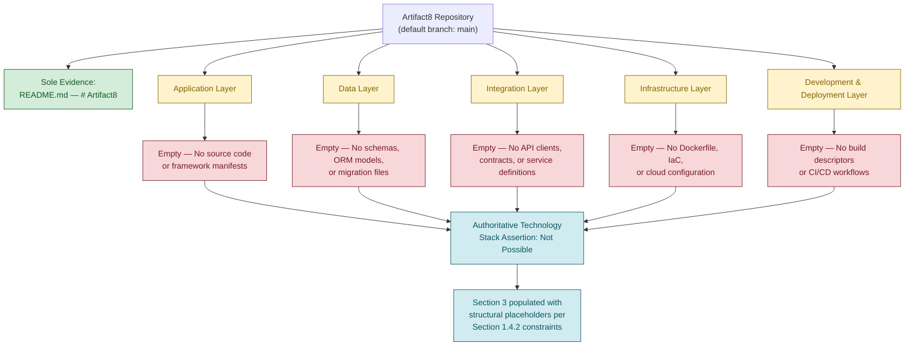

## 3.2 PROGRAMMING LANGUAGES

No programming language can be authoritatively asserted for the Artifact8 system. The repository contains zero source files of any language. **Section 1.2.2 (Core Technical Approach)** has already established verbatim that "Programming Languages" are "Not Documented (no source files present)." The schema below is preserved for future per-language population once source files are committed.

### 3.2.1 Identified Languages by Platform / Component

| Platform / Component | Language | Version | Selection Justification | Status |
|----------------------|----------|---------|--------------------------|--------|
| Backend / Service Tier | — | — | — | Not Documented — see Section 1.2.2 |
| Frontend / Web Client | — | — | — | Not Documented — see Section 1.2.2 |
| Mobile / Cross-Platform Client | — | — | — | Not Documented — see Section 1.2.2 |
| Native iOS Client | — | — | — | Not Documented — see Section 1.2.2 |
| Native Android Client | — | — | — | Not Documented — see Section 1.2.2 |
| Native macOS / Desktop Client | — | — | — | Not Documented — see Section 1.2.2 |
| Data / Analytics Pipeline | — | — | — | Not Documented — see Section 1.2.2 |
| Infrastructure Scripting | — | — | — | Not Documented — see Section 1.2.2 |

### 3.2.2 Language Selection Criteria

No selection criteria are documented because no language has been adopted. Forward-looking criteria typically applied in a Technology Stack assessment — including ecosystem maturity, team familiarity, performance characteristics, security posture, licensing compatibility, and long-term maintainability — cannot be evaluated against an adopted language because no candidate has been manifested in the repository.

| Criterion | Documented Assessment | Status |
|-----------|------------------------|--------|
| Ecosystem Maturity | — | Not Documented in Current Repository State |
| Team Familiarity / Hiring Profile | — | Not Documented in Current Repository State |
| Performance Profile | — | Not Documented in Current Repository State |
| Security Track Record | — | Not Documented in Current Repository State |
| Licensing Compatibility | — | Not Documented in Current Repository State |
| Tooling and IDE Support | — | Not Documented in Current Repository State |

### 3.2.3 Language Constraints and Dependencies

No language-level constraints or inter-language dependencies are documented. **Section 2.5.1 (Technical Constraints)** has already classified "Programming Language Constraints" as "Not Documented — see Section 1.2.2."

| Constraint Dimension | Value | Status |
|----------------------|-------|--------|
| Minimum Language Runtime Version | — | Not Documented — see Section 2.5.1 |
| Required Compiler / Interpreter Toolchain | — | Not Documented — see Section 2.5.1 |
| Cross-Language Interoperability Requirements | — | Not Documented in Current Repository State |
| Polyglot Service Boundaries | — | Not Documented in Current Repository State |

## 3.3 FRAMEWORKS & LIBRARIES

No application frameworks, runtime libraries, or supporting libraries can be authoritatively asserted. The repository contains no dependency manifests of any kind — verified absence of `package.json`, `requirements.txt`, `pom.xml`, `Cargo.toml`, `go.mod`, and `pyproject.toml` is recorded verbatim in **Section 2.1.1 (Pre-Requisite Inputs and Repository Evidence)**. The schema below is preserved for future population once a manifest establishes the chosen stack.

### 3.3.1 Core Frameworks and Runtime Environments

| Component Layer | Framework | Version | Compatibility Requirement | Justification | Status |
|-----------------|-----------|---------|---------------------------|---------------|--------|
| Backend Web / API Framework | — | — | — | — | Not Documented — see Section 1.2.2 |
| Frontend SPA Framework | — | — | — | — | Not Documented — see Section 1.2.2 |
| Mobile / Cross-Platform Framework | — | — | — | — | Not Documented — see Section 1.2.2 |
| ORM / Data Access Framework | — | — | — | — | Not Documented — see Section 1.2.2 |
| Background Job / Task Framework | — | — | — | — | Not Documented — see Section 1.2.2 |
| AI / ML Orchestration Framework | — | — | — | — | Not Documented — see Section 1.2.2 |
| Testing Framework | — | — | — | — | Not Documented — see Section 1.2.2 |

### 3.3.2 Supporting Libraries

No supporting libraries (utility libraries, validation libraries, HTTP clients, serialization libraries, logging frameworks, etc.) are documented. No dependency manifest exists to enumerate library selections.

| Library Category | Selected Library | Version | Justification | Status |
|------------------|------------------|---------|---------------|--------|
| Validation / Schema | — | — | — | Not Documented in Current Repository State |
| HTTP Client | — | — | — | Not Documented in Current Repository State |
| Serialization (JSON, Protobuf, etc.) | — | — | — | Not Documented in Current Repository State |
| Logging | — | — | — | Not Documented in Current Repository State |
| Cryptography / Hashing | — | — | — | Not Documented in Current Repository State |
| Date / Time Handling | — | — | — | Not Documented in Current Repository State |
| Internationalization | — | — | — | Not Documented in Current Repository State |

### 3.3.3 Compatibility Requirements

No compatibility requirements are documented. **Section 2.5.1 (Technical Constraints)** has classified "Framework / Runtime Constraints" as "Not Documented — see Section 1.2.2."

| Compatibility Dimension | Documented Requirement | Status |
|--------------------------|------------------------|--------|
| Inter-Framework Compatibility | — | Not Documented — see Section 2.5.1 |
| Operating System Compatibility | — | Not Documented — see Section 2.5.1 |
| Browser Compatibility (if applicable) | — | Not Documented in Current Repository State |
| Mobile OS Compatibility (if applicable) | — | Not Documented in Current Repository State |
| Backward Compatibility Policy | — | Not Documented in Current Repository State |

## 3.4 OPEN SOURCE DEPENDENCIES

No third-party or open-source dependencies can be enumerated. As established in **Section 1.2.1 (Integration with Existing Enterprise Landscape)**, the repository contains no `package.json`, `requirements.txt`, `pom.xml`, `Cargo.toml`, `go.mod`, `pyproject.toml`, or any other dependency manifest. The schema below is preserved for future, manifest-driven population.

### 3.4.1 Identified Third-Party / Open-Source Libraries

| Dependency Name | Version | Package Registry | License | Purpose / Justification | Status |
|------------------|---------|-------------------|---------|--------------------------|--------|
| — | — | — | — | — | Not Documented — no manifest present |

| Aggregate Attribute | Value |
|---------------------|-------|
| Total Identified Open-Source Dependencies | 0 |
| Total Documented Transitive Dependencies | 0 |
| Total Pinned Versions | 0 |
| Dependency Update Policy | Not Documented in Current Repository State |

### 3.4.2 Package Manifests, Registries, and Lockfiles

The following table enumerates each common package manifest, registry, and lockfile category and confirms its absence from the repository.

| Manifest / Registry / Lockfile | Ecosystem | Status |
|--------------------------------|-----------|--------|
| `package.json` / `package-lock.json` | npm / Node.js | Absent — see Section 2.1.1 |
| `yarn.lock` / `pnpm-lock.yaml` | Yarn / pnpm | Absent — see Section 2.1.1 |
| `requirements.txt` / `Pipfile` / `Pipfile.lock` | Python / pip / Pipenv | Absent — see Section 2.1.1 |
| `pyproject.toml` / `poetry.lock` | Python / Poetry | Absent — see Section 2.1.1 |
| `pom.xml` | Java / Maven | Absent — see Section 2.1.1 |
| `build.gradle` / `build.gradle.kts` | Java / Kotlin / Gradle | Absent — see Section 2.1.1 |
| `Cargo.toml` / `Cargo.lock` | Rust / Cargo | Absent — see Section 2.1.1 |
| `go.mod` / `go.sum` | Go / Go Modules | Absent — see Section 2.1.1 |
| `Gemfile` / `Gemfile.lock` | Ruby / Bundler | Absent — see Section 2.1.1 |
| `composer.json` / `composer.lock` | PHP / Composer | Absent |
| `*.csproj` / `packages.config` | .NET / NuGet | Absent |

### 3.4.3 License and Supply Chain Posture

No software bill of materials (SBOM), license inventory, or supply chain attestation can be produced absent a dependency manifest. License compatibility analysis, vulnerability scanning thresholds, and dependency provenance policy remain undefined.

| Supply Chain Attribute | Documented Position | Status |
|------------------------|---------------------|--------|
| SBOM Format / Generation Tool | — | Not Documented in Current Repository State |
| License Inventory | — | Not Documented in Current Repository State |
| Vulnerability Scanning Policy | — | Not Documented in Current Repository State |
| Dependency Pinning Policy | — | Not Documented in Current Repository State |
| Private Registry Configuration | — | Not Documented in Current Repository State |

## 3.5 THIRD-PARTY SERVICES

No third-party services, external APIs, authentication providers, observability tools, or cloud platform services can be authoritatively asserted. **Section 2.4.2 (Integration Points)** has classified both "Internal Integration Points" and "External Integration Points" as "None Documented." **Section 1.2.1 (Integration with Existing Enterprise Landscape)** has classified all integration attributes — Enterprise Systems, External APIs or Services, Authentication / Identity Provider Integration, and Data Source / Sink Integrations — as "Not Documented." The schema below is preserved for future population.

### 3.5.1 External APIs and Service Integrations

| Service / API | Vendor | Integration Pattern | Auth Mechanism | SLA | Status |
|---------------|--------|---------------------|----------------|-----|--------|
| — | — | — | — | — | Not Documented — see Section 2.4.2 |

### 3.5.2 Authentication and Identity Services

No authentication mechanism is asserted. **Section 2.5.4 (Security Implications)** has classified the "Authentication Mechanism" and "Authorization Model" as "Not Documented in Current Repository State."

| Identity / Auth Attribute | Selected Service | Configuration Reference | Status |
|----------------------------|------------------|--------------------------|--------|
| Identity Provider (IdP) | — | — | Not Documented — see Section 2.5.4 |
| Federation Standard (SAML / OIDC / OAuth2) | — | — | Not Documented in Current Repository State |
| Multi-Factor Authentication | — | — | Not Documented in Current Repository State |
| Service-to-Service Authentication | — | — | Not Documented in Current Repository State |
| Secrets Management Service | — | — | Not Documented in Current Repository State |

### 3.5.3 Monitoring, Logging, and Observability

No observability tooling is documented. **Section 2.5.5 (Maintenance Requirements)** has classified "Observability and Monitoring" as "Not Documented in Current Repository State."

| Observability Pillar | Selected Tool / Service | Status |
|----------------------|--------------------------|--------|
| Application Performance Monitoring (APM) | — | Not Documented — see Section 2.5.5 |
| Distributed Tracing | — | Not Documented in Current Repository State |
| Log Aggregation / Search | — | Not Documented in Current Repository State |
| Metrics / Time-Series Storage | — | Not Documented in Current Repository State |
| Alerting / Incident Management | — | Not Documented in Current Repository State |
| Real User Monitoring (RUM) | — | Not Documented in Current Repository State |
| Error Tracking | — | Not Documented in Current Repository State |

### 3.5.4 Cloud Platform Services

No cloud platform adoption, account topology, region selection, or managed-service inventory is documented. **Section 1.2.2 (Core Technical Approach)** has classified the "Deployment Model" as "Not Documented in Current Repository State."

| Cloud Service Category | Selected Service | Provider | Status |
|------------------------|------------------|----------|--------|
| Compute (VMs / Serverless / Containers-as-a-Service) | — | — | Not Documented — see Section 1.2.2 |
| Managed Database Services | — | — | Not Documented in Current Repository State |
| Managed Messaging / Streaming | — | — | Not Documented in Current Repository State |
| Content Delivery Network (CDN) | — | — | Not Documented in Current Repository State |
| Identity and Access Management (IAM) | — | — | Not Documented in Current Repository State |
| Networking (VPC, Load Balancers) | — | — | Not Documented in Current Repository State |
| AI / ML Managed Services | — | — | Not Documented in Current Repository State |

## 3.6 DATABASES & STORAGE

No data persistence layer, caching infrastructure, or storage service can be authoritatively asserted. **Section 1.2.2 (Major System Components)** has classified "Data Storage Components" as "Not Documented in Current Repository State." No database schemas, ORM models, migration files, entity-relationship diagrams, or seed scripts exist in the repository. The schema below is preserved for future population.

### 3.6.1 Primary and Secondary Databases

| Database Role | Engine / Product | Version | Schema Reference | Status |
|---------------|------------------|---------|-------------------|--------|
| Primary OLTP Database | — | — | — | Not Documented — see Section 1.2.2 |
| Read-Replica / Secondary Database | — | — | — | Not Documented in Current Repository State |
| Analytical / OLAP Store | — | — | — | Not Documented in Current Repository State |
| Document / NoSQL Store | — | — | — | Not Documented in Current Repository State |
| Graph Database | — | — | — | Not Documented in Current Repository State |
| Time-Series Database | — | — | — | Not Documented in Current Repository State |
| Search Index | — | — | — | Not Documented in Current Repository State |
| Vector / Embedding Store | — | — | — | Not Documented in Current Repository State |

### 3.6.2 Data Persistence Strategy

No persistence strategy, transactional boundaries, consistency model, partitioning scheme, or backup-and-recovery approach is documented. **Section 2.5.4 (Security Implications)** has classified "Data Protection (At-Rest / In-Transit)" as "Not Documented in Current Repository State."

| Persistence Dimension | Documented Strategy | Status |
|------------------------|---------------------|--------|
| Consistency Model (ACID / BASE) | — | Not Documented in Current Repository State |
| Transactional Boundaries | — | Not Documented in Current Repository State |
| Partitioning / Sharding Strategy | — | Not Documented in Current Repository State |
| Replication Topology | — | Not Documented in Current Repository State |
| Encryption-at-Rest | — | Not Documented — see Section 2.5.4 |
| Backup and Recovery Cadence | — | Not Documented in Current Repository State |
| Data Retention Policy | — | Not Documented in Current Repository State |
| Schema Migration Tooling | — | Not Documented in Current Repository State |

### 3.6.3 Caching Solutions

No caching layer is documented at any tier (client-side, edge, application, database).

| Cache Tier | Selected Solution | Eviction Policy | TTL Strategy | Status |
|------------|--------------------|------------------|---------------|--------|
| Client-Side / Browser Cache | — | — | — | Not Documented in Current Repository State |
| CDN / Edge Cache | — | — | — | Not Documented in Current Repository State |
| Application-Tier Cache | — | — | — | Not Documented in Current Repository State |
| Distributed In-Memory Cache | — | — | — | Not Documented in Current Repository State |
| Database Query Cache | — | — | — | Not Documented in Current Repository State |

### 3.6.4 Object and File Storage Services

No object storage, file storage, or blob storage selection is documented.

| Storage Category | Selected Service | Access Pattern | Encryption Posture | Status |
|------------------|------------------|----------------|---------------------|--------|
| Object Storage (S3-compatible) | — | — | — | Not Documented in Current Repository State |
| Block Storage / Persistent Volumes | — | — | — | Not Documented in Current Repository State |
| Network File System (NFS / SMB) | — | — | — | Not Documented in Current Repository State |
| Archive / Cold Storage | — | — | — | Not Documented in Current Repository State |
| Static Asset Hosting | — | — | — | Not Documented in Current Repository State |

## 3.7 DEVELOPMENT & DEPLOYMENT

No development tooling, build system, containerization, infrastructure-as-code, or continuous integration / continuous deployment (CI/CD) configuration can be authoritatively asserted. The repository contains no `Dockerfile`, `docker-compose.yml`, `*.tf` Terraform files, `.github/workflows/*` GitHub Actions definitions, `.gitlab-ci.yml`, `Jenkinsfile`, `azure-pipelines.yml`, `.circleci/*` configuration, Makefile, or any other build or pipeline descriptor. **Section 1.2.2 (Core Technical Approach)** has classified the "Deployment Model" as "Not Documented in Current Repository State."

### 3.7.1 Development Tooling

No editor configuration (`.editorconfig`), linter configuration (`.eslintrc`, `pyproject.toml [tool.ruff]`, etc.), formatter configuration (`.prettierrc`, `pyproject.toml [tool.black]`, etc.), pre-commit hooks, or `.gitignore`/`.blitzyignore` is present in the repository.

| Development Tool Category | Selected Tool | Configuration Reference | Status |
|---------------------------|---------------|--------------------------|--------|
| Editor / IDE Configuration | — | No `.editorconfig` present | Not Documented in Current Repository State |
| Linter | — | No linter config present | Not Documented in Current Repository State |
| Formatter | — | No formatter config present | Not Documented in Current Repository State |
| Pre-Commit Hooks | — | No `pre-commit` config present | Not Documented in Current Repository State |
| Git Ignore Rules | — | No `.gitignore` present | Not Documented in Current Repository State |
| Local Development Environment Manager | — | — | Not Documented in Current Repository State |
| Dependency Vulnerability Scanner | — | — | Not Documented in Current Repository State |

### 3.7.2 Build System

No build system, build descriptor, or build orchestration is documented. The absence of every common build descriptor is verified through the inventory in **Section 2.1.1 (Pre-Requisite Inputs and Repository Evidence)**.

| Build System Dimension | Selected Tool / Approach | Status |
|------------------------|--------------------------|--------|
| Primary Build Tool | — | Not Documented in Current Repository State |
| Task Runner | — | Not Documented in Current Repository State |
| Artifact Repository | — | Not Documented in Current Repository State |
| Build Reproducibility Approach | — | Not Documented in Current Repository State |
| Monorepo Tooling (if applicable) | — | Not Documented in Current Repository State |

### 3.7.3 Containerization

No container image definition, container orchestration manifest, or registry configuration is documented. No `Dockerfile`, `docker-compose.yml`, `.dockerignore`, Kubernetes manifest (`*.yaml` under a `k8s/`-style path), or Helm chart is present.

| Containerization Dimension | Selected Tool / Service | Status |
|----------------------------|--------------------------|--------|
| Container Runtime | — | Not Documented in Current Repository State |
| Image Definition (Dockerfile) | — | Absent — verified in Section 2.1.1 inventory |
| Multi-Service Composition (`docker-compose.yml`) | — | Absent — verified in Section 2.1.1 inventory |
| Container Orchestration Platform | — | Not Documented in Current Repository State |
| Container Registry | — | Not Documented in Current Repository State |
| Image Scanning / Signing | — | Not Documented in Current Repository State |

### 3.7.4 Infrastructure-as-Code

No infrastructure-as-code (IaC) artifacts are present. The absence of Terraform (`*.tf`, `*.tfvars`), CloudFormation, Pulumi, AWS CDK, Azure Bicep, and Ansible playbooks is verified.

| IaC Dimension | Selected Tool / Approach | Status |
|---------------|--------------------------|--------|
| IaC Language / Tool | — | Not Documented in Current Repository State |
| State Management Backend | — | Not Documented in Current Repository State |
| Environment Separation (dev/stg/prod) | — | Not Documented in Current Repository State |
| Policy-as-Code / Guardrails | — | Not Documented in Current Repository State |
| Secrets Injection Pattern | — | Not Documented in Current Repository State |

### 3.7.5 Continuous Integration and Continuous Deployment

No CI/CD pipeline is documented. The repository contains no `.github/workflows/` directory, no GitLab CI configuration, no Jenkins pipeline definition, no Azure Pipelines configuration, and no CircleCI configuration. Consequently, no automated build, test, security-scan, packaging, or release stages can be enumerated.

| CI/CD Dimension | Selected Tool / Approach | Status |
|-----------------|--------------------------|--------|
| CI Platform | — | Not Documented in Current Repository State |
| CD / Release Platform | — | Not Documented in Current Repository State |
| Pipeline Trigger Events | — | Not Documented in Current Repository State |
| Test Automation Stages | — | Not Documented in Current Repository State |
| Static Analysis / Security Scanning Stages | — | Not Documented in Current Repository State |
| Deployment Strategy (Blue-Green / Canary / Rolling) | — | Not Documented in Current Repository State |
| Rollback Strategy | — | Not Documented in Current Repository State |
| Environment Promotion Policy | — | Not Documented in Current Repository State |

## 3.8 CANDIDATE TECHNOLOGIES PROVIDED IN AUTHORING PROMPT (NOT ADOPTED)

### 3.8.1 Treatment of the Default Technology Stack

The authoring prompt for Section 3 provided a "Default Technology Stack" comprising a set of candidate technologies across infrastructure, backend, frontend, and native-application tiers. Per the binding **"No technical stack asserted"** constraint in **Section 1.4.2 (Document Authoring Constraints)** and the verbatim statements in **Section 1.2.2 (Core Technical Approach)** that programming languages and frameworks are "Not Documented (no source files / manifests present)," none of these candidates may be promoted to an adopted-state assertion absent corresponding repository evidence. The tables below are reproduced for traceability only: each entry is **non-binding**, **unverified**, and **not present in the repository**. They are recorded here so that, when future contributions introduce repository evidence, reviewers can distinguish between candidates that were considered during authoring and the technologies that are ultimately adopted.

### 3.8.2 Core Infrastructure Candidates (Not Adopted)

| Candidate Category | Candidate Technology | Adoption Status | Evidence in Repository |
|--------------------|----------------------|-----------------|------------------------|
| Cloud Platform | AWS | Not Adopted | No IaC, CLI configuration, or service references present |
| Containerization | Docker | Not Adopted | No `Dockerfile` or `docker-compose.yml` present |
| Infrastructure as Code | Terraform | Not Adopted | No `*.tf` or `*.tfvars` files present |
| CI/CD | GitHub Actions | Not Adopted | No `.github/workflows/` directory present |

### 3.8.3 Backend Candidates (Not Adopted)

| Candidate Category | Candidate Technology | Adoption Status | Evidence in Repository |
|--------------------|----------------------|-----------------|------------------------|
| Primary Language | Python | Not Adopted | No `*.py` source files, `requirements.txt`, `pyproject.toml`, or `Pipfile` present |
| Framework | Flask | Not Adopted | No Python sources or dependency manifest referencing Flask |
| Authentication | Auth0 | Not Adopted | No SDK configuration, environment variables, or integration code present |
| Database | MongoDB | Not Adopted | No connection strings, ODM models, or schema references present |
| AI Framework | LangChain | Not Adopted | No Python sources or dependency manifest referencing LangChain |

### 3.8.4 Frontend Candidates (Not Adopted)

| Candidate Category | Candidate Technology | Adoption Status | Evidence in Repository |
|--------------------|----------------------|-----------------|------------------------|
| Web Framework | React with TypeScript | Not Adopted | No `*.tsx`/`*.jsx` files, `package.json`, or `tsconfig.json` present |
| CSS Framework | TailwindCSS | Not Adopted | No `tailwind.config.*`, `postcss.config.*`, or CSS source files present |
| Mobile / Cross-Platform | React Native with TypeScript | Not Adopted | No React Native project structure, `metro.config.*`, or related manifests present |

### 3.8.5 Native Application Candidates (Not Adopted)

| Candidate Category | Candidate Technology | Adoption Status | Evidence in Repository |
|--------------------|----------------------|-----------------|------------------------|
| iOS Native | Swift | Not Adopted | No `*.swift` source files, `*.xcodeproj`, or `Package.swift` present |
| Android Native | Kotlin | Not Adopted | No `*.kt` source files, `build.gradle`/`build.gradle.kts`, or Android manifest present |
| macOS Native | Objective-C | Not Adopted | No `*.m` or `*.h` source files present |
| Desktop | ElectronJS | Not Adopted | No `package.json`, Electron main process file, or build configuration present |

### 3.8.6 Candidate Stack Summary

| Aggregate Attribute | Value |
|---------------------|-------|
| Total Candidate Technologies Listed in Prompt | 16 |
| Total Candidates with Repository Evidence | 0 |
| Total Adopted Technologies | 0 |
| Authoring-Time Status | All candidates non-binding pending future evidence |

## 3.9 RECOMMENDED NEXT STEPS FOR TECHNOLOGY STACK AUTHORING

Consistent with the recommendation pattern established in **Section 1.4.3 (Recommended Next Steps for Project Authoring)** and **Section 2.8 (Recommended Next Steps for Requirements Authoring)**, the following minimum contributions are required to enable substantive population of this Technology Stack section. These are recommendations only and do not themselves constitute adopted technology choices.

### 3.9.1 Minimum Repository Contributions Required

| Recommended Contribution | Subsection Enabled |
|---------------------------|---------------------|
| Source files in one or more languages committed to the repository | Section 3.2 (Programming Languages) |
| Dependency manifest (`package.json`, `requirements.txt`, `pyproject.toml`, `pom.xml`, `Cargo.toml`, `go.mod`, or equivalent) committed | Section 3.3 (Frameworks & Libraries), Section 3.4 (Open Source Dependencies) |
| Configuration files referencing external services, API keys, or integration endpoints | Section 3.5 (Third-Party Services) |
| Database schema files, ORM models, migration scripts, or seed data | Section 3.6 (Databases & Storage) |
| `Dockerfile`, `docker-compose.yml`, IaC files, and CI/CD workflow definitions | Section 3.7 (Development & Deployment) |
| Explicit selection rationale documenting why specific technologies were chosen | Section 3.2.2, Section 3.3, and Section 3.8 promotion to adopted state |

### 3.9.2 Section Re-Authoring Triggers

| Trigger Event | Required Re-Authoring Action |
|---------------|-------------------------------|
| Introduction of any dependency manifest | Repopulate Sections 3.2, 3.3, and 3.4 from manifest contents |
| Introduction of any source file | Repopulate Section 3.2 with verified language adoption |
| Introduction of any `Dockerfile` or IaC artifact | Repopulate Section 3.7.3 and Section 3.7.4 |
| Introduction of any CI/CD workflow file | Repopulate Section 3.7.5 |
| Introduction of any external service configuration | Repopulate Section 3.5 |
| Introduction of any database schema or migration artifact | Repopulate Section 3.6 |
| Promotion of any prompt candidate to adopted state | Move row from Section 3.8 into the corresponding adopted-state table in Sections 3.2–3.7 |

#### References

#### Files Examined

- `README.md` — The sole tracked file in the repository (11 bytes, 1 line). Direct content inspection confirmed it contains only a single H1 heading (`# Artifact8`), with no technology references, no dependency declarations, no framework or runtime mentions, no version numbers, and no integration descriptions. Its only contribution to Section 3 is the project name.

#### Folders Explored

- `""` (repository root, depth 0) — Confirmed via directory listing and recursive `find` to contain exactly one tracked child (`README.md`) and no subdirectories beyond `.git/` metadata. No source folders (`src/`, `lib/`, `app/`, `cmd/`, `pkg/`), no configuration directories (`config/`, `conf/`, `etc/`), no infrastructure directories (`infra/`, `deploy/`, `k8s/`, `helm/`), no CI/CD directories (`.github/`, `.gitlab/`, `.circleci/`), no test directories (`tests/`, `__tests__/`, `spec/`), and no documentation folders (`docs/`) are present.

#### Repository-Wide Verifications Performed

- Filesystem inspection (`ls -la` and recursive `find`) — Confirmed absence of every common dependency manifest, lockfile, container descriptor, infrastructure-as-code file, CI/CD workflow descriptor, configuration file, database schema, API/IDL definition, source code file, frontend asset, and test artifact.
- Semantic file search for "dependency manifest package configuration build" — 0 results.
- Semantic file search for "source code application implementation files" — 0 results.
- Semantic folder search for "technology stack frameworks libraries infrastructure" — 0 results.
- `.blitzyignore` presence check — Confirmed absent.

#### Cross-Referenced Specification Sections

- **Section 1.1 (Executive Summary)** — Establishes the project name "Artifact8" as the sole evidence-based fact and confirms the pre-implementation state of the repository.
- **Section 1.2 (System Overview)** — Primary reference for Section 3; the verbatim "Core Technical Approach" table in Section 1.2.2 marks Programming Languages, Frameworks / Runtimes, Architectural Style, and Deployment Model as "Not Documented." Section 1.2.1 confirms the absence of External APIs or Services, Authentication / Identity Provider Integration, and Data Source / Sink Integrations.
- **Section 1.3 (Scope)** — Provides the Scope Determination Constraint (Section 1.3.3) that governs the absence-documentation pattern reused throughout this section.
- **Section 1.4 (Evidence Base and Document Integrity)** — Provides the seven-fact Verifiable Facts Summary (Section 1.4.1), the binding "No technical stack asserted" constraint (Section 1.4.2), and the Recommended Next Steps pattern (Section 1.4.3) emulated in Section 3.9.
- **Section 2.1 (Requirements Enumeration Constraint)** — Enumerates the absent dependency manifests (`package.json`, `requirements.txt`, `pom.xml`, `Cargo.toml`, `go.mod`, `pyproject.toml`) reused in Section 3.4.2; provides the empty-input decision-flow diagram pattern emulated in Section 3.1.3.
- **Section 2.4 (Feature Relationships)** — Section 2.4.2 (Integration Points) confirms both Internal and External Integration Points are "None Documented" — the primary cross-reference for Section 3.5.
- **Section 2.5 (Implementation Considerations)** — Section 2.5.1 (Technical Constraints) marks Programming Language, Framework/Runtime, and Platform/Deployment constraints as "Not Documented"; Section 2.5.4 (Security Implications) marks Authentication Mechanism, Authorization Model, and Data Protection as "Not Documented"; Section 2.5.5 (Maintenance Requirements) marks Observability and Monitoring as "Not Documented."
- **Section 2.7 (Assumptions, Constraints, and Version Tracking)** — Section 2.7.2 confirms the sole evidence available is the project name "Artifact8" and reaffirms the evidence-based authoring constraint.
- **Section 2.8 (Recommended Next Steps for Requirements Authoring)** — Provides the recommended-next-steps pattern and the closing-references structure (Files Examined / Folders Explored / Cross-Referenced Specification Sections) adopted at the end of Section 3.

# 4. Process Flowchart

The Artifact8 repository is in a pre-implementation, placeholder state in which no business logic, integration code, state-machine definitions, workflow orchestration artifacts, or error-handling implementations have been committed. Consequently, this section cannot author authoritative process flowcharts, sequence diagrams, or state-transition diagrams from evidence. In strict adherence to the authoring constraints established in **Section 1.4.2 (Document Authoring Constraints)** and the scope determination constraint stated in **Section 1.3.3 (Scope Determination Constraint)**, this section documents the absence of authoritative workflow inputs rather than fabricating them. The subsection structure below preserves the canonical Process Flowchart schema (System Workflows, Integration Workflows, Validation Rules, State Management, Error Handling, and Required Diagrams) so that future contributions to the repository can populate each placeholder with verifiable content without restructuring the specification.

## 4.1 AUTHORING CONSTRAINT FOR PROCESS FLOWCHARTS

### 4.1.1 Binding Authoring Constraint

The Process Flowchart section is authored under the same evidence-only authoring discipline established and ratified in **Section 1.4 (Evidence Base and Document Integrity)**, **Section 2.1 (Requirements Enumeration Constraint)**, and **Section 3.1 (Authoring Constraint for Technology Stack)**. The constraints below are restated for traceability within this section and govern every decision in the subsections that follow.

| Constraint | Source / Cross-Reference |
|------------|--------------------------|
| No business context fabricated — no user journeys, swim lanes, or actor roles invented | Section 1.4.2 — Document Authoring Constraints |
| No stakeholders inferred beyond the commit author — no user touchpoints asserted | Section 1.4.2 — Document Authoring Constraints |
| No technical stack asserted — no implementation-level workflows derivable | Section 1.4.2 — Document Authoring Constraints |
| No integrations described — no integration sequences, API call flows, or event-processing chains | Section 1.4.2 — Document Authoring Constraints |
| Feature relationships must be "clearly evident in the requirements or source code" | Section 2.4.1 — Dependency Map |
| Internal and External Integration Points marked "None Documented" | Section 2.4.2 — Integration Points |
| Latency, Throughput, Availability / SLA Targets marked "Not Documented" | Section 2.5.2 — Performance Requirements |
| Authentication, Authorization, Data Protection, and Audit Requirements marked "Not Documented" | Section 2.5.4 — Security Implications |
| Disaster Recovery Procedures and Observability marked "Not Documented" | Section 2.5.5 — Maintenance Requirements |
| Transactional Boundaries, Consistency Model, and Schema Migration Tooling marked "Not Documented" | Section 3.6.2 — Data Persistence Strategy |
| Error Tracking and Alerting / Incident Management marked "Not Documented" | Section 3.5.3 — Monitoring, Logging, and Observability |

### 4.1.2 Verified Absence of Workflow Evidence

Authoritative documentation of process flows depends on the presence of identifiable workflow-bearing artifacts in the source repository. The following table maps each canonical Process Flowchart input category to the corresponding evidence (or absence of evidence) in the Artifact8 repository. The catalogue of absent artifacts is inherited and extended from **Section 2.1.1 (Pre-Requisite Inputs and Repository Evidence)** and **Section 3.1.2 (Verified Absence of Technology Evidence)**.

| Required Input Category | Repository Evidence | Status |
|-------------------------|---------------------|--------|
| Business Logic Source Code | No source files of any language present (verified per Section 3.1.2) | Absent |
| API / IDL Definitions (OpenAPI, GraphQL, Protobuf, Thrift) | No service contracts or API specifications present | Absent |
| Workflow Orchestration Artifacts (BPMN, Airflow DAGs, Step Functions, Temporal) | No orchestrator definitions or DAG files present | Absent |
| State Machine Definitions (XState, YAML, lifecycle documents) | No state-machine artifacts present | Absent |
| Event Handler Code (Kafka consumers, SQS workers, webhook receivers) | No message broker integration code present | Absent |
| Batch Processor Configurations (cron, scheduled jobs, ETL pipelines) | No scheduler or batch framework configuration present | Absent |
| Validation Schemas (JSON Schema, Joi, Yup, Pydantic, OpenAPI validators) | No validation library configurations present | Absent |
| Authentication / Authorization Middleware | No auth code, RBAC policies, or IAM configurations present (per Section 2.5.4) | Absent |
| Retry Policies and Circuit Breakers | No resilience library configurations present | Absent |
| Error Tracking Configurations | No error monitoring service definitions present (per Section 3.5.3) | Absent |
| SLA / Performance Contracts | No latency, throughput, or availability targets defined (per Section 2.5.2) | Absent |
| Sequence Diagrams or BPMN in Documentation | No supplementary documentation beyond the 11-byte `README.md` | Absent |
| User Stories or BDD Scenarios | No behavioural specifications present (per Section 2.1.1) | Absent |
| Test Files Implying Workflow Behaviour | No test artifacts of any kind present (per Section 2.1.1) | Absent |
| Sole Identified Artifact | `README.md` (11 bytes) containing only the H1 heading `# Artifact8` | Present |

The absence of every workflow-bearing artifact above has been verified through direct filesystem inspection, recursive directory traversal, and multiple semantic searches, all cross-referenced in **Section 1.4.1 (Verifiable Facts Summary)**, **Section 2.1.1 (Pre-Requisite Inputs and Repository Evidence)**, and **Section 3.1.2 (Verified Absence of Technology Evidence)**.

### 4.1.3 Process Workflow Absence Determination

The following diagram illustrates the input-evaluation logic that yields the documented absence of authoritative process flows. The diagram follows the same `classDef` styling convention established in **Section 1.2.2 (Current Repository State)**, **Section 2.1.3 (Verified Repository State)**, and **Section 3.1.3 (Repository State Visualization)**, where yellow denotes input questions, red denotes confirmed absence, and blue denotes outcome states.

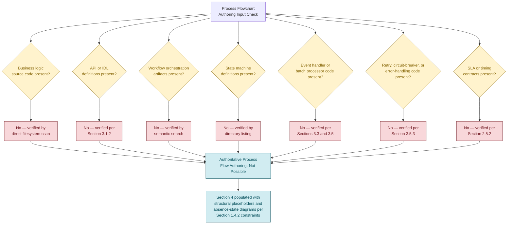

## 4.2 SYSTEM WORKFLOWS — CORE BUSINESS PROCESSES

No core business processes can be documented for the Artifact8 system. **Section 2.2.1 (Feature Inventory Summary)** has recorded zero features identified, and **Section 2.3.1 (Functional Requirements Inventory Summary)** has recorded zero functional requirements documented. The absence of features and requirements precludes any authoritative description of business processes, user journeys, system interactions, decision points, or error-handling paths. The schemas below are preserved for future per-process population.

### 4.2.1 End-to-End User Journey Schema (Reserved for Future Population)

| Journey Field | Purpose | Current Entries |
|---------------|---------|-----------------|
| Actor / Persona | Identifies the user or system initiating the journey | Not Documented — see Section 1.4.2 (no stakeholders inferred) |
| Entry Point / Trigger | The event or action that initiates the journey | Not Documented in Current Repository State |
| Sequenced Process Steps | Ordered list of user actions and system responses | Not Documented in Current Repository State |
| Decision Branches | Conditional paths and their selection criteria | Not Documented in Current Repository State |
| Terminal State | Successful completion conditions | Not Documented in Current Repository State |
| Alternative / Exception Flows | Non-happy-path branches | Not Documented in Current Repository State |

### 4.2.2 System Interaction Schema (Reserved for Future Population)

| Interaction Field | Purpose | Current Entries |
|-------------------|---------|-----------------|
| Source Component | Originating component of the interaction | Not Documented — see Section 1.2.2 (no components identified) |
| Target Component | Receiving component of the interaction | Not Documented — see Section 1.2.2 |
| Interaction Protocol | Transport / messaging pattern | Not Documented in Current Repository State |
| Synchronicity | Synchronous / asynchronous classification | Not Documented in Current Repository State |
| Payload Contract | Structure and schema of the exchanged data | Not Documented in Current Repository State |

### 4.2.3 Decision Point Schema (Reserved for Future Population)

| Decision Field | Purpose | Current Entries |
|----------------|---------|-----------------|
| Decision Identifier | Stable label for the decision diamond | Not Documented in Current Repository State |
| Predicate / Condition | Boolean or multi-valued expression evaluated | Not Documented in Current Repository State |
| Outcome Branches | Named paths and their selection logic | Not Documented in Current Repository State |
| Business Rule Reference | Cross-reference to the rule governing the decision | Not Documented — see Section 2.3.4 |

### 4.2.4 Error Handling Path Schema (Reserved for Future Population)

| Error Path Field | Purpose | Current Entries |
|------------------|---------|-----------------|
| Error Classification | Recoverable / Non-Recoverable / Terminal | Not Documented in Current Repository State |
| Detection Point | Process step at which the error is observed | Not Documented in Current Repository State |
| Compensating Action | Rollback, retry, or escalation logic | Not Documented in Current Repository State |
| Notification Target | Operator / user / monitoring system notified | Not Documented — see Section 3.5.3 |
| Recovery Outcome | Final state after recovery attempt | Not Documented in Current Repository State |

### 4.2.5 Timing and SLA Considerations

No timing constraints or service-level agreements have been documented. **Section 2.5.2 (Performance Requirements)** has classified Latency Targets, Throughput Targets, Resource Utilization Targets, and Availability / SLA Targets as "Not Documented in Current Repository State." Consequently, no SLA annotations, time-boxed steps, or latency budgets can be applied to any process step in this specification.

| SLA Dimension | Target Value | Status |
|---------------|--------------|--------|
| Step-Level Latency Budgets | — | Not Documented — see Section 2.5.2 |
| End-to-End Journey Latency | — | Not Documented — see Section 2.5.2 |
| Throughput Per Process | — | Not Documented — see Section 2.5.2 |
| Availability / Uptime Targets | — | Not Documented — see Section 2.5.2 |
| Recovery Time Objective (RTO) | — | Not Documented — see Section 2.5.5 |
| Recovery Point Objective (RPO) | — | Not Documented — see Section 2.5.5 |

## 4.3 INTEGRATION WORKFLOWS

No integration workflows can be documented. **Section 2.4.2 (Integration Points)** has classified Internal Integration Points, External Integration Points, Identified APIs Consumed, and Identified APIs Exposed as "None Documented." **Section 3.5 (Third-Party Services)** has further classified External APIs, Authentication Services, Observability Tools, and Cloud Platform Services as "Not Documented in Current Repository State." The schemas below are preserved for future population.

### 4.3.1 Data Flow Between Systems

| Data Flow Attribute | Documented Specification | Status |
|---------------------|--------------------------|--------|
| Source System | — | Not Documented — see Section 2.4.2 |
| Target System | — | Not Documented — see Section 2.4.2 |
| Data Format / Schema | — | Not Documented in Current Repository State |
| Transformation Steps | — | Not Documented in Current Repository State |
| Transport Mechanism | — | Not Documented in Current Repository State |
| Frequency / Cadence | — | Not Documented in Current Repository State |

### 4.3.2 API Interactions

| API Interaction Attribute | Documented Specification | Status |
|---------------------------|--------------------------|--------|
| Consumed APIs (Client Role) | — | Not Documented — see Section 2.4.2 |
| Exposed APIs (Server Role) | — | Not Documented — see Section 2.4.2 |
| Authentication Mechanism | — | Not Documented — see Section 2.5.4 |
| Authorization Scope | — | Not Documented — see Section 2.5.4 |
| Request / Response Contracts | — | Not Documented in Current Repository State |
| Rate Limiting / Throttling | — | Not Documented in Current Repository State |
| Idempotency Guarantees | — | Not Documented in Current Repository State |

### 4.3.3 Event Processing Flows

| Event Processing Attribute | Documented Specification | Status |
|----------------------------|--------------------------|--------|
| Event Broker / Message Bus | — | Not Documented — see Section 3.5.4 |
| Event Producers | — | Not Documented in Current Repository State |
| Event Consumers | — | Not Documented in Current Repository State |
| Event Schema Registry | — | Not Documented in Current Repository State |
| Delivery Guarantees (At-Least-Once / Exactly-Once) | — | Not Documented in Current Repository State |
| Dead-Letter Queue Strategy | — | Not Documented in Current Repository State |
| Ordering Guarantees | — | Not Documented in Current Repository State |

### 4.3.4 Batch Processing Sequences

| Batch Processing Attribute | Documented Specification | Status |
|----------------------------|--------------------------|--------|
| Scheduler / Orchestrator | — | Not Documented in Current Repository State |
| Batch Window | — | Not Documented in Current Repository State |
| Input Source(s) | — | Not Documented in Current Repository State |
| Output Sink(s) | — | Not Documented in Current Repository State |
| Idempotency / Checkpointing | — | Not Documented in Current Repository State |
| Failure Compensation Strategy | — | Not Documented in Current Repository State |
| Backfill / Replay Procedures | — | Not Documented in Current Repository State |

## 4.4 VALIDATION RULES

The schema established in **Section 2.3.4 (Validation Rules Schema)** has classified Business Rules, Data Validation, Security Requirements, and Compliance Requirements as "Not Documented in Current Repository State." Consequently, no validation checkpoints, authorization gates, or compliance verifications can be embedded in any process flow.

### 4.4.1 Business Rules at Process Steps

| Business Rule Attribute | Documented Specification | Status |
|-------------------------|--------------------------|--------|
| Rule Identifier | — | Not Documented — see Section 2.3.4 |
| Process Step Anchor | — | Not Documented in Current Repository State |
| Predicate Logic | — | Not Documented in Current Repository State |
| Violation Handling | — | Not Documented in Current Repository State |
| Owning Stakeholder | — | Not Documented — see Section 1.4.2 |

### 4.4.2 Data Validation Requirements

| Data Validation Attribute | Documented Specification | Status |
|---------------------------|--------------------------|--------|
| Validation Library / Framework | — | Not Documented — see Section 3.3 |
| Schema Source (JSON Schema, Pydantic, Joi, Yup, Zod) | — | Not Documented in Current Repository State |
| Field-Level Validation Rules | — | Not Documented — see Section 2.3.4 |
| Cross-Field Validation Rules | — | Not Documented in Current Repository State |
| Server-Side Enforcement Points | — | Not Documented in Current Repository State |
| Client-Side Enforcement Points | — | Not Documented in Current Repository State |

### 4.4.3 Authorization Checkpoints

| Authorization Attribute | Documented Specification | Status |
|-------------------------|--------------------------|--------|
| Authentication Method | — | Not Documented — see Section 2.5.4 |
| Authorization Model (RBAC / ABAC / ReBAC) | — | Not Documented — see Section 2.5.4 |
| Checkpoint Locations in Flow | — | Not Documented in Current Repository State |
| Policy Storage and Evaluation | — | Not Documented in Current Repository State |
| Service-to-Service Authorization | — | Not Documented — see Section 3.5.2 |
| Audit Trail Capture | — | Not Documented — see Section 2.5.4 |

### 4.4.4 Regulatory Compliance Checks

| Compliance Attribute | Documented Specification | Status |
|----------------------|--------------------------|--------|
| Applicable Regulatory Frameworks | — | Not Documented — see Section 1.2.1 |
| Compliance Checkpoints in Flow | — | Not Documented — see Section 2.3.4 |
| Data Residency / Sovereignty Controls | — | Not Documented in Current Repository State |
| Consent Capture Points | — | Not Documented in Current Repository State |
| Retention and Erasure Procedures | — | Not Documented — see Section 3.6.2 |
| Audit Logging Obligations | — | Not Documented — see Section 2.5.4 |

## 4.5 STATE MANAGEMENT

No state management strategy can be documented. **Section 3.6 (Databases & Storage)** has classified all database roles, persistence dimensions, caching tiers, and object/file storage categories as "Not Documented in Current Repository State." No source code, ORM models, or state-machine definitions are present from which state transitions could be authoritatively extracted.

### 4.5.1 State Transitions

| State Transition Attribute | Documented Specification | Status |
|----------------------------|--------------------------|--------|
| Stateful Entity Catalogue | — | Not Documented in Current Repository State |
| State Enumerations Per Entity | — | Not Documented in Current Repository State |
| Permitted Transitions Matrix | — | Not Documented in Current Repository State |
| Transition Triggers (Events / Commands) | — | Not Documented in Current Repository State |
| Guard Conditions | — | Not Documented — see Section 2.3.4 |
| Side Effects / Emitted Events | — | Not Documented in Current Repository State |

### 4.5.2 Data Persistence Points

| Persistence Point Attribute | Documented Specification | Status |
|-----------------------------|--------------------------|--------|
| Persistence Targets (DB / File / Object Store) | — | Not Documented — see Section 3.6 |
| Write Anchors in Process Flow | — | Not Documented in Current Repository State |
| Read Anchors in Process Flow | — | Not Documented in Current Repository State |
| Encryption-at-Rest Posture | — | Not Documented — see Section 2.5.4 |
| Backup Capture Cadence | — | Not Documented — see Section 3.6.2 |

### 4.5.3 Caching Requirements

| Caching Attribute | Documented Specification | Status |
|-------------------|--------------------------|--------|
| Cache Tier (Client / CDN / Application / DB) | — | Not Documented — see Section 3.6.3 |
| Cache Population Trigger | — | Not Documented in Current Repository State |
| Cache Invalidation Strategy | — | Not Documented in Current Repository State |
| TTL / Eviction Policy | — | Not Documented — see Section 3.6.3 |
| Cache Coherence Across Replicas | — | Not Documented in Current Repository State |

### 4.5.4 Transaction Boundaries

| Transaction Attribute | Documented Specification | Status |
|-----------------------|--------------------------|--------|
| Consistency Model (ACID / BASE) | — | Not Documented — see Section 3.6.2 |
| Transaction Scope per Process Step | — | Not Documented in Current Repository State |
| Distributed Transaction Pattern (Saga / 2PC) | — | Not Documented in Current Repository State |
| Compensating Action Catalogue | — | Not Documented in Current Repository State |
| Isolation Level | — | Not Documented in Current Repository State |
| Optimistic / Pessimistic Concurrency | — | Not Documented in Current Repository State |

## 4.6 ERROR HANDLING AND RECOVERY

No error handling, retry, fallback, notification, or recovery procedures can be documented. **Section 2.5.5 (Maintenance Requirements)** has classified Operational Runbooks, Observability and Monitoring, and Disaster Recovery Procedures as "Not Documented in Current Repository State." **Section 3.5.3 (Monitoring, Logging, and Observability)** has classified Error Tracking and Alerting / Incident Management as "Not Documented in Current Repository State."

### 4.6.1 Retry Mechanisms

| Retry Attribute | Documented Specification | Status |
|-----------------|--------------------------|--------|
| Retry Trigger Conditions | — | Not Documented in Current Repository State |
| Backoff Strategy (Exponential / Linear / Jittered) | — | Not Documented in Current Repository State |
| Maximum Retry Attempts | — | Not Documented in Current Repository State |
| Idempotency Key Strategy | — | Not Documented in Current Repository State |
| Circuit-Breaker Integration | — | Not Documented in Current Repository State |

### 4.6.2 Fallback Processes

| Fallback Attribute | Documented Specification | Status |
|--------------------|--------------------------|--------|
| Fallback Activation Conditions | — | Not Documented in Current Repository State |
| Degraded-Mode Capabilities | — | Not Documented in Current Repository State |
| Cached / Stale Data Substitutes | — | Not Documented — see Section 3.6.3 |
| Static / Default Response Strategy | — | Not Documented in Current Repository State |
| Fallback-to-Manual Procedure | — | Not Documented in Current Repository State |

### 4.6.3 Error Notification Flows

| Notification Attribute | Documented Specification | Status |
|------------------------|--------------------------|--------|
| Error Tracking Service | — | Not Documented — see Section 3.5.3 |
| Alerting Service / Incident Management | — | Not Documented — see Section 3.5.3 |
| Notification Channels (Email / SMS / Pager / Chat) | — | Not Documented in Current Repository State |
| Severity Classification Matrix | — | Not Documented in Current Repository State |
| On-Call Routing Policy | — | Not Documented in Current Repository State |

### 4.6.4 Recovery Procedures

| Recovery Attribute | Documented Specification | Status |
|--------------------|--------------------------|--------|
| Disaster Recovery Playbook | — | Not Documented — see Section 2.5.5 |
| Recovery Time Objective (RTO) | — | Not Documented — see Section 2.5.5 |
| Recovery Point Objective (RPO) | — | Not Documented — see Section 2.5.5 |
| Data Restoration Procedure | — | Not Documented — see Section 3.6.2 |
| Operational Runbook Library | — | Not Documented — see Section 2.5.5 |
| Post-Incident Review Process | — | Not Documented in Current Repository State |

## 4.7 REQUIRED DIAGRAMS — ABSENCE-STATE VISUALIZATIONS

The Section 4 authoring prompt requests a High-Level System Workflow, Detailed Process Flows, Error Handling Flowcharts, Integration Sequence Diagrams, and State Transition Diagrams. Because no business logic, integration code, state-machine definitions, or error-handling implementations exist in the repository, the diagrams below visually document the **absence** of each required artifact, following the established precedent set in **Section 1.2.2 (Current Repository State)**, **Section 2.1.3 (Verified Repository State)**, and **Section 3.1.3 (Repository State Visualization)**. All diagrams use the same `classDef` styling convention — green denotes present evidence, red denotes confirmed absence, yellow denotes question or layer nodes, and blue denotes outcome states.

### 4.7.1 High-Level System Workflow (Absence-State)

The diagram below depicts the canonical skeleton of an end-to-end system workflow (Actor → Entry → Business Logic → Persistence → Response) and explicitly marks every node as absent from the repository, with cross-references to the specification sections that have already documented the corresponding absences.

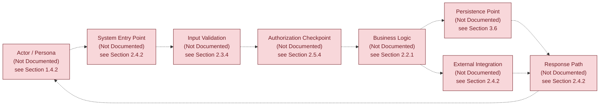

### 4.7.2 Detailed Process Flow (Absence-State)

The diagram below depicts the canonical structure of a detailed process flow — including a start event, sequenced steps, a decision diamond, and terminal states — and marks every element as absent. No core feature exists from which a substantive detailed process flow could be derived (per **Section 2.2.1 — Feature Inventory Summary**, zero features identified).

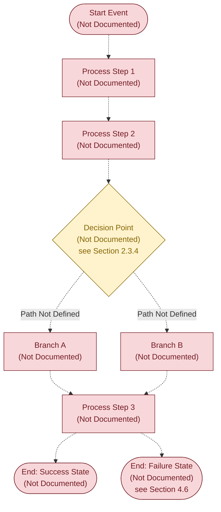

### 4.7.3 Error Handling Flowchart (Absence-State)

The diagram below depicts the canonical structure of an error-handling flow — including detection, classification, retry, fallback, notification, and recovery — and marks every element as absent. No retry policies, circuit breakers, or error tracking integrations exist in the repository (per **Section 3.5.3** and **Section 4.6**).

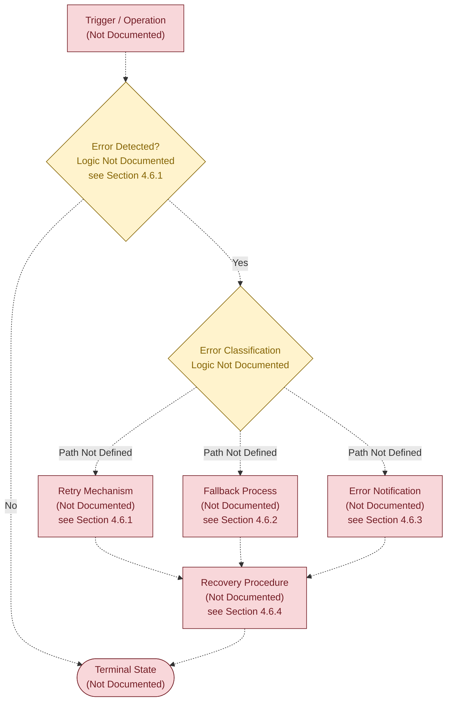

### 4.7.4 Integration Sequence Diagram (Absence-State)

The sequence diagram below depicts the canonical roster of participants and message exchanges that an integration workflow would normally contain. Because no integration points are documented (per **Section 2.4.2**) and no external services or APIs are defined (per **Section 3.5**), every participant and every message is annotated as absent. The dashed-X arrow notation (`--x`) is used to visually distinguish that no actual message contracts are evidenced.

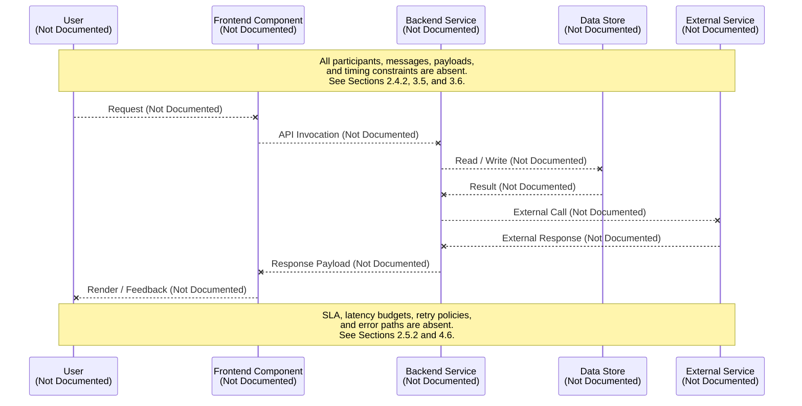

### 4.7.5 State Transition Diagram (Absence-State)

The state diagram below depicts the canonical structure of a state machine. Because no stateful entities, lifecycle documents, or status enumerations are documented (per **Section 3.6.2 — Data Persistence Strategy**, Transactional Boundaries marked "Not Documented"), the diagram contains only a single placeholder state representing the undocumented state space.

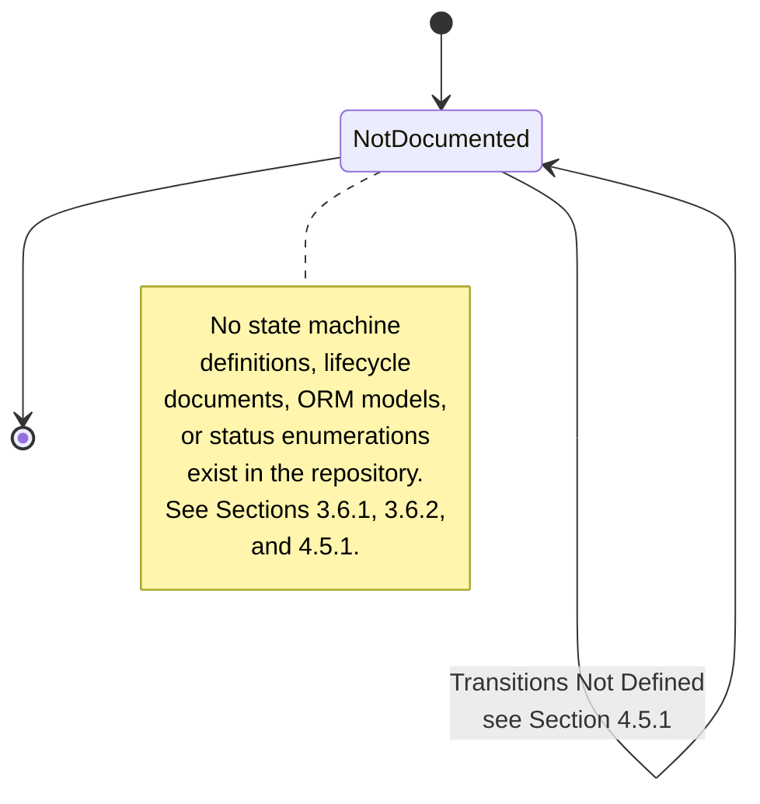

### 4.7.6 Diagram Coverage Summary

The following table maps each diagram type requested by the Section 4 authoring prompt to its corresponding absence-state visualization in this specification, ensuring full coverage of the prompt's diagram requirements within the bounds of the evidence-only authoring discipline.

| Prompt-Required Diagram | Absence-State Visualization | Cross-Reference |
|-------------------------|------------------------------|-----------------|
| High-level system workflow | Section 4.7.1 | Sections 1.2.2, 2.4.2 |
| Detailed process flows for each core feature | Section 4.7.2 | Section 2.2.1 (0 features) |
| Error handling flowcharts | Section 4.7.3 | Sections 4.6, 3.5.3 |
| Integration sequence diagrams | Section 4.7.4 | Sections 2.4.2, 3.5 |
| State transition diagrams | Section 4.7.5 | Sections 3.6, 4.5.1 |
| Process workflow input determination | Section 4.1.3 | Sections 2.1.3, 3.1.3 |

## 4.8 RECOMMENDED NEXT STEPS FOR PROCESS FLOWCHART AUTHORING

Following the precedent established in **Section 1.4.3**, **Section 2.8**, and **Section 3.9**, this subsection enumerates the minimum repository contributions required to lift the structural placeholders above into substantive content. None of the items below are asserted to be planned, scheduled, or under consideration — they are documented purely as the artifact categories whose introduction would enable evidence-based authoring of the corresponding subsections.

### 4.8.1 Minimum Repository Contributions Required

| Recommended Contribution | Subsection Enabled for Substantive Authoring |
|--------------------------|-----------------------------------------------|
| Source code implementing business logic (any language) | 4.2.1, 4.2.2, 4.2.3, 4.7.1, 4.7.2 |
| OpenAPI / GraphQL / Protobuf service contracts | 4.3.2, 4.7.4 |
| Workflow orchestrator definitions (Airflow DAGs, Step Functions, Temporal, BPMN) | 4.3.4, 4.7.1 |
| State machine artifacts (XState definitions, YAML lifecycle documents) | 4.5.1, 4.7.5 |
| Event broker integration code (Kafka, SQS, RabbitMQ, EventBridge consumers / producers) | 4.3.3, 4.7.4 |
| Batch processor configurations (cron, scheduled jobs, ETL pipeline definitions) | 4.3.4 |
| Validation schemas (JSON Schema, Joi, Yup, Zod, Pydantic models) | 4.4.1, 4.4.2 |
| Authentication and authorization middleware, RBAC / ABAC policy files | 4.4.3 |
| Retry policies and circuit-breaker configurations (Resilience4j, Polly, tenacity) | 4.6.1, 4.7.3 |
| Error tracking and incident management integration (Sentry, Rollbar, PagerDuty) | 4.6.3, 4.7.3 |
| Operational runbooks and disaster recovery playbooks | 4.6.4 |
| SLA / latency / availability contract documents | 4.2.5, 4.7.1 |
| Sequence diagrams or BPMN diagrams committed to a `docs/` directory | 4.7.1, 4.7.2, 4.7.4 |
| User stories or BDD scenario files (Gherkin) | 4.2.1, 4.2.4 |
| Database schemas, ORM models, migration files | 4.5.2, 4.5.4, 4.7.5 |
| Caching tier configurations (Redis, Memcached, CDN rules) | 4.5.3 |

### 4.8.2 Subsection Enablement Mapping

The table below provides the inverse mapping, showing for each subsection in this Section 4 the minimum artifact category whose introduction would enable its population.

| Section 4 Subsection | Minimum Enabling Artifact |
|----------------------|---------------------------|
| 4.2 System Workflows | Source code implementing business logic, optionally accompanied by user-story documents |
| 4.3 Integration Workflows | API contracts, event broker code, and / or batch orchestrator definitions |
| 4.4 Validation Rules | Validation schemas and authorization policy files |
| 4.5 State Management | State machine definitions, ORM models, transaction configuration |
| 4.6 Error Handling and Recovery | Retry / circuit-breaker code, error tracking configuration, runbooks |
| 4.7 Required Diagrams | Any of the above; diagrams in `docs/` accelerate population substantially |

### 4.8.3 Re-Authoring Triggers

This Section 4 should be revisited for substantive re-authoring when any of the following triggers occurs in the repository:

| Trigger | Action |
|---------|--------|
| First commit introducing source code in any language | Re-evaluate 4.2, 4.5, 4.6, and 4.7 against the introduced code |
| First API contract or IDL definition committed | Re-evaluate 4.3.2 and 4.7.4 |
| First workflow orchestrator file committed | Re-evaluate 4.2, 4.3.4, and 4.7.1 |
| First state machine definition committed | Re-evaluate 4.5.1 and 4.7.5 |
| First validation schema committed | Re-evaluate 4.4.1 and 4.4.2 |
| First authentication / authorization code committed | Re-evaluate 4.4.3 |
| First retry or error-handling configuration committed | Re-evaluate 4.6 and 4.7.3 |
| First SLA / availability contract committed | Re-evaluate 4.2.5 |

## 4.9 SECTION INTEGRITY AND TRACEABILITY

### 4.9.1 Adherence to Document Authoring Constraints

This Section 4 has been authored in strict adherence to the constraints established in **Section 1.4.2 (Document Authoring Constraints)**. No process flow, sequence, state transition, validation rule, or error-handling procedure has been asserted that is not directly supported by repository evidence. Where the canonical Process Flowchart schema would normally require substantive content, structural placeholders have been preserved with explicit "Not Documented in Current Repository State" markers and cross-references to the originating absence determinations.

### 4.9.2 Evidence Base Consistency

The single piece of evidence available to this section — the project name "Artifact8" derived from the H1 heading in `README.md` — provides no basis from which any workflow, integration sequence, state transition, or error path could be authoritatively inferred. This is consistent with the evidence base catalogued in **Section 1.4.1 (Verifiable Facts Summary)**, in which only seven verifiable facts are recorded, none of which describe process or workflow behaviour.

### 4.9.3 Cross-Section Coherence

The absence-state determinations in this section align with and inherit from the corresponding determinations in:

| Upstream Section | Inheritance |
|------------------|-------------|
| Section 1.2.1 — Integration with Existing Enterprise Landscape | Drives 4.3 absence determinations |
| Section 1.2.2 — Major System Components | Drives 4.2.2 and 4.7.1 absence determinations |
| Section 2.2.1 — Feature Inventory Summary (0 features) | Drives all of 4.2 |
| Section 2.3.1 — Functional Requirements Inventory (0 requirements) | Drives 4.2 and 4.4 |
| Section 2.3.4 — Validation Rules Schema | Drives all of 4.4 |
| Section 2.4.2 — Integration Points | Drives all of 4.3 |
| Section 2.5.2 — Performance Requirements | Drives 4.2.5 |
| Section 2.5.4 — Security Implications | Drives 4.4.3 |
| Section 2.5.5 — Maintenance Requirements | Drives 4.6.4 |
| Section 3.5.3 — Monitoring, Logging, and Observability | Drives 4.6.3 |
| Section 3.5.4 — Cloud Platform Services | Drives 4.3.3 |
| Section 3.6 — Databases & Storage | Drives 4.5 |
| Section 3.6.2 — Data Persistence Strategy | Drives 4.5.4 |
| Section 3.6.3 — Caching Solutions | Drives 4.5.3 |

#### References

#### Files Examined

- `README.md` — The sole tracked file in the Artifact8 repository. Its entire content (`# Artifact8`, 11 bytes) provided the only piece of evidence-based content used in this section: the project name. Contains no descriptions of workflows, processes, integrations, state machines, validation rules, or error-handling procedures.

#### Folders Explored

- `""` (repository root, depth 0) — Confirmed to contain exactly one tracked file (`README.md`) and no source folders. No `src/`, `lib/`, `app/`, `workflows/`, `pipelines/`, `tests/`, `docs/`, `infra/`, `events/`, `handlers/`, or any other folder that would contain workflow-bearing artifacts is present. The `.git/` metadata directory exists but contains only Git internals.

#### Repository-Wide Verifications Performed

- Recursive filesystem scan for source code files of any common language extension — Confirmed absent (per Section 3.1.2).
- Semantic search for "workflow business process flow diagram" — Returned zero results.
- Semantic search for "source code application logic business rules" — Returned zero results.
- Semantic search for "API endpoints integration services" — Returned zero results.
- Semantic search for "configuration deployment infrastructure manifest" — Returned zero results.
- Git commit history inspection (`git log --all`) — Confirmed a single "Initial commit" introducing only `README.md`.
- Filesystem inspection for `.blitzyignore`, `.gitignore`, dependency manifests, configuration files, build descriptors, CI/CD workflow descriptors, and container orchestration manifests — All confirmed absent.

#### Cross-Referenced Specification Sections

- **Section 1.2.1 (Project Context)** — Source for the absence of enterprise integration evidence cited throughout 4.3.
- **Section 1.2.2 (High-Level Description)** — Source for the absence of system components, technical approach, and the visual styling precedent for all diagrams in this section.
- **Section 1.3.3 (Scope Determination Constraint)** — Source for the binding constraint that any further scope assertion would constitute fabrication.
- **Section 1.4.1 (Verifiable Facts Summary)** — Source for the seven verifiable facts that bound this section's authorship.
- **Section 1.4.2 (Document Authoring Constraints)** — Source for the six binding authoring constraints applied throughout this section.
- **Section 1.4.3 (Recommended Next Steps for Project Authoring)** — Pattern source for Section 4.8.
- **Section 2.1.1 (Pre-Requisite Inputs and Repository Evidence)** — Pattern source for Section 4.1.2's absence-mapping table.
- **Section 2.1.3 (Verified Repository State)** — Pattern source for Section 4.1.3's decision-flow diagram.
- **Section 2.2.1 (Feature Inventory Summary)** — Source for "zero features identified" cited in 4.2.
- **Section 2.3.1 (Functional Requirements Inventory Summary)** — Source for "zero requirements documented" cited in 4.2 and 4.4.
- **Section 2.3.4 (Validation Rules Schema)** — Source for Section 4.4 schema inheritance.
- **Section 2.4.1 (Dependency Map)** — Source for the directive that feature relationships must be clearly evident in requirements or source code.
- **Section 2.4.2 (Integration Points)** — Source for Section 4.3 absence determinations.
- **Section 2.5.2 (Performance Requirements)** — Source for Section 4.2.5 SLA absence determinations.
- **Section 2.5.4 (Security Implications)** — Source for Section 4.4.3 authorization absence determinations.
- **Section 2.5.5 (Maintenance Requirements)** — Source for Section 4.6.4 recovery procedure absence determinations.
- **Section 3.1.2 (Verified Absence of Technology Evidence)** — Source for the catalogue of absent artifact categories cited in 4.1.2.
- **Section 3.1.3 (Repository State Visualization)** — Pattern source for the layered absence-state diagram style.
- **Section 3.3 (Frameworks & Libraries)** — Source for the absence of any framework that would enable workflow orchestration.
- **Section 3.5 (Third-Party Services)** — Source for Section 4.3 third-party integration absence determinations.
- **Section 3.5.3 (Monitoring, Logging, and Observability)** — Source for Section 4.6.3 error notification absence determinations.
- **Section 3.5.4 (Cloud Platform Services)** — Source for Section 4.3.3 event broker absence determinations.
- **Section 3.6 (Databases & Storage)** — Source for Section 4.5 state management absence determinations.
- **Section 3.6.2 (Data Persistence Strategy)** — Source for Section 4.5.4 transaction boundary absence determinations.
- **Section 3.6.3 (Caching Solutions)** — Source for Section 4.5.3 caching absence determinations.
- **Section 3.9 (Recommended Next Steps for Technology Stack Authoring)** — Pattern source for Section 4.8.

# 5. System Architecture

The System Architecture section conventionally documents architectural style, component decomposition, data flows, integration topology, technical decisions, and cross-cutting concerns. Authoritative documentation of each of these dimensions requires identifiable evidence in the source repository — source code, dependency manifests, configuration files, infrastructure-as-code, API definitions, deployment descriptors, or design records. The Artifact8 repository contains none of these artifacts. Consequently, this section cannot assert an architectural style, enumerate components, describe data flows, or rationalize technical decisions from evidence. In strict adherence to the binding constraints established in **Section 1.4.2 (Document Authoring Constraints)** and ratified in **Section 3.1.1 (Binding Authoring Constraint)** and **Section 4.1.1 (Binding Authoring Constraint)**, this section documents the absence of architectural evidence rather than fabricating it. The subsection structure below preserves the canonical System Architecture schema (High-Level Architecture, Component Details, Technical Decisions, Cross-Cutting Concerns) so that future contributions to the repository can populate each placeholder with verifiable content without restructuring the specification.

## 5.1 AUTHORING CONSTRAINT FOR SYSTEM ARCHITECTURE

### 5.1.1 Binding Authoring Constraint

The System Architecture section is authored under the same evidence-only authoring discipline established and ratified in earlier sections of this specification. The constraints below are restated for traceability within this section.

| Constraint | Source / Cross-Reference |
|------------|--------------------------|
| No architectural style or pattern asserted | Section 1.2.2 — Core Technical Approach (Architectural Style "Not Documented") |
| No deployment model asserted | Section 1.2.2 — Core Technical Approach (Deployment Model "Not Documented") |
| No frontend, backend, data, or cross-cutting components enumerated | Section 1.2.2 — Major System Components (all four categories "Not Documented") |
| No internal or external integration points described | Section 2.4.2 — Integration Points (both "None Documented") |
| No shared components, common services, or reusable utilities documented | Section 2.4.3 — Shared Components and Common Services (all zero instances) |
| No performance, scalability, security, or maintenance commitments asserted | Section 2.5 — Implementation Considerations (all dimensions "Not Documented") |
| No databases, caches, or persistence strategies asserted | Section 3.6 — Databases & Storage (all tiers "Not Documented") |
| No third-party services, identity providers, or observability tooling asserted | Section 3.5 — Third-Party Services (all categories "Not Documented") |
| No error handling, retry, fallback, or recovery procedures asserted | Section 4.6 — Error Handling and Recovery (all subsections "Not Documented") |

### 5.1.2 Verified Absence of Architectural Evidence

Authoritative documentation of a system architecture depends on the presence of identifiable artifacts in the source repository. The following table maps each canonical System Architecture input category to the corresponding evidence (or absence of evidence) in the Artifact8 repository. The catalogue of absent artifacts is inherited verbatim from **Section 3.1.2 (Verified Absence of Technology Evidence)**.

| Required Input Category | Repository Evidence | Status |
|-------------------------|---------------------|--------|
| Component Source Modules | No `src/`, `lib/`, `app/`, `services/`, `components/`, or equivalent folders present | Absent |
| Service Boundary Definitions | No service manifests, API specifications, or interface descriptors present | Absent |
| Deployment Topology Artifacts | No `Dockerfile`, `docker-compose.yml`, Kubernetes manifests, or Helm charts present | Absent |
| Infrastructure-as-Code | No `*.tf`, CloudFormation, Pulumi, CDK, Bicep, or Ansible artifacts present | Absent |
| API / IDL Contracts | No OpenAPI/Swagger, GraphQL schemas, Protocol Buffers, or Thrift definitions present | Absent |
| Data Persistence Schemas | No SQL files, ORM models, Prisma schema, or migration artifacts present | Absent |
| Caching Configuration | No Redis, Memcached, or CDN configuration present | Absent |
| Authentication / Authorization Policies | No IAM policies, OAuth/OIDC configuration, or middleware definitions present | Absent |
| Observability Configuration | No APM agent configuration, log aggregator descriptors, or alerting rules present | Absent |
| Architecture Decision Records (ADRs) | No `docs/`, `adr/`, `architecture/`, or design-record folders present | Absent |
| Sole Identified Artifact | `README.md` (11 bytes) containing only the H1 heading `# Artifact8` | Present |

The absence of every artifact category above has been verified through direct filesystem inspection, recursive directory traversal, and multiple semantic searches, all cross-referenced in **Section 1.4.1 (Verifiable Facts Summary)**, **Section 2.1.1 (Pre-Requisite Inputs and Repository Evidence)**, and **Section 3.1.2 (Verified Absence of Technology Evidence)**.

### 5.1.3 Repository Architectural State Visualization

The following diagram illustrates the verifiable empty-state of every architectural layer that a System Architecture section would normally populate. The diagram follows the same `classDef` styling convention established in **Section 1.2.2 (Current Repository State)**, **Section 2.1.3 (Verified Repository State)**, **Section 3.1.3 (Repository State Visualization)**, and **Section 4.7 (Required Diagrams — Absence-State Visualizations)**.

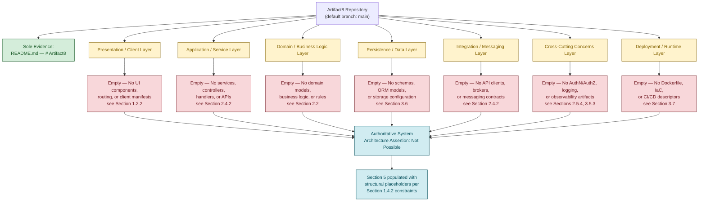

## 5.2 HIGH-LEVEL ARCHITECTURE

### 5.2.1 System Overview

#### Overall System Architecture Style and Rationale

No architectural style — whether monolithic, microservices, service-oriented, event-driven, layered, hexagonal, serverless, or any hybrid pattern — can be authoritatively asserted. **Section 1.2.2 (Core Technical Approach)** has classified Architectural Style as "Not Documented in Current Repository State." The repository contains no source code from which an implicit style could be inferred, no design documents declaring a chosen style, and no architecture decision records (ADRs) recording a rationale.

| Architecture Style Attribute | Value | Status |
|------------------------------|-------|--------|
| Declared Architectural Style | — | Not Documented — see Section 1.2.2 |
| Style Selection Rationale | — | Not Documented in Current Repository State |
| Reference Architectures Cited | — | Not Documented in Current Repository State |
| Style-Specific Constraints Imposed | — | Not Documented in Current Repository State |

#### Key Architectural Principles and Patterns

No architectural principles (such as separation of concerns, single responsibility, dependency inversion, command-query separation, eventual consistency, idempotency, or twelve-factor compliance) and no design patterns (such as repository, factory, mediator, saga, circuit breaker, or bulkhead) have been declared or implemented. With zero source files in the repository, no patterns are observable in code, and no principle-level documentation exists.

| Principle / Pattern Category | Documented Instances | Status |
|------------------------------|----------------------|--------|
| Declared Architectural Principles | 0 | Not Documented in Current Repository State |
| Implemented Design Patterns | 0 | Not Documented — no source code present |
| Domain-Driven Design Boundaries | 0 | Not Documented in Current Repository State |
| Cloud-Native / Twelve-Factor Adherence | 0 | Not Documented in Current Repository State |

#### System Boundaries and Major Interfaces

No system boundaries have been defined because no components, services, or modules exist to bound. **Section 2.4.2 (Integration Points)** has classified both Internal Integration Points and External Integration Points as "None Documented," and **Section 2.4.3 (Shared Components and Common Services)** has confirmed zero shared assets across all four categories.

| Boundary Attribute | Documented Definition | Status |
|--------------------|------------------------|--------|
| System Context Boundary | — | Not Documented — see Section 2.4.2 |
| Container / Service Boundaries | — | Not Documented — see Section 1.2.2 |
| Public Interface Surfaces (APIs Exposed) | — | Not Documented — see Section 2.4.2 |
| Consumed Interface Surfaces (APIs Consumed) | — | Not Documented — see Section 2.4.2 |

### 5.2.2 Core Components Table

The Section 5 authoring prompt requests a Core Components Table enumerating Component Name, Primary Responsibility, Key Dependencies, and Integration Points. **Section 1.2.2 (Major System Components)** has already established that zero components are documented across all four canonical categories (Frontend/Client, Backend/Service, Data Storage, Cross-Cutting/Platform). The schema is preserved below for future population.

| Component Name | Primary Responsibility | Key Dependencies | Integration Points |
|----------------|------------------------|------------------|--------------------|
| — | Not Documented — see Section 1.2.2 | Not Documented — see Section 2.4.1 | Not Documented — see Section 2.4.2 |

Critical considerations that would normally accompany each component row (criticality classification, failure modes, scaling profile, regulatory exposure) are likewise undocumented and are addressed at the cross-cutting level in **Section 5.5 (Cross-Cutting Concerns)**.

### 5.2.3 Data Flow Description

#### Primary Data Flows Between Components

No data flows can be described. **Section 4.3.1 (Data Flow Between Systems)** has classified every canonical data-flow attribute — Source System, Target System, Data Payload / Schema, Transformation Logic, Transport Protocol, and Frequency / Trigger — as "Not Documented in Current Repository State." With no components identified (per **Section 1.2.2**) and no integration points documented (per **Section 2.4.2**), no source–target pairs exist from which a flow could be derived.

| Data Flow Attribute | Documented Specification | Status |
|---------------------|--------------------------|--------|
| Identified Source–Target Pairs | 0 | Not Documented — see Section 4.3.1 |
| Synchronous vs Asynchronous Flow Classification | — | Not Documented in Current Repository State |
| Batch vs Streaming Flow Classification | — | Not Documented in Current Repository State |
| End-to-End Data Lineage | — | Not Documented in Current Repository State |

#### Integration Patterns and Protocols

No integration patterns (such as request/response, publish/subscribe, message queue, event sourcing, CQRS, change data capture, webhook, or saga) and no transport protocols (such as HTTP/REST, gRPC, GraphQL, WebSocket, AMQP, MQTT, Kafka, or SQS) have been declared or implemented.

| Pattern / Protocol Attribute | Documented Selection | Status |
|------------------------------|----------------------|--------|
| Synchronous Integration Pattern | — | Not Documented in Current Repository State |
| Asynchronous Integration Pattern | — | Not Documented in Current Repository State |
| Transport Protocol(s) | — | Not Documented — see Section 3.5 |
| Serialization Format(s) | — | Not Documented in Current Repository State |

#### Data Transformation Points

No data transformation points (such as adapters, mappers, anti-corruption layers, schema registries, or ETL/ELT pipelines) exist. With no source data structures and no target data structures documented, no transformation contract can be authored.

| Transformation Attribute | Documented Specification | Status |
|--------------------------|--------------------------|--------|
| Adapter / Mapper Components | 0 | Not Documented — see Section 1.2.2 |
| Schema Registry / Contract Repository | — | Not Documented in Current Repository State |
| ETL / ELT Pipeline Definitions | — | Not Documented — see Section 3.7 |
| Anti-Corruption Layer Boundaries | — | Not Documented in Current Repository State |

#### Key Data Stores and Caches

No data stores or caches are documented. **Section 3.6 (Databases & Storage)** has classified all database engines (OLTP, OLAP, Document/NoSQL, Graph, Time-Series, Search, Vector) as "Not Documented" and **Section 3.6.3 (Caching Solutions)** has classified all cache tiers (Client, CDN, Application, Distributed, Database Query) as "Not Documented."

| Data Store / Cache Attribute | Documented Selection | Status |
|------------------------------|----------------------|--------|
| Primary Operational Data Store | — | Not Documented — see Section 3.6.1 |
| Analytical Data Store | — | Not Documented — see Section 3.6.1 |
| Distributed Cache Tier | — | Not Documented — see Section 3.6.3 |
| Object / Blob Storage | — | Not Documented — see Section 3.6 |

### 5.2.4 External Integration Points Table

The Section 5 authoring prompt requests an External Integration Points table enumerating System Name, Integration Type, Data Exchange Pattern, and Protocol/Format. **Section 2.4.2 (Integration Points)** has confirmed zero external integration points, and **Section 3.5.1 (External Service Integrations)** has confirmed zero external API integrations. The schema is preserved below for future population.

| System Name | Integration Type | Data Exchange Pattern | Protocol / Format |
|-------------|-------------------|------------------------|--------------------|
| — | Not Documented — see Section 2.4.2 | Not Documented — see Section 4.3.1 | Not Documented — see Section 3.5 |

Associated SLA requirements (response time, availability targets, throughput ceilings, error budgets) for each external integration are likewise undocumented and inherit from **Section 2.5.2 (Performance Requirements)**, which classifies all four performance dimensions as "Not Documented in Current Repository State."

## 5.3 COMPONENT DETAILS

The Section 5 authoring prompt requests, for each major component, documentation of purpose and responsibilities, technologies and frameworks used, key interfaces and APIs, data persistence requirements, and scaling considerations. The component inventory is empty per **Section 1.2.2 (Major System Components)**, which marks Frontend/Client, Backend/Service, Data Storage, and Cross-Cutting/Platform component categories as "Not Documented in Current Repository State." **Section 2.4.3 (Shared Components and Common Services)** further confirms zero shared libraries, zero common services, zero cross-cutting concerns, and zero reusable utilities. Consequently, the per-component specification table below contains only structural placeholders.

### 5.3.1 Per-Component Specification Schema

| Component Specification Dimension | Documented Value | Status |
|-----------------------------------|------------------|--------|
| Purpose and Responsibilities | — | Not Documented — see Section 1.2.2 |
| Technologies and Frameworks Used | — | Not Documented — see Section 3.3 |
| Key Interfaces and APIs | — | Not Documented — see Section 2.4.2 |
| Data Persistence Requirements | — | Not Documented — see Section 3.6 |
| Scaling Considerations | — | Not Documented — see Section 2.5.3 |

### 5.3.2 Component Interaction Diagram (Absence-State)

The diagram below depicts the canonical roster of architectural components that a System Architecture section would normally interconnect. Because the component inventory is empty, every node is marked as absent, and every relationship is rendered as a dashed edge (`-.->`) to indicate that no interaction contracts are evidenced. The convention follows the precedent established in **Section 4.7.1 (High-Level System Workflow — Absence-State)**.

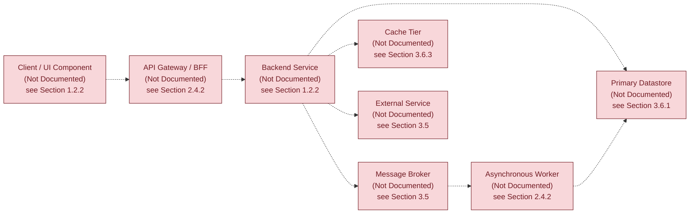

### 5.3.3 State Transition Diagram (Absence-State)

No stateful components, lifecycle entities, or status enumerations are documented. **Section 3.6.2 (Data Persistence Strategy)** has classified Transactional Boundaries as "Not Documented," and **Section 4.5.1 (State Definitions)** has confirmed zero state machines. The diagram below preserves a single placeholder state to signal the undocumented state space, following the precedent of **Section 4.7.5 (State Transition Diagram — Absence-State)**.

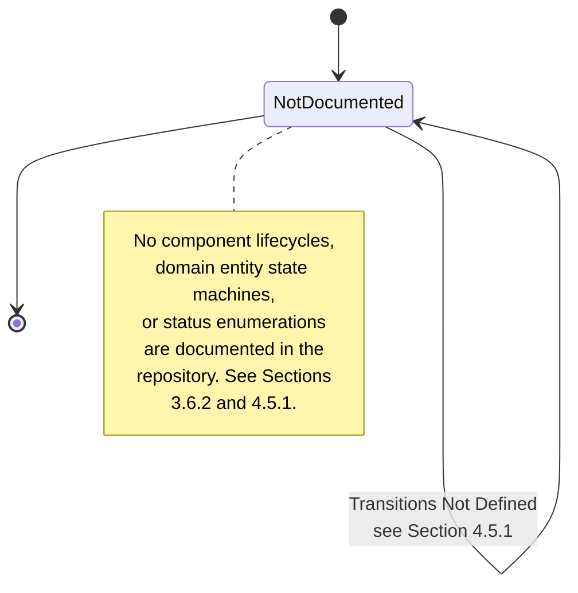

### 5.3.4 Sequence Diagram for Key Flows (Absence-State)

The sequence diagram below depicts the canonical roster of participants and message exchanges that a key architectural flow would normally contain. Because no integration points are documented (per **Section 2.4.2**), no external services or APIs are defined (per **Section 3.5**), and no business processes are documented (per **Section 4.2**), every participant and every message is annotated as absent. The dashed-X arrow notation (`--x`) is reused from **Section 4.7.4 (Integration Sequence Diagram — Absence-State)** to visually distinguish that no actual message contracts are evidenced.

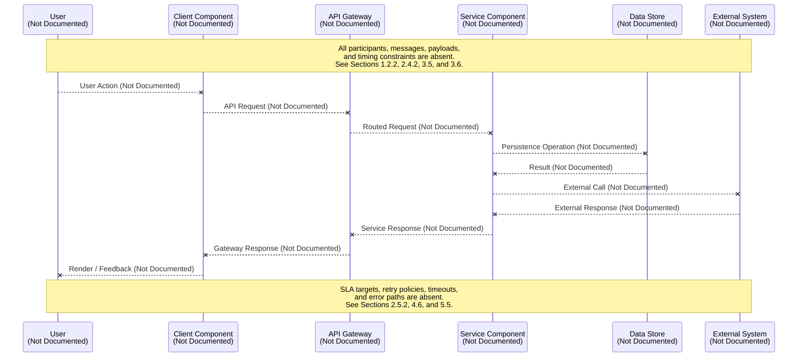

## 5.4 TECHNICAL DECISIONS

The Section 5 authoring prompt requests documentation and justification of architecture style decisions, communication pattern choices, data storage solution rationale, caching strategy justification, and security mechanism selection. No such decisions have been recorded in the repository. No Architecture Decision Records (ADRs), design documents, request-for-comments (RFC) artifacts, or technical option-analysis documents exist. The five canonical decision domains and their corresponding absence determinations are catalogued below.

### 5.4.1 Architecture Decision Inventory

| Decision Domain | Decision Made | Rationale Documented | Originating Cross-Reference |
|-----------------|---------------|----------------------|------------------------------|
| Architecture Style (Monolith / Microservices / Serverless / Hybrid) | Not Documented | Not Documented | Section 1.2.2 |
| Communication Pattern (Sync REST / Async Messaging / Event-Driven) | Not Documented | Not Documented | Section 2.4.2 |
| Data Storage Solution (Relational / Document / Graph / Time-Series) | Not Documented | Not Documented | Section 3.6.1 |
| Caching Strategy (None / Client / CDN / Distributed) | Not Documented | Not Documented | Section 3.6.3 |
| Security Mechanism (AuthN Method / AuthZ Model / Encryption Posture) | Not Documented | Not Documented | Section 2.5.4 |

### 5.4.2 Architecture Decision Record Catalogue

No ADRs exist in the repository. No `docs/`, `adr/`, `architecture/`, or `decisions/` folder has been committed, and no Markdown, AsciiDoc, or reStructuredText files (other than the 11-byte `README.md`) are present.

| ADR Attribute | Documented Value | Status |
|---------------|-------------------|--------|
| Total ADRs Recorded | 0 | Not Documented in Current Repository State |
| Status Classifications Used (Proposed / Accepted / Superseded) | — | Not Applicable — zero records |
| Decision Template Adopted (Nygard / MADR / Custom) | — | Not Documented in Current Repository State |
| Decision Log Location | — | Not Documented in Current Repository State |

### 5.4.3 Decision Tree (Absence-State)

The diagram below depicts the canonical decision tree that a System Architecture section would traverse to arrive at architectural choices. Because no decision inputs are available, every decision node is marked unresolved and every branch is rendered as a dashed edge. The diagram follows the same `classDef` styling and dashed-edge convention used throughout **Section 4.7 (Required Diagrams — Absence-State Visualizations)**.

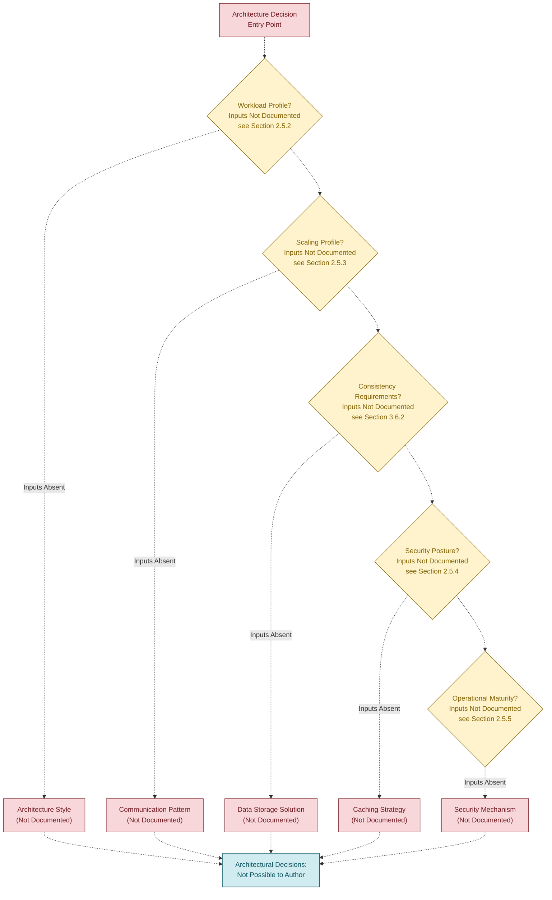

## 5.5 CROSS-CUTTING CONCERNS

The Section 5 authoring prompt requests documentation of monitoring and observability, logging and tracing, error handling, authentication and authorization, performance requirements, and disaster recovery. Each cross-cutting concern maps to a prior absence determination in the specification, as catalogued below. No cross-cutting implementation artifacts (middleware, interceptors, decorators, aspect definitions, sidecars, or service-mesh configurations) exist in the repository.

### 5.5.1 Cross-Cutting Concerns Inheritance Map

| Cross-Cutting Concern | Originating Absence Determination | Status |
|-----------------------|-----------------------------------|--------|
| Monitoring and Observability Approach | Section 3.5.3 — all observability pillars "Not Documented" | Not Documented in Current Repository State |
| Logging and Tracing Strategy | Section 3.5.3 — log aggregation and distributed tracing "Not Documented" | Not Documented in Current Repository State |
| Error Handling Patterns | Section 4.6 — all four subsections "Not Documented" | Not Documented in Current Repository State |
| Authentication Framework | Section 2.5.4 — Authentication Mechanism "Not Documented" | Not Documented in Current Repository State |
| Authorization Framework | Section 2.5.4 — Authorization Model "Not Documented" | Not Documented in Current Repository State |
| Performance Requirements and SLAs | Section 2.5.2 — all four performance dimensions "Not Documented" | Not Documented in Current Repository State |
| Disaster Recovery Procedures | Section 2.5.5 + Section 4.6.4 — RTO/RPO "Not Documented" | Not Documented in Current Repository State |

### 5.5.2 Monitoring, Observability, Logging, and Tracing

No monitoring, observability, logging, or tracing infrastructure has been declared or configured. The full inheritance from **Section 3.5.3 (Monitoring, Logging, and Observability)** is reproduced below for traceability.

| Observability Pillar | Documented Selection | Status |
|----------------------|----------------------|--------|
| Application Performance Monitoring (APM) | — | Not Documented — see Section 3.5.3 |
| Distributed Tracing | — | Not Documented — see Section 3.5.3 |
| Log Aggregation | — | Not Documented — see Section 3.5.3 |
| Metrics and Dashboards | — | Not Documented — see Section 3.5.3 |
| Alerting / Incident Management | — | Not Documented — see Section 3.5.3 |
| Real User Monitoring (RUM) | — | Not Documented — see Section 3.5.3 |
| Error Tracking | — | Not Documented — see Section 3.5.3 |

### 5.5.3 Authentication and Authorization Framework

No authentication or authorization framework has been declared. **Section 2.5.4 (Security Implications)** has classified Authentication Mechanism, Authorization Model, Data Protection (At-Rest / In-Transit), and Audit and Logging Requirements as "Not Documented in Current Repository State." **Section 1.2.1 (Integration with Existing Enterprise Landscape)** further confirms that no Authentication / Identity Provider Integration is documented.

| Security Dimension | Documented Selection | Status |
|--------------------|----------------------|--------|
| Authentication Protocol (OAuth2 / OIDC / SAML / Custom) | — | Not Documented — see Section 2.5.4 |
| Identity Provider Integration | — | Not Documented — see Section 1.2.1 |
| Authorization Model (RBAC / ABAC / PBAC / ReBAC) | — | Not Documented — see Section 2.5.4 |
| Session Management Strategy | — | Not Documented in Current Repository State |
| Token Type and Lifetime Policy | — | Not Documented in Current Repository State |
| Encryption At Rest | — | Not Documented — see Section 2.5.4 |
| Encryption In Transit | — | Not Documented — see Section 2.5.4 |
| Audit Logging Strategy | — | Not Documented — see Section 2.5.4 |

### 5.5.4 Performance Requirements and SLAs

No performance commitments have been recorded. **Section 2.5.2 (Performance Requirements)** has classified Latency Targets, Throughput Targets, Resource Utilization Targets, and Availability / SLA Targets as "Not Documented in Current Repository State."

| Performance / SLA Dimension | Target Value | Status |
|-----------------------------|--------------|--------|
| End-to-End Latency Budget | — | Not Documented — see Section 2.5.2 |
| Sustained Throughput Target | — | Not Documented — see Section 2.5.2 |
| Peak / Burst Throughput Target | — | Not Documented — see Section 2.5.2 |
| Availability Target (SLA / SLO) | — | Not Documented — see Section 2.5.2 |
| Error Budget Policy | — | Not Documented in Current Repository State |
| Resource Utilization Ceiling (CPU / Memory) | — | Not Documented — see Section 2.5.2 |

### 5.5.5 Disaster Recovery Procedures

No disaster recovery procedures have been recorded. **Section 2.5.5 (Maintenance Requirements)** and **Section 4.6.4 (Recovery Procedures)** have classified the Disaster Recovery Playbook, Recovery Time Objective (RTO), Recovery Point Objective (RPO), Data Restoration Procedure, Operational Runbook Library, and Post-Incident Review Process as "Not Documented in Current Repository State."

| Disaster Recovery Dimension | Documented Specification | Status |
|------------------------------|--------------------------|--------|
| Recovery Time Objective (RTO) | — | Not Documented — see Section 4.6.4 |
| Recovery Point Objective (RPO) | — | Not Documented — see Section 4.6.4 |
| Backup Strategy and Cadence | — | Not Documented — see Section 3.6.2 |
| Cross-Region / Cross-Zone Failover | — | Not Documented in Current Repository State |
| Disaster Recovery Playbook | — | Not Documented — see Section 2.5.5 |
| Post-Incident Review Process | — | Not Documented — see Section 4.6.4 |

### 5.5.6 Error Handling Flow (Absence-State)

The diagram below depicts the canonical structure of an error-handling flow that a System Architecture section would normally specify across cross-cutting layers (detection, classification, retry, fallback, notification, recovery). Because no retry policies, circuit breakers, fallback procedures, or error tracking integrations exist in the repository (per **Section 4.6**), every node is marked as absent. The diagram follows the precedent of **Section 4.7.3 (Error Handling Flowchart — Absence-State)**.

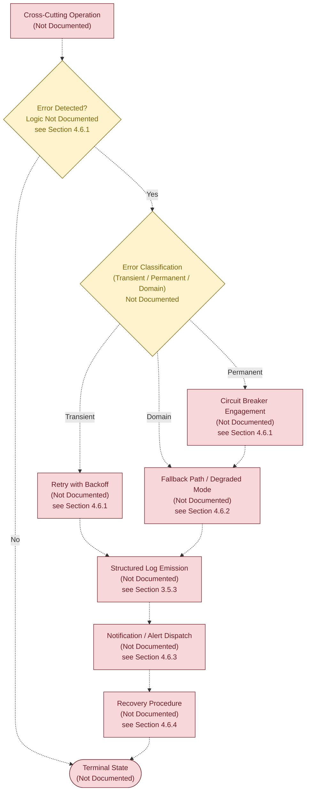

## 5.6 RECOMMENDED NEXT STEPS FOR SYSTEM ARCHITECTURE AUTHORING

While outside the strict factual scope of this specification, the absence of substantive architectural content suggests that subsequent contributions to the repository should introduce, at minimum, the following inputs to enable authoritative population of Section 5. This list parallels the recommendation patterns established in **Section 1.4.3**, **Section 2.8**, **Section 3.9**, and **Section 4.8**.

### 5.6.1 Minimum Repository Contributions Required

| Contribution Category | Minimum Required Artifacts | Enables Section |
|-----------------------|----------------------------|------------------|
| Architectural Style Declaration | A `docs/architecture/overview.md` (or equivalent) declaring the chosen style and its rationale | Section 5.2.1 |
| Component Inventory | A source-tree skeleton (`src/`, `services/`, etc.) reflecting the intended component decomposition | Sections 5.2.2, 5.3 |
| Integration Topology | API specifications (OpenAPI/GraphQL/Protobuf) and external client manifests | Sections 5.2.3, 5.2.4 |
| Data Flow Documentation | Sequence diagrams or interaction specifications committed under `docs/flows/` | Section 5.2.3 |
| Architecture Decision Records | An `adr/` (or `docs/decisions/`) folder using a recognized ADR template (Nygard or MADR) | Section 5.4 |
| Observability Configuration | APM, logging, tracing, and alerting configuration files committed to the repository | Section 5.5.2 |
| Security Policies | AuthN/AuthZ middleware, identity provider configuration, and encryption posture documentation | Section 5.5.3 |
| Performance and SLA Documentation | A `docs/sla/` (or equivalent) declaring latency, throughput, availability, and error-budget commitments | Section 5.5.4 |
| Disaster Recovery Playbooks | Runbooks, backup/restore procedures, and RTO/RPO declarations under `docs/runbooks/` | Section 5.5.5 |
| Cross-Cutting Implementation Artifacts | Middleware, interceptors, and service-mesh configuration evidencing retry/fallback/circuit-breaker policy | Section 5.5.6 |

### 5.6.2 Re-Authoring Triggers

This section must be re-authored from evidence — rather than from placeholders — when any of the following triggers occur in the repository:

- Introduction of any source code file in a recognized language (any of `*.py`, `*.js`, `*.ts`, `*.go`, `*.rs`, `*.java`, `*.kt`, `*.swift`, `*.cs`, `*.rb`, `*.php`, or equivalent).
- Introduction of any dependency manifest (`package.json`, `requirements.txt`, `pyproject.toml`, `pom.xml`, `Cargo.toml`, `go.mod`, `Gemfile`, `composer.json`, `*.csproj`, or equivalent).
- Introduction of any container or orchestration descriptor (`Dockerfile`, `docker-compose.yml`, Kubernetes manifests, or Helm charts).
- Introduction of any infrastructure-as-code artifact (`*.tf`, CloudFormation, Pulumi, CDK, Bicep, Ansible).
- Introduction of any API or IDL definition (OpenAPI, GraphQL schema, Protocol Buffers, Thrift, AsyncAPI).
- Introduction of any architecture decision record (`adr/`, `docs/decisions/`, RFC, or design-record artifact).
- Introduction of any observability, security, or runbook configuration (APM agent config, IAM policy, runbook Markdown, alerting rule file).

## 5.7 SECTION INTEGRITY AND TRACEABILITY

### 5.7.1 Adherence to Document Authoring Constraints

This Section 5 has been authored in strict adherence to the constraints established in **Section 1.4.2 (Document Authoring Constraints)** and ratified in **Section 3.1.1** and **Section 4.1.1**. No architectural style, component, data flow, integration point, decision rationale, or cross-cutting concern has been asserted that is not directly supported by repository evidence. Where the canonical System Architecture schema would normally require substantive content, structural placeholders have been preserved with explicit "Not Documented in Current Repository State" markers and cross-references to the originating absence determinations.

### 5.7.2 Evidence Base Consistency

The single piece of evidence available to this section — the project name "Artifact8" derived from the H1 heading in `README.md` — provides no basis from which any architectural style, component decomposition, integration topology, decision rationale, or cross-cutting policy could be authoritatively inferred. This is consistent with the evidence base catalogued in **Section 1.4.1 (Verifiable Facts Summary)**, in which only seven verifiable facts are recorded, none of which describe architectural behaviour.

### 5.7.3 Cross-Section Coherence

The absence-state determinations in this section align with and inherit from the corresponding determinations in the following upstream sections.

| Upstream Section | Inheritance into Section 5 |
|------------------|------------------------------|
| Section 1.2.1 — Integration with Existing Enterprise Landscape | Drives 5.2.4 and 5.5.3 absence determinations |
| Section 1.2.2 — Major System Components | Drives 5.1.3, 5.2.1, 5.2.2, and 5.3 absence determinations |
| Section 1.2.2 — Core Technical Approach | Drives 5.2.1 architectural style absence |
| Section 1.4.1 — Verifiable Facts Summary | Bounds the evidence base for all of Section 5 |
| Section 1.4.2 — Document Authoring Constraints | Provides the six binding constraints inherited by 5.1.1 |
| Section 2.4.2 — Integration Points | Drives 5.2.3, 5.2.4, and 5.3.4 absence determinations |
| Section 2.4.3 — Shared Components and Common Services | Drives 5.3 component-inventory absence |
| Section 2.5.1 — Technical Constraints | Drives 5.2.1 style and 5.4.1 decision absences |
| Section 2.5.2 — Performance Requirements | Drives 5.5.4 SLA absences |
| Section 2.5.3 — Scalability Considerations | Drives 5.3.1 scaling-consideration absence |
| Section 2.5.4 — Security Implications | Drives 5.4.1 and 5.5.3 security absences |
| Section 2.5.5 — Maintenance Requirements | Drives 5.5.5 disaster-recovery absences |
| Section 3.1.2 — Verified Absence of Technology Evidence | Source for 5.1.2 absence catalogue |
| Section 3.5 — Third-Party Services | Drives 5.2.3, 5.2.4, and 5.3.4 external-system absences |
| Section 3.5.3 — Monitoring, Logging, and Observability | Drives 5.5.2 observability absence |
| Section 3.6 — Databases & Storage | Drives 5.2.3 and 5.3.1 data-persistence absences |
| Section 3.6.2 — Data Persistence Strategy | Drives 5.3.3 state-transition absence |
| Section 3.6.3 — Caching Solutions | Drives 5.2.3 and 5.4.1 caching absences |
| Section 3.7 — Development & Deployment | Drives 5.1.2 deployment-artifact absences |
| Section 4.2 — System Workflows | Drives 5.3.4 sequence-diagram absence |
| Section 4.5.1 — State Definitions | Drives 5.3.3 state-transition absence |
| Section 4.6 — Error Handling and Recovery | Drives 5.5.1 and 5.5.6 error-handling absences |
| Section 4.7 — Required Diagrams — Absence-State Visualizations | Pattern source for 5.1.3, 5.3.2, 5.3.3, 5.3.4, 5.4.3, and 5.5.6 diagrams |

#### References

#### Files Examined

- `README.md` — The sole tracked file in the Artifact8 repository. Its entire content (`# Artifact8`, 11 bytes) provided the only piece of evidence-based content used in this section: the project name. Contains no descriptions of architectural style, component decomposition, data flows, integration topology, decision rationale, or cross-cutting policy.

#### Folders Explored

- `""` (repository root, depth 0) — Confirmed to contain exactly one tracked file (`README.md`) and no source folders. No `src/`, `lib/`, `app/`, `services/`, `components/`, `modules/`, `infrastructure/`, `infra/`, `terraform/`, `k8s/`, `helm/`, `deploy/`, `ops/`, `runbooks/`, `adr/`, `docs/`, `architecture/`, `decisions/`, or any other folder that would contain architectural artifacts is present. The `.git/` metadata directory exists but contains only Git internals.

#### Repository-Wide Verifications Performed

- Recursive filesystem scan for source code files of any common language extension — Confirmed absent (per Section 3.1.2).
- Recursive filesystem scan for dependency manifests, lockfiles, and configuration files — Confirmed absent (per Section 3.1.2).
- Recursive filesystem scan for containerization, orchestration, and IaC artifacts — Confirmed absent (per Section 3.1.2).
- Semantic search for "source code application implementation directories" — Returned zero results.
- Semantic search for "workflows pipelines orchestration deployment" — Returned zero results.
- Semantic search for "configuration files dependency manifests build descriptors" — Returned zero results.
- Filesystem inspection for ADR folders (`adr/`, `docs/decisions/`, `architecture/`) — Confirmed absent.
- Filesystem inspection for observability configuration (APM agent config, logging config, tracing config) — Confirmed absent.
- Filesystem inspection for security policy artifacts (IAM, OAuth/OIDC configuration, middleware) — Confirmed absent.
- Git commit history inspection (`git log --all`) — Confirmed a single "Initial commit" (`4cdb1ff7d5c4423fb475c9c2707d5d83abba3bf2`) introducing only `README.md`.

#### Cross-Referenced Specification Sections

- **Section 1.2.1 (Project Context)** — Source for the absence of enterprise integration evidence cited throughout 5.2.4 and 5.5.3.
- **Section 1.2.2 (High-Level Description)** — Source for the absence of architectural style, deployment model, and component inventory cited throughout 5.1, 5.2, and 5.3, and the visual styling precedent for all diagrams in this section.
- **Section 1.4.1 (Verifiable Facts Summary)** — Source for the seven verifiable facts that bound this section's authorship.
- **Section 1.4.2 (Document Authoring Constraints)** — Source for the six binding authoring constraints applied throughout this section.
- **Section 1.4.3 (Recommended Next Steps for Project Authoring)** — Pattern source for Section 5.6.
- **Section 2.1.1 (Pre-Requisite Inputs and Repository Evidence)** — Pattern source for Section 5.1.2's absence-mapping table.
- **Section 2.1.3 (Verified Repository State)** — Pattern source for Section 5.1.3's layered absence diagram.
- **Section 2.4.2 (Integration Points)** — Source for Section 5.2.3, 5.2.4, and 5.3.4 absence determinations.
- **Section 2.4.3 (Shared Components and Common Services)** — Source for Section 5.3 component-inventory absence.
- **Section 2.5.1 (Technical Constraints)** — Source for Section 5.2.1 style absence.
- **Section 2.5.2 (Performance Requirements)** — Source for Section 5.5.4 SLA absences.
- **Section 2.5.3 (Scalability Considerations)** — Source for Section 5.3.1 scaling absence.
- **Section 2.5.4 (Security Implications)** — Source for Section 5.4.1 and 5.5.3 security absences.
- **Section 2.5.5 (Maintenance Requirements)** — Source for Section 5.5.5 disaster-recovery absences.
- **Section 2.7.2 (Documented Constraints)** — Source for the binding constraint that the sole evidence is the project name.
- **Section 2.8 (Recommended Next Steps for Requirements Authoring)** — Pattern source for Section 5.6.
- **Section 3.1.1 (Binding Authoring Constraint)** — Pattern source for Section 5.1.1.
- **Section 3.1.2 (Verified Absence of Technology Evidence)** — Source for the comprehensive artifact-absence catalogue inherited by Section 5.1.2.
- **Section 3.1.3 (Repository State Visualization)** — Pattern source for Section 5.1.3.
- **Section 3.3 (Frameworks & Libraries)** — Source for the absence of any framework that would enable architectural patterns.
- **Section 3.5 (Third-Party Services)** — Source for Section 5.2.3, 5.2.4, and 5.3.4 external-service absences.
- **Section 3.5.3 (Monitoring, Logging, and Observability)** — Source for Section 5.5.2 observability absences.
- **Section 3.6 (Databases & Storage)** — Source for Section 5.2.3 and 5.3.1 data-persistence absences.
- **Section 3.6.2 (Data Persistence Strategy)** — Source for Section 5.3.3 state-transition absence.
- **Section 3.6.3 (Caching Solutions)** — Source for Section 5.2.3 and 5.4.1 caching absences.
- **Section 3.7 (Development & Deployment)** — Source for Section 5.1.2 deployment-artifact absences.
- **Section 3.9 (Recommended Next Steps for Technology Stack Authoring)** — Pattern source for Section 5.6.
- **Section 4.1.1 (Binding Authoring Constraint)** — Pattern source for Section 5.1.1.
- **Section 4.2 (System Workflows — Core Business Processes)** — Source for Section 5.3.4 sequence-diagram absence.
- **Section 4.3.1 (Data Flow Between Systems)** — Source for Section 5.2.3 data-flow absence.
- **Section 4.5.1 (State Definitions)** — Source for Section 5.3.3 state-transition absence.
- **Section 4.6 (Error Handling and Recovery)** — Source for Section 5.5.1 and 5.5.6 error-handling absences.
- **Section 4.7 (Required Diagrams — Absence-State Visualizations)** — Pattern source for Sections 5.1.3, 5.3.2, 5.3.3, 5.3.4, 5.4.3, and 5.5.6 diagrams; including the `classDef` styling convention, dashed-edge (`-.->`) notation, and dashed-X (`--x`) sequence-message notation.
- **Section 4.8 (Recommended Next Steps for Process Flowchart Authoring)** — Pattern source for Section 5.6.
- **Section 4.9 (Section Integrity and Traceability)** — Pattern source for Section 5.7.

# 6. SYSTEM COMPONENTS DESIGN

## 6.1 Core Services Architecture

**Core Services Architecture is not applicable for this system in its current repository state.**

The Section 6.1 authoring prompt explicitly directs that "If the system does not require microservices, distributed architecture, or distinct service components, clearly state 'Core Services Architecture is not applicable for this system' and explain why." This determination is the only authoritative authoring outcome available for Artifact8, because the repository contains no source code, no service manifests, no API or IDL definitions, no deployment topology descriptors, no infrastructure-as-code artifacts, and no declared architectural style from which any service decomposition — monolithic or distributed — could be inferred. The originating absence determinations are inherited verbatim from **Section 1.2.2 (Major System Components)**, **Section 2.4.2 (Integration Points)**, **Section 2.4.3 (Shared Components and Common Services)**, **Section 3.1.2 (Verified Absence of Technology Evidence)**, **Section 5.1.2 (Verified Absence of Architectural Evidence)**, and **Section 5.2 (High-Level Architecture)**.

This section preserves the canonical schema requested by the authoring prompt — Service Components, Scalability Design, and Resilience Patterns — populated exclusively with absence determinations and cross-references, so that subsequent contributions to the repository can populate each placeholder with verifiable content without restructuring the specification. The section follows the same evidence-only authoring discipline ratified in **Section 1.4.2 (Document Authoring Constraints)** and applied throughout **Sections 3.1.1, 4.1.1, and 5.1.1**.

### 6.1.1 Applicability Determination

The applicability of a Core Services Architecture section depends on the presence of identifiable service components, declared inter-component contracts, and at least one of the following architectural conditions: a microservices decomposition, an event-driven topology, a service-oriented architecture, a serverless function inventory, or any hybrid pattern that yields distinct, independently addressable service boundaries. None of these conditions are evidenced in the Artifact8 repository.

#### Rationale Summary

| Required Condition for Applicability | Repository Evidence | Determination |
|--------------------------------------|---------------------|----------------|
| Declared architectural style indicating distributed services | None (Architectural Style "Not Documented" — Section 5.2.1) | Condition Not Met |
| Identifiable service boundaries or component decomposition | None (all four component categories "Not Documented" — Section 1.2.2) | Condition Not Met |
| Internal or external integration points | None (zero documented — Section 2.4.2) | Condition Not Met |
| Source code, dependency manifests, or service manifests | None (all categories absent — Section 3.1.2) | Condition Not Met |
| Deployment topology or container/orchestration descriptors | None (no Dockerfile, no Kubernetes manifests, no IaC — Section 3.7) | Condition Not Met |
| Architecture Decision Records declaring service pattern | None (zero ADRs — Section 5.4) | Condition Not Met |

Because every condition above is unmet, no microservices, distributed architecture, or distinct service components can be documented. The remainder of this section therefore preserves the prompt-requested subsection structure but reports each canonical sub-area as inheriting its absence determination from the corresponding upstream section.

#### Sole Verifiable Evidence

Per **Section 1.4.1 (Verifiable Facts Summary)**, only seven verifiable facts exist for this repository, none of which describe service-level behaviour:

| # | Verifiable Fact | Bearing on Section 6.1 |
|---|-----------------|------------------------|
| 1 | Project name is "Artifact8" (`README.md` H1) | Provides no service decomposition signal |
| 2 | Repository contains exactly one tracked file | Confirms absence of source modules |
| 3 | Default branch is `main` with `origin/main` remote | No bearing on service topology |
| 4 | Repository initialized via single "Initial commit" | Confirms pre-implementation state |
| 5 | Initial commit date is June 1, 2026 | No bearing on service topology |
| 6 | Initial commit author is shalini690 (shalini@blitzy.io) | No bearing on service topology |
| 7 | `README.md` total size is 11 bytes | Confirms no architectural narrative present |

### 6.1.2 Binding Authoring Constraint

The constraints below restate, for traceability within this section, the evidence-only authoring discipline inherited from **Section 1.4.2** and ratified in **Sections 3.1.1, 4.1.1, and 5.1.1**.

| Constraint | Source / Cross-Reference |
|------------|--------------------------|
| No service boundaries or service components asserted | Section 1.2.2 — Major System Components ("Not Documented") |
| No inter-service communication patterns asserted | Section 2.4.2 — Integration Points ("None Documented") |
| No service discovery or load-balancing mechanism asserted | Section 5.2.1 — System Boundaries ("Not Documented"); Section 3.5 — Third-Party Services ("Not Documented") |
| No circuit-breaker, retry, or fallback policy asserted | Section 4.6 — Error Handling and Recovery (all four subsections "Not Documented") |
| No horizontal, vertical, or auto-scaling strategy asserted | Section 2.5.3 — Scalability Considerations ("Not Documented") |
| No performance optimization or capacity planning asserted | Section 2.5.2 — Performance Requirements ("Not Documented") |
| No fault-tolerance, disaster recovery, or failover policy asserted | Section 5.5.5 — Disaster Recovery Procedures ("Not Documented") |
| No data redundancy or replication topology asserted | Section 3.6 — Databases & Storage ("Not Documented") |
| No service degradation or graceful-failure policy asserted | Section 4.6.2 — Fallback Processes ("Not Documented") |

### 6.1.3 Service Components — Absence Determinations

The Section 6.1 authoring prompt requests documentation of service boundaries and responsibilities, inter-service communication patterns, service discovery mechanisms, load balancing strategy, circuit breaker patterns, and retry/fallback mechanisms. Each sub-area maps to a prior absence determination, as catalogued below.

#### Service Boundaries and Responsibilities

No service boundaries or component responsibilities have been declared. **Section 1.2.2 (Major System Components)** marks Frontend/Client, Backend/Service, Data Storage, and Cross-Cutting/Platform component categories as "Not Documented in Current Repository State," and **Section 2.4.3 (Shared Components and Common Services)** confirms zero shared libraries, zero common services, zero cross-cutting concerns, and zero reusable utilities. The per-service schema is preserved below for future population.

| Service Specification Dimension | Documented Value | Status |
|--------------------------------|------------------|--------|
| Service Name | — | Not Documented — see Section 1.2.2 |
| Primary Responsibility | — | Not Documented — see Section 5.2.2 |
| Bounded Context / Domain | — | Not Documented — see Section 5.2.1 |
| Public Interface Contract | — | Not Documented — see Section 2.4.2 |

#### Inter-Service Communication Patterns

No inter-service communication patterns (such as synchronous request/response, asynchronous publish/subscribe, event sourcing, CQRS, saga orchestration, or change data capture) and no transport protocols (such as HTTP/REST, gRPC, GraphQL, WebSocket, AMQP, MQTT, or Kafka) have been declared or implemented. **Section 5.2.3 (Data Flow Description)** has classified Synchronous Integration Pattern, Asynchronous Integration Pattern, Transport Protocols, and Serialization Formats as "Not Documented in Current Repository State."

| Communication Attribute | Documented Selection | Status |
|-------------------------|----------------------|--------|
| Synchronous Pattern | — | Not Documented — see Section 5.2.3 |
| Asynchronous Pattern | — | Not Documented — see Section 5.2.3 |
| Transport Protocol | — | Not Documented — see Section 3.5 |
| Serialization Format | — | Not Documented — see Section 5.2.3 |

#### Service Discovery Mechanisms

No service discovery mechanism has been declared. A service discovery layer (such as DNS-based discovery, client-side discovery with a registry, server-side discovery via a load balancer, or a service mesh control plane) presupposes the existence of multiple addressable service instances. Because the component inventory is empty (per **Section 1.2.2**), no addressable instances exist to register, query, or route to.

| Service Discovery Attribute | Documented Selection | Status |
|------------------------------|----------------------|--------|
| Discovery Mode (Client-Side / Server-Side) | — | Not Documented in Current Repository State |
| Service Registry Technology | — | Not Documented — see Section 3.5 |
| Health Check Mechanism | — | Not Documented — see Section 3.5.3 |
| Instance Metadata / Tagging Strategy | — | Not Documented in Current Repository State |

#### Load Balancing Strategy

No load balancing strategy has been declared. A load balancing layer (such as L4 round-robin, L7 weighted routing, least-connections, consistent hashing, or geo-aware routing) presupposes both a fronting balancer and multiple backend instances. **Section 3.5 (Third-Party Services)** confirms no cloud platform services, networking primitives, or traffic-management tooling are documented, and **Section 3.7 (Development & Deployment)** confirms no deployment topology exists.

| Load Balancing Attribute | Documented Selection | Status |
|--------------------------|----------------------|--------|
| Balancing Layer (L4 / L7) | — | Not Documented — see Section 3.5 |
| Routing Algorithm | — | Not Documented in Current Repository State |
| Session Affinity / Sticky Sessions | — | Not Documented in Current Repository State |
| Health-Aware Routing Policy | — | Not Documented — see Section 3.5.3 |

#### Circuit Breaker Patterns

No circuit breaker pattern has been declared. **Section 4.6.1 (Retry Mechanisms)** has classified Circuit-Breaker Integration as "Not Documented in Current Repository State," and **Section 5.2.1 (Key Architectural Principles and Patterns)** has confirmed zero implemented design patterns, with circuit breaker explicitly enumerated among the unimplemented patterns.

| Circuit Breaker Attribute | Documented Selection | Status |
|---------------------------|----------------------|--------|
| Breaker States (Closed / Open / Half-Open) | — | Not Documented — see Section 4.6.1 |
| Failure Threshold / Volume Trigger | — | Not Documented — see Section 4.6.1 |
| Reset Timeout / Half-Open Probe Policy | — | Not Documented — see Section 4.6.1 |
| Breaker Telemetry / Metric Emission | — | Not Documented — see Section 3.5.3 |

#### Retry and Fallback Mechanisms

No retry policies and no fallback procedures have been declared. **Section 4.6.1 (Retry Mechanisms)** has classified Retry Trigger Conditions, Backoff Strategy, Maximum Retry Attempts, and Idempotency Key Strategy as "Not Documented in Current Repository State." **Section 4.6.2 (Fallback Processes)** has classified Fallback Activation Conditions, Degraded-Mode Capabilities, Cached/Stale Data Substitutes, Static/Default Response Strategy, and Fallback-to-Manual Procedure as "Not Documented in Current Repository State."

| Retry / Fallback Attribute | Documented Selection | Status |
|----------------------------|----------------------|--------|
| Retry Trigger Conditions | — | Not Documented — see Section 4.6.1 |
| Backoff Strategy (Exponential / Jittered / Linear) | — | Not Documented — see Section 4.6.1 |
| Fallback Activation Conditions | — | Not Documented — see Section 4.6.2 |
| Degraded-Mode Capabilities | — | Not Documented — see Section 4.6.2 |

### 6.1.4 Scalability Design — Absence Determinations

The Section 6.1 authoring prompt requests documentation of horizontal/vertical scaling approach, auto-scaling triggers and rules, resource allocation strategy, performance optimization techniques, and capacity planning guidelines. Each sub-area maps to a prior absence determination, as catalogued below.

#### Horizontal and Vertical Scaling Approach

No scaling approach has been declared. **Section 2.5.3 (Scalability Considerations)** has classified Horizontal Scaling Strategy, Vertical Scaling Strategy, Data Volume Growth Assumptions, and Concurrent User Assumptions as "Not Documented in Current Repository State." Because no source code or deployment topology exists, no scalable unit (process, container, pod, function, or VM) can be identified.

| Scaling Attribute | Documented Selection | Status |
|-------------------|----------------------|--------|
| Horizontal Scaling Strategy | — | Not Documented — see Section 2.5.3 |
| Vertical Scaling Strategy | — | Not Documented — see Section 2.5.3 |
| Scalable Unit (Process / Container / Pod / Function) | — | Not Documented — see Section 1.2.2 |
| Stateless vs Stateful Classification | — | Not Documented — see Section 3.6.2 |

#### Auto-Scaling Triggers and Rules

No auto-scaling triggers or rules have been declared. **Section 3.7 (Development & Deployment)** has confirmed no containerization, orchestration, or infrastructure-as-code artifacts are present from which auto-scaling policy could be inferred, and **Section 3.5 (Third-Party Services)** has confirmed no cloud platform services from which managed auto-scaling capability could be drawn.

| Auto-Scaling Attribute | Documented Selection | Status |
|------------------------|----------------------|--------|
| Scale-Out Trigger Metric (CPU / Memory / Queue Depth / Custom) | — | Not Documented — see Section 2.5.3 |
| Scale-In Trigger / Cooldown Policy | — | Not Documented in Current Repository State |
| Minimum / Maximum Instance Counts | — | Not Documented in Current Repository State |
| Predictive / Scheduled Scaling Rules | — | Not Documented in Current Repository State |

#### Resource Allocation Strategy

No resource allocation strategy has been declared. **Section 2.5.2 (Performance Requirements)** has classified Resource Utilization Targets as "Not Documented in Current Repository State," and **Section 3.7 (Development & Deployment)** has confirmed no container resource requests/limits, no VM sizing, and no serverless concurrency caps are declared.

| Resource Allocation Attribute | Documented Selection | Status |
|-------------------------------|----------------------|--------|
| CPU Request / Limit | — | Not Documented — see Section 2.5.2 |
| Memory Request / Limit | — | Not Documented — see Section 2.5.2 |
| Storage Provisioning | — | Not Documented — see Section 3.6 |
| Network Bandwidth Allocation | — | Not Documented in Current Repository State |

#### Performance Optimization Techniques

No performance optimization techniques have been declared. **Section 2.5.2 (Performance Requirements)** has classified Latency Targets, Throughput Targets, Resource Utilization Targets, and Availability/SLA Targets as "Not Documented in Current Repository State." **Section 3.6.3 (Caching Solutions)** has confirmed zero documented cache tiers (Client, CDN, Application, Distributed, Database Query).

| Optimization Technique | Documented Selection | Status |
|------------------------|----------------------|--------|
| Caching Strategy | — | Not Documented — see Section 3.6.3 |
| Asynchronous / Batch Processing | — | Not Documented — see Section 5.2.3 |
| Database Query Optimization | — | Not Documented — see Section 3.6 |
| Content Delivery / Edge Acceleration | — | Not Documented — see Section 3.5 |

#### Capacity Planning Guidelines

No capacity planning guidelines have been declared. Capacity planning presupposes documented growth assumptions (data volume, concurrent users, transactions per second), baseline performance measurements, and headroom policies — all of which **Section 2.5.3** has classified as "Not Documented in Current Repository State."

| Capacity Planning Attribute | Documented Selection | Status |
|-----------------------------|----------------------|--------|
| Baseline Workload Profile | — | Not Documented — see Section 2.5.3 |
| Growth Projection Horizon | — | Not Documented — see Section 2.5.3 |
| Headroom / Safety Margin Policy | — | Not Documented in Current Repository State |
| Cost / Performance Trade-Off Model | — | Not Documented in Current Repository State |

### 6.1.5 Resilience Patterns — Absence Determinations

The Section 6.1 authoring prompt requests documentation of fault tolerance mechanisms, disaster recovery procedures, data redundancy approach, failover configurations, and service degradation policies. Each sub-area maps to a prior absence determination, as catalogued below.

#### Fault Tolerance Mechanisms

No fault tolerance mechanisms have been declared. **Section 4.6 (Error Handling and Recovery)** has classified all four subsections — Retry Mechanisms, Fallback Processes, Error Notification Flows, and Recovery Procedures — as "Not Documented in Current Repository State." **Section 5.2.1 (Key Architectural Principles and Patterns)** has confirmed zero implemented design patterns, with bulkhead and circuit breaker explicitly enumerated among the unimplemented patterns.

| Fault Tolerance Attribute | Documented Selection | Status |
|---------------------------|----------------------|--------|
| Bulkhead / Resource Isolation | — | Not Documented — see Section 5.2.1 |
| Timeout Policy | — | Not Documented — see Section 4.6.1 |
| Idempotency Guarantees | — | Not Documented — see Section 4.6.1 |
| Health Probes (Liveness / Readiness) | — | Not Documented — see Section 3.5.3 |

#### Disaster Recovery Procedures

No disaster recovery procedures have been declared. **Section 5.5.5 (Disaster Recovery Procedures)** has classified Recovery Time Objective (RTO), Recovery Point Objective (RPO), Backup Strategy and Cadence, Cross-Region/Cross-Zone Failover, Disaster Recovery Playbook, and Post-Incident Review Process as "Not Documented in Current Repository State." **Section 4.6.4 (Recovery Procedures)** has classified the Disaster Recovery Playbook, RTO, RPO, Data Restoration Procedure, Operational Runbook Library, and Post-Incident Review Process as "Not Documented in Current Repository State."

| Disaster Recovery Attribute | Documented Specification | Status |
|------------------------------|--------------------------|--------|
| Recovery Time Objective (RTO) | — | Not Documented — see Section 5.5.5 |
| Recovery Point Objective (RPO) | — | Not Documented — see Section 5.5.5 |
| Disaster Recovery Playbook | — | Not Documented — see Section 4.6.4 |
| Post-Incident Review Process | — | Not Documented — see Section 4.6.4 |

#### Data Redundancy Approach

No data redundancy approach has been declared. **Section 3.6 (Databases & Storage)** has classified all database engines (OLTP, OLAP, Document/NoSQL, Graph, Time-Series, Search, Vector) as "Not Documented" and **Section 3.6.2 (Data Persistence Strategy)** has confirmed no replication topology, no transactional boundaries, and no backup configuration are documented.

| Data Redundancy Attribute | Documented Selection | Status |
|---------------------------|----------------------|--------|
| Replication Topology (Primary-Replica / Multi-Primary / Quorum) | — | Not Documented — see Section 3.6.2 |
| Cross-Zone / Cross-Region Replication | — | Not Documented — see Section 5.5.5 |
| Backup Strategy and Cadence | — | Not Documented — see Section 3.6.2 |
| Erasure Coding / Storage Redundancy Class | — | Not Documented — see Section 3.6 |

#### Failover Configurations

No failover configuration has been declared. Failover presupposes both a primary instance and at least one standby (active or passive) along with a health-aware switching mechanism, none of which are evidenced in the repository.

| Failover Attribute | Documented Selection | Status |
|--------------------|----------------------|--------|
| Failover Mode (Active-Active / Active-Passive) | — | Not Documented — see Section 5.5.5 |
| Failover Trigger Mechanism | — | Not Documented — see Section 3.5.3 |
| Failover RTO (Detection + Switchover) | — | Not Documented — see Section 4.6.4 |
| DNS / Traffic Steering Policy | — | Not Documented — see Section 3.5 |

#### Service Degradation Policies

No service degradation policies have been declared. **Section 4.6.2 (Fallback Processes)** has classified Fallback Activation Conditions, Degraded-Mode Capabilities, Cached/Stale Data Substitutes, Static/Default Response Strategy, and Fallback-to-Manual Procedure as "Not Documented in Current Repository State."

| Degradation Attribute | Documented Selection | Status |
|-----------------------|----------------------|--------|
| Degraded-Mode Capability Set | — | Not Documented — see Section 4.6.2 |
| Read-Only / Limited-Feature Fallback | — | Not Documented — see Section 4.6.2 |
| Load-Shedding / Rate-Limiting Policy | — | Not Documented in Current Repository State |
| User-Facing Degradation Messaging | — | Not Documented — see Section 4.6.3 |

### 6.1.6 Required Diagrams — Absence-State Visualizations

The Section 6.1 authoring prompt requests three diagrams: a service interaction diagram, a scalability architecture diagram, and a resilience pattern implementation diagram. Because no service components, scaling units, or resilience mechanisms exist in the repository, the diagrams below visually document the **absence** of each required artifact. All diagrams follow the same `classDef` styling convention established in **Section 1.2.2 (Current Repository State)**, **Section 2.1.3 (Verified Repository State)**, **Section 3.1.3 (Repository State Visualization)**, **Section 4.7 (Required Diagrams — Absence-State Visualizations)**, **Section 5.1.3 (Repository Architectural State Visualization)**, **Section 5.3.2 (Component Interaction Diagram)**, and **Section 5.5.6 (Error Handling Flow)** — green denotes present evidence, red denotes confirmed absence, yellow denotes question or layer nodes, and blue denotes outcome states; dashed edges (`-.->`) indicate that no relationship contract is evidenced.

#### 6.1.6.1 Service Interaction Diagram (Absence-State)

The diagram below depicts the canonical roster of service-tier participants that a Core Services Architecture section would normally interconnect — clients, edge/gateway, service-discovery registry, multiple backend services, message broker, and shared data tier — and explicitly marks every node as absent, with cross-references to the specification sections that have documented the corresponding absences. The convention follows the precedent established in **Section 5.3.2 (Component Interaction Diagram — Absence-State)**.

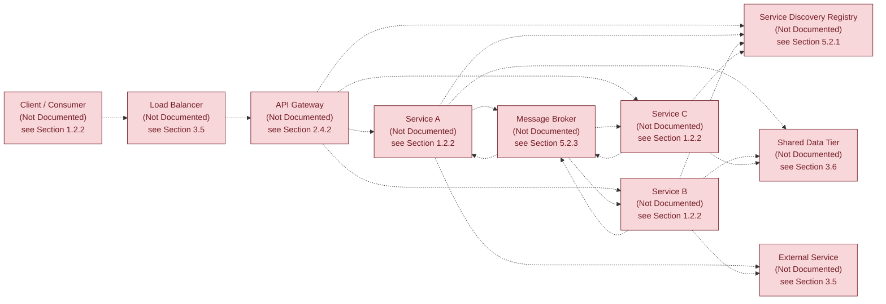

#### 6.1.6.2 Scalability Architecture (Absence-State)

The diagram below depicts the canonical structure of a scalable services architecture — including ingress traffic management, an auto-scaling control plane, a horizontally scalable service pool, a metrics-driven feedback loop, a cache tier, and a replicated data tier — and explicitly marks every node as absent. Every horizontal-scaling, vertical-scaling, auto-scaling-trigger, and capacity-planning attribute has been classified as "Not Documented" by **Section 2.5.3 (Scalability Considerations)** and **Section 2.5.2 (Performance Requirements)**.

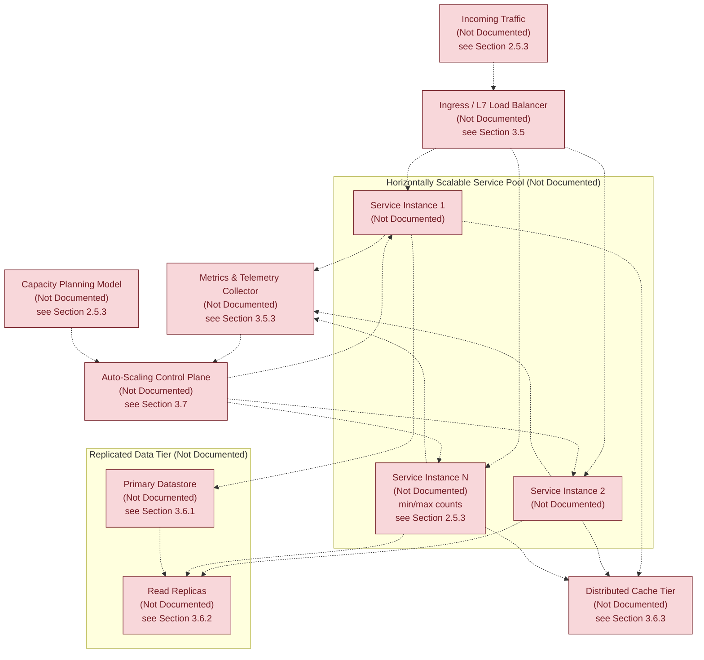

#### 6.1.6.3 Resilience Pattern Implementation (Absence-State)

The diagram below depicts the canonical structure of a resilience pattern stack — including health probing, timeout enforcement, retry-with-backoff, circuit breaker, bulkhead isolation, fallback handling, rate-limiting/load-shedding, primary/standby failover, and disaster-recovery backup — and explicitly marks every node as absent. The diagram adapts the precedent established in **Section 4.7.3 (Error Handling Flowchart — Absence-State)** and **Section 5.5.6 (Error Handling Flow — Absence-State)**, extending the pattern coverage to the resilience dimensions specifically requested by the Section 6.1 authoring prompt.

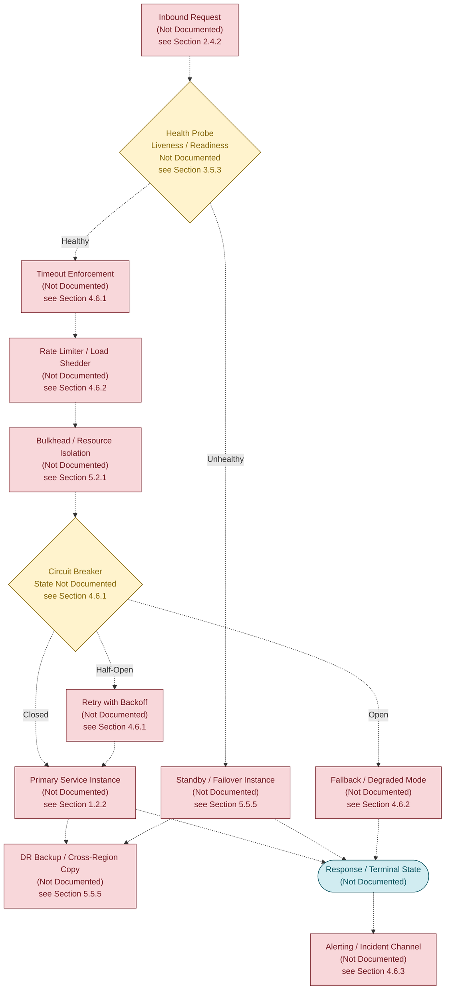

#### 6.1.6.4 Diagram Coverage Summary

| Prompt-Required Diagram | Absence-State Visualization | Cross-Reference |
|-------------------------|------------------------------|-----------------|
| Service interaction diagram | Section 6.1.6.1 | Sections 1.2.2, 2.4.2, 5.3.2 |
| Scalability architecture | Section 6.1.6.2 | Sections 2.5.2, 2.5.3, 3.6.3 |
| Resilience pattern implementations | Section 6.1.6.3 | Sections 4.6, 5.5.5, 5.5.6 |

### 6.1.7 Re-Authoring Triggers

This Section 6.1 must be re-authored from evidence — rather than from absence determinations — when any of the following triggers occur in the repository. The list parallels and extends **Section 5.6.2 (Re-Authoring Triggers)**.

| Trigger Category | Specific Trigger Artifacts | Re-Authoring Scope |
|------------------|----------------------------|---------------------|
| Source Code Introduction | Any source file (`*.py`, `*.js`, `*.ts`, `*.go`, `*.rs`, `*.java`, `*.kt`, `*.swift`, `*.cs`, `*.rb`, `*.php`) in a recognizable component directory | Section 6.1.3 — Service Components |
| Dependency Manifest Introduction | `package.json`, `requirements.txt`, `pyproject.toml`, `pom.xml`, `Cargo.toml`, `go.mod`, `Gemfile`, `composer.json`, or `*.csproj` | Section 6.1.3 — Service Components |
| Containerization Artifact | `Dockerfile`, `docker-compose.yml`, Kubernetes manifests, or Helm charts | Sections 6.1.3, 6.1.4 |
| Infrastructure-as-Code Artifact | `*.tf`, CloudFormation, Pulumi, CDK, Bicep, or Ansible artifacts | Sections 6.1.4, 6.1.5 |
| API or IDL Definition | OpenAPI, GraphQL schema, Protocol Buffers, Thrift, or AsyncAPI specifications | Section 6.1.3 — Inter-Service Communication |
| Service-Mesh or Discovery Configuration | Istio, Linkerd, Consul, Eureka, or equivalent control-plane configuration | Section 6.1.3 — Service Discovery |
| Resilience Library Adoption | Adoption of resilience libraries (Resilience4j, Polly, Hystrix successors) or equivalent middleware | Section 6.1.5 — Resilience Patterns |
| Observability and SLA Documentation | APM agent config, alerting rule files, runbook Markdown, RTO/RPO declarations | Sections 6.1.4, 6.1.5 |
| Architecture Decision Record | An `adr/` or `docs/decisions/` artifact declaring services topology, scaling strategy, or resilience pattern | All subsections of 6.1 |

### 6.1.8 Section Integrity and Traceability

#### 6.1.8.1 Adherence to Document Authoring Constraints

This Section 6.1 has been authored in strict adherence to the constraints established in **Section 1.4.2 (Document Authoring Constraints)** and ratified in **Sections 3.1.1, 4.1.1, and 5.1.1**. No service component, communication pattern, scaling strategy, resilience mechanism, or disaster-recovery procedure has been asserted that is not directly supported by repository evidence. Where the canonical Core Services Architecture schema would normally require substantive content, structural placeholders have been preserved with explicit "Not Documented in Current Repository State" markers and cross-references to the originating absence determinations.

#### 6.1.8.2 Evidence Base Consistency

The single piece of evidence available to this section — the project name "Artifact8" derived from the H1 heading in `README.md` — provides no basis from which any service boundary, communication contract, scaling policy, or resilience pattern could be authoritatively inferred. This is consistent with the evidence base catalogued in **Section 1.4.1 (Verifiable Facts Summary)**, in which only seven verifiable facts are recorded, none of which describe service-level behaviour. The applicability determination in **Section 6.1.1** — that Core Services Architecture is not applicable to this system in its current state — is therefore the only authoritative authoring outcome.

#### 6.1.8.3 Cross-Section Coherence

The absence-state determinations in this section align with and inherit from the corresponding determinations in the following upstream sections.

| Upstream Section | Inheritance into Section 6.1 |
|------------------|------------------------------|
| Section 1.2.2 — Major System Components | Drives 6.1.3 service-component absence |
| Section 1.2.2 — Core Technical Approach | Drives 6.1.1 architectural-style absence |
| Section 1.4.1 — Verifiable Facts Summary | Bounds the evidence base for all of Section 6.1 |
| Section 1.4.2 — Document Authoring Constraints | Provides the binding constraints inherited by 6.1.2 |
| Section 2.4.2 — Integration Points | Drives 6.1.3 inter-service communication absence |
| Section 2.4.3 — Shared Components and Common Services | Drives 6.1.3 service-component absence |
| Section 2.5.2 — Performance Requirements | Drives 6.1.4 performance / resource absences |
| Section 2.5.3 — Scalability Considerations | Drives 6.1.4 scaling-strategy absences |
| Section 2.5.5 — Maintenance Requirements | Drives 6.1.5 disaster-recovery absences |
| Section 3.1.2 — Verified Absence of Technology Evidence | Source for the artifact-absence catalogue |
| Section 3.5 — Third-Party Services | Drives 6.1.3 service-discovery and load-balancing absences |
| Section 3.5.3 — Monitoring, Logging, and Observability | Drives 6.1.5 health-probe and alerting absences |
| Section 3.6 — Databases & Storage | Drives 6.1.5 data-redundancy absences |
| Section 3.6.2 — Data Persistence Strategy | Drives 6.1.5 replication-topology absences |
| Section 3.6.3 — Caching Solutions | Drives 6.1.4 caching-strategy absences |
| Section 3.7 — Development & Deployment | Drives 6.1.4 deployment-topology absences |
| Section 4.6 — Error Handling and Recovery | Drives 6.1.3 retry/fallback and 6.1.5 fault-tolerance absences |
| Section 4.7 — Required Diagrams — Absence-State Visualizations | Pattern source for diagrams in 6.1.6 |
| Section 5.1.2 — Verified Absence of Architectural Evidence | Source for 6.1.1 applicability rationale |
| Section 5.2.1 — System Overview | Drives 6.1.3 service-boundary absences |
| Section 5.2.3 — Data Flow Description | Drives 6.1.3 communication-pattern absences |
| Section 5.3.2 — Component Interaction Diagram | Pattern source for diagram in 6.1.6.1 |
| Section 5.4 — Technical Decisions | Drives 6.1.1 ADR absence |
| Section 5.5.5 — Disaster Recovery Procedures | Drives 6.1.5 DR and failover absences |
| Section 5.5.6 — Error Handling Flow | Pattern source for diagram in 6.1.6.3 |
| Section 5.6.2 — Re-Authoring Triggers | Pattern source for 6.1.7 |
| Section 5.7 — Section Integrity and Traceability | Pattern source for 6.1.8 |

#### References

#### Files Examined

- `README.md` — The sole tracked file in the Artifact8 repository. Its entire content (`# Artifact8`, 11 bytes) provided the only piece of evidence-based content used in this section: the project name. Contains no descriptions of service components, scaling strategy, or resilience patterns.

#### Folders Explored

- `""` (repository root, depth 0) — Confirmed to contain exactly one tracked file (`README.md`) and no source folders. No `src/`, `services/`, `lib/`, `app/`, `components/`, `modules/`, `infrastructure/`, `k8s/`, `helm/`, `deploy/`, `runbooks/`, `adr/`, `docs/`, or any other folder that would contain service-architecture artifacts is present. The `.git/` metadata directory exists but contains only Git internals.

#### Repository-Wide Verifications Performed

- Recursive filesystem scan for service manifests, container descriptors, and orchestration artifacts — Confirmed absent (per Section 3.1.2).
- Recursive filesystem scan for API/IDL definitions, service-mesh configurations, and load-balancer descriptors — Confirmed absent (per Section 3.1.2).
- Recursive filesystem scan for resilience-library dependencies, retry policies, and circuit-breaker configurations — Confirmed absent (per Section 4.6 and Section 5.5.6).
- Recursive filesystem scan for scaling and capacity-planning artifacts (HPA descriptors, scaling policy configs, capacity models) — Confirmed absent (per Section 2.5.3).
- Recursive filesystem scan for disaster-recovery runbooks and RTO/RPO declarations — Confirmed absent (per Section 5.5.5).
- Git commit history inspection — Confirmed a single "Initial commit" (`4cdb1ff7d5c4423fb475c9c2707d5d83abba3bf2`) introducing only `README.md`.

#### Cross-Referenced Specification Sections

- **Section 1.2.2 (High-Level Description)** — Source for the absence of major system components, architectural style, and deployment model cited throughout 6.1.1, 6.1.3, and 6.1.4.
- **Section 1.4.1 (Verifiable Facts Summary)** — Source for the seven verifiable facts that bound this section's authorship.
- **Section 1.4.2 (Document Authoring Constraints)** — Source for the binding authoring constraints applied throughout this section.
- **Section 2.4.2 (Integration Points)** — Source for 6.1.3 inter-service communication absence.
- **Section 2.4.3 (Shared Components and Common Services)** — Source for 6.1.3 service-component absence.
- **Section 2.5.2 (Performance Requirements)** — Source for 6.1.4 performance and resource-allocation absences.
- **Section 2.5.3 (Scalability Considerations)** — Source for 6.1.4 horizontal/vertical and auto-scaling absences.
- **Section 2.5.5 (Maintenance Requirements)** — Source for 6.1.5 disaster-recovery absences.
- **Section 3.1.2 (Verified Absence of Technology Evidence)** — Source for the comprehensive artifact-absence catalogue.
- **Section 3.5 (Third-Party Services)** — Source for 6.1.3 service-discovery, load-balancing, and external-service absences.
- **Section 3.5.3 (Monitoring, Logging, and Observability)** — Source for 6.1.5 health-probe and alerting absences.
- **Section 3.6 (Databases & Storage)** — Source for 6.1.5 data-redundancy absences.
- **Section 3.6.2 (Data Persistence Strategy)** — Source for 6.1.5 replication-topology absences.
- **Section 3.6.3 (Caching Solutions)** — Source for 6.1.4 caching-strategy absences.
- **Section 3.7 (Development & Deployment)** — Source for 6.1.4 deployment-topology absences.
- **Section 4.6 (Error Handling and Recovery)** — Source for 6.1.3 retry/fallback and 6.1.5 fault-tolerance absences.
- **Section 4.7 (Required Diagrams — Absence-State Visualizations)** — Pattern source for the `classDef` styling convention, dashed-edge (`-.->`) notation, and absence-state visualization conventions reused throughout 6.1.6.
- **Section 5.1.2 (Verified Absence of Architectural Evidence)** — Source for 6.1.1 applicability rationale.
- **Section 5.2 (High-Level Architecture)** — Source for 6.1.1 architectural-style and service-boundary absences.
- **Section 5.3.2 (Component Interaction Diagram — Absence-State)** — Pattern source for the service-interaction diagram in 6.1.6.1.
- **Section 5.4 (Technical Decisions)** — Source for 6.1.1 ADR absence.
- **Section 5.5.5 (Disaster Recovery Procedures)** — Source for 6.1.5 DR, failover, and post-incident-review absences.
- **Section 5.5.6 (Error Handling Flow — Absence-State)** — Pattern source for the resilience-pattern diagram in 6.1.6.3.
- **Section 5.6.2 (Re-Authoring Triggers)** — Pattern source for the triggers enumerated in 6.1.7.
- **Section 5.7 (Section Integrity and Traceability)** — Pattern source for the structure of 6.1.8.

## 6.2 Database Design

**Database Design is not applicable to this system in its current repository state.**

The Section 6.2 authoring prompt explicitly directs that "If the system does not require or direct database or persistent storage interactions are not clearly evident, clearly state 'Database Design is not applicable to this system' and explain why." This determination is the only authoritative authoring outcome available for Artifact8, because the repository contains no database schemas, no Object-Relational Mapping (ORM) models, no migration scripts, no entity-relationship diagrams, no seed scripts or fixtures, no database configuration files, no dependency manifests declaring database client libraries, no containerization descriptors that would provision a database engine, and no infrastructure-as-code artifacts that would declare a managed-database service. The originating absence determinations are inherited verbatim from **Section 1.2.2 (Major System Components)**, **Section 3.1.2 (Verified Absence of Technology Evidence)**, **Section 3.6 (Databases & Storage)**, **Section 4.5 (State Management)**, and **Section 5.5 (Cross-Cutting Concerns)**.

This section preserves the canonical schema requested by the authoring prompt — Schema Design, Data Management, Compliance Considerations, and Performance Optimization — populated exclusively with absence determinations and cross-references, so that subsequent contributions to the repository can populate each placeholder with verifiable content without restructuring the specification. The section follows the same evidence-only authoring discipline ratified in **Section 1.4.2 (Document Authoring Constraints)** and applied throughout **Sections 3.1.1, 4.1.1, 5.1.1, and 6.1.2**, and adopts the structural precedent established in **Section 6.1 (Core Services Architecture)**.

### 6.2.1 Applicability Determination

The applicability of a Database Design section depends on the presence of at least one identifiable persistence layer artifact and at least one of the following conditions: a declared database engine (relational, document, graph, time-series, search, or vector), an ORM or query-builder model class, a SQL/DDL schema file, a migration tool artifact (Alembic, Flyway, Liquibase, Prisma, Knex, TypeORM, Sequelize, Diesel, GORM), an entity-relationship diagram, a containerization descriptor that provisions a database engine, or an infrastructure-as-code resource that declares a managed-database service. None of these conditions are evidenced in the Artifact8 repository.

#### 6.2.1.1 Rationale Summary

| Required Condition for Applicability | Repository Evidence | Determination |
|--------------------------------------|---------------------|----------------|
| Declared database engine (OLTP, OLAP, NoSQL, Graph, Time-Series, Search, Vector) | None (all eight engine categories "Not Documented" — Section 3.6.1) | Condition Not Met |
| Schema artifact (SQL DDL, Prisma schema, JSON Schema, ORM model class) | None (Database Schemas and Migrations "Absent" — Section 3.1.2) | Condition Not Met |
| Migration tooling artifact (Alembic, Flyway, Liquibase, Prisma Migrate) | None (Schema Migration Tooling "Not Documented" — Section 3.6.2) | Condition Not Met |
| Dependency manifest declaring a database driver or ORM | None (no `package.json`, `requirements.txt`, `pom.xml`, `go.mod`, etc. — Section 3.1.2) | Condition Not Met |
| Containerization descriptor provisioning a database | None (no `Dockerfile` or `docker-compose.yml` — Section 3.1.2) | Condition Not Met |
| Infrastructure-as-Code resource declaring a managed database | None (no `*.tf`, CloudFormation, Pulumi, CDK — Section 3.1.2) | Condition Not Met |
| Caching tier configuration (client, CDN, application, distributed, query) | None (all five cache tiers "Not Documented" — Section 3.6.3) | Condition Not Met |
| Object / file storage configuration | None (all five storage categories "Not Documented" — Section 3.6.4) | Condition Not Met |
| State machine or lifecycle definition implying persisted state | None (Stateful Entity Catalogue "Not Documented" — Section 4.5.1) | Condition Not Met |

Because every condition above is unmet, no schema, data model, indexing strategy, partitioning scheme, replication topology, backup architecture, migration procedure, retention rule, or query optimization pattern can be documented. The remainder of this section therefore preserves the prompt-requested subsection structure but reports each canonical sub-area as inheriting its absence determination from the corresponding upstream section.

#### 6.2.1.2 Sole Verifiable Evidence

Per **Section 1.4.1 (Verifiable Facts Summary)**, only seven verifiable facts exist for this repository, none of which describe persistence-layer behaviour:

| # | Verifiable Fact | Bearing on Section 6.2 |
|---|-----------------|------------------------|
| 1 | Project name is "Artifact8" (`README.md` H1) | Provides no schema or entity signal |
| 2 | Repository contains exactly one tracked file | Confirms absence of database artifacts |
| 3 | Default branch is `main` with `origin/main` remote | No bearing on data layer |
| 4 | Repository initialized via single "Initial commit" | Confirms pre-implementation state |
| 5 | Initial commit date is June 1, 2026 | No bearing on data layer |
| 6 | Initial commit author is shalini690 (shalini@blitzy.io) | No bearing on data layer |
| 7 | `README.md` total size is 11 bytes | Confirms no schema narrative present |

### 6.2.2 Binding Authoring Constraint

The constraints below restate, for traceability within this section, the evidence-only authoring discipline inherited from **Section 1.4.2** and ratified in **Sections 3.1.1, 4.1.1, 5.1.1, and 6.1.2**.

| Constraint | Source / Cross-Reference |
|------------|--------------------------|
| No database engine, version, or vendor asserted | Section 3.6.1 — Primary and Secondary Databases ("Not Documented") |
| No schema, entity, or data model asserted | Section 3.6 — Databases & Storage (preamble); Section 4.5.1 — State Transitions |
| No indexing, partitioning, or sharding strategy asserted | Section 3.6.2 — Data Persistence Strategy ("Not Documented") |
| No replication topology or failover configuration asserted | Section 3.6.2 — Replication Topology; Section 5.5.5 — Disaster Recovery |
| No backup, recovery, or retention policy asserted | Section 3.6.2 — Backup and Recovery Cadence; Section 4.4.4 — Retention and Erasure |
| No migration tooling or schema versioning asserted | Section 3.6.2 — Schema Migration Tooling ("Not Documented") |
| No caching tier, eviction policy, or TTL strategy asserted | Section 3.6.3 — Caching Solutions (all five tiers "Not Documented") |
| No object / file / blob storage strategy asserted | Section 3.6.4 — Object and File Storage Services ("Not Documented") |
| No transactional boundary, isolation level, or concurrency model asserted | Section 4.5.4 — Transaction Boundaries ("Not Documented") |
| No encryption-at-rest, audit logging, or access control asserted | Section 2.5.4 — Security Implications; Section 5.5.3 — Auth Framework |
| No regulatory or data-residency posture asserted | Section 4.4.4 — Regulatory Compliance Checks ("Not Documented") |

### 6.2.3 Schema Design — Absence Determinations

The Section 6.2 authoring prompt requests documentation of entity relationships, data models and structures, indexing strategy, partitioning approach, replication configuration, and backup architecture. Each sub-area maps to a prior absence determination, as catalogued below.

#### 6.2.3.1 Entity Relationships

No entity relationships have been declared. **Section 4.5.1 (State Transitions)** has classified the Stateful Entity Catalogue, State Enumerations Per Entity, Permitted Transitions Matrix, Transition Triggers, Guard Conditions, and Side Effects / Emitted Events as "Not Documented in Current Repository State." Because the repository contains no ORM model classes, no schema DDL, and no entity-relationship diagrams, no parent-child, one-to-one, one-to-many, many-to-many, or polymorphic association can be authoritatively asserted.

| Entity-Relationship Attribute | Documented Specification | Status |
|-------------------------------|--------------------------|--------|
| Entity Inventory | — | Not Documented — see Section 4.5.1 |
| Primary Key Strategy | — | Not Documented in Current Repository State |
| Foreign Key Constraints | — | Not Documented in Current Repository State |
| Cardinality (1:1 / 1:N / N:M) | — | Not Documented in Current Repository State |

#### 6.2.3.2 Data Models and Structures

No data models or structures have been declared. **Section 3.6.1 (Primary and Secondary Databases)** has classified all eight database engine categories (Primary OLTP, Read-Replica, Analytical/OLAP, Document/NoSQL, Graph, Time-Series, Search Index, Vector/Embedding) as "Not Documented." Because no engine is selected, no row, document, node-edge, point, inverted-index, or vector data model can be specified.

| Data Model Attribute | Documented Specification | Status |
|----------------------|--------------------------|--------|
| Model Family (Relational / Document / Graph / Columnar / KV / Vector) | — | Not Documented — see Section 3.6.1 |
| Attribute Types and Constraints | — | Not Documented in Current Repository State |
| Normalization / Denormalization Posture | — | Not Documented in Current Repository State |
| Embedded vs Referenced Object Strategy | — | Not Documented in Current Repository State |

#### 6.2.3.3 Indexing Strategy

No indexing strategy has been declared. Indexing presupposes a defined schema, a known query pattern, and an explicit cost/benefit trade-off for write-amplification versus read latency. Because **Section 3.6.1** marks all database engines as "Not Documented" and **Section 2.5.2 (Performance Requirements)** marks all latency and throughput targets as "Not Documented," no indexing rationale can be derived.

| Indexing Attribute | Documented Specification | Status |
|---------------------|--------------------------|--------|
| Index Type (B-Tree / Hash / Bitmap / Inverted / GIN / Vector) | — | Not Documented — see Section 3.6.1 |
| Single-Column vs Composite Index Policy | — | Not Documented in Current Repository State |
| Covering Index Strategy | — | Not Documented in Current Repository State |
| Index Maintenance Cadence | — | Not Documented in Current Repository State |

#### 6.2.3.4 Partitioning Approach

No partitioning or sharding approach has been declared. **Section 3.6.2 (Data Persistence Strategy)** has classified the Partitioning / Sharding Strategy as "Not Documented in Current Repository State." Because no data volume growth assumptions are documented (**Section 2.5.3 — Scalability Considerations**, Data Volume Growth Assumptions "Not Documented"), no horizontal-partitioning rationale can be derived.

| Partitioning Attribute | Documented Specification | Status |
|------------------------|--------------------------|--------|
| Partition Mode (Range / Hash / List / Composite) | — | Not Documented — see Section 3.6.2 |
| Shard Key / Partition Key Selection | — | Not Documented in Current Repository State |
| Re-Partitioning / Re-Sharding Procedure | — | Not Documented in Current Repository State |
| Cross-Shard Query Handling | — | Not Documented in Current Repository State |

#### 6.2.3.5 Replication Configuration

No replication configuration has been declared. **Section 3.6.2** has classified the Replication Topology as "Not Documented," and **Section 5.5.5 (Disaster Recovery Procedures)** has classified Cross-Region / Cross-Zone Failover as "Not Documented in Current Repository State." Because no primary instance exists, no replica, no quorum member, and no read-only mirror can be authoritatively defined.

| Replication Attribute | Documented Specification | Status |
|-----------------------|--------------------------|--------|
| Topology (Primary-Replica / Multi-Primary / Quorum) | — | Not Documented — see Section 3.6.2 |
| Replication Mode (Sync / Async / Semi-Sync) | — | Not Documented in Current Repository State |
| Cross-Zone / Cross-Region Posture | — | Not Documented — see Section 5.5.5 |
| Replica Lag Targets / Read Consistency Guarantees | — | Not Documented in Current Repository State |

#### 6.2.3.6 Backup Architecture

No backup architecture has been declared. **Section 3.6.2** has classified the Backup and Recovery Cadence as "Not Documented in Current Repository State," and **Section 5.5.5** has classified the Backup Strategy and Cadence as "Not Documented." **Section 4.6.4 (Recovery Procedures)** likewise has classified the Data Restoration Procedure as "Not Documented in Current Repository State."

| Backup Attribute | Documented Specification | Status |
|------------------|--------------------------|--------|
| Backup Mode (Full / Incremental / Differential / Snapshot) | — | Not Documented — see Section 3.6.2 |
| Backup Cadence and Retention Window | — | Not Documented — see Section 5.5.5 |
| Backup Storage Class (Hot / Warm / Cold / Archive) | — | Not Documented — see Section 3.6.4 |
| Restore Validation / Drill Cadence | — | Not Documented — see Section 4.6.4 |

#### 6.2.3.7 Indexes and Constraints Catalog

The Section 6.2 authoring prompt requires that all indexes and constraints be documented. The catalog below preserves the canonical schema for future population; every entry is "Not Documented" because no schema artifact exists in the repository.

| Object Class | Identifier | Definition | Status |
|--------------|------------|------------|--------|
| Primary Key Constraint | — | — | Not Documented — see Section 6.2.3.1 |
| Foreign Key Constraint | — | — | Not Documented — see Section 6.2.3.1 |
| Unique Constraint | — | — | Not Documented in Current Repository State |
| Check Constraint | — | — | Not Documented — see Section 4.4.2 |
| Not-Null Constraint | — | — | Not Documented — see Section 4.4.2 |
| Default-Value Constraint | — | — | Not Documented in Current Repository State |
| B-Tree / Default Index | — | — | Not Documented — see Section 6.2.3.3 |
| Composite Index | — | — | Not Documented — see Section 6.2.3.3 |
| Partial / Filtered Index | — | — | Not Documented in Current Repository State |
| Full-Text / Inverted Index | — | — | Not Documented — see Section 3.6.1 |
| Vector / Embedding Index | — | — | Not Documented — see Section 3.6.1 |
| Trigger / Stored Procedure | — | — | Not Documented in Current Repository State |
| View / Materialized View | — | — | Not Documented in Current Repository State |

### 6.2.4 Data Management — Absence Determinations

The Section 6.2 authoring prompt requests documentation of migration procedures, versioning strategy, archival policies, data storage and retrieval mechanisms, and caching policies. Each sub-area maps to a prior absence determination, as catalogued below.

#### 6.2.4.1 Migration Procedures

No migration procedures have been declared. **Section 3.6.2** has classified Schema Migration Tooling as "Not Documented in Current Repository State," and **Section 3.1.2 (Verified Absence of Technology Evidence)** confirms the absence of SQL files, Prisma schema, Alembic, Liquibase, and Flyway artifacts.

| Migration Attribute | Documented Specification | Status |
|---------------------|--------------------------|--------|
| Migration Tool (Alembic / Flyway / Liquibase / Prisma / Knex / TypeORM) | — | Not Documented — see Section 3.6.2 |
| Forward / Rollback Strategy | — | Not Documented in Current Repository State |
| Zero-Downtime / Expand-Contract Pattern | — | Not Documented in Current Repository State |
| Pre-Deploy / Post-Deploy Migration Sequencing | — | Not Documented in Current Repository State |

#### 6.2.4.2 Versioning Strategy

No schema versioning strategy has been declared. Schema versioning presupposes a migration history (numeric, timestamp-based, or hash-based) and a tracked version-control discipline for schema artifacts. Because no schema artifacts exist, no version-control discipline can be authoritatively asserted.

| Versioning Attribute | Documented Specification | Status |
|----------------------|--------------------------|--------|
| Version Identifier Scheme (Numeric / Timestamp / Hash) | — | Not Documented — see Section 3.6.2 |
| Compatibility Posture (Backward / Forward / Both) | — | Not Documented in Current Repository State |
| Deprecation and Sunset Policy | — | Not Documented in Current Repository State |
| Cross-Service Schema Coordination | — | Not Documented in Current Repository State |

#### 6.2.4.3 Archival Policies

No archival policies have been declared. **Section 3.6.2** has classified Data Retention Policy as "Not Documented in Current Repository State," and **Section 3.6.4 (Object and File Storage Services)** has classified Archive / Cold Storage as "Not Documented in Current Repository State."

| Archival Attribute | Documented Specification | Status |
|--------------------|--------------------------|--------|
| Archival Trigger (Age / Volume / Access Frequency) | — | Not Documented — see Section 3.6.2 |
| Archival Destination (Cold Tier / Object Store / Tape) | — | Not Documented — see Section 3.6.4 |
| Retrieval SLA / Thaw Procedure | — | Not Documented in Current Repository State |
| Archival Encryption and Integrity Verification | — | Not Documented — see Section 2.5.4 |

#### 6.2.4.4 Data Storage and Retrieval Mechanisms

No data storage or retrieval mechanism has been declared. **Section 4.5.2 (Data Persistence Points)** has classified Persistence Targets, Write Anchors in Process Flow, Read Anchors in Process Flow, Encryption-at-Rest Posture, and Backup Capture Cadence as "Not Documented in Current Repository State." Likewise, **Section 5.2.3 (Data Flow Description)** marks the Primary Operational Data Store, Analytical Data Store, Distributed Cache Tier, and Object/Blob Storage as "Not Documented."

| Storage / Retrieval Attribute | Documented Specification | Status |
|-------------------------------|--------------------------|--------|
| Write Path (Direct / Queue-Backed / Event-Sourced) | — | Not Documented — see Section 4.5.2 |
| Read Path (Direct / Cache-Aside / Read-Through) | — | Not Documented — see Section 4.5.3 |
| Query Interface (SQL / DSL / API / GraphQL) | — | Not Documented in Current Repository State |
| Bulk Load / ETL Mechanism | — | Not Documented in Current Repository State |

#### 6.2.4.5 Caching Policies

No caching policies have been declared. **Section 3.6.3 (Caching Solutions)** has classified all five cache tiers (Client-Side / Browser, CDN / Edge, Application-Tier, Distributed In-Memory, Database Query) as "Not Documented in Current Repository State." **Section 4.5.3 (Caching Requirements)** has additionally classified Cache Population Trigger, Cache Invalidation Strategy, and Cache Coherence Across Replicas as "Not Documented."

| Caching Attribute | Documented Specification | Status |
|-------------------|--------------------------|--------|
| Cache Tier (Client / CDN / Application / Distributed / Query) | — | Not Documented — see Section 3.6.3 |
| Population Pattern (Read-Through / Write-Through / Write-Behind) | — | Not Documented — see Section 4.5.3 |
| Invalidation Strategy (TTL / Tag-Based / Event-Driven) | — | Not Documented — see Section 4.5.3 |
| Eviction Policy (LRU / LFU / FIFO / Random) | — | Not Documented — see Section 3.6.3 |

### 6.2.5 Compliance Considerations — Absence Determinations

The Section 6.2 authoring prompt requests documentation of data retention rules, backup and fault tolerance policies, privacy controls, audit mechanisms, and access controls. Each sub-area maps to a prior absence determination, as catalogued below.

#### 6.2.5.1 Data Retention Rules

No data retention rules have been declared. **Section 3.6.2** has classified Data Retention Policy as "Not Documented in Current Repository State." **Section 4.4.4 (Regulatory Compliance Checks)** has classified Applicable Regulatory Frameworks, Data Residency / Sovereignty Controls, and Retention and Erasure Procedures as "Not Documented."

| Retention Attribute | Documented Specification | Status |
|---------------------|--------------------------|--------|
| Retention Period (per Entity / per Classification) | — | Not Documented — see Section 3.6.2 |
| Legal-Hold Mechanism | — | Not Documented in Current Repository State |
| Right-to-Erasure / Right-to-Be-Forgotten Procedure | — | Not Documented — see Section 4.4.4 |
| Disposition / Secure-Deletion Method | — | Not Documented in Current Repository State |

#### 6.2.5.2 Backup and Fault Tolerance Policies

No backup or fault-tolerance policies have been declared. **Section 5.5.5 (Disaster Recovery Procedures)** has classified Recovery Time Objective (RTO), Recovery Point Objective (RPO), Backup Strategy and Cadence, Cross-Region / Cross-Zone Failover, Disaster Recovery Playbook, and Post-Incident Review Process as "Not Documented in Current Repository State." This duplicates the determinations made in **Section 6.2.3.6 (Backup Architecture)** and **Section 6.1.5 (Resilience Patterns)** and is presented again here for the compliance-focused viewpoint.

| Backup / Fault Tolerance Attribute | Documented Specification | Status |
|------------------------------------|--------------------------|--------|
| RTO / RPO Targets | — | Not Documented — see Section 5.5.5 |
| Geo-Redundant Backup Copies | — | Not Documented — see Section 5.5.5 |
| Point-in-Time Recovery (PITR) Window | — | Not Documented in Current Repository State |
| Backup Integrity Verification Cadence | — | Not Documented — see Section 4.6.4 |

#### 6.2.5.3 Privacy Controls

No privacy controls have been declared. **Section 2.5.4 (Security Implications)** has classified Data Protection (At-Rest / In-Transit) and Audit and Logging Requirements as "Not Documented in Current Repository State." **Section 4.4.4** has classified Data Residency / Sovereignty Controls and Consent Capture Points as "Not Documented."

| Privacy Attribute | Documented Specification | Status |
|-------------------|--------------------------|--------|
| Personally Identifiable Information (PII) Classification | — | Not Documented in Current Repository State |
| Encryption-at-Rest Posture | — | Not Documented — see Section 2.5.4 |
| Field-Level Encryption / Tokenization / Masking | — | Not Documented in Current Repository State |
| Consent Capture / Lawful Basis Recording | — | Not Documented — see Section 4.4.4 |

#### 6.2.5.4 Audit Mechanisms

No audit mechanisms have been declared. **Section 2.5.4** has classified Audit and Logging Requirements as "Not Documented in Current Repository State," and **Section 5.5.3 (Authentication and Authorization Framework)** has likewise classified Audit Logging Strategy as "Not Documented." **Section 4.4.3 (Authorization Checkpoints)** classifies Audit Trail Capture as "Not Documented — see Section 2.5.4."

| Audit Attribute | Documented Specification | Status |
|-----------------|--------------------------|--------|
| Audit Log Schema (Who / What / When / Where) | — | Not Documented — see Section 2.5.4 |
| Audit Sink (Database Table / Append-Only Log / SIEM) | — | Not Documented — see Section 5.5.2 |
| Tamper-Evident / Immutable Storage Posture | — | Not Documented in Current Repository State |
| Audit Retention and Review Cadence | — | Not Documented — see Section 5.5.3 |

#### 6.2.5.5 Access Controls

No database-level access controls have been declared. **Section 5.5.3** has classified the Authorization Model (RBAC / ABAC / PBAC / ReBAC), Session Management Strategy, and Token Type and Lifetime Policy as "Not Documented in Current Repository State." **Section 4.4.3** has classified Authentication Method, Authorization Model, Checkpoint Locations in Flow, Policy Storage and Evaluation, and Service-to-Service Authorization as "Not Documented."

| Access Control Attribute | Documented Specification | Status |
|--------------------------|--------------------------|--------|
| Database Account Model (Service Account / IAM-Federated / Per-User) | — | Not Documented — see Section 5.5.3 |
| Privilege Granularity (Database / Schema / Table / Row / Column) | — | Not Documented — see Section 4.4.3 |
| Row-Level Security / Column Masking Policy | — | Not Documented in Current Repository State |
| Credential Rotation and Vaulting Mechanism | — | Not Documented in Current Repository State |

### 6.2.6 Performance Optimization — Absence Determinations

The Section 6.2 authoring prompt requests documentation of query optimization patterns, caching strategy, connection pooling, read/write splitting, and batch processing approach. Each sub-area maps to a prior absence determination, as catalogued below.

#### 6.2.6.1 Query Optimization Patterns

No query optimization patterns have been declared. **Section 2.5.2 (Performance Requirements)** has classified Latency Targets, Throughput Targets, Resource Utilization Targets, and Availability / SLA Targets as "Not Documented in Current Repository State." Because no schema, no engine, and no representative workload are documented, no execution-plan analysis, no index tuning, and no query rewrite pattern can be specified.

| Query Optimization Attribute | Documented Specification | Status |
|------------------------------|--------------------------|--------|
| Execution Plan / EXPLAIN Discipline | — | Not Documented — see Section 2.5.2 |
| Slow-Query Threshold and Logging | — | Not Documented — see Section 5.5.2 |
| Index Hint / Query Rewrite Posture | — | Not Documented — see Section 6.2.3.3 |
| Materialized View / Pre-Aggregation Strategy | — | Not Documented in Current Repository State |

#### 6.2.6.2 Caching Strategy

No caching strategy has been declared. This restates, for the performance-focused viewpoint, the determination already recorded in **Section 6.2.4.5 (Caching Policies)**, inheriting from **Section 3.6.3 (Caching Solutions)** and **Section 4.5.3 (Caching Requirements)**. **Section 5.2.3 (Data Flow Description)** further marks the Distributed Cache Tier as "Not Documented."

| Cache-Strategy Attribute | Documented Specification | Status |
|--------------------------|--------------------------|--------|
| Hot-Key / Hotspot Mitigation | — | Not Documented in Current Repository State |
| Negative Cache / Empty-Result Caching | — | Not Documented — see Section 3.6.3 |
| Cache Stampede / Thundering-Herd Protection | — | Not Documented in Current Repository State |
| Read-Through vs Cache-Aside Selection | — | Not Documented — see Section 4.5.3 |

#### 6.2.6.3 Connection Pooling

No connection pooling configuration has been declared. Connection pooling presupposes a known database driver, a known concurrency profile, and an explicit pool sizing rationale tied to **Section 2.5.3 (Scalability Considerations)** — which marks Concurrent User Assumptions and the Horizontal/Vertical Scaling Strategies as "Not Documented."

| Connection Pooling Attribute | Documented Specification | Status |
|------------------------------|--------------------------|--------|
| Pool Implementation (Driver-Native / PgBouncer / RDS Proxy / HikariCP) | — | Not Documented — see Section 3.6.1 |
| Pool Size (Min / Max / Idle) | — | Not Documented — see Section 2.5.3 |
| Acquisition Timeout / Queueing Policy | — | Not Documented in Current Repository State |
| Statement Cache / Prepared Statement Posture | — | Not Documented in Current Repository State |

#### 6.2.6.4 Read/Write Splitting

No read/write splitting configuration has been declared. Read/write splitting presupposes a Primary-Replica topology, a driver that routes queries by intent, and an explicit policy for handling replica lag — none of which are documented. **Section 6.2.3.5 (Replication Configuration)** confirms the topology absence, and **Section 4.5.4 (Transaction Boundaries)** confirms the consistency-model absence.

| Read/Write Splitting Attribute | Documented Specification | Status |
|--------------------------------|--------------------------|--------|
| Routing Policy (Driver-Level / Proxy-Level / Application-Level) | — | Not Documented — see Section 6.2.3.5 |
| Read-from-Replica Eligibility Rules | — | Not Documented — see Section 4.5.4 |
| Stale-Read Tolerance / Read-After-Write Policy | — | Not Documented — see Section 4.5.4 |
| Failover-Aware Routing | — | Not Documented — see Section 5.5.5 |

#### 6.2.6.5 Batch Processing Approach

No batch processing approach has been declared. **Section 5.2.3 (Data Flow Description)** has classified Synchronous Integration Pattern, Asynchronous Integration Pattern, and Serialization Formats as "Not Documented in Current Repository State." Batch processing presupposes a defined ETL/ELT pipeline, a scheduling mechanism, and a target sink, none of which exist in the repository.

| Batch Processing Attribute | Documented Specification | Status |
|----------------------------|--------------------------|--------|
| Batch Engine (Cron / Workflow / Stream / Map-Reduce) | — | Not Documented — see Section 5.2.3 |
| Batch Window / Cadence | — | Not Documented in Current Repository State |
| Idempotency / Replay Semantics | — | Not Documented — see Section 4.6.1 |
| Backpressure / Throttling Policy | — | Not Documented in Current Repository State |

### 6.2.7 Required Diagrams — Absence-State Visualizations

The Section 6.2 authoring prompt requests three diagrams: a database schema diagram (ERD), a data flow diagram, and a replication architecture diagram. Because no schema, no data path, and no replication topology exist in the repository, the diagrams below visually document the **absence** of each required artifact. All diagrams follow the same `classDef` styling convention established in **Section 1.2.2 (Current Repository State)**, **Section 3.1.3 (Repository State Visualization)**, **Section 4.7 (Required Diagrams — Absence-State Visualizations)**, and **Section 6.1.6 (Required Diagrams — Absence-State Visualizations)** — green denotes present evidence, red denotes confirmed absence, yellow denotes question or layer nodes, and blue denotes outcome states; dashed edges (`-.->`) indicate that no relationship contract is evidenced.

#### 6.2.7.1 Database Schema Diagram — Absence-State (ERD)

The entity-relationship diagram below depicts a canonical placeholder entity to satisfy the prompt's ERD requirement while explicitly marking every attribute and every relationship as undocumented. Because **Section 4.5.1 (State Transitions)** records zero stateful entities and **Section 3.6.1 (Primary and Secondary Databases)** records zero database engines, the placeholder cannot be expanded with substantive content. The diagram follows the single-placeholder precedent established in **Section 4.7.5 (State Transition Diagram — Absence-State)**.

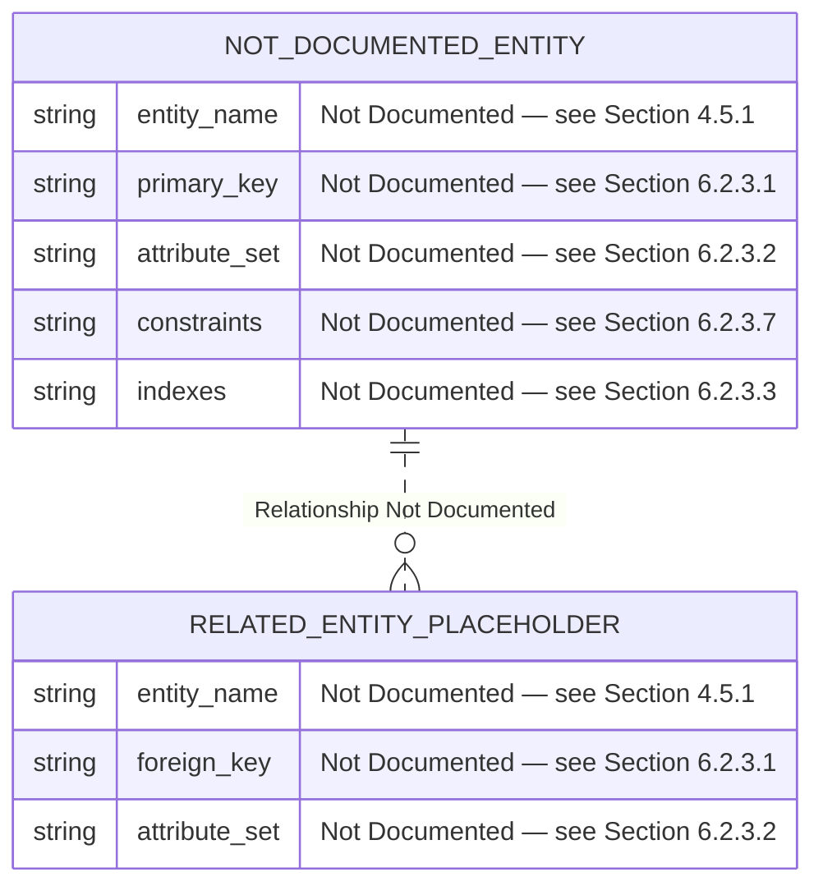

A complementary block-style schema visualization below preserves the colour-coded absence convention used throughout this specification, restating each absent schema dimension with explicit cross-references.

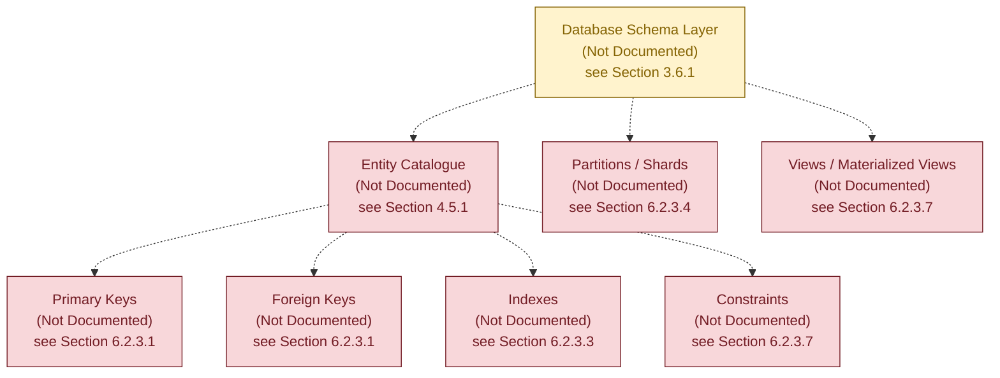

#### 6.2.7.2 Data Flow Diagram — Absence-State

The diagram below depicts the canonical end-to-end data flow that a Database Design section would normally specify — including client, application tier, distributed cache, primary datastore, read replicas, archive tier, object/blob storage, and audit sink — and explicitly marks every node as absent. **Section 5.2.3 (Data Flow Description)** has classified the Primary Operational Data Store, Analytical Data Store, Distributed Cache Tier, and Object/Blob Storage as "Not Documented." Dashed edges signal that no read path, no write path, and no audit path is evidenced.

```mermaid
graph LR
    Client["Client / API Consumer<br/>(Not Documented)<br/>see Section 1.2.2"]
    AppTier["Application Tier<br/>(Not Documented)<br/>see Section 1.2.2"]
    Cache["Distributed Cache Tier<br/>(Not Documented)<br/>see Section 3.6.3"]
    Primary["Primary Operational Datastore<br/>(Not Documented)<br/>see Section 3.6.1"]
    Replica["Read Replicas<br/>(Not Documented)<br/>see Section 6.2.3.5"]
    OLAP["Analytical / OLAP Store<br/>(Not Documented)<br/>see Section 3.6.1"]
    Object["Object / Blob Storage<br/>(Not Documented)<br/>see Section 3.6.4"]
    Archive["Archive / Cold Storage<br/>(Not Documented)<br/>see Section 3.6.4"]
    Audit["Audit Log Sink<br/>(Not Documented)<br/>see Section 6.2.5.4"]
    ETL["Batch / ETL Pipeline<br/>(Not Documented)<br/>see Section 6.2.6.5"]

    Client -.->|Write Path Not Defined| AppTier
    Client -.->|Read Path Not Defined| AppTier
    AppTier -.-> Cache
    Cache -.-> AppTier
    AppTier -.->|Write Path Not Defined| Primary
    AppTier -.->|Read Path Not Defined| Replica
    Primary -.->|Replication Not Defined| Replica
    Primary -.->|CDC / Batch Not Defined| ETL
    ETL -.-> OLAP
    Primary -.-> Object
    Primary -.->|Retention Not Defined| Archive
    AppTier -.-> Audit
    Primary -.-> Audit

    classDef absent fill:#f8d7da,stroke:#721c24,color:#721c24
    class Client,AppTier,Cache,Primary,Replica,OLAP,Object,Archive,Audit,ETL absent
```

#### 6.2.7.3 Replication Architecture — Absence-State

The diagram below depicts the canonical structure of a database replication topology — including a primary instance, synchronous and asynchronous replicas, cross-region standbys, an automated backup pipeline, a point-in-time-recovery (PITR) log archive, and a failover controller — and explicitly marks every node as absent. **Section 3.6.2** has classified the Replication Topology as "Not Documented," **Section 5.5.5** has classified Cross-Region / Cross-Zone Failover as "Not Documented," and **Section 6.1.6.2 (Scalability Architecture — Absence-State)** has previously visualized the Primary Datastore and Read Replicas as absent.

```mermaid
graph TD
    AppTier["Application Tier<br/>(Not Documented)<br/>see Section 1.2.2"]
    Router["Read/Write Router<br/>(Not Documented)<br/>see Section 6.2.6.4"]
    FailoverCtrl["Failover Controller<br/>(Not Documented)<br/>see Section 5.5.5"]
    PITR["PITR / WAL Archive<br/>(Not Documented)<br/>see Section 6.2.3.6"]

    subgraph PrimaryRegion["Primary Region (Not Documented)"]
        PrimaryDB["Primary Datastore<br/>(Not Documented)<br/>see Section 3.6.1"]
        SyncReplica["Synchronous Replica<br/>(Not Documented)<br/>see Section 6.2.3.5"]
        AsyncReplica["Asynchronous Replica<br/>(Not Documented)<br/>see Section 6.2.3.5"]
    end

    subgraph SecondaryRegion["Secondary / DR Region (Not Documented)"]
        DRStandby["Cross-Region Standby<br/>(Not Documented)<br/>see Section 5.5.5"]
        DRBackup["Geo-Redundant Backup<br/>(Not Documented)<br/>see Section 6.2.5.2"]
    end

    BackupVault["Backup Vault / Snapshot Store<br/>(Not Documented)<br/>see Section 3.6.4"]

    AppTier -.-> Router
    Router -.->|Writes| PrimaryDB
    Router -.->|Reads| SyncReplica
    Router -.->|Reads| AsyncReplica
    PrimaryDB -.->|Sync Replication| SyncReplica
    PrimaryDB -.->|Async Replication| AsyncReplica
    PrimaryDB -.->|Cross-Region Replication| DRStandby
    PrimaryDB -.->|WAL Shipping| PITR
    PITR -.-> BackupVault
    PrimaryDB -.->|Snapshot Cadence| BackupVault
    BackupVault -.->|Geo Replication| DRBackup
    FailoverCtrl -.->|Health Probes| PrimaryDB
    FailoverCtrl -.->|Promotion Trigger| DRStandby
    FailoverCtrl -.->|Routing Update| Router

    classDef absent fill:#f8d7da,stroke:#721c24,color:#721c24
    classDef layer fill:#fff3cd,stroke:#856404,color:#856404
    class AppTier,Router,FailoverCtrl,PITR,PrimaryDB,SyncReplica,AsyncReplica,DRStandby,DRBackup,BackupVault absent
```

#### 6.2.7.4 Diagram Coverage Summary

| Prompt-Required Diagram | Absence-State Visualization | Cross-Reference |
|-------------------------|------------------------------|-----------------|
| Database schema diagram (ERD) | Section 6.2.7.1 | Sections 3.6.1, 4.5.1, 6.2.3 |
| Data flow diagram | Section 6.2.7.2 | Sections 3.6, 4.5.2, 5.2.3 |
| Replication architecture | Section 6.2.7.3 | Sections 3.6.2, 5.5.5, 6.1.6.2 |

### 6.2.8 Re-Authoring Triggers

This Section 6.2 must be re-authored from evidence — rather than from absence determinations — when any of the following triggers occur in the repository. The list parallels and extends **Section 5.6.2 (Re-Authoring Triggers)** and **Section 6.1.7 (Re-Authoring Triggers)**.

| Trigger Category | Specific Trigger Artifacts | Re-Authoring Scope |
|------------------|----------------------------|---------------------|
| Schema Artifact Introduction | Any SQL DDL file, Prisma `schema.prisma`, MongoDB schema validator, or JSON Schema definition | Sections 6.2.3.1, 6.2.3.2, 6.2.3.7 |
| ORM Model Introduction | SQLAlchemy/Django/Hibernate/TypeORM/Sequelize/GORM/Diesel model classes | Sections 6.2.3.1, 6.2.3.2 |
| Migration Tooling Introduction | Alembic, Flyway, Liquibase, Prisma Migrate, Knex Migrate, db-migrate, or `migrations/` directory | Sections 6.2.4.1, 6.2.4.2 |
| Database Driver / Client Dependency | Database driver in `package.json`, `requirements.txt`, `pom.xml`, `go.mod`, `Cargo.toml`, `Gemfile`, or `composer.json` | Section 6.2.3.2 |
| Containerized Database Service | `Dockerfile` or `docker-compose.yml` declaring postgres, mysql, mongodb, redis, elasticsearch, cassandra, or equivalent image | Sections 6.2.3, 6.2.3.5 |
| Infrastructure-as-Code Database Resource | Terraform `aws_db_instance`, `aws_rds_cluster`, `azurerm_postgresql`, `google_sql_database`, or equivalent | Sections 6.2.3.5, 6.2.3.6 |
| Caching Tier Introduction | Redis/Memcached client dependency, CDN configuration, or application-tier cache adapter | Sections 6.2.4.5, 6.2.6.2 |
| Object Storage Configuration | S3 bucket policy, GCS bucket descriptor, Azure Blob container descriptor, or equivalent | Sections 6.2.4.3, 6.2.4.4 |
| Backup / DR Tooling | Backup CronJob manifest, AWS Backup plan, snapshot lifecycle policy, or DR playbook Markdown | Sections 6.2.3.6, 6.2.5.2 |
| Compliance Documentation | GDPR / HIPAA / PCI / SOC 2 control mapping, data classification register, or DPIA | Section 6.2.5 |
| Performance / Capacity Artifact | Index tuning notes, EXPLAIN plan baselines, connection pool configuration, or load-test result set | Section 6.2.6 |
| Architecture Decision Record | An `adr/` or `docs/decisions/` artifact declaring data-tier topology, engine selection, or replication policy | All subsections of 6.2 |

### 6.2.9 Section Integrity and Traceability

#### 6.2.9.1 Adherence to Document Authoring Constraints

This Section 6.2 has been authored in strict adherence to the constraints established in **Section 1.4.2 (Document Authoring Constraints)** and ratified in **Sections 3.1.1, 4.1.1, 5.1.1, and 6.1.2**. No database engine, schema element, entity relationship, index, constraint, partitioning scheme, replication topology, backup policy, retention rule, audit mechanism, access control policy, query optimization technique, caching strategy, connection pooling configuration, or batch processing pattern has been asserted that is not directly supported by repository evidence. Where the canonical Database Design schema would normally require substantive content, structural placeholders have been preserved with explicit "Not Documented in Current Repository State" markers and cross-references to the originating absence determinations.

#### 6.2.9.2 Evidence Base Consistency

The single piece of evidence available to this section — the project name "Artifact8" derived from the H1 heading in `README.md` — provides no basis from which any schema, persistence policy, replication topology, or query pattern could be authoritatively inferred. This is consistent with the evidence base catalogued in **Section 1.4.1 (Verifiable Facts Summary)**, in which only seven verifiable facts are recorded, none of which describe persistence-layer behaviour. The applicability determination in **Section 6.2.1** — that Database Design is not applicable to this system in its current state — is therefore the only authoritative authoring outcome.

#### 6.2.9.3 Cross-Section Coherence

The absence-state determinations in this section align with and inherit from the corresponding determinations in the following upstream sections.

| Upstream Section | Inheritance into Section 6.2 |
|------------------|------------------------------|
| Section 1.2.2 — Major System Components | Drives 6.2.1 data-storage-component absence |
| Section 1.4.1 — Verifiable Facts Summary | Bounds the evidence base for all of Section 6.2 |
| Section 1.4.2 — Document Authoring Constraints | Provides the binding constraints inherited by 6.2.2 |
| Section 2.5.2 — Performance Requirements | Drives 6.2.6 query-optimization and latency-target absences |
| Section 2.5.3 — Scalability Considerations | Drives 6.2.3.4 partitioning and 6.2.6.3 pool-sizing absences |
| Section 2.5.4 — Security Implications | Drives 6.2.5.3 privacy-control and 6.2.5.4 audit absences |
| Section 3.1.2 — Verified Absence of Technology Evidence | Source for the artifact-absence catalogue (no SQL, no ORM, no migrations) |
| Section 3.6 — Databases & Storage | Primary source for nearly all absence determinations in 6.2.3, 6.2.4, 6.2.6 |
| Section 3.6.1 — Primary and Secondary Databases | Drives 6.2.3.2 model-family and 6.2.7.1 ERD absences |
| Section 3.6.2 — Data Persistence Strategy | Drives 6.2.3.4 partitioning, 6.2.3.5 replication, 6.2.3.6 backup, 6.2.4.1 migration absences |
| Section 3.6.3 — Caching Solutions | Drives 6.2.4.5 and 6.2.6.2 caching absences |
| Section 3.6.4 — Object and File Storage Services | Drives 6.2.4.3 archival absences |
| Section 3.7 — Development & Deployment | Drives 6.2.3.5 deployment-topology absence |
| Section 4.4.4 — Regulatory Compliance Checks | Drives 6.2.5.1 retention and 6.2.5.3 privacy absences |
| Section 4.5.1 — State Transitions | Drives 6.2.3.1 entity-relationship absence |
| Section 4.5.2 — Data Persistence Points | Drives 6.2.4.4 storage-and-retrieval absence |
| Section 4.5.3 — Caching Requirements | Drives 6.2.4.5 cache-population and invalidation absences |
| Section 4.5.4 — Transaction Boundaries | Drives 6.2.6.4 read/write-splitting consistency absence |
| Section 4.6.4 — Recovery Procedures | Drives 6.2.5.2 RTO/RPO and 6.2.3.6 restore-validation absences |
| Section 4.7 — Required Diagrams — Absence-State Visualizations | Pattern source for `classDef` styling and dashed-edge notation in 6.2.7 |
| Section 5.2.3 — Data Flow Description | Drives 6.2.7.2 data-flow absence visualization |
| Section 5.5.2 — Monitoring, Observability, Logging, Tracing | Drives 6.2.5.4 audit-sink absence |
| Section 5.5.3 — Authentication and Authorization Framework | Drives 6.2.5.5 access-control absence |
| Section 5.5.5 — Disaster Recovery Procedures | Drives 6.2.5.2 backup-and-fault-tolerance absences |
| Section 6.1.5 — Resilience Patterns | Drives 6.2.3.5 replication and 6.2.7.3 failover-controller absences |
| Section 6.1.6.2 — Scalability Architecture (Absence-State) | Precedent for the Primary/Replica visualization in 6.2.7.3 |
| Section 6.1.7 — Re-Authoring Triggers | Pattern source for 6.2.8 |
| Section 6.1.8 — Section Integrity and Traceability | Pattern source for 6.2.9 |

#### References

#### Files Examined

- `README.md` — The sole tracked file in the Artifact8 repository. Its entire content (`# Artifact8`, 11 bytes) provided the only piece of evidence-based content available to this section: the project name. Contains no descriptions of database engines, schema, persistence strategy, caching, replication, backup, retention, privacy, audit, access control, or query optimization.

#### Folders Explored

- `""` (repository root, depth 0) — Confirmed to contain exactly one tracked file (`README.md`) and no source folders. No `db/`, `database/`, `schema/`, `migrations/`, `models/`, `data/`, `persistence/`, `orm/`, `prisma/`, `sql/`, `seeds/`, `fixtures/`, or any other folder that would contain database-design artifacts is present. The `.git/` metadata directory exists but contains only Git internals.

#### Repository-Wide Verifications Performed

- Recursive filesystem scan for schema artifacts (SQL DDL, Prisma schema, JSON Schema, MongoDB validators) — Confirmed absent (per Section 3.1.2).
- Recursive filesystem scan for ORM model classes across all major languages — Confirmed absent (per Section 3.1.2).
- Recursive filesystem scan for migration tooling artifacts (Alembic, Flyway, Liquibase, Prisma Migrate, Knex) — Confirmed absent (per Section 3.6.2).
- Recursive filesystem scan for dependency manifests declaring database drivers or ORM dependencies — Confirmed absent (per Section 3.1.2).
- Recursive filesystem scan for containerization descriptors provisioning database engines — Confirmed absent (per Section 3.1.2).
- Recursive filesystem scan for infrastructure-as-code resources declaring managed databases — Confirmed absent (per Section 3.1.2).
- Recursive filesystem scan for caching configurations and object/file/blob storage descriptors — Confirmed absent (per Sections 3.6.3, 3.6.4).
- Semantic searches for "database schema migration ORM model SQL" and "database data storage persistence migration" — Zero results.
- Git commit history inspection — Confirmed a single "Initial commit" (`4cdb1ff7d5c4423fb475c9c2707d5d83abba3bf2`) introducing only `README.md`.

#### Cross-Referenced Specification Sections

- **Section 1.2.2 (Major System Components)** — Source for the absence of Data Storage Components.
- **Section 1.4.1 (Verifiable Facts Summary)** — Source for the seven verifiable facts that bound this section's authorship.
- **Section 1.4.2 (Document Authoring Constraints)** — Source for the binding authoring constraints applied throughout this section.
- **Section 2.5.2 (Performance Requirements)** — Source for 6.2.6.1 query-optimization absences.
- **Section 2.5.3 (Scalability Considerations)** — Source for 6.2.3.4 partitioning and 6.2.6.3 connection-pooling absences.
- **Section 2.5.4 (Security Implications)** — Source for 6.2.5.3 privacy and 6.2.5.4 audit absences.
- **Section 3.1.2 (Verified Absence of Technology Evidence)** — Source for the comprehensive artifact-absence catalogue.
- **Section 3.6 (Databases & Storage)** — Primary source for nearly all absence determinations in this section.
- **Section 3.6.1 (Primary and Secondary Databases)** — Source for database engine absences.
- **Section 3.6.2 (Data Persistence Strategy)** — Source for persistence strategy, replication, partitioning, backup, and migration tooling absences.
- **Section 3.6.3 (Caching Solutions)** — Source for caching tier absences.
- **Section 3.6.4 (Object and File Storage Services)** — Source for object/file storage and archival absences.
- **Section 4.4.4 (Regulatory Compliance Checks)** — Source for retention, residency, consent, and erasure absences.
- **Section 4.5 (State Management)** — Source for state-transition, persistence-point, caching, and transaction-boundary absences.
- **Section 4.6.4 (Recovery Procedures)** — Source for RTO/RPO and restore-validation absences.
- **Section 4.7 (Required Diagrams — Absence-State Visualizations)** — Pattern source for `classDef` styling, dashed-edge (`-.->`) notation, and absence-state visualization conventions reused throughout 6.2.7.
- **Section 5.2.3 (Data Flow Description)** — Source for primary/analytical/cache/object data-flow absences.
- **Section 5.5 (Cross-Cutting Concerns)** — Source for compliance, audit, and DR absences.
- **Section 5.5.3 (Authentication and Authorization Framework)** — Source for 6.2.5.5 access-control absences.
- **Section 5.5.5 (Disaster Recovery Procedures)** — Source for 6.2.5.2 backup and fault-tolerance absences.
- **Section 6.1 (Core Services Architecture)** — Direct structural precedent for this section's organization, including applicability determination, binding-authoring-constraint, absence-determination subsections, required-diagrams subsection, re-authoring-triggers subsection, and section-integrity-and-traceability subsection.
- **Section 6.1.6.2 (Scalability Architecture — Absence-State)** — Pattern precedent for the Primary/Replica visualization in 6.2.7.3.
- **Section 6.1.7 (Re-Authoring Triggers)** — Pattern source for the triggers enumerated in 6.2.8.
- **Section 6.1.8 (Section Integrity and Traceability)** — Pattern source for the structure of 6.2.9.

## 6.3 Integration Architecture

**Integration Architecture is not applicable for this system in its current repository state.**

The Section 6.3 authoring prompt explicitly directs that "If the system does not require integration with external systems or services, clearly state 'Integration Architecture is not applicable for this system' and explain why." This determination is the only authoritative authoring outcome available for Artifact8, because the repository contains no API or IDL definitions, no authentication or authorization configuration, no message broker descriptors, no event schema registry artifacts, no batch or streaming orchestration descriptors, no API gateway configuration, no third-party service client libraries, no legacy system adapter code, no webhook endpoints, and no external service contracts. The originating absence determinations are inherited verbatim from **Section 1.2.1 (Integration with Existing Enterprise Landscape)**, **Section 2.4.2 (Integration Points)**, **Section 3.5 (Third-Party Services)**, **Section 4.3 (Integration Workflows)**, **Section 4.6 (Error Handling and Recovery)**, **Section 5.2.3 (Data Flow Description)**, and **Section 5.5.3 (Authentication and Authorization Framework)**.

This section preserves the canonical schema requested by the authoring prompt — API Design, Message Processing, and External Systems — populated exclusively with absence determinations and cross-references, so that subsequent contributions to the repository can populate each placeholder with verifiable content without restructuring the specification. The section follows the same evidence-only authoring discipline ratified in **Section 1.4.2 (Document Authoring Constraints)** and applied throughout **Sections 3.1.1, 4.1.1, 5.1.1, 6.1.2, and 6.2.2**, and adopts the structural precedent established jointly by **Section 6.1 (Core Services Architecture)** and **Section 6.2 (Database Design)**.

### 6.3.1 Applicability Determination

The applicability of an Integration Architecture section depends on the presence of at least one identifiable integration artifact and at least one of the following conditions: a declared API or IDL specification (OpenAPI, GraphQL, gRPC IDL, AsyncAPI, Thrift, Protocol Buffers), an authentication or authorization library configuration, a message broker or event bus client dependency, an API gateway descriptor, a third-party service SDK or adapter, a legacy system interface module, a webhook endpoint declaration, or any integration test artifact exercising an external dependency. None of these conditions are evidenced in the Artifact8 repository.

#### 6.3.1.1 Rationale Summary

| Required Condition for Applicability | Repository Evidence | Determination |
|--------------------------------------|---------------------|----------------|
| Declared API/IDL specification (OpenAPI, GraphQL, gRPC, AsyncAPI, Thrift) | None (Identified APIs Exposed and Consumed "None Documented" — Section 2.4.2) | Condition Not Met |
| Authentication / Identity Provider integration artifact | None (all five identity attributes "Not Documented" — Section 3.5.2) | Condition Not Met |
| Authorization framework configuration (RBAC/ABAC/PBAC/ReBAC) | None (Authorization Model "Not Documented" — Section 5.5.3) | Condition Not Met |
| Message broker / event bus client dependency or configuration | None (Managed Messaging / Streaming "Not Documented" — Section 3.5.4) | Condition Not Met |
| Event schema registry / topic catalogue | None (all seven event attributes "Not Documented" — Section 4.3.3) | Condition Not Met |
| Batch / streaming orchestration descriptor | None (all seven batch attributes "Not Documented" — Section 4.3.4) | Condition Not Met |
| API gateway / BFF configuration (Kong, AWS API Gateway, Apigee, Nginx) | None (Networking / Load Balancers "Not Documented" — Section 3.5.4) | Condition Not Met |
| Third-party service SDK / client library in dependency manifest | None (External APIs and Service Integrations "None Documented" — Section 3.5.1) | Condition Not Met |
| Legacy system adapter or anti-corruption layer | None (no predecessor system referenced — Section 1.2.1) | Condition Not Met |
| Webhook endpoint declaration or callback URL configuration | None (no service definitions present — Section 2.4.2) | Condition Not Met |
| Integration test suite exercising external dependencies | None (no test artifacts — Section 3.1.2) | Condition Not Met |
| Architecture Decision Record declaring integration topology | None (zero ADRs — Section 5.4) | Condition Not Met |

Because every condition above is unmet, no API specification, protocol selection, authentication mechanism, authorization policy, rate-limiting rule, versioning scheme, documentation standard, event pattern, message queue topology, stream processor, batch flow, error-handling strategy, third-party integration pattern, legacy interface, gateway configuration, or external service contract can be documented. The remainder of this section therefore preserves the prompt-requested subsection structure but reports each canonical sub-area as inheriting its absence determination from the corresponding upstream section.

#### 6.3.1.2 Sole Verifiable Evidence

Per **Section 1.4.1 (Verifiable Facts Summary)**, only seven verifiable facts exist for this repository, none of which describe integration behaviour:

| # | Verifiable Fact | Bearing on Section 6.3 |
|---|-----------------|------------------------|
| 1 | Project name is "Artifact8" (`README.md` H1) | Provides no integration topology signal |
| 2 | Repository contains exactly one tracked file | Confirms absence of integration artifacts |
| 3 | Default branch is `main` with `origin/main` remote | No bearing on integration architecture |
| 4 | Repository initialized via single "Initial commit" | Confirms pre-implementation state |
| 5 | Initial commit date is June 1, 2026 | No bearing on integration architecture |
| 6 | Initial commit author is shalini690 (shalini@blitzy.io) | No bearing on integration architecture |
| 7 | `README.md` total size is 11 bytes | Confirms no integration narrative present |

### 6.3.2 Binding Authoring Constraint

The constraints below restate, for traceability within this section, the evidence-only authoring discipline inherited from **Section 1.4.2** and ratified in **Sections 3.1.1, 4.1.1, 5.1.1, 6.1.2, and 6.2.2**. Per the document-wide constraint catalogued in **Section 1.4.2**, "No integrations described" because the repository contains no manifests or configuration files.

| Constraint | Source / Cross-Reference |
|------------|--------------------------|
| No API protocol, IDL, or wire format asserted | Section 5.2.3 — Transport Protocols, Serialization Formats ("Not Documented") |
| No authentication mechanism, identity provider, or federation standard asserted | Section 5.5.3 — Authentication Protocol; Section 3.5.2 — Identity Services |
| No authorization model, policy storage, or evaluation engine asserted | Section 5.5.3 — Authorization Model; Section 4.4.3 — Authorization Checkpoints |
| No rate limit, throttling policy, or quota configuration asserted | Section 4.3.2 — Rate Limiting / Throttling ("Not Documented") |
| No API versioning, deprecation, or sunset strategy asserted | Section 4.3.2 — Request/Response Contracts; Section 2.4.2 — APIs Exposed |
| No API documentation standard, portal, or developer-experience artifact asserted | Section 3.1.2 — API / IDL Definitions ("Absent") |
| No event broker, topic, producer, or consumer asserted | Section 4.3.3 — Event Processing Flows ("Not Documented") |
| No message queue, dead-letter strategy, or delivery guarantee asserted | Section 3.5.4 — Managed Messaging / Streaming ("Not Documented") |
| No stream processor, windowing policy, or state store asserted | Section 5.2.3 — Batch vs Streaming Flow Classification ("Not Documented") |
| No batch scheduler, orchestrator, or backfill procedure asserted | Section 4.3.4 — Batch Processing Sequences ("Not Documented") |
| No retry, fallback, error notification, or recovery procedure asserted | Section 4.6 — Error Handling and Recovery (all four subsections "Not Documented") |
| No third-party SDK, vendor service, or external service contract asserted | Section 3.5.1 — External APIs and Service Integrations ("None Documented") |
| No legacy system, predecessor platform, or migration interface asserted | Section 1.2.1 — Integration with Existing Enterprise Landscape ("Not Documented") |
| No API gateway, BFF, edge function, or reverse proxy asserted | Section 5.3.2 — API Gateway / BFF in Component Diagram ("Not Documented") |

### 6.3.3 API Design — Absence Determinations

The Section 6.3 authoring prompt requests documentation of protocol specifications, authentication methods, authorization framework, rate limiting strategy, versioning approach, and documentation standards. Each sub-area maps to a prior absence determination, as catalogued below.

#### 6.3.3.1 Protocol Specifications

No API protocol has been declared. **Section 5.2.3 (Data Flow Description)** has classified Synchronous Integration Pattern, Asynchronous Integration Pattern, Transport Protocol(s), and Serialization Format(s) as "Not Documented in Current Repository State." **Section 4.3.2 (API Interactions)** has classified Request/Response Contracts as "Not Documented in Current Repository State." Because no source code, no dependency manifest, and no IDL artifact exist, no HTTP/REST, gRPC, GraphQL, WebSocket, AMQP, MQTT, Kafka wire-protocol, or any other transport-format pair can be authoritatively asserted.

| Protocol Attribute | Documented Selection | Status |
|--------------------|----------------------|--------|
| Transport Protocol (HTTP/1.1, HTTP/2, HTTP/3, gRPC, WebSocket) | — | Not Documented — see Section 5.2.3 |
| API Style (REST, GraphQL, RPC, Hypermedia, JSON-RPC) | — | Not Documented — see Section 2.4.2 |
| Serialization Format (JSON, Protocol Buffers, Avro, MessagePack, XML) | — | Not Documented — see Section 5.2.3 |
| TLS Version and Cipher Policy | — | Not Documented — see Section 5.5.3 |

#### 6.3.3.2 Authentication Methods

No authentication method has been declared. **Section 2.5.4 (Security Implications)** has classified the Authentication Mechanism as "Not Documented in Current Repository State," **Section 5.5.3 (Authentication and Authorization Framework)** has classified the Authentication Protocol (OAuth2 / OIDC / SAML / Custom) and Identity Provider Integration as "Not Documented," and **Section 3.5.2 (Authentication and Identity Services)** has classified all five identity attributes — Identity Provider (IdP), Federation Standard (SAML / OIDC / OAuth2), Multi-Factor Authentication, Service-to-Service Authentication, and Secrets Management Service — as "Not Documented." **Section 1.2.1 (Integration with Existing Enterprise Landscape)** further confirms that no Authentication / Identity Provider Integration is documented.

| Authentication Attribute | Documented Selection | Status |
|--------------------------|----------------------|--------|
| Authentication Protocol (OAuth2 / OIDC / SAML / API Key / mTLS) | — | Not Documented — see Section 5.5.3 |
| Identity Provider (IdP) | — | Not Documented — see Section 3.5.2 |
| Multi-Factor Authentication Posture | — | Not Documented — see Section 3.5.2 |
| Service-to-Service Authentication Mechanism | — | Not Documented — see Section 3.5.2 |

#### 6.3.3.3 Authorization Framework

No authorization framework has been declared. **Section 2.5.4 (Security Implications)** has classified the Authorization Model as "Not Documented in Current Repository State," **Section 5.5.3** has classified the Authorization Model (RBAC / ABAC / PBAC / ReBAC), Session Management Strategy, and Token Type and Lifetime Policy as "Not Documented," and **Section 4.4.3 (Authorization Checkpoints)** has classified Authorization Model, Checkpoint Locations in Flow, Policy Storage and Evaluation, and Service-to-Service Authorization as "Not Documented." No policy decision point (PDP), policy enforcement point (PEP), or policy administration point (PAP) can be authoritatively asserted.

| Authorization Attribute | Documented Selection | Status |
|-------------------------|----------------------|--------|
| Authorization Model (RBAC / ABAC / PBAC / ReBAC) | — | Not Documented — see Section 5.5.3 |
| Token Type (Opaque / JWT / PASETO / Macaroon) and Lifetime | — | Not Documented — see Section 5.5.3 |
| Policy Storage and Evaluation Engine (OPA / Casbin / Custom) | — | Not Documented — see Section 4.4.3 |
| Service-to-Service Authorization (mTLS / SPIFFE / Workload Identity) | — | Not Documented — see Section 4.4.3 |

#### 6.3.3.4 Rate Limiting Strategy

No rate limiting strategy has been declared. **Section 4.3.2 (API Interactions)** has classified Rate Limiting / Throttling and Idempotency Guarantees as "Not Documented in Current Repository State." Rate limiting presupposes a fronting enforcement point (gateway, sidecar, or middleware), a quota persistence tier, and a published consumer contract — none of which are evidenced in the repository.

| Rate Limiting Attribute | Documented Selection | Status |
|-------------------------|----------------------|--------|
| Enforcement Point (Gateway / Sidecar / Application Middleware) | — | Not Documented — see Section 4.3.2 |
| Algorithm (Token Bucket / Leaky Bucket / Fixed Window / Sliding Window) | — | Not Documented in Current Repository State |
| Quota Scope (Per-API Key / Per-User / Per-IP / Per-Tenant) | — | Not Documented in Current Repository State |
| Throttle Response Semantics (HTTP 429 / Retry-After / Backpressure) | — | Not Documented — see Section 4.6.1 |

#### 6.3.3.5 Versioning Approach

No API versioning approach has been declared. API versioning presupposes a published version-identifier scheme (URI-segment, header-based, media-type, or query-parameter), a backward-/forward-compatibility posture, and a documented deprecation and sunset policy. Because **Section 2.4.2 (Integration Points)** has confirmed zero APIs exposed and zero APIs consumed, no version identifier can be authoritatively asserted.

| Versioning Attribute | Documented Selection | Status |
|----------------------|----------------------|--------|
| Versioning Scheme (URI / Header / Media-Type / Query Parameter) | — | Not Documented — see Section 2.4.2 |
| Compatibility Posture (Backward / Forward / Both) | — | Not Documented in Current Repository State |
| Deprecation and Sunset Policy | — | Not Documented in Current Repository State |
| Cross-Service Version Coordination | — | Not Documented in Current Repository State |

#### 6.3.3.6 Documentation Standards

No API documentation standard has been declared. The verified-absence catalogue in **Section 3.1.2** confirms that no OpenAPI/Swagger specification, no GraphQL schema, no Protocol Buffer or Thrift IDL, and no AsyncAPI specification exists in the repository. Because no machine-readable interface contract exists, no developer portal, no code-generation pipeline, and no documentation-as-code workflow can be authored.

| Documentation Attribute | Documented Selection | Status |
|-------------------------|----------------------|--------|
| Machine-Readable Spec (OpenAPI / GraphQL SDL / Proto / Thrift / AsyncAPI) | — | Not Documented — see Section 3.1.2 |
| Developer Portal / Reference Site | — | Not Documented in Current Repository State |
| Documentation Generation Pipeline | — | Not Documented in Current Repository State |
| Example Library / SDK Catalogue | — | Not Documented — see Section 3.5.1 |

#### 6.3.3.7 API Endpoint Catalogue

The Section 6.3 authoring prompt requires that API specifications be documented in Markdown tables with at most four columns. The catalogue below preserves the canonical endpoint schema for future population; every entry is "Not Documented" because **Section 2.4.2** records zero APIs exposed and zero APIs consumed.

| Endpoint Identifier | Method / Operation | Auth & Authorization | Status |
|---------------------|--------------------|-----------------------|--------|
| — | — | — | Not Documented — see Section 2.4.2 |

| Endpoint Identifier | Request Schema | Response Schema | Status |
|---------------------|----------------|-----------------|--------|
| — | — | — | Not Documented — see Section 4.3.2 |

| Endpoint Identifier | Rate Limit | Idempotency Key | Status |
|---------------------|------------|------------------|--------|
| — | — | — | Not Documented — see Section 4.3.2 |

### 6.3.4 Message Processing — Absence Determinations

The Section 6.3 authoring prompt requests documentation of event processing patterns, message queue architecture, stream processing design, batch processing flows, and error handling strategy. Each sub-area maps to a prior absence determination, as catalogued below.

#### 6.3.4.1 Event Processing Patterns

No event processing patterns have been declared. **Section 4.3.3 (Event Processing Flows)** has classified all seven event attributes — Event Broker / Message Bus, Event Producers, Event Consumers, Event Schema Registry, Delivery Guarantees (At-Least-Once / Exactly-Once), Dead-Letter Queue Strategy, and Ordering Guarantees — as "Not Documented in Current Repository State." Because no broker, no topic, no subscription, and no schema registry exist, no event-driven, event-sourcing, CQRS, or saga pattern can be authoritatively asserted.

| Event Processing Attribute | Documented Selection | Status |
|----------------------------|----------------------|--------|
| Event Broker (Kafka / Pulsar / NATS / RabbitMQ / EventBridge) | — | Not Documented — see Section 4.3.3 |
| Delivery Guarantees (At-Least-Once / At-Most-Once / Exactly-Once) | — | Not Documented — see Section 4.3.3 |
| Event Schema Registry and Compatibility Posture | — | Not Documented — see Section 4.3.3 |
| Ordering Guarantees and Partition Key Strategy | — | Not Documented — see Section 4.3.3 |

#### 6.3.4.2 Message Queue Architecture

No message queue architecture has been declared. **Section 3.5.4 (Cloud Platform Services)** has classified Managed Messaging / Streaming as "Not Documented in Current Repository State," and **Section 5.2.3 (Data Flow Description)** has classified the Asynchronous Integration Pattern as "Not Documented." No queue topology (point-to-point, fan-out, work-stealing, priority, delay), no consumer-group model, and no dead-letter strategy can be authoritatively asserted.

| Queue Architecture Attribute | Documented Selection | Status |
|------------------------------|----------------------|--------|
| Queue Mode (Point-to-Point / Fan-Out / Work-Stealing / Priority / Delay) | — | Not Documented — see Section 3.5.4 |
| Consumer Group / Subscription Topology | — | Not Documented — see Section 4.3.3 |
| Visibility Timeout / Acknowledgement Policy | — | Not Documented in Current Repository State |
| Dead-Letter Queue Strategy and Replay Procedure | — | Not Documented — see Section 4.3.3 |

#### 6.3.4.3 Stream Processing Design

No stream processing design has been declared. **Section 5.2.3 (Data Flow Description)** has classified Batch vs Streaming Flow Classification as "Not Documented in Current Repository State." Stream processing presupposes a windowing policy (tumbling, hopping, session, global), a state-store choice, and an explicit watermark / event-time discipline — none of which are evidenced in the repository.

| Stream Processing Attribute | Documented Selection | Status |
|-----------------------------|----------------------|--------|
| Stream Engine (Kafka Streams / Flink / Spark Structured Streaming / Beam) | — | Not Documented — see Section 5.2.3 |
| Windowing Policy (Tumbling / Hopping / Session / Global) | — | Not Documented in Current Repository State |
| Watermark / Event-Time Discipline | — | Not Documented in Current Repository State |
| State Store and Checkpoint Strategy | — | Not Documented — see Section 3.6.2 |

#### 6.3.4.4 Batch Processing Flows

No batch processing flows have been declared. **Section 4.3.4 (Batch Processing Sequences)** has classified all seven batch attributes — Scheduler / Orchestrator, Batch Window, Input Source(s), Output Sink(s), Idempotency / Checkpointing, Failure Compensation Strategy, and Backfill / Replay Procedures — as "Not Documented in Current Repository State." Because no scheduler (cron, Airflow, Prefect, Dagster, AWS Step Functions, Azure Data Factory), no orchestrator artifact, and no ETL/ELT DAG exist in the repository, no batch flow can be authoritatively asserted.

| Batch Processing Attribute | Documented Selection | Status |
|----------------------------|----------------------|--------|
| Scheduler / Orchestrator (Cron / Airflow / Prefect / Dagster / Step Functions) | — | Not Documented — see Section 4.3.4 |
| Batch Window and Cadence | — | Not Documented — see Section 4.3.4 |
| Idempotency / Checkpoint Strategy | — | Not Documented — see Section 4.3.4 |
| Backfill / Replay Procedure | — | Not Documented — see Section 4.3.4 |

#### 6.3.4.5 Error Handling Strategy

No message-processing error handling strategy has been declared. **Section 4.6 (Error Handling and Recovery)** has classified all four subsections — Retry Mechanisms (4.6.1), Fallback Processes (4.6.2), Error Notification Flows (4.6.3), and Recovery Procedures (4.6.4) — as "Not Documented in Current Repository State." This restates, for the message-processing viewpoint, the determinations already recorded in **Section 6.1.3 (Retry and Fallback Mechanisms)** and **Section 6.1.5 (Fault Tolerance Mechanisms)**.

| Error Handling Attribute | Documented Selection | Status |
|--------------------------|----------------------|--------|
| Retry Trigger Conditions and Backoff Strategy | — | Not Documented — see Section 4.6.1 |
| Dead-Letter Queue / Poison Message Quarantine | — | Not Documented — see Section 4.3.3 |
| Compensating Transaction / Saga Rollback | — | Not Documented — see Section 4.6.2 |
| Error Notification and Alerting Channel | — | Not Documented — see Section 4.6.3 |

### 6.3.5 External Systems — Absence Determinations

The Section 6.3 authoring prompt requests documentation of third-party integration patterns, legacy system interfaces, API gateway configuration, and external service contracts. Each sub-area maps to a prior absence determination, as catalogued below.

#### 6.3.5.1 Third-Party Integration Patterns

No third-party integration patterns have been declared. **Section 3.5.1 (External APIs and Service Integrations)** records zero documented external service integrations across vendor, integration pattern, authentication mechanism, and SLA attributes. **Section 1.2.1 (Integration with Existing Enterprise Landscape)** has classified Enterprise Systems Identified for Integration, External APIs or Services, and Data Source / Sink Integrations as "Not Documented" — explicitly noting that no dependency manifests are present. No SDK adoption, no webhook receiver, no event subscription, and no anti-corruption layer can be authoritatively asserted.

| Third-Party Integration Attribute | Documented Selection | Status |
|------------------------------------|----------------------|--------|
| Integration Pattern (REST Client / SDK / Webhook / Event Subscription) | — | Not Documented — see Section 3.5.1 |
| Vendor / Service Identity | — | Not Documented — see Section 3.5.1 |
| Credential and Secret Management | — | Not Documented — see Section 3.5.2 |
| Vendor SLA / Quota / Retry Posture | — | Not Documented — see Section 3.5.1 |

#### 6.3.5.2 Legacy System Interfaces

No legacy system interfaces have been declared. **Section 1.2.1 (Integration with Existing Enterprise Landscape)** confirms no reference to any predecessor system, legacy platform, or existing tooling within the repository, and no migration notes, no anti-corruption layer artifact, and no shim/adapter code exist. Because **Section 3.1.2 (Verified Absence of Technology Evidence)** has confirmed zero source code, zero configuration files, and zero infrastructure-as-code artifacts, no file-drop, EDI, SOAP, ODBC, JDBC, FTP/SFTP, or message-queue legacy-integration mode can be authoritatively asserted.

| Legacy Interface Attribute | Documented Selection | Status |
|----------------------------|----------------------|--------|
| Legacy Integration Mode (File Drop / EDI / SOAP / FTP / DB Link) | — | Not Documented — see Section 1.2.1 |
| Anti-Corruption Layer / Adapter Component | — | Not Documented — see Section 5.2.3 |
| Predecessor System Identity and Decommissioning Plan | — | Not Documented — see Section 1.2.1 |
| Data Migration / Coexistence Strategy | — | Not Documented in Current Repository State |

#### 6.3.5.3 API Gateway Configuration

No API gateway configuration has been declared. **Section 3.5.4 (Cloud Platform Services)** has classified Networking (VPC, Load Balancers) as "Not Documented in Current Repository State." **Section 5.3.2 (Component Interaction Diagram)** has visualized API Gateway / BFF as an absent component with a dashed-edge link. No edge proxy (Kong, AWS API Gateway, Azure API Management, Apigee, Nginx, Envoy, Traefik), no Backend-for-Frontend (BFF), no service mesh ingress, and no edge function (Cloudflare Workers, Lambda@Edge) can be authoritatively asserted.

| Gateway Configuration Attribute | Documented Selection | Status |
|---------------------------------|----------------------|--------|
| Gateway Product (Kong / AWS API Gateway / Apigee / Azure APIM / Nginx / Envoy) | — | Not Documented — see Section 3.5.4 |
| Routing and Path Rewrite Rules | — | Not Documented — see Section 5.3.2 |
| Plugin / Policy Chain (Auth / Rate Limit / WAF / Caching) | — | Not Documented — see Section 5.5.3 |
| TLS Termination and Certificate Management | — | Not Documented — see Section 5.5.3 |

#### 6.3.5.4 External Service Contracts

No external service contracts have been declared. **Section 4.3.1 (Data Flow Between Systems)** has classified all six data-flow attributes — Source System, Target System, Data Format / Schema, Transformation Steps, Transport Mechanism, and Frequency / Cadence — as "Not Documented." **Section 5.2.4 (External Integration Points Table)** has confirmed zero external integration points and zero SLA commitments. No contract test, no consumer-driven contract, no schema fixture, and no fault-injection rehearsal artifact can be authoritatively asserted.

| External Service Contract Attribute | Documented Selection | Status |
|--------------------------------------|----------------------|--------|
| Contract Source (OpenAPI / WSDL / Pact / Protocol Buffer / Avro / JSON Schema) | — | Not Documented — see Section 3.1.2 |
| Data Format and Schema Reference | — | Not Documented — see Section 4.3.1 |
| SLA Commitments (Latency / Availability / Throughput / Error Budget) | — | Not Documented — see Section 5.2.4 |
| Contract Test / Consumer-Driven Contract Discipline | — | Not Documented in Current Repository State |

### 6.3.6 Required Diagrams — Absence-State Visualizations

The Section 6.3 authoring prompt requests three diagrams: an integration flow diagram, an API architecture diagram, and a message flow diagram. Because no integration components, no API surfaces, and no message exchanges exist in the repository, the diagrams below visually document the **absence** of each required artifact. All diagrams follow the same `classDef` styling convention established in **Section 1.2.2 (Current Repository State)**, **Section 2.1.3 (Verified Repository State)**, **Section 3.1.3 (Repository State Visualization)**, **Section 4.7 (Required Diagrams — Absence-State Visualizations)**, **Section 5.1.3 (Repository Architectural State Visualization)**, **Section 5.3.2 (Component Interaction Diagram)**, **Section 5.5.6 (Error Handling Flow)**, **Section 6.1.6 (Required Diagrams — Absence-State Visualizations)**, and **Section 6.2.7 (Required Diagrams — Absence-State Visualizations)** — green denotes present evidence, red denotes confirmed absence, yellow denotes question or layer nodes, and blue denotes outcome states; dashed edges (`-.->`) indicate that no relationship contract is evidenced, and the dashed-X arrow notation (`--x`) is used in sequence diagrams to indicate that no actual message contracts are evidenced.

#### 6.3.6.1 Integration Flow Diagram — Absence-State

The diagram below depicts the canonical roster of integration-tier participants that a typical Integration Architecture section would normally interconnect — external clients, the edge/gateway, an authentication service, a backend service, a message broker, asynchronous workers, an external third-party service, a webhook receiver, and a legacy system adapter — and explicitly marks every node and every relationship as absent. The convention follows the precedent established in **Section 6.1.6.1 (Service Interaction Diagram — Absence-State)**.

```mermaid
graph LR
    ExtClient["External Client / Consumer<br/>(Not Documented)<br/>see Section 2.4.2"]
    Webhook["Webhook Receiver<br/>(Not Documented)<br/>see Section 6.3.5.1"]
    Gateway["API Gateway / BFF<br/>(Not Documented)<br/>see Section 6.3.5.3"]
    AuthN["Authentication Service / IdP<br/>(Not Documented)<br/>see Section 3.5.2"]
    AuthZ["Authorization / Policy Engine<br/>(Not Documented)<br/>see Section 5.5.3"]
    RateLimit["Rate Limiter / Throttler<br/>(Not Documented)<br/>see Section 6.3.3.4"]
    Backend["Backend Service<br/>(Not Documented)<br/>see Section 1.2.2"]
    Broker["Message Broker / Event Bus<br/>(Not Documented)<br/>see Section 6.3.4.2"]
    Worker["Asynchronous Worker<br/>(Not Documented)<br/>see Section 6.3.4.1"]
    Stream["Stream Processor<br/>(Not Documented)<br/>see Section 6.3.4.3"]
    Batch["Batch Scheduler / Orchestrator<br/>(Not Documented)<br/>see Section 6.3.4.4"]
    ExtAPI["Third-Party External Service<br/>(Not Documented)<br/>see Section 3.5.1"]
    Legacy["Legacy System Interface<br/>(Not Documented)<br/>see Section 6.3.5.2"]
    DLQ["Dead-Letter Queue<br/>(Not Documented)<br/>see Section 6.3.4.5"]

    ExtClient -.-> Gateway
    Webhook -.-> Gateway
    Gateway -.-> AuthN
    Gateway -.-> RateLimit
    AuthN -.-> AuthZ
    AuthZ -.-> Backend
    RateLimit -.-> Backend
    Backend -.-> Broker
    Broker -.-> Worker
    Broker -.-> Stream
    Broker -.-> DLQ
    Backend -.-> ExtAPI
    Backend -.-> Legacy
    Batch -.-> Backend
    Batch -.-> Legacy
    Worker -.-> ExtAPI

    classDef absent fill:#f8d7da,stroke:#721c24,color:#721c24
    class ExtClient,Webhook,Gateway,AuthN,AuthZ,RateLimit,Backend,Broker,Worker,Stream,Batch,ExtAPI,Legacy,DLQ absent
```

#### 6.3.6.2 API Architecture Diagram — Absence-State

The diagram below depicts the canonical structure of an API architecture — including a client tier, edge/gateway layer with cross-cutting policy plugins (authentication, authorization, rate limiting, versioning, observability), an API surface, backend handlers, and a documentation portal — and explicitly marks every node as absent. The convention adapts and extends the precedent established in **Section 5.3.2 (Component Interaction Diagram — Absence-State)**.

```mermaid
graph TD
    ClientApp["Client Application<br/>(Not Documented)<br/>see Section 1.2.2"]
    SDK["Client SDK / Library<br/>(Not Documented)<br/>see Section 6.3.3.6"]
    DevPortal["Developer Portal / Reference<br/>(Not Documented)<br/>see Section 6.3.3.6"]

    subgraph EdgeLayer["Edge / Gateway Layer (Not Documented)"]
        TLSTerm["TLS Termination<br/>(Not Documented)<br/>see Section 6.3.3.1"]
        AuthNPlugin["Authentication Plugin<br/>(Not Documented)<br/>see Section 6.3.3.2"]
        AuthZPlugin["Authorization Plugin<br/>(Not Documented)<br/>see Section 6.3.3.3"]
        RatePlugin["Rate Limit Plugin<br/>(Not Documented)<br/>see Section 6.3.3.4"]
        VersionPlugin["Version Routing<br/>(Not Documented)<br/>see Section 6.3.3.5"]
        Observability["Observability Hook<br/>(Not Documented)<br/>see Section 3.5.3"]
    end

    subgraph APILayer["API Surface (Not Documented)"]
        RESTAPI["REST API<br/>(Not Documented)<br/>see Section 6.3.3.1"]
        GraphAPI["GraphQL API<br/>(Not Documented)<br/>see Section 6.3.3.1"]
        GrpcAPI["gRPC API<br/>(Not Documented)<br/>see Section 6.3.3.1"]
    end

    Handlers["Backend Handlers<br/>(Not Documented)<br/>see Section 1.2.2"]
    Spec["Machine-Readable Spec<br/>(OpenAPI / SDL / Proto)<br/>Not Documented<br/>see Section 3.1.2"]

    ClientApp -.-> SDK
    SDK -.-> TLSTerm
    DevPortal -.-> Spec
    Spec -.-> SDK
    TLSTerm -.-> AuthNPlugin
    AuthNPlugin -.-> AuthZPlugin
    AuthZPlugin -.-> RatePlugin
    RatePlugin -.-> VersionPlugin
    VersionPlugin -.-> Observability
    Observability -.-> RESTAPI
    Observability -.-> GraphAPI
    Observability -.-> GrpcAPI
    RESTAPI -.-> Handlers
    GraphAPI -.-> Handlers
    GrpcAPI -.-> Handlers

    classDef absent fill:#f8d7da,stroke:#721c24,color:#721c24
    classDef layer fill:#fff3cd,stroke:#856404,color:#856404
    class ClientApp,SDK,DevPortal,TLSTerm,AuthNPlugin,AuthZPlugin,RatePlugin,VersionPlugin,Observability,RESTAPI,GraphAPI,GrpcAPI,Handlers,Spec absent
```

#### 6.3.6.3 Message Flow Diagram — Absence-State (Sequence)

The sequence diagram below depicts the canonical roster of participants and message exchanges that an Integration Architecture section would normally specify across the request, authentication, authorization, rate-limit, backend, broker, worker, and external-service tiers. Because no integration points are documented (per **Section 2.4.2**) and no external services or APIs are defined (per **Section 3.5**), every participant and every message is annotated as absent. The dashed-X arrow notation (`--x`) is reused from **Section 4.7.4 (Integration Sequence Diagram — Absence-State)** and **Section 5.3.4 (Sequence Diagram for Key Flows — Absence-State)** to visually distinguish that no actual message contracts are evidenced.

```mermaid
sequenceDiagram
    participant C as External Client<br/>(Not Documented)
    participant G as API Gateway<br/>(Not Documented)
    participant A as Auth Service / IdP<br/>(Not Documented)
    participant R as Rate Limiter<br/>(Not Documented)
    participant S as Backend Service<br/>(Not Documented)
    participant B as Message Broker<br/>(Not Documented)
    participant W as Async Worker<br/>(Not Documented)
    participant X as External Third-Party Service<br/>(Not Documented)

    Note over C,X: All participants, messages, payloads,<br/>auth tokens, retry policies, and SLAs<br/>are absent. See Sections 2.4.2, 3.5, 4.3, and 5.5.3.

    C--xG: API Request (Protocol Not Documented)
    G--xA: Token Verification (Mechanism Not Documented)
    A--xG: Identity Assertion (Contract Not Documented)
    G--xR: Quota Check (Policy Not Documented)
    R--xG: Allow / Deny (Algorithm Not Documented)
    G--xS: Routed Request (Versioning Not Documented)
    S--xB: Publish Event (Topic Not Documented)
    B--xW: Deliver Message (Delivery Guarantee Not Documented)
    W--xX: External Service Invocation (Contract Not Documented)
    X--xW: External Response (Schema Not Documented)
    W--xB: Acknowledgement (Idempotency Not Documented)
    S--xG: Service Response (Schema Not Documented)
    G--xC: Gateway Response (Headers Not Documented)

    Note over C,X: Dead-letter routing, retry/backoff,<br/>fallback, and error notification paths<br/>are absent. See Sections 4.6 and 6.3.4.5.
```

#### 6.3.6.4 Diagram Coverage Summary

| Prompt-Required Diagram | Absence-State Visualization | Cross-Reference |
|-------------------------|------------------------------|-----------------|
| Integration flow diagrams | Section 6.3.6.1 | Sections 2.4.2, 3.5, 4.3, 6.1.6.1 |
| API architecture diagrams | Section 6.3.6.2 | Sections 3.1.2, 5.3.2, 5.5.3 |
| Message flow diagrams | Section 6.3.6.3 | Sections 4.3, 4.7.4, 5.3.4 |

### 6.3.7 Re-Authoring Triggers

This Section 6.3 must be re-authored from evidence — rather than from absence determinations — when any of the following triggers occur in the repository. The list parallels and extends **Section 5.6.2 (Re-Authoring Triggers)**, **Section 6.1.7 (Re-Authoring Triggers)**, and **Section 6.2.8 (Re-Authoring Triggers)**.

| Trigger Category | Specific Trigger Artifacts | Re-Authoring Scope |
|------------------|----------------------------|---------------------|
| API / IDL Definition Introduction | OpenAPI/Swagger document, GraphQL SDL, gRPC `.proto`, AsyncAPI document, Thrift IDL, JSON Schema | Sections 6.3.3.1, 6.3.3.5, 6.3.3.6 |
| Authentication Library Adoption | OAuth/OIDC client (Passport, Authlib, go-oidc), JWT library, SAML toolkit, mTLS configuration | Section 6.3.3.2 |
| Authorization Library Adoption | Casbin, OPA / Rego policies, Cedar, SpiceDB / Zanzibar client, custom RBAC/ABAC implementation | Section 6.3.3.3 |
| Rate Limiting Configuration | Token-bucket / leaky-bucket middleware, Redis-rate-limit, gateway rate-limit plugin descriptor | Section 6.3.3.4 |
| API Documentation Pipeline | Redoc, Swagger UI, Stoplight, Slate, or documentation-as-code workflow descriptor | Section 6.3.3.6 |
| Message Broker Configuration | Kafka, RabbitMQ, NATS, Pulsar, SQS, SNS, EventBridge, Pub/Sub client libraries or `docker-compose` services | Sections 6.3.4.1, 6.3.4.2 |
| Stream Processing Adoption | Kafka Streams, Apache Flink, Spark Structured Streaming, Apache Beam, Materialize | Section 6.3.4.3 |
| Batch Orchestration Adoption | Cron, Airflow, Prefect, Dagster, AWS Step Functions, Azure Data Factory, Google Cloud Composer | Section 6.3.4.4 |
| Third-Party Service Client Library | Vendor SDK in dependency manifest (Stripe, Twilio, SendGrid, Salesforce, GitHub, etc.) | Section 6.3.5.1 |
| Legacy System Adapter | File-drop watcher, EDI processor, SOAP client, ODBC/JDBC bridge, FTP/SFTP integration | Section 6.3.5.2 |
| API Gateway Configuration | Kong, AWS API Gateway, Azure APIM, Apigee, Nginx config, Envoy/Istio, Traefik, KrakenD | Section 6.3.5.3 |
| Webhook Endpoint Declaration | Inbound webhook route, signature verification middleware, idempotency key handler | Sections 6.3.5.1, 6.3.6.1 |
| Service Mesh Configuration | Istio VirtualService/DestinationRule, Linkerd, Consul Connect, AWS App Mesh manifests | Sections 6.3.3.3, 6.3.5.3 |
| Integration Test Suite | Pact contract tests, WireMock fixtures, MockServer, VCR cassettes, integration `.feature` files | Section 6.3.5.4 |
| Architecture Decision Record | An `adr/` or `docs/decisions/` artifact declaring API style, broker selection, or gateway topology | All subsections of 6.3 |

### 6.3.8 Section Integrity and Traceability

#### 6.3.8.1 Adherence to Document Authoring Constraints

This Section 6.3 has been authored in strict adherence to the constraints established in **Section 1.4.2 (Document Authoring Constraints)** — specifically the binding directive that "No integrations described" because the repository contains no manifests or configuration files — and ratified in **Sections 3.1.1, 4.1.1, 5.1.1, 6.1.2, and 6.2.2**. No API protocol, authentication mechanism, authorization framework, rate-limiting policy, versioning scheme, documentation standard, event pattern, message queue topology, stream processor, batch flow, error-handling strategy, third-party integration pattern, legacy interface, gateway configuration, or external service contract has been asserted that is not directly supported by repository evidence. Where the canonical Integration Architecture schema would normally require substantive content, structural placeholders have been preserved with explicit "Not Documented in Current Repository State" markers and cross-references to the originating absence determinations. All tables in this section comply with the prompt's explicit constraint that tables contain at most four columns.

#### 6.3.8.2 Evidence Base Consistency

The single piece of evidence available to this section — the project name "Artifact8" derived from the H1 heading in `README.md` — provides no basis from which any API contract, authentication mechanism, authorization policy, rate-limit rule, message broker topology, event schema, batch orchestrator, gateway configuration, third-party adapter, legacy interface, or external service contract could be authoritatively inferred. This is consistent with the evidence base catalogued in **Section 1.4.1 (Verifiable Facts Summary)**, in which only seven verifiable facts are recorded, none of which describe integration behaviour. The applicability determination in **Section 6.3.1** — that Integration Architecture is not applicable to this system in its current state — is therefore the only authoritative authoring outcome.

#### 6.3.8.3 Cross-Section Coherence

The absence-state determinations in this section align with and inherit from the corresponding determinations in the following upstream sections.

| Upstream Section | Inheritance into Section 6.3 |
|------------------|------------------------------|
| Section 1.2.1 — Integration with Existing Enterprise Landscape | Drives 6.3.5.1 and 6.3.5.2 third-party and legacy absences |
| Section 1.2.2 — Major System Components | Drives 6.3.6 component-roster absences in all three diagrams |
| Section 1.4.1 — Verifiable Facts Summary | Bounds the evidence base for all of Section 6.3 |
| Section 1.4.2 — Document Authoring Constraints | Provides the "No integrations described" constraint inherited by 6.3.2 |
| Section 2.4.2 — Integration Points | Drives 6.3.1 applicability determination and 6.3.3.7 endpoint-catalogue absence |
| Section 2.5.4 — Security Implications | Drives 6.3.3.2 authentication and 6.3.3.3 authorization absences |
| Section 3.1.2 — Verified Absence of Technology Evidence | Source for API/IDL, manifest, and configuration absence catalogue |
| Section 3.5 — Third-Party Services | Drives 6.3.5 external-systems absences |
| Section 3.5.1 — External APIs and Service Integrations | Drives 6.3.5.1 third-party integration pattern absence |
| Section 3.5.2 — Authentication and Identity Services | Drives 6.3.3.2 authentication-method absences |
| Section 3.5.4 — Cloud Platform Services | Drives 6.3.4.2 managed messaging and 6.3.5.3 gateway absences |
| Section 4.3.1 — Data Flow Between Systems | Drives 6.3.5.4 external-service-contract absences |
| Section 4.3.2 — API Interactions | Drives 6.3.3.4 rate-limiting and 6.3.3.7 endpoint-catalogue absences |
| Section 4.3.3 — Event Processing Flows | Drives 6.3.4.1 event-pattern and 6.3.4.2 queue absences |
| Section 4.3.4 — Batch Processing Sequences | Drives 6.3.4.4 batch-processing absences |
| Section 4.4.3 — Authorization Checkpoints | Drives 6.3.3.3 authorization-framework absences |
| Section 4.6 — Error Handling and Recovery | Drives 6.3.4.5 message-error-handling absences |
| Section 4.7 — Required Diagrams — Absence-State Visualizations | Pattern source for `classDef` styling, `-.->` notation, and `--x` sequence notation in 6.3.6 |
| Section 4.7.4 — Integration Sequence Diagram (Absence-State) | Direct precedent for the sequence diagram in 6.3.6.3 |
| Section 5.2.3 — Data Flow Description | Drives 6.3.3.1 protocol and 6.3.4.3 stream-processing absences |
| Section 5.2.4 — External Integration Points Table | Drives 6.3.5.4 SLA-commitment absences |
| Section 5.3.2 — Component Interaction Diagram | Pattern precedent for the integration and API diagrams in 6.3.6.1 and 6.3.6.2 |
| Section 5.3.4 — Sequence Diagram for Key Flows | Pattern precedent for the message flow diagram in 6.3.6.3 |
| Section 5.5.3 — Authentication and Authorization Framework | Drives 6.3.3.2 and 6.3.3.3 cross-cutting auth absences |
| Section 5.5.6 — Error Handling Flow | Pattern precedent for the error-handling visualization referenced in 6.3.4.5 |
| Section 5.6.2 — Re-Authoring Triggers | Pattern source for the triggers enumerated in 6.3.7 |
| Section 5.7 — Section Integrity and Traceability | Pattern source for the structure of 6.3.8 |
| Section 6.1 — Core Services Architecture | Structural precedent for the entire section, including the applicability/binding-constraint/absence-determination/diagrams/re-authoring/integrity template |
| Section 6.1.6.1 — Service Interaction Diagram (Absence-State) | Pattern precedent for the integration flow diagram in 6.3.6.1 |
| Section 6.2 — Database Design | Structural precedent for the entire section, reinforcing the schema-preserving "Not Applicable" pattern |
| Section 6.2.7 — Required Diagrams (Absence-State Visualizations) | Pattern precedent for diagram styling reused throughout 6.3.6 |

#### References

#### Files Examined

- `README.md` — The sole tracked file in the Artifact8 repository. Its entire content (`# Artifact8`, 11 bytes) provided the only piece of evidence-based content available to this section: the project name. Contains no descriptions of API protocols, authentication mechanisms, authorization frameworks, rate limiting, versioning, documentation standards, event patterns, message queues, stream processors, batch flows, error-handling strategies, third-party integrations, legacy interfaces, API gateway configurations, or external service contracts.

#### Folders Explored

- `""` (repository root, depth 0) — Confirmed to contain exactly one tracked file (`README.md`) and no subdirectories beyond the standard `.git/` metadata directory. No `api/`, `apis/`, `openapi/`, `swagger/`, `graphql/`, `proto/`, `idl/`, `integrations/`, `clients/`, `sdk/`, `adapters/`, `events/`, `messages/`, `brokers/`, `streams/`, `batch/`, `workers/`, `gateway/`, `webhooks/`, `auth/`, `iam/`, `legacy/`, or any other folder that would contain integration-architecture artifacts is present.

#### Repository-Wide Verifications Performed

- Recursive filesystem scan for API / IDL definitions (OpenAPI, Swagger, GraphQL SDL, gRPC `.proto`, AsyncAPI, Thrift) — Confirmed absent (per Section 3.1.2).
- Recursive filesystem scan for authentication and authorization configuration (OAuth client config, JWT keys, OPA policies, Casbin model files, SAML metadata) — Confirmed absent (per Sections 3.5.2 and 5.5.3).
- Recursive filesystem scan for message broker client dependencies and configurations (Kafka, RabbitMQ, NATS, Pulsar, SQS/SNS, EventBridge, Pub/Sub) — Confirmed absent (per Sections 3.5.4 and 4.3.3).
- Recursive filesystem scan for batch and stream orchestration descriptors (Airflow DAGs, Prefect flows, Dagster jobs, Step Functions, cron tabs) — Confirmed absent (per Section 4.3.4).
- Recursive filesystem scan for API gateway and reverse proxy configurations (Kong, Nginx, Envoy, Istio, Traefik, AWS API Gateway, Apigee) — Confirmed absent (per Sections 3.5.4 and 5.3.2).
- Recursive filesystem scan for third-party SDK dependencies, webhook handlers, and external service adapter code — Confirmed absent (per Section 3.5.1).
- Recursive filesystem scan for legacy system adapters, anti-corruption layers, EDI/SOAP/FTP integration modules — Confirmed absent (per Section 1.2.1).
- Recursive filesystem scan for contract tests, consumer-driven contracts, and integration test suites — Confirmed absent (per Section 3.1.2).
- Git commit history inspection — Confirmed a single "Initial commit" (`4cdb1ff7d5c4423fb475c9c2707d5d83abba3bf2`) introducing only `README.md`.

#### Cross-Referenced Specification Sections

- **Section 1.2.1 (Integration with Existing Enterprise Landscape)** — Source for the absence of enterprise systems, external APIs, identity provider integration, and data source / sink integrations.
- **Section 1.2.2 (Major System Components)** — Source for the absence of component participants referenced in 6.3.6 diagrams.
- **Section 1.4.1 (Verifiable Facts Summary)** — Source for the seven verifiable facts that bound this section's authorship.
- **Section 1.4.2 (Document Authoring Constraints)** — Source for the binding "No integrations described" constraint applied throughout this section.
- **Section 2.4.2 (Integration Points)** — Source for the zero internal and external integration points and zero APIs exposed / consumed.
- **Section 2.5.4 (Security Implications)** — Source for the Authentication Mechanism and Authorization Model absences.
- **Section 3.1.2 (Verified Absence of Technology Evidence)** — Source for the comprehensive artifact-absence catalogue, including API/IDL, manifest, and configuration absences.
- **Section 3.5 (Third-Party Services)** — Primary source for nearly all absence determinations in Section 6.3.5.
- **Section 3.5.1 (External APIs and Service Integrations)** — Source for the zero external service integrations.
- **Section 3.5.2 (Authentication and Identity Services)** — Source for the absence of all five identity attributes.
- **Section 3.5.3 (Monitoring, Logging, and Observability)** — Source for the API-architecture observability-hook absence in 6.3.6.2.
- **Section 3.5.4 (Cloud Platform Services)** — Source for managed messaging / streaming and networking absences.
- **Section 4.3 (Integration Workflows)** — Primary source for absence of data flows, API interactions, event processing, and batch processing.
- **Section 4.3.1 (Data Flow Between Systems)** — Source for 6.3.5.4 external service contract absences.
- **Section 4.3.2 (API Interactions)** — Source for 6.3.3.4 rate-limiting and 6.3.3.7 endpoint-catalogue absences.
- **Section 4.3.3 (Event Processing Flows)** — Source for 6.3.4.1 event-pattern and 6.3.4.2 message-queue absences.
- **Section 4.3.4 (Batch Processing Sequences)** — Source for 6.3.4.4 batch-processing absences.
- **Section 4.4.3 (Authorization Checkpoints)** — Source for 6.3.3.3 authorization-framework absences.
- **Section 4.6 (Error Handling and Recovery)** — Source for 6.3.4.5 message-error-handling absences.
- **Section 4.7 (Required Diagrams — Absence-State Visualizations)** — Pattern source for `classDef` styling, dashed-edge (`-.->`) notation, and absence-state visualization conventions reused throughout 6.3.6.
- **Section 4.7.4 (Integration Sequence Diagram — Absence-State)** — Direct precedent for the message flow sequence diagram in 6.3.6.3.
- **Section 5.2.3 (Data Flow Description)** — Source for 6.3.3.1 protocol absences and 6.3.4.3 stream-processing absences.
- **Section 5.2.4 (External Integration Points Table)** — Source for 6.3.5.4 SLA-commitment absences.
- **Section 5.3.2 (Component Interaction Diagram — Absence-State)** — Pattern precedent for integration and API architecture diagrams in 6.3.6.1 and 6.3.6.2.
- **Section 5.3.4 (Sequence Diagram for Key Flows — Absence-State)** — Pattern precedent for the message flow sequence diagram in 6.3.6.3.
- **Section 5.5 (Cross-Cutting Concerns)** — Source for cross-cutting auth, observability, and error-handling absences inherited by 6.3.
- **Section 5.5.3 (Authentication and Authorization Framework)** — Source for 6.3.3.2 and 6.3.3.3 cross-cutting auth absences.
- **Section 5.5.6 (Error Handling Flow — Absence-State)** — Pattern precedent for the error-handling visualization referenced in 6.3.4.5.
- **Section 5.6.2 (Re-Authoring Triggers)** — Pattern source for the triggers enumerated in 6.3.7.
- **Section 5.7 (Section Integrity and Traceability)** — Pattern source for the structure of 6.3.8.
- **Section 6.1 (Core Services Architecture)** — Direct structural precedent for the entire section, including applicability determination, binding-authoring-constraint, absence-determination subsections, required-diagrams subsection, re-authoring-triggers subsection, and section-integrity-and-traceability subsection.
- **Section 6.1.6.1 (Service Interaction Diagram — Absence-State)** — Pattern precedent for the integration flow diagram in 6.3.6.1.
- **Section 6.1.7 (Re-Authoring Triggers)** — Pattern source for the triggers enumerated in 6.3.7.
- **Section 6.1.8 (Section Integrity and Traceability)** — Pattern source for the structure of 6.3.8.
- **Section 6.2 (Database Design)** — Direct structural precedent for the schema-preserving "Not Applicable" pattern applied throughout this section.
- **Section 6.2.7 (Required Diagrams — Absence-State Visualizations)** — Pattern precedent for diagram styling reused throughout 6.3.6.
- **Section 6.2.8 (Re-Authoring Triggers)** — Pattern source for the triggers enumerated in 6.3.7.
- **Section 6.2.9 (Section Integrity and Traceability)** — Pattern source for the structure of 6.3.8.

## 6.4 Security Architecture

**Detailed Security Architecture is not applicable for this system in its current repository state.**

The Section 6.4 authoring prompt explicitly directs that "If the system does not require specific security considerations beyond standard practices, clearly state 'Detailed Security Architecture is not applicable for this system' and explain which standard security practices will be followed instead." This determination is the only authoritative authoring outcome available for Artifact8, because the repository contains no source code, no authentication or authorization library configurations, no identity provider integration manifests, no token-issuance descriptors, no session-store configurations, no encryption-key material or key-management service references, no audit-log schemas, no compliance control mappings, no secrets-management adoption, no TLS/PKI configuration, and no security policy as code. The originating absence determinations are inherited verbatim from **Section 1.2.1 (Integration with Existing Enterprise Landscape)**, **Section 2.5.4 (Security Implications)**, **Section 3.1.2 (Verified Absence of Technology Evidence)**, **Section 3.5.2 (Authentication and Identity Services)**, **Section 3.5.4 (Cloud Platform Services)**, **Section 3.6.2 (Data Persistence Strategy)**, **Section 3.6.4 (Object and File Storage Services)**, **Section 4.4.3 (Authorization Checkpoints)**, **Section 4.4.4 (Regulatory Compliance Checks)**, **Section 4.5.2 (Data Persistence Points)**, and **Section 5.5.3 (Authentication and Authorization Framework)**.

This section preserves the canonical schema requested by the authoring prompt — Authentication Framework, Authorization System, and Data Protection — populated exclusively with absence determinations and cross-references, so that subsequent contributions to the repository can populate each placeholder with verifiable content without restructuring the specification. The section follows the same evidence-only authoring discipline ratified in **Section 1.4.2 (Document Authoring Constraints)** and applied throughout **Sections 3.1.1, 4.1.1, 5.1.1, 6.1.2, 6.2.2, and 6.3.2**, and adopts the structural precedent jointly established by **Section 6.1 (Core Services Architecture)**, **Section 6.2 (Database Design)**, and **Section 6.3 (Integration Architecture)**.

A clarifying note on the prompt's "standard practices" provision: because no implementation, no runtime, no protocol surface, no data store, no network boundary, and no operational workload yet exists in the repository, even an enumeration of "standard practices to be followed" cannot be authoritatively asserted — there is, as of the initial commit, no subject to which any standard security practice could attach. The structural placeholders that follow therefore catalogue the canonical security-control surface that subsequent contributions must populate, and **Section 6.4.7 (Re-Authoring Triggers)** enumerates the precise artifact introductions that would convert each absence determination into an evidence-based authoring outcome.

### 6.4.1 Applicability Determination

The applicability of a detailed Security Architecture section depends on the presence of at least one identifiable security artifact and at least one of the following conditions: a declared authentication protocol (OAuth2, OIDC, SAML, mTLS, custom token, API key), an identity provider configuration (Auth0, Okta, Azure AD, AWS Cognito, Keycloak, custom OIDC provider), an authorization framework (RBAC, ABAC, PBAC, ReBAC, OPA/Rego, Casbin, Cedar, SpiceDB), an encryption library or key-management service reference, a secrets-management adoption (HashiCorp Vault, AWS Secrets Manager, Azure Key Vault, Doppler, SOPS), an audit-logging pipeline, a compliance control mapping (GDPR, HIPAA, PCI, SOC 2, ISO 27001), a TLS/PKI configuration artifact, or any security policy as code. None of these conditions are evidenced in the Artifact8 repository.

#### 6.4.1.1 Rationale Summary

| Required Condition for Applicability | Repository Evidence | Determination |
|--------------------------------------|---------------------|----------------|
| Declared authentication protocol or identity provider | None (all five identity attributes "Not Documented" — Section 3.5.2) | Condition Not Met |
| Authorization framework configuration (RBAC / ABAC / PBAC / ReBAC) | None (Authorization Model "Not Documented" — Section 2.5.4) | Condition Not Met |
| Session and token management artifacts | None (Session Management and Token Type "Not Documented" — Section 5.5.3) | Condition Not Met |
| Password policy / credential schema | None (no source code or schema — Section 3.1.2) | Condition Not Met |
| Multi-Factor Authentication posture | None (MFA "Not Documented" — Section 3.5.2) | Condition Not Met |
| Service-to-service authentication mechanism | None (S2S Auth "Not Documented" — Section 3.5.2) | Condition Not Met |
| Encryption-at-rest configuration | None (Encryption At Rest "Not Documented" — Section 2.5.4) | Condition Not Met |
| Encryption-in-transit configuration / TLS termination | None (Encryption In Transit "Not Documented" — Section 2.5.4) | Condition Not Met |
| Key management service / KMS reference | None (Secrets Management Service "Not Documented" — Section 3.5.2) | Condition Not Met |
| Data masking / tokenization / redaction policy | None (no data flows documented — Section 4.3.1) | Condition Not Met |
| Audit logging pipeline / SIEM integration | None (Audit Logging Strategy "Not Documented" — Section 5.5.3) | Condition Not Met |
| Regulatory compliance control mapping | None (all six compliance attributes "Not Documented" — Section 4.4.4) | Condition Not Met |
| Security policy as code (OPA / Rego / Sentinel) | None (no policy artifacts — Section 3.1.2) | Condition Not Met |
| Architecture Decision Record declaring security stance | None (zero ADRs — Section 5.4) | Condition Not Met |

Because every condition above is unmet, no identity management approach, multi-factor authentication posture, session management strategy, token handling protocol, password policy, role-based access control schema, permission management mechanism, resource authorization rule, policy enforcement point, audit-logging strategy, encryption standard, key management procedure, data masking rule, secure communication channel, or compliance control can be authoritatively documented. The remainder of this section therefore preserves the prompt-requested subsection structure but reports each canonical sub-area as inheriting its absence determination from the corresponding upstream section.

#### 6.4.1.2 Sole Verifiable Evidence

Per **Section 1.4.1 (Verifiable Facts Summary)**, only seven verifiable facts exist for this repository, none of which describe security behaviour:

| # | Verifiable Fact | Bearing on Section 6.4 |
|---|-----------------|------------------------|
| 1 | Project name is "Artifact8" (`README.md` H1) | Provides no security posture signal |
| 2 | Repository contains exactly one tracked file | Confirms absence of security artifacts |
| 3 | Default branch is `main` with `origin/main` remote | No bearing on security architecture |
| 4 | Repository initialized via single "Initial commit" | Confirms pre-implementation state |
| 5 | Initial commit date is June 1, 2026 | No bearing on security architecture |
| 6 | Initial commit author is shalini690 (shalini@blitzy.io) | No bearing on security architecture |
| 7 | `README.md` total size is 11 bytes | Confirms no security narrative present |

### 6.4.2 Binding Authoring Constraint

The constraints below restate, for traceability within this section, the evidence-only authoring discipline inherited from **Section 1.4.2 (Document Authoring Constraints)** and ratified in **Sections 3.1.1, 4.1.1, 5.1.1, 6.1.2, 6.2.2, and 6.3.2**. Per the document-wide constraint catalogued in **Section 1.4.2**, "No integrations described" — including authentication, authorization, and identity-provider integrations — applies because the repository contains no manifests or configuration files.

| Constraint | Source / Cross-Reference |
|------------|--------------------------|
| No authentication protocol or identity provider asserted | Section 2.5.4 — Authentication Mechanism; Section 3.5.2 — Identity Services |
| No multi-factor authentication posture asserted | Section 3.5.2 — Multi-Factor Authentication |
| No session management strategy or token lifetime asserted | Section 5.5.3 — Session Management; Token Type and Lifetime |
| No password policy, credential format, or rotation cadence asserted | Section 3.1.2 — Verified Absence of Technology Evidence |
| No authorization model (RBAC / ABAC / PBAC / ReBAC) asserted | Section 2.5.4 — Authorization Model; Section 5.5.3 |
| No role inventory, permission catalogue, or policy artifact asserted | Section 4.4.3 — Authorization Checkpoints |
| No policy decision point (PDP), policy enforcement point (PEP), policy administration point (PAP), or policy information point (PIP) asserted | Section 4.4.3 — Policy Storage and Evaluation |
| No service-to-service authentication or workload identity asserted | Section 3.5.2 — Service-to-Service Authentication |
| No encryption-at-rest configuration or KMS reference asserted | Section 2.5.4 — Data Protection; Section 3.6.2 — Data Persistence |
| No encryption-in-transit / TLS termination / cipher policy asserted | Section 2.5.4 — Data Protection (In-Transit) |
| No data masking, tokenization, or redaction rule asserted | Section 4.3.1 — Data Flow Between Systems |
| No secrets-management service or secret-rotation cadence asserted | Section 3.5.2 — Secrets Management Service |
| No audit logging schema, retention, or SIEM integration asserted | Section 2.5.4 — Audit and Logging; Section 5.5.3 |
| No regulatory framework, data residency, consent, or retention obligation asserted | Section 4.4.4 — Regulatory Compliance Checks |

### 6.4.3 Authentication Framework — Absence Determinations

The Section 6.4 authoring prompt requests documentation of identity management, multi-factor authentication, session management, token handling, and password policies. Each sub-area maps to a prior absence determination, as catalogued below. No authentication artifact (OAuth/OIDC client, JWT or PASETO library, SAML toolkit, mTLS configuration, WebAuthn registration, or custom token handler) is present in the repository.

#### 6.4.3.1 Identity Management

No identity management approach has been declared. **Section 2.5.4 (Security Implications)** has classified the Authentication Mechanism as "Not Documented in Current Repository State," **Section 5.5.3 (Authentication and Authorization Framework)** has classified the Authentication Protocol (OAuth2 / OIDC / SAML / Custom) and Identity Provider Integration as "Not Documented," and **Section 3.5.2 (Authentication and Identity Services)** has classified all five identity attributes — Identity Provider (IdP), Federation Standard (SAML / OIDC / OAuth2), Multi-Factor Authentication, Service-to-Service Authentication, and Secrets Management Service — as "Not Documented." **Section 1.2.1 (Integration with Existing Enterprise Landscape)** further confirms that no Authentication / Identity Provider Integration is documented. **Section 6.3.3.2 (Authentication Methods)** has already ratified these absences from the integration-architecture viewpoint.

| Identity Management Attribute | Documented Selection | Status |
|-------------------------------|----------------------|--------|
| Identity Provider (Auth0 / Okta / Azure AD / Cognito / Keycloak) | — | Not Documented — see Section 3.5.2 |
| Federation Standard (SAML 2.0 / OIDC / OAuth 2.0 / WS-Federation) | — | Not Documented — see Section 3.5.2 |
| User Directory (LDAP / Active Directory / SCIM Endpoint) | — | Not Documented — see Section 1.2.1 |
| Service-to-Service Identity (mTLS / SPIFFE / Workload Identity) | — | Not Documented — see Section 3.5.2 |

#### 6.4.3.2 Multi-Factor Authentication

No multi-factor authentication posture has been declared. **Section 3.5.2 (Authentication and Identity Services)** has classified Multi-Factor Authentication as "Not Documented in Current Repository State." Because no first-factor authentication mechanism exists, no second-factor enrollment, challenge-response flow, or recovery procedure can be authoritatively asserted.

| MFA Attribute | Documented Selection | Status |
|---------------|----------------------|--------|
| Second-Factor Type (TOTP / WebAuthn / Push / SMS / Hardware Key) | — | Not Documented — see Section 3.5.2 |
| Enrollment Policy (Self-Service / Mandatory / Risk-Based) | — | Not Documented in Current Repository State |
| Step-Up Authentication Triggers | — | Not Documented in Current Repository State |
| Recovery and Backup Code Procedure | — | Not Documented in Current Repository State |

#### 6.4.3.3 Session Management

No session management strategy has been declared. **Section 5.5.3 (Authentication and Authorization Framework)** has classified the Session Management Strategy as "Not Documented in Current Repository State." Session management presupposes a session store (in-memory, distributed cache, signed cookie, or stateless token), an idle/absolute timeout policy, and a revocation mechanism — none of which are evidenced in the repository.

| Session Management Attribute | Documented Selection | Status |
|------------------------------|----------------------|--------|
| Session Store (Cookie / Server-Side Cache / Stateless Token) | — | Not Documented — see Section 5.5.3 |
| Idle Timeout / Absolute Timeout Policy | — | Not Documented in Current Repository State |
| Session Revocation / Logout Propagation Mechanism | — | Not Documented in Current Repository State |
| Concurrent Session and Device Binding Policy | — | Not Documented in Current Repository State |

#### 6.4.3.4 Token Handling

No token handling protocol has been declared. **Section 5.5.3 (Authentication and Authorization Framework)** has classified the Token Type and Lifetime Policy as "Not Documented in Current Repository State." **Section 6.3.3.3 (Authorization Framework)** has already ratified the absence of token type (opaque / JWT / PASETO / Macaroon) and lifetime from the integration-architecture viewpoint. No signing algorithm, key-rotation cadence, or token-introspection endpoint can be authoritatively asserted.

| Token Handling Attribute | Documented Selection | Status |
|--------------------------|----------------------|--------|
| Token Type (Opaque / JWT / PASETO / Macaroon) | — | Not Documented — see Section 5.5.3 |
| Signing Algorithm (HS256 / RS256 / ES256 / EdDSA) | — | Not Documented in Current Repository State |
| Access / Refresh Token Lifetime Policy | — | Not Documented — see Section 5.5.3 |
| Token Revocation and Introspection Mechanism | — | Not Documented in Current Repository State |

#### 6.4.3.5 Password Policies

No password policy has been declared. Password policy presupposes a credential storage schema (hash algorithm, salt scheme, work factor), a strength/complexity policy, a rotation cadence, and a breach-detection mechanism — all of which require source code, configuration, or a documented standard, none of which are evidenced in the repository (per **Section 3.1.2**). No passwordless / WebAuthn-only stance can be asserted either, because no authentication mechanism is documented at all.

| Password Policy Attribute | Documented Selection | Status |
|---------------------------|----------------------|--------|
| Credential Storage Algorithm (Argon2 / bcrypt / scrypt / PBKDF2) | — | Not Documented — see Section 3.1.2 |
| Complexity / Length / Entropy Requirements | — | Not Documented in Current Repository State |
| Rotation Cadence and Reuse Prevention | — | Not Documented in Current Repository State |
| Breach Detection (HIBP / Pwned Passwords / Custom) | — | Not Documented in Current Repository State |

#### 6.4.3.6 Authentication Framework Summary Matrix

| Authentication Sub-Area | Originating Absence Section | Status |
|--------------------------|------------------------------|--------|
| Identity Management | Section 3.5.2 + Section 5.5.3 | Not Documented in Current Repository State |
| Multi-Factor Authentication | Section 3.5.2 | Not Documented in Current Repository State |
| Session Management | Section 5.5.3 | Not Documented in Current Repository State |
| Token Handling | Section 5.5.3 | Not Documented in Current Repository State |
| Password Policies | Section 3.1.2 | Not Documented in Current Repository State |

### 6.4.4 Authorization System — Absence Determinations

The Section 6.4 authoring prompt requests documentation of role-based access control, permission management, resource authorization, policy enforcement points, and audit logging. Each sub-area maps to a prior absence determination, as catalogued below. No authorization artifact (OPA/Rego policies, Casbin model files, Cedar policies, SpiceDB schema, or custom RBAC/ABAC implementation) is present in the repository.

#### 6.4.4.1 Role-Based Access Control

No role-based access control schema has been declared. **Section 2.5.4 (Security Implications)** has classified the Authorization Model as "Not Documented in Current Repository State," **Section 5.5.3 (Authentication and Authorization Framework)** has classified the Authorization Model (RBAC / ABAC / PBAC / ReBAC) as "Not Documented," and **Section 4.4.3 (Authorization Checkpoints)** has classified the Authorization Model as "Not Documented." No role inventory, role-hierarchy graph, or role-assignment lifecycle can be authoritatively asserted.

| RBAC Attribute | Documented Selection | Status |
|----------------|----------------------|--------|
| Authorization Paradigm (RBAC / ABAC / PBAC / ReBAC / Hybrid) | — | Not Documented — see Section 5.5.3 |
| Role Inventory and Hierarchy | — | Not Documented — see Section 4.4.3 |
| Role Assignment Lifecycle (Provisioning / Deprovisioning / Review) | — | Not Documented in Current Repository State |
| Separation-of-Duties / Least-Privilege Policy | — | Not Documented in Current Repository State |

#### 6.4.4.2 Permission Management

No permission catalogue has been declared. Permission management presupposes either a discrete permission inventory (action × resource tuples) or a policy-language artifact (Rego, Cedar, SpiceDB schema, Casbin model) from which permissions can be derived. **Section 3.1.2 (Verified Absence of Technology Evidence)** confirms that no IAM policies, no OAuth/OIDC configuration, and no middleware definitions exist in the repository.

| Permission Management Attribute | Documented Selection | Status |
|---------------------------------|----------------------|--------|
| Permission Catalogue / Action × Resource Inventory | — | Not Documented — see Section 3.1.2 |
| Permission Grouping (Scopes / Capabilities / Claims) | — | Not Documented in Current Repository State |
| Delegated / On-Behalf-Of Permission Model | — | Not Documented in Current Repository State |
| Permission Review and Recertification Cadence | — | Not Documented in Current Repository State |

#### 6.4.4.3 Resource Authorization

No resource authorization model has been declared. Resource authorization presupposes a resource hierarchy or graph, an ownership model, and a relationship- or attribute-based evaluation rule — none of which are evidenced in the repository. **Section 1.2.2 (Major System Components)** has classified all component categories as "Not Documented," meaning no resources exist to be authorized against.

| Resource Authorization Attribute | Documented Selection | Status |
|----------------------------------|----------------------|--------|
| Resource Hierarchy / Graph Model | — | Not Documented — see Section 1.2.2 |
| Ownership and Tenancy Model | — | Not Documented in Current Repository State |
| Relationship / Attribute Evaluation Rules | — | Not Documented — see Section 4.4.3 |
| Field-Level / Row-Level Authorization | — | Not Documented in Current Repository State |

#### 6.4.4.4 Policy Enforcement Points

No policy enforcement points have been declared. **Section 4.4.3 (Authorization Checkpoints)** has classified Checkpoint Locations in Flow, Policy Storage and Evaluation, and Service-to-Service Authorization as "Not Documented in Current Repository State." A policy enforcement architecture presupposes the canonical PEP/PDP/PAP/PIP layering — none of which can be authoritatively asserted in the absence of source code, middleware, or a policy engine.

| Policy Enforcement Attribute | Documented Selection | Status |
|------------------------------|----------------------|--------|
| Policy Enforcement Point (Gateway / Sidecar / Application / Database) | — | Not Documented — see Section 4.4.3 |
| Policy Decision Point (OPA / Casbin / Cedar / Embedded) | — | Not Documented — see Section 4.4.3 |
| Policy Administration Point (Git / UI / API) | — | Not Documented in Current Repository State |
| Policy Information Point (Subject / Resource / Environment Attributes) | — | Not Documented in Current Repository State |

#### 6.4.4.5 Audit Logging

No audit logging strategy has been declared. **Section 2.5.4 (Security Implications)** has classified Audit and Logging Requirements as "Not Documented in Current Repository State," **Section 5.5.3 (Authentication and Authorization Framework)** has classified Audit Logging Strategy as "Not Documented," and **Section 4.4.3 (Authorization Checkpoints)** has classified Audit Trail Capture as "Not Documented." No audit-log schema, append-only sink, retention policy, or SIEM integration can be authoritatively asserted.

| Audit Logging Attribute | Documented Selection | Status |
|--------------------------|----------------------|--------|
| Audit Event Schema (Who / What / When / Where / Outcome) | — | Not Documented — see Section 2.5.4 |
| Audit Sink (Append-Only Log / SIEM / Cloud Audit Service) | — | Not Documented — see Section 5.5.3 |
| Retention and Immutability Policy | — | Not Documented — see Section 4.4.4 |
| Audit Review and Anomaly-Detection Workflow | — | Not Documented in Current Repository State |

#### 6.4.4.6 Authorization System Summary Matrix

| Authorization Sub-Area | Originating Absence Section | Status |
|------------------------|------------------------------|--------|
| Role-Based Access Control | Section 2.5.4 + Section 4.4.3 + Section 5.5.3 | Not Documented in Current Repository State |
| Permission Management | Section 3.1.2 | Not Documented in Current Repository State |
| Resource Authorization | Section 1.2.2 + Section 4.4.3 | Not Documented in Current Repository State |
| Policy Enforcement Points | Section 4.4.3 | Not Documented in Current Repository State |
| Audit Logging | Section 2.5.4 + Section 4.4.3 + Section 5.5.3 | Not Documented in Current Repository State |

### 6.4.5 Data Protection — Absence Determinations

The Section 6.4 authoring prompt requests documentation of encryption standards, key management, data masking rules, secure communication, and compliance controls. Each sub-area maps to a prior absence determination, as catalogued below. No data-protection artifact (encryption library import, KMS reference, secrets-manager integration, redaction middleware, TLS certificate, or compliance control mapping) is present in the repository.

#### 6.4.5.1 Encryption Standards

No encryption standards have been declared. **Section 2.5.4 (Security Implications)** has classified Data Protection (At-Rest / In-Transit) as "Not Documented in Current Repository State," **Section 5.5.3 (Authentication and Authorization Framework)** has classified Encryption At Rest and Encryption In Transit as "Not Documented," **Section 3.6.2 (Data Persistence Strategy)** has classified Encryption-at-Rest as "Not Documented," **Section 3.6.4 (Object and File Storage Services)** has classified Encryption Posture for all five storage categories as "Not Documented," and **Section 4.5.2 (Data Persistence Points)** has classified Encryption-at-Rest Posture as "Not Documented." No symmetric algorithm (AES-256-GCM, ChaCha20-Poly1305), asymmetric algorithm (RSA-4096, ECDSA-P256, Ed25519), or hashing algorithm (SHA-256, SHA-3, BLAKE3) can be authoritatively asserted.

| Encryption Attribute | Documented Selection | Status |
|----------------------|----------------------|--------|
| Encryption-at-Rest Algorithm (AES-256-GCM / ChaCha20-Poly1305) | — | Not Documented — see Section 2.5.4 |
| Encryption-in-Transit (TLS Version, Cipher Suite) | — | Not Documented — see Section 5.5.3 |
| Field-Level / Envelope Encryption Strategy | — | Not Documented — see Section 4.5.2 |
| Object / File Storage Encryption Posture | — | Not Documented — see Section 3.6.4 |

#### 6.4.5.2 Key Management

No key management approach has been declared. **Section 3.5.2 (Authentication and Identity Services)** has classified the Secrets Management Service as "Not Documented in Current Repository State," and **Section 3.5.4 (Cloud Platform Services)** has classified Identity and Access Management (IAM) as "Not Documented." No HSM, KMS, secrets-manager, or envelope-encryption hierarchy can be authoritatively asserted.

| Key Management Attribute | Documented Selection | Status |
|--------------------------|----------------------|--------|
| Key Management Service (AWS KMS / Azure Key Vault / GCP KMS / Vault) | — | Not Documented — see Section 3.5.2 |
| Key Hierarchy (Master / Data Encryption Keys / Envelope) | — | Not Documented in Current Repository State |
| Key Rotation Cadence and Algorithm | — | Not Documented in Current Repository State |
| Hardware Security Module (HSM) Usage | — | Not Documented — see Section 3.5.4 |

#### 6.4.5.3 Data Masking Rules

No data masking, tokenization, or redaction rules have been declared. Data masking presupposes a data classification register (PII / PHI / PCI / confidential / public), a transformation policy (static masking, dynamic masking, format-preserving encryption, tokenization), and a per-context enforcement point — none of which are evidenced in the repository. **Section 4.3.1 (Data Flow Between Systems)** has classified all six data-flow attributes as "Not Documented."

| Data Masking Attribute | Documented Selection | Status |
|------------------------|----------------------|--------|
| Data Classification Register (PII / PHI / PCI / Confidential) | — | Not Documented in Current Repository State |
| Masking Mode (Static / Dynamic / Format-Preserving / Tokenization) | — | Not Documented — see Section 4.3.1 |
| Redaction Policy in Logs and Telemetry | — | Not Documented — see Section 3.5.3 |
| Pseudonymization / De-Identification Strategy | — | Not Documented in Current Repository State |

#### 6.4.5.4 Secure Communication

No secure communication channel has been declared. **Section 6.3.3.1 (Protocol Specifications)** has already ratified that TLS Version and Cipher Policy are "Not Documented," **Section 6.3.5.3 (API Gateway Configuration)** has classified TLS Termination and Certificate Management as "Not Documented," and **Section 5.5.3 (Authentication and Authorization Framework)** has classified Encryption In Transit as "Not Documented." No mTLS posture, certificate-management automation (cert-manager, Let's Encrypt), or service-mesh traffic-encryption policy can be authoritatively asserted.

| Secure Communication Attribute | Documented Selection | Status |
|--------------------------------|----------------------|--------|
| TLS Version and Cipher Suite Policy | — | Not Documented — see Section 6.3.3.1 |
| Certificate Management (Manual / ACME / cert-manager / Internal CA) | — | Not Documented — see Section 6.3.5.3 |
| Mutual TLS (mTLS) for Service-to-Service Communication | — | Not Documented — see Section 3.5.2 |
| Service-Mesh Encryption Policy (Istio / Linkerd / Consul Connect) | — | Not Documented — see Section 6.3.5.3 |

#### 6.4.5.5 Compliance Controls

No regulatory compliance controls have been declared. **Section 4.4.4 (Regulatory Compliance Checks)** has classified all six compliance attributes — Applicable Regulatory Frameworks, Compliance Checkpoints in Flow, Data Residency / Sovereignty Controls, Consent Capture Points, Retention and Erasure Procedures, and Audit Logging Obligations — as "Not Documented in Current Repository State." No GDPR, HIPAA, PCI DSS, SOC 2, ISO 27001, FedRAMP, or other compliance posture can be authoritatively asserted.

| Compliance Control Attribute | Documented Selection | Status |
|------------------------------|----------------------|--------|
| Applicable Regulatory Frameworks (GDPR / HIPAA / PCI / SOC 2 / ISO 27001) | — | Not Documented — see Section 4.4.4 |
| Data Residency / Sovereignty Controls | — | Not Documented — see Section 4.4.4 |
| Consent Capture and Lawful-Basis Tracking | — | Not Documented — see Section 4.4.4 |
| Retention, Erasure, and Right-to-Be-Forgotten Procedure | — | Not Documented — see Section 4.4.4 |

#### 6.4.5.6 Data Protection Summary Matrix

| Data Protection Sub-Area | Originating Absence Section | Status |
|--------------------------|------------------------------|--------|
| Encryption Standards | Section 2.5.4 + Section 3.6.2 + Section 3.6.4 + Section 4.5.2 | Not Documented in Current Repository State |
| Key Management | Section 3.5.2 + Section 3.5.4 | Not Documented in Current Repository State |
| Data Masking Rules | Section 4.3.1 | Not Documented in Current Repository State |
| Secure Communication | Section 5.5.3 + Section 6.3.3.1 + Section 6.3.5.3 | Not Documented in Current Repository State |
| Compliance Controls | Section 4.4.4 | Not Documented in Current Repository State |

### 6.4.6 Required Diagrams — Absence-State Visualizations

The Section 6.4 authoring prompt requests three diagrams: an authentication flow diagram, an authorization flow diagram, and a security zone diagram. Because no authentication artifacts, no authorization artifacts, and no network or trust-boundary topology exist in the repository, the diagrams below visually document the **absence** of each required artifact. All diagrams follow the same `classDef` styling convention established in **Section 1.2.2 (Current Repository State)**, **Section 2.1.3 (Verified Repository State)**, **Section 3.1.3 (Repository State Visualization)**, **Section 4.7 (Required Diagrams — Absence-State Visualizations)**, **Section 5.1.3 (Repository Architectural State Visualization)**, **Section 5.3.2 (Component Interaction Diagram)**, **Section 5.5.6 (Error Handling Flow)**, **Section 6.1.6 (Required Diagrams — Absence-State Visualizations)**, **Section 6.2.7 (Required Diagrams — Absence-State Visualizations)**, and **Section 6.3.6 (Required Diagrams — Absence-State Visualizations)** — green denotes present evidence, red denotes confirmed absence, yellow denotes question or layer nodes, and blue denotes outcome states; dashed edges (`-.->`) indicate that no relationship contract is evidenced, and the dashed-X arrow notation (`--x`) is used in sequence diagrams to indicate that no actual message contracts are evidenced.

#### 6.4.6.1 Authentication Flow Diagram — Absence-State

The diagram below depicts the canonical roster of authentication-flow participants that a typical Security Architecture section would normally specify — a user/client, the application service, an API gateway, an identity provider, a multi-factor authentication service, a token-issuance service, a session store, a secrets/key-management service, and an audit sink — and explicitly marks every participant and every message exchange as absent. The convention follows the sequence-diagram precedent established in **Section 6.3.6.3 (Message Flow Diagram — Absence-State)** and the auth-participant precedent established in **Section 6.3.6.1 (Integration Flow Diagram — Absence-State)**.

```mermaid
sequenceDiagram
    participant U as User / Client<br/>(Not Documented)
    participant G as API Gateway<br/>(Not Documented)
    participant App as Application Service<br/>(Not Documented)
    participant IdP as Identity Provider<br/>(Not Documented)
    participant MFA as MFA Service<br/>(Not Documented)
    participant TS as Token Service<br/>(Not Documented)
    participant SS as Session Store<br/>(Not Documented)
    participant KMS as Secrets / Key Mgmt<br/>(Not Documented)
    participant Audit as Audit Sink<br/>(Not Documented)

    Note over U,Audit: All participants, protocols, tokens, MFA factors,<br/>session cookies, key material, and audit events<br/>are absent. See Sections 2.5.4, 3.5.2, and 5.5.3.

    U--xG: Credential Submission (Protocol Not Documented)
    G--xIdP: Identity Assertion Request (Federation Standard Not Documented)
    IdP--xMFA: Second-Factor Challenge (MFA Type Not Documented)
    MFA--xU: Challenge Prompt (Channel Not Documented)
    U--xMFA: Challenge Response (Factor Not Documented)
    MFA--xIdP: Factor Verification (Verification Method Not Documented)
    IdP--xTS: Token Mint Request (Token Type Not Documented)
    TS--xKMS: Signing Key Retrieval (Algorithm Not Documented)
    KMS--xTS: Key Material (Rotation Cadence Not Documented)
    TS--xG: Issued Token (Lifetime Not Documented)
    G--xSS: Session Establishment (Store Not Documented)
    G--xU: Authenticated Response (Cookie / Header Not Documented)
    U--xG: Subsequent Request (Bearer Token Not Documented)
    G--xApp: Authorized Invocation (Claims Forwarding Not Documented)
    G--xAudit: Authentication Event (Schema Not Documented)
    App--xAudit: Resource Access Event (Schema Not Documented)

    Note over U,Audit: Token revocation, session logout, MFA recovery,<br/>and credential-rotation paths are absent.<br/>See Sections 6.4.3.3, 6.4.3.4, and 6.4.3.5.
```

#### 6.4.6.2 Authorization Flow Diagram — Absence-State

The diagram below depicts the canonical XACML-style authorization architecture — Subject, Policy Enforcement Point (PEP), Policy Decision Point (PDP), Policy Administration Point (PAP), Policy Information Point (PIP), Resource, and Audit Sink — and explicitly marks every node and every relationship as absent. Every authorization-model, policy-storage, checkpoint-location, and audit-capture attribute has been classified as "Not Documented" by **Section 4.4.3 (Authorization Checkpoints)** and **Section 5.5.3 (Authentication and Authorization Framework)**.

```mermaid
graph LR
    Subject["Subject<br/>(User / Service)<br/>Not Documented<br/>see Section 6.4.3.1"]
    PEP["Policy Enforcement Point<br/>(Gateway / Sidecar / Middleware)<br/>Not Documented<br/>see Section 6.4.4.4"]
    PDP["Policy Decision Point<br/>(OPA / Casbin / Cedar / Custom)<br/>Not Documented<br/>see Section 6.4.4.4"]
    PAP["Policy Administration Point<br/>(Git / UI / API)<br/>Not Documented<br/>see Section 6.4.4.4"]
    PIP["Policy Information Point<br/>(Attributes / Relationships)<br/>Not Documented<br/>see Section 6.4.4.3"]
    Resource["Protected Resource<br/>(Not Documented)<br/>see Section 1.2.2"]
    Roles["Role / Permission Catalogue<br/>(Not Documented)<br/>see Section 6.4.4.1"]
    Audit["Audit Sink<br/>(Not Documented)<br/>see Section 6.4.4.5"]
    Compliance["Compliance Control Mapping<br/>(Not Documented)<br/>see Section 6.4.5.5"]

    Subject -.-> PEP
    PEP -.-> PDP
    PDP -.-> PIP
    PDP -.-> Roles
    PAP -.-> PDP
    PAP -.-> Roles
    PEP -.-> Resource
    PEP -.-> Audit
    PDP -.-> Audit
    Audit -.-> Compliance

    classDef absent fill:#f8d7da,stroke:#721c24,color:#721c24
    class Subject,PEP,PDP,PAP,PIP,Resource,Roles,Audit,Compliance absent
```

#### 6.4.6.3 Security Zone Diagram — Absence-State

The diagram below depicts the canonical roster of trust boundaries and security zones that a Security Architecture section would normally delineate — the Public/Untrusted Zone, the DMZ/Edge Zone, the Application Zone, the Data Zone, and the Management/Audit Zone — together with their canonical control surfaces (WAF, gateway, authentication service, authorization service, key management service, audit sink, observability). Every zone, every control surface, and every trust boundary is marked as absent. The roster aligns with the component-tier absences ratified in **Section 1.2.2 (Major System Components)**, **Section 5.2.1 (System Overview)**, and **Section 3.6 (Databases & Storage)**.

```mermaid
graph TD
    ExtUser["External User / Client<br/>(Not Documented)<br/>see Section 1.2.2"]

    subgraph PublicZone["Public / Untrusted Zone (Not Documented)"]
        Internet["Internet Traffic Source<br/>(Not Documented)<br/>see Section 5.2.1"]
    end

    subgraph EdgeZone["DMZ / Edge Zone (Not Documented)"]
        WAF["Web Application Firewall<br/>(Not Documented)<br/>see Section 6.3.5.3"]
        EdgeGateway["API Gateway / Edge Proxy<br/>(Not Documented)<br/>see Section 6.3.5.3"]
        TLSTerm["TLS Termination<br/>(Not Documented)<br/>see Section 6.4.5.4"]
    end

    subgraph AppZone["Application Zone (Not Documented)"]
        AuthN["Authentication Service<br/>(Not Documented)<br/>see Section 6.4.3.1"]
        AuthZ["Authorization Service<br/>(Not Documented)<br/>see Section 6.4.4.4"]
        AppSvc["Application Service<br/>(Not Documented)<br/>see Section 1.2.2"]
    end

    subgraph DataZone["Data Zone (Not Documented)"]
        DB["Datastore<br/>(Not Documented)<br/>see Section 3.6"]
        ObjStore["Object / File Storage<br/>(Not Documented)<br/>see Section 3.6.4"]
        Cache["Cache Tier<br/>(Not Documented)<br/>see Section 3.6.3"]
    end

    subgraph MgmtZone["Management / Audit Zone (Not Documented)"]
        KMS["Key Management Service<br/>(Not Documented)<br/>see Section 6.4.5.2"]
        Secrets["Secrets Manager<br/>(Not Documented)<br/>see Section 3.5.2"]
        SIEM["Audit Sink / SIEM<br/>(Not Documented)<br/>see Section 6.4.4.5"]
        Observability["Observability Tier<br/>(Not Documented)<br/>see Section 3.5.3"]
    end

    ExtUser -.-> Internet
    Internet -.-> WAF
    WAF -.-> TLSTerm
    TLSTerm -.-> EdgeGateway
    EdgeGateway -.-> AuthN
    EdgeGateway -.-> AuthZ
    AuthN -.-> AppSvc
    AuthZ -.-> AppSvc
    AppSvc -.-> Cache
    AppSvc -.-> DB
    AppSvc -.-> ObjStore
    AuthN -.-> Secrets
    AuthZ -.-> Secrets
    DB -.-> KMS
    ObjStore -.-> KMS
    EdgeGateway -.-> SIEM
    AuthN -.-> SIEM
    AuthZ -.-> SIEM
    AppSvc -.-> SIEM
    AppSvc -.-> Observability

    classDef absent fill:#f8d7da,stroke:#721c24,color:#721c24
    classDef layer fill:#fff3cd,stroke:#856404,color:#856404
    class ExtUser,Internet,WAF,EdgeGateway,TLSTerm,AuthN,AuthZ,AppSvc,DB,ObjStore,Cache,KMS,Secrets,SIEM,Observability absent
```

#### 6.4.6.4 Diagram Coverage Summary

| Prompt-Required Diagram | Absence-State Visualization | Cross-Reference |
|-------------------------|------------------------------|-----------------|
| Authentication flow diagrams | Section 6.4.6.1 | Sections 2.5.4, 3.5.2, 5.5.3, 6.3.6.3 |
| Authorization flow diagrams | Section 6.4.6.2 | Sections 4.4.3, 5.5.3, 6.4.4 |
| Security zone diagrams | Section 6.4.6.3 | Sections 1.2.2, 3.6, 5.2.1, 6.3.5.3 |

### 6.4.7 Re-Authoring Triggers

This Section 6.4 must be re-authored from evidence — rather than from absence determinations — when any of the following triggers occur in the repository. The list parallels and extends **Section 5.6.2 (Re-Authoring Triggers)**, **Section 6.1.7 (Re-Authoring Triggers)**, **Section 6.2.8 (Re-Authoring Triggers)**, and **Section 6.3.7 (Re-Authoring Triggers)**.

| Trigger Category | Specific Trigger Artifacts | Re-Authoring Scope |
|------------------|----------------------------|---------------------|
| Authentication Library Adoption | OAuth/OIDC clients (Passport, Authlib, go-oidc); JWT libraries (jose, jsonwebtoken, PyJWT); SAML toolkits; WebAuthn libraries; mTLS configuration | Sections 6.4.3.1, 6.4.3.4 |
| Multi-Factor Authentication Configuration | TOTP libraries, WebAuthn registration handlers, push-notification SDKs (Authy, Duo), SMS gateway integration | Section 6.4.3.2 |
| Session Management Adoption | Session middleware (express-session, Flask-Session, etc.), Redis/Memcached session stores, signed-cookie configuration | Section 6.4.3.3 |
| Token-Issuance Infrastructure | OAuth2 authorization server (Hydra, Authelia, Authentik, Keycloak), PASETO implementations, custom token issuer | Section 6.4.3.4 |
| Password Storage Configuration | Argon2id / bcrypt / scrypt / PBKDF2 hashing implementations, credential schema migrations, password-strength validators | Section 6.4.3.5 |
| Identity Provider Configuration | Auth0 / Okta / Azure AD / AWS Cognito / Keycloak / custom OIDC provider configuration | Section 6.4.3.1 |
| Authorization Library Adoption | Casbin model files, OPA / Rego policies, Cedar policy bundles, SpiceDB / Zanzibar schemas, custom RBAC/ABAC implementation | Sections 6.4.4.1, 6.4.4.4 |
| Permission Catalogue Introduction | Permission inventory (YAML/JSON catalogue), OAuth2 scopes definition, capability schema | Section 6.4.4.2 |
| Resource Authorization Implementation | Row-level security policies, ownership/tenancy schemas, ReBAC relationship schemas | Section 6.4.4.3 |
| Audit Logging Pipeline | Audit-log schema definition, append-only log sinks (CloudTrail, Cloud Audit Logs, Azure Monitor), SIEM integration (Splunk, Elastic, Datadog Security) | Section 6.4.4.5 |
| Encryption Library Introduction | libsodium, cryptography (Python), BouncyCastle (JVM), Tink (Google), NaCl bindings, Web Crypto API wrappers | Section 6.4.5.1 |
| Secrets Management Adoption | HashiCorp Vault, AWS Secrets Manager, Azure Key Vault, GCP Secret Manager, Doppler, SOPS, sealed-secrets manifests | Section 6.4.5.2 |
| KMS / HSM Reference | AWS KMS key ARNs, Azure Key Vault key IDs, GCP KMS key resources, CloudHSM / Azure Dedicated HSM configuration | Section 6.4.5.2 |
| Data Masking / Redaction Adoption | Log-redaction middleware, dynamic-masking proxies, tokenization service references, format-preserving encryption | Section 6.4.5.3 |
| TLS / PKI Configuration | TLS certificate files, cert-manager manifests, Let's Encrypt automation, internal CA configuration, mTLS bundles | Section 6.4.5.4 |
| Service Mesh Adoption | Istio / Linkerd / Consul Connect / AWS App Mesh manifests with traffic-encryption policy | Section 6.4.5.4 |
| Compliance Documentation | GDPR / HIPAA / PCI DSS / SOC 2 / ISO 27001 / FedRAMP control mapping, DPIA, data classification register, retention schedule | Section 6.4.5.5 |
| Container / Image Security Scanning | Trivy, Snyk, Clair, Dockle, Anchore configuration; SBOM generation (Syft, CycloneDX, SPDX) | Sections 6.4.5.1, 6.4.7 |
| Security Policy as Code | OPA policies, Rego rule files, AWS IAM policies, Sentinel policies, AWS Config rules, Cloud Custodian | Sections 6.4.4.4, 6.4.5.5 |
| Architecture Decision Record | An `adr/` or `docs/decisions/` artifact declaring authentication, authorization, or encryption choice | All subsections of 6.4 |

### 6.4.8 Section Integrity and Traceability

#### 6.4.8.1 Adherence to Document Authoring Constraints

This Section 6.4 has been authored in strict adherence to the constraints established in **Section 1.4.2 (Document Authoring Constraints)** — specifically the binding directives that "No technical stack asserted," "No integrations described," and "No business context fabricated" because the repository contains no source files, no dependency manifests, no configuration files, and no domain or problem descriptions — and ratified in **Sections 3.1.1, 4.1.1, 5.1.1, 6.1.2, 6.2.2, and 6.3.2**. No authentication mechanism, identity provider, multi-factor authentication posture, session management strategy, token type or lifetime, password policy, authorization model, role inventory, permission catalogue, policy enforcement architecture, audit logging pipeline, encryption algorithm, key management service, data masking rule, secure communication channel, or regulatory compliance control has been asserted that is not directly supported by repository evidence. Where the canonical Security Architecture schema would normally require substantive content, structural placeholders have been preserved with explicit "Not Documented in Current Repository State" markers and cross-references to the originating absence determinations. All tables in this section comply with the prompt's explicit constraint that tables contain at most four columns.

#### 6.4.8.2 Evidence Base Consistency

The single piece of evidence available to this section — the project name "Artifact8" derived from the H1 heading in `README.md` — provides no basis from which any authentication protocol, identity provider, MFA factor, session policy, token lifetime, password policy, authorization model, role inventory, permission catalogue, policy enforcement point, audit-log schema, encryption algorithm, key management service, masking rule, TLS posture, or compliance framework could be authoritatively inferred. This is consistent with the evidence base catalogued in **Section 1.4.1 (Verifiable Facts Summary)**, in which only seven verifiable facts are recorded, none of which describe security behaviour. The applicability determination in **Section 6.4.1** — that Detailed Security Architecture is not applicable to this system in its current state — is therefore the only authoritative authoring outcome. The clarifying note in the section preamble further establishes that no "standard practices" can be authoritatively enumerated either, because no implementation, runtime, protocol surface, data store, network boundary, or operational workload yet exists to which any standard security practice could attach.

#### 6.4.8.3 Cross-Section Coherence

The absence-state determinations in this section align with and inherit from the corresponding determinations in the following upstream sections.

| Upstream Section | Inheritance into Section 6.4 |
|------------------|-------------------------------|
| Section 1.2.1 — Integration with Existing Enterprise Landscape | Drives 6.4.3.1 IdP integration absence |
| Section 1.2.2 — Major System Components | Drives 6.4.4.3 resource-hierarchy and 6.4.6.3 component-roster absences |
| Section 1.4.1 — Verifiable Facts Summary | Bounds the evidence base for all of Section 6.4 |
| Section 1.4.2 — Document Authoring Constraints | Provides binding constraints inherited by 6.4.2 |
| Section 2.5.4 — Security Implications | Primary source — drives 6.4.3.1, 6.4.4.1, 6.4.4.5, and 6.4.5.1 absences |
| Section 3.1.2 — Verified Absence of Technology Evidence | Source for security-artifact-absence catalogue in 6.4.3.5 and 6.4.4.2 |
| Section 3.5.2 — Authentication and Identity Services | Drives 6.4.3.1, 6.4.3.2, and 6.4.5.2 absences |
| Section 3.5.3 — Monitoring, Logging, and Observability | Drives 6.4.4.5 audit-pipeline and 6.4.5.3 log-redaction absences |
| Section 3.5.4 — Cloud Platform Services | Drives 6.4.5.2 IAM and KMS absences |
| Section 3.6 — Databases & Storage | Drives 6.4.5.1 encryption-at-rest and 6.4.6.3 data-zone absences |
| Section 3.6.2 — Data Persistence Strategy | Drives 6.4.5.1 encryption-at-rest absence |
| Section 3.6.4 — Object and File Storage Services | Drives 6.4.5.1 storage-encryption absence |
| Section 4.3.1 — Data Flow Between Systems | Drives 6.4.5.3 data-masking absences |
| Section 4.4.3 — Authorization Checkpoints | Drives 6.4.4.1, 6.4.4.3, 6.4.4.4, and 6.4.4.5 absences |
| Section 4.4.4 — Regulatory Compliance Checks | Drives 6.4.5.5 all six compliance absences |
| Section 4.5.2 — Data Persistence Points | Drives 6.4.5.1 encryption-at-rest absence |
| Section 4.7 — Required Diagrams — Absence-State Visualizations | Pattern source for `classDef` styling, dashed-edge (`-.->`) notation, and `--x` sequence notation in 6.4.6 |
| Section 5.2.1 — System Overview | Drives 6.4.6.3 security-zone boundary absences |
| Section 5.3.2 — Component Interaction Diagram | Pattern precedent for authorization flow diagram in 6.4.6.2 |
| Section 5.5.3 — Authentication and Authorization Framework | Drives 6.4.3.1, 6.4.3.3, 6.4.3.4, 6.4.4.1, 6.4.4.5, and 6.4.5.1 cross-cutting auth absences |
| Section 5.5.6 — Error Handling Flow (Absence-State) | Pattern precedent for flowchart absence-visualization conventions |
| Section 5.6.2 — Re-Authoring Triggers | Pattern source for the triggers enumerated in 6.4.7 |
| Section 5.7 — Section Integrity and Traceability | Pattern source for the structure of 6.4.8 |
| Section 6.1 — Core Services Architecture | Direct structural precedent for entire section, including applicability/binding-constraint/absence-determination/diagrams/re-authoring/integrity template |
| Section 6.2 — Database Design | Structural precedent reinforcing schema-preserving "Not Applicable" pattern |
| Section 6.3 — Integration Architecture | Most direct precedent — Sections 6.3.3.2 (Authentication Methods) and 6.3.3.3 (Authorization Framework) already ratified the cross-cutting auth absences |
| Section 6.3.3.1 — Protocol Specifications | Drives 6.4.5.4 TLS-version absence |
| Section 6.3.5.3 — API Gateway Configuration | Drives 6.4.5.4 TLS-termination and certificate-management absences |
| Section 6.3.6.1 — Integration Flow Diagram (Absence-State) | Pattern precedent for participant roster in 6.4.6.1 and 6.4.6.3 |
| Section 6.3.6.3 — Message Flow Diagram (Absence-State) | Direct precedent for sequence diagram in 6.4.6.1 |

#### References

#### Files Examined

- `README.md` — The sole tracked file in the Artifact8 repository. Its entire content (`# Artifact8`, 11 bytes) provided the only piece of evidence-based content available to this section: the project name. Contains no descriptions of identity management, multi-factor authentication, session management, token handling, password policies, role-based access control, permission management, resource authorization, policy enforcement points, audit logging, encryption standards, key management, data masking, secure communication, or compliance controls.

#### Folders Explored

- `""` (repository root, depth 0) — Confirmed to contain exactly one tracked file (`README.md`) and no subdirectories beyond the standard `.git/` metadata directory. No `auth/`, `authn/`, `authz/`, `iam/`, `identity/`, `security/`, `policies/`, `policy/`, `keys/`, `secrets/`, `crypto/`, `tls/`, `certs/`, `pki/`, `compliance/`, `audit/`, `gdpr/`, `hipaa/`, `pci/`, `soc2/`, `iso27001/`, or any other folder that would contain security artifacts is present.

#### Repository-Wide Verifications Performed

- Recursive filesystem scan for authentication library configurations (OAuth/OIDC clients, JWT libraries, SAML toolkits, WebAuthn libraries, mTLS configuration) — Confirmed absent (per Sections 3.1.2 and 3.5.2).
- Recursive filesystem scan for identity provider integration manifests (Auth0, Okta, Azure AD, AWS Cognito, Keycloak, custom OIDC provider configuration) — Confirmed absent (per Section 3.5.2).
- Recursive filesystem scan for authorization library configurations (Casbin, OPA / Rego policies, Cedar, SpiceDB / Zanzibar) — Confirmed absent (per Sections 4.4.3 and 5.5.3).
- Recursive filesystem scan for encryption library imports and key-management service references (libsodium, cryptography, BouncyCastle, Tink, KMS resource ARNs) — Confirmed absent (per Sections 2.5.4 and 3.5.2).
- Recursive filesystem scan for secrets-management adoption (HashiCorp Vault, AWS Secrets Manager, Azure Key Vault, Doppler, SOPS, sealed-secrets) — Confirmed absent (per Section 3.5.2).
- Recursive filesystem scan for audit-log schemas, SIEM integration, and append-only log sinks — Confirmed absent (per Sections 2.5.4 and 5.5.3).
- Recursive filesystem scan for TLS/PKI artifacts (certificates, cert-manager manifests, Let's Encrypt automation, mTLS bundles) — Confirmed absent (per Sections 5.5.3 and 6.3.5.3).
- Recursive filesystem scan for compliance control mappings (GDPR / HIPAA / PCI DSS / SOC 2 / ISO 27001 / FedRAMP), data classification registers, DPIAs, and retention schedules — Confirmed absent (per Section 4.4.4).
- Recursive filesystem scan for security policy as code (OPA / Rego / Sentinel / AWS IAM policies / Cloud Custodian rules) — Confirmed absent (per Section 3.1.2).
- Recursive filesystem scan for Architecture Decision Records (`adr/`, `docs/decisions/`) declaring security stance — Confirmed absent (per Section 5.4).
- Git commit history inspection — Confirmed a single "Initial commit" (`4cdb1ff7d5c4423fb475c9c2707d5d83abba3bf2`) introducing only `README.md`, with no security-related content.

#### Cross-Referenced Specification Sections

- **Section 1.2.1 (Integration with Existing Enterprise Landscape)** — Source for the absence of Authentication / Identity Provider Integration informing 6.4.3.1.
- **Section 1.2.2 (Major System Components)** — Source for the absence of components informing 6.4.4.3 and the component-roster absences in the security zone diagram (6.4.6.3).
- **Section 1.4.1 (Verifiable Facts Summary)** — Source for the seven verifiable facts that bound this section's authorship.
- **Section 1.4.2 (Document Authoring Constraints)** — Source for the binding constraints applied throughout this section, including "No technical stack asserted," "No integrations described," and "No business context fabricated."
- **Section 2.5.4 (Security Implications)** — Primary source for the four-dimensional security absence (Authentication Mechanism, Authorization Model, Data Protection At-Rest/In-Transit, Audit and Logging Requirements) inherited throughout Section 6.4.
- **Section 3.1.2 (Verified Absence of Technology Evidence)** — Source for the comprehensive artifact-absence catalogue, including the explicit "Authentication / Authorization Policies — Absent" determination informing 6.4.3.5 and 6.4.4.2.
- **Section 3.5.2 (Authentication and Identity Services)** — Source for the absence of all five identity attributes (IdP, Federation Standard, MFA, S2S Authentication, Secrets Management) inherited by 6.4.3 and 6.4.5.2.
- **Section 3.5.3 (Monitoring, Logging, and Observability)** — Source for the absence of audit-log aggregation, distributed tracing, and error tracking informing 6.4.4.5 and 6.4.5.3.
- **Section 3.5.4 (Cloud Platform Services)** — Source for the absence of IAM and managed-KMS services informing 6.4.5.2.
- **Section 3.6 (Databases & Storage)** — Source for the absence of databases and storage tiers informing 6.4.5.1 and the data-zone absence in 6.4.6.3.
- **Section 3.6.2 (Data Persistence Strategy)** — Source for the Encryption-at-Rest absence informing 6.4.5.1.
- **Section 3.6.4 (Object and File Storage Services)** — Source for the Object/File Storage Encryption Posture absences informing 6.4.5.1.
- **Section 4.3.1 (Data Flow Between Systems)** — Source for the data-flow absences informing 6.4.5.3 data-masking determinations.
- **Section 4.4.3 (Authorization Checkpoints)** — Source for all six authorization attribute absences (Authentication Method, Authorization Model, Checkpoint Locations, Policy Storage and Evaluation, Service-to-Service Authorization, Audit Trail Capture) inherited by 6.4.4.
- **Section 4.4.4 (Regulatory Compliance Checks)** — Source for all six compliance attribute absences (Frameworks, Checkpoints, Residency, Consent, Retention/Erasure, Audit Obligations) inherited by 6.4.5.5.
- **Section 4.5.2 (Data Persistence Points)** — Source for the Encryption-at-Rest Posture absence informing 6.4.5.1.
- **Section 4.7 (Required Diagrams — Absence-State Visualizations)** — Pattern source for the `classDef` styling convention, dashed-edge (`-.->`) notation, and `--x` sequence-diagram notation reused throughout 6.4.6.
- **Section 5.2.1 (System Overview)** — Source for the System Boundaries absence informing the trust-zone boundaries in 6.4.6.3.
- **Section 5.3.2 (Component Interaction Diagram — Absence-State)** — Pattern precedent for the authorization flow diagram in 6.4.6.2 and the security zone diagram in 6.4.6.3.
- **Section 5.5.3 (Authentication and Authorization Framework)** — Source for all eight cross-cutting security dimension absences (Authentication Protocol, IdP Integration, Authorization Model, Session Management, Token Type/Lifetime, Encryption At Rest, Encryption In Transit, Audit Logging Strategy).
- **Section 5.5.6 (Error Handling Flow — Absence-State)** — Pattern precedent for absence-visualization conventions used throughout 6.4.6.
- **Section 5.6.2 (Re-Authoring Triggers)** — Pattern source for the triggers enumerated in 6.4.7.
- **Section 5.7 (Section Integrity and Traceability)** — Pattern source for the structure of 6.4.8.
- **Section 6.1 (Core Services Architecture)** — Direct structural precedent for the entire section, including applicability determination, binding-authoring-constraint, absence-determination subsections, required-diagrams subsection, re-authoring-triggers subsection, and section-integrity-and-traceability subsection.
- **Section 6.2 (Database Design)** — Structural precedent reinforcing the schema-preserving "Not Applicable" pattern applied throughout this section.
- **Section 6.3 (Integration Architecture)** — Most direct structural and content precedent. Sections 6.3.3.2 (Authentication Methods) and 6.3.3.3 (Authorization Framework) already ratified the cross-cutting auth absences from the integration-architecture viewpoint, while Section 6.3.6 established the diagram styling conventions extended in 6.4.6.
- **Section 6.3.3.1 (Protocol Specifications)** — Source for the TLS Version and Cipher Policy absence informing 6.4.5.4.
- **Section 6.3.5.3 (API Gateway Configuration)** — Source for the TLS Termination and Certificate Management absences informing 6.4.5.4.
- **Section 6.3.6.1 (Integration Flow Diagram — Absence-State)** — Pattern precedent for the participant roster reused in 6.4.6.1 and 6.4.6.3.
- **Section 6.3.6.3 (Message Flow Diagram — Absence-State)** — Direct sequence-diagram precedent for 6.4.6.1.

## 6.5 Monitoring and Observability

**Detailed Monitoring Architecture is not applicable for this system in its current repository state.**

The Section 6.5 authoring prompt explicitly directs that "If the system does not require specific monitoring beyond basic health checks, clearly state 'Detailed Monitoring Architecture is not applicable for this system' and explain which basic monitoring practices will be followed instead." This determination is the only authoritative authoring outcome available for Artifact8, because the repository contains no source code, no service manifests, no Application Performance Monitoring (APM) agent configurations, no logging library adoptions, no metrics client libraries, no distributed-tracing instrumentation, no log forwarder configurations, no time-series database references, no alert-manager rule files, no dashboard-as-code artifacts, no health-check endpoint declarations, no Service Level Objective (SLO) or Service Level Indicator (SLI) definitions, no runbook documentation, no post-mortem templates, and no incident-management platform integrations. The originating absence determinations are inherited verbatim from **Section 1.2.3 (Key Performance Indicators)**, **Section 2.5.2 (Performance Requirements)**, **Section 2.5.3 (Scalability Considerations)**, **Section 2.5.5 (Maintenance Requirements)**, **Section 3.1.2 (Verified Absence of Technology Evidence)**, **Section 3.5.3 (Monitoring, Logging, and Observability)**, **Section 3.5.4 (Cloud Platform Services)**, **Section 4.4.3 (Authorization Checkpoints)**, **Section 4.4.4 (Regulatory Compliance Checks)**, **Section 4.6 (Error Handling and Recovery)**, **Section 5.5.2 (Monitoring, Observability, Logging, and Tracing)**, **Section 5.5.4 (Performance Requirements and SLAs)**, and **Section 5.5.5 (Disaster Recovery Procedures)**.

This section preserves the canonical schema requested by the authoring prompt — Monitoring Infrastructure, Observability Patterns, and Incident Response — populated exclusively with absence determinations and cross-references, so that subsequent contributions to the repository can populate each placeholder with verifiable content without restructuring the specification. The section follows the same evidence-only authoring discipline ratified in **Section 1.4.2 (Document Authoring Constraints)** and applied throughout **Sections 3.1.1, 4.1.1, 5.1.1, 6.1.2, 6.2.2, 6.3.2, and 6.4.2**, and adopts the structural precedent jointly established by **Section 6.1 (Core Services Architecture)**, **Section 6.2 (Database Design)**, **Section 6.3 (Integration Architecture)**, and **Section 6.4 (Security Architecture)**.

A clarifying note on the prompt's "basic monitoring practices" provision: because no implementation, no runtime, no protocol surface, no data store, no network boundary, and no operational workload yet exists in the repository, even an enumeration of "basic monitoring practices to be followed" — such as a `/health` endpoint, a process-uptime probe, a basic log-to-stdout convention, or a default cloud-platform metrics scrape — cannot be authoritatively asserted because there is, as of the initial commit, no subject (no service, no process, no endpoint, no container, no workload) to which any basic monitoring practice could attach. This clarifying note mirrors the analogous clarification recorded in **Section 6.4 (Security Architecture)** concerning "standard security practices." The structural placeholders that follow therefore catalogue the canonical monitoring-and-observability surface that subsequent contributions must populate, and **Section 6.5.7 (Re-Authoring Triggers)** enumerates the precise artifact introductions that would convert each absence determination into an evidence-based authoring outcome.

### 6.5.1 Applicability Determination

The applicability of a detailed Monitoring and Observability section depends on the presence of at least one identifiable monitoring artifact and at least one of the following conditions: an APM agent configuration (Datadog, New Relic, Dynatrace, AppDynamics, Elastic APM), a metrics library adoption (Prometheus client, OpenTelemetry Metrics SDK, StatsD client, Micrometer), a structured-logging library (Winston, Pino, Bunyan, Logback, Zap, Serilog), a log-forwarding agent configuration (Fluentd, Fluent Bit, Vector, Filebeat, Logstash), a distributed-tracing SDK (OpenTelemetry, Jaeger, Zipkin, AWS X-Ray), a metrics backend (Prometheus, VictoriaMetrics, InfluxDB, CloudWatch Metrics), a log aggregation backend (Elasticsearch, OpenSearch, Loki, Splunk, CloudWatch Logs), an alert manager rule file (Alertmanager, Grafana Alerting, PagerDuty integration, Opsgenie config), a dashboard-as-code artifact (Grafana JSON, Datadog YAML, Kibana exports), a health-check endpoint route (`/health`, `/healthz`, `/ready`, `/live`), an SLO-as-code definition (OpenSLO, Nobl9), a runbook library, a post-mortem template, or any incident-management platform integration. None of these conditions are evidenced in the Artifact8 repository.

#### 6.5.1.1 Rationale Summary

| Required Condition for Applicability | Repository Evidence | Determination |
|--------------------------------------|---------------------|----------------|
| APM agent configuration (Datadog / New Relic / Dynatrace / Elastic APM) | None (APM "Not Documented" — Section 3.5.3) | Condition Not Met |
| Metrics library / time-series client (Prometheus / OpenTelemetry / StatsD / Micrometer) | None (Metrics / Time-Series Storage "Not Documented" — Section 3.5.3) | Condition Not Met |
| Structured logging library (Winston / Pino / Logback / Zap / Serilog) | None (no source code — Section 3.1.2) | Condition Not Met |
| Log forwarding agent (Fluentd / Fluent Bit / Vector / Filebeat / Logstash) | None (Log Aggregation / Search "Not Documented" — Section 3.5.3) | Condition Not Met |
| Distributed tracing SDK (OpenTelemetry / Jaeger / Zipkin / X-Ray) | None (Distributed Tracing "Not Documented" — Section 3.5.3) | Condition Not Met |
| Time-series metrics backend (Prometheus / VictoriaMetrics / CloudWatch / Azure Monitor) | None (Metrics Storage "Not Documented" — Section 3.5.3) | Condition Not Met |
| Log aggregation backend (Elasticsearch / OpenSearch / Loki / Splunk / CloudWatch Logs) | None (Log Aggregation "Not Documented" — Section 3.5.3) | Condition Not Met |
| Alert manager / incident management integration (Alertmanager / PagerDuty / Opsgenie) | None (Alerting / Incident Management "Not Documented" — Section 3.5.3) | Condition Not Met |
| Dashboard-as-code artifact (Grafana JSON / Datadog YAML / Kibana exports) | None (Metrics and Dashboards "Not Documented" — Section 5.5.2) | Condition Not Met |
| Health-check endpoint declaration (`/health`, `/healthz`, `/ready`, `/live`) | None (no source code — Section 3.1.2) | Condition Not Met |
| Real User Monitoring (RUM) / Synthetics configuration | None (RUM "Not Documented" — Section 3.5.3) | Condition Not Met |
| Error tracking integration (Sentry / Rollbar / Bugsnag / Honeybadger) | None (Error Tracking "Not Documented" — Section 3.5.3) | Condition Not Met |
| Latency / Throughput / Availability SLA target declaration | None (all four performance dimensions "Not Documented" — Section 2.5.2) | Condition Not Met |
| Business / Operational / Technical / UX KPI definitions | None (all four KPI categories "Not Documented" — Section 1.2.3) | Condition Not Met |
| Capacity planning / scalability target documentation | None (all four scalability dimensions "Not Documented" — Section 2.5.3) | Condition Not Met |
| Operational runbook library | None (Operational Runbooks "Not Documented" — Section 2.5.5) | Condition Not Met |
| On-call routing / escalation policy | None (On-Call Routing Policy "Not Documented" — Section 4.6.3) | Condition Not Met |
| Severity classification matrix | None (Severity Classification Matrix "Not Documented" — Section 4.6.3) | Condition Not Met |
| Post-incident review process | None (Post-Incident Review Process "Not Documented" — Section 4.6.4) | Condition Not Met |
| Architecture Decision Record declaring observability stack | None (zero ADRs — Section 5.4) | Condition Not Met |

Because every condition above is unmet, no metrics collection strategy, log aggregation pipeline, distributed tracing topology, alert management configuration, dashboard layout, health-check probe, performance metric, business metric, SLA monitoring rule, capacity tracking model, alert routing policy, escalation procedure, runbook, post-mortem template, or improvement-tracking workflow can be authoritatively documented. The remainder of this section therefore preserves the prompt-requested subsection structure but reports each canonical sub-area as inheriting its absence determination from the corresponding upstream section.

#### 6.5.1.2 Sole Verifiable Evidence

Per **Section 1.4.1 (Verifiable Facts Summary)**, only seven verifiable facts exist for this repository, none of which describe monitoring, observability, or incident-response behaviour:

| # | Verifiable Fact | Bearing on Section 6.5 |
|---|-----------------|------------------------|
| 1 | Project name is "Artifact8" (`README.md` H1) | Provides no monitoring signal |
| 2 | Repository contains exactly one tracked file | Confirms absence of monitoring artifacts |
| 3 | Default branch is `main` with `origin/main` remote | No bearing on observability |
| 4 | Repository initialized via single "Initial commit" | Confirms pre-implementation state |
| 5 | Initial commit date is June 1, 2026 | No bearing on observability |
| 6 | Initial commit author is shalini690 (shalini@blitzy.io) | No bearing on observability |
| 7 | `README.md` total size is 11 bytes | Confirms no monitoring narrative present |

### 6.5.2 Binding Authoring Constraint

The constraints below restate, for traceability within this section, the evidence-only authoring discipline inherited from **Section 1.4.2 (Document Authoring Constraints)** and ratified in **Sections 3.1.1, 4.1.1, 5.1.1, 6.1.2, 6.2.2, 6.3.2, and 6.4.2**. Per the document-wide constraint catalogued in **Section 1.4.2**, "No technical stack asserted" and "No KPIs or success criteria proposed" apply because the repository contains no source files, no dependency manifests, no configuration files, and no measurement artifacts.

| Constraint | Source / Cross-Reference |
|------------|--------------------------|
| No APM agent, vendor, or instrumentation library asserted | Section 3.5.3 — Application Performance Monitoring |
| No distributed-tracing SDK, sampler, or backend asserted | Section 3.5.3 — Distributed Tracing |
| No log aggregation pipeline, parser, or retention policy asserted | Section 3.5.3 — Log Aggregation / Search |
| No metrics emission convention, scraper, or time-series backend asserted | Section 3.5.3 — Metrics / Time-Series Storage |
| No alert-manager rule file, threshold, or routing policy asserted | Section 3.5.3 — Alerting / Incident Management; Section 4.6.3 |
| No Real User Monitoring (RUM) or synthetic-probe configuration asserted | Section 3.5.3 — Real User Monitoring |
| No error-tracking integration (Sentry, Rollbar, Bugsnag) asserted | Section 3.5.3 — Error Tracking |
| No dashboard-as-code artifact or visualization layout asserted | Section 5.5.2 — Metrics and Dashboards |
| No health-check endpoint, liveness probe, or readiness probe asserted | Section 3.1.2 — Verified Absence of Technology Evidence |
| No latency, throughput, or resource-utilization target asserted | Section 2.5.2 — Performance Requirements |
| No availability / SLA / SLO / error-budget commitment asserted | Section 2.5.2 — Availability / SLA Targets; Section 5.5.4 |
| No business, operational, or quality KPI asserted | Section 1.2.3 — Key Performance Indicators |
| No capacity-planning model, growth projection, or headroom policy asserted | Section 2.5.3 — Scalability Considerations |
| No audit-logging schema, retention, or compliance obligation asserted | Section 4.4.3 — Audit Trail Capture; Section 4.4.4 |
| No on-call routing, escalation policy, or severity classification asserted | Section 4.6.3 — Error Notification Flows |
| No operational runbook, runbook library, or operational procedure asserted | Section 2.5.5 — Operational Runbooks; Section 4.6.4 |
| No disaster recovery, RTO, RPO, or post-incident review process asserted | Section 4.6.4 — Recovery Procedures; Section 5.5.5 |
| No improvement-tracking, follow-up-action, or learning-loop process asserted | Section 4.6.4 — Post-Incident Review Process |

### 6.5.3 Monitoring Infrastructure — Absence Determinations

The Section 6.5 authoring prompt requests documentation of metrics collection, log aggregation, distributed tracing, alert management, and dashboard design. Each sub-area maps to a prior absence determination, as catalogued below. No monitoring-infrastructure artifact (APM agent, metrics client, logging library, log forwarder, tracing SDK, alert-manager rule, dashboard JSON, or health-check route) is present in the repository.

#### 6.5.3.1 Metrics Collection

No metrics collection mechanism has been declared. **Section 3.5.3 (Monitoring, Logging, and Observability)** has classified Application Performance Monitoring (APM) and Metrics / Time-Series Storage as "Not Documented in Current Repository State," and **Section 5.5.2 (Monitoring, Observability, Logging, and Tracing)** has reaffirmed both classifications. **Section 2.5.5 (Maintenance Requirements)** has classified Observability and Monitoring as "Not Documented." No metrics namespace, no cardinality budget, no scrape interval, and no metrics type discipline (counters, gauges, histograms, summaries) can be authoritatively asserted.

| Metrics Collection Attribute | Documented Selection | Status |
|------------------------------|----------------------|--------|
| Metrics Client Library (Prometheus / OpenTelemetry / StatsD / Micrometer) | — | Not Documented — see Section 3.5.3 |
| APM Agent (Datadog / New Relic / Dynatrace / AppDynamics / Elastic APM) | — | Not Documented — see Section 3.5.3 |
| Metrics Backend / Time-Series Store (Prometheus / VictoriaMetrics / InfluxDB / CloudWatch) | — | Not Documented — see Section 3.5.3 |
| Metric Type Discipline (Counter / Gauge / Histogram / Summary) | — | Not Documented in Current Repository State |

#### 6.5.3.2 Log Aggregation

No log aggregation pipeline has been declared. **Section 3.5.3 (Monitoring, Logging, and Observability)** has classified Log Aggregation / Search as "Not Documented in Current Repository State," and **Section 5.5.2** has reaffirmed the classification. **Section 3.1.2 (Verified Absence of Technology Evidence)** has confirmed that no source code or configuration files exist from which a structured-logging library (Winston, Pino, Bunyan, Logback, Zap, Serilog, Loguru) could be inferred. No log schema, no log forwarder (Fluentd, Fluent Bit, Vector, Filebeat, Logstash), no log retention policy, and no log-redaction middleware can be authoritatively asserted.

| Log Aggregation Attribute | Documented Selection | Status |
|---------------------------|----------------------|--------|
| Structured Logging Library (Winston / Pino / Logback / Zap / Serilog) | — | Not Documented — see Section 3.1.2 |
| Log Forwarder / Agent (Fluentd / Fluent Bit / Vector / Filebeat / Logstash) | — | Not Documented — see Section 3.5.3 |
| Log Aggregation Backend (Elasticsearch / OpenSearch / Loki / Splunk / CloudWatch Logs) | — | Not Documented — see Section 3.5.3 |
| Retention, Sampling, and Redaction Policy | — | Not Documented — see Section 5.5.2 |

#### 6.5.3.3 Distributed Tracing

No distributed-tracing topology has been declared. **Section 3.5.3 (Monitoring, Logging, and Observability)** has classified Distributed Tracing as "Not Documented in Current Repository State," and **Section 5.5.2** has reaffirmed the classification. No tracing SDK (OpenTelemetry, Jaeger client, Zipkin instrumentation, AWS X-Ray daemon), no propagation format (W3C Trace Context, B3, AWS X-Ray, Jaeger Native), no sampler (probabilistic, rate-limiting, tail-based), and no trace backend can be authoritatively asserted.

| Distributed Tracing Attribute | Documented Selection | Status |
|--------------------------------|----------------------|--------|
| Tracing SDK (OpenTelemetry / Jaeger / Zipkin / AWS X-Ray) | — | Not Documented — see Section 3.5.3 |
| Context Propagation Format (W3C Trace Context / B3 / Jaeger Native / X-Ray) | — | Not Documented in Current Repository State |
| Sampler Strategy (Probabilistic / Rate-Limiting / Tail-Based / Always-On) | — | Not Documented — see Section 3.5.3 |
| Trace Backend (Jaeger / Tempo / Zipkin / Datadog APM / Honeycomb) | — | Not Documented — see Section 5.5.2 |

#### 6.5.3.4 Alert Management

No alert management configuration has been declared. **Section 3.5.3 (Monitoring, Logging, and Observability)** has classified Alerting / Incident Management as "Not Documented in Current Repository State," and **Section 4.6.3 (Error Notification Flows)** has classified Error Tracking Service, Alerting Service / Incident Management, Notification Channels, Severity Classification Matrix, and On-Call Routing Policy as "Not Documented in Current Repository State." No alert-manager rule file (Prometheus Alertmanager, Grafana Alerting), no incident-management platform integration (PagerDuty, Opsgenie, VictorOps, Squadcast, FireHydrant), and no alert-grouping or alert-suppression policy can be authoritatively asserted.

| Alert Management Attribute | Documented Selection | Status |
|----------------------------|----------------------|--------|
| Alert Rule File / Configuration (Alertmanager / Grafana Alerting) | — | Not Documented — see Section 3.5.3 |
| Incident Management Platform (PagerDuty / Opsgenie / VictorOps / Squadcast) | — | Not Documented — see Section 4.6.3 |
| Alert Grouping, Deduplication, and Suppression Policy | — | Not Documented in Current Repository State |
| Notification Channels (Email / SMS / Pager / Chat / Webhook) | — | Not Documented — see Section 4.6.3 |

#### Alert Threshold Matrix — Absence-State Placeholder

Per the Section 6.5 authoring prompt's "Include alert threshold matrices" directive, the matrix below preserves the canonical alert-threshold schema for future population. Every entry is "Not Documented" because **Section 2.5.2 (Performance Requirements)** has classified all latency, throughput, and resource-utilization targets as "Not Documented," and **Section 4.6.3 (Error Notification Flows)** has classified the Severity Classification Matrix as "Not Documented."

| Alert Metric / Signal | Warning Threshold | Critical Threshold | Status |
|------------------------|-------------------|---------------------|--------|
| Request Latency (P95 / P99) | — | — | Not Documented — see Section 2.5.2 |
| Error Rate (% of requests) | — | — | Not Documented — see Section 4.6 |
| Throughput / Request Rate | — | — | Not Documented — see Section 2.5.2 |
| CPU Utilization | — | — | Not Documented — see Section 2.5.2 |
| Memory Utilization | — | — | Not Documented — see Section 2.5.2 |
| Queue Depth / Backlog | — | — | Not Documented — see Section 6.3.4.2 |
| SLO Burn Rate (Fast / Slow Window) | — | — | Not Documented — see Section 5.5.4 |
| Synthetic Probe Failure Rate | — | — | Not Documented — see Section 3.5.3 |
| Disk / Storage Utilization | — | — | Not Documented — see Section 3.6 |
| Certificate Expiry Countdown | — | — | Not Documented — see Section 6.4.5.4 |

#### 6.5.3.5 Dashboard Design

No dashboard design has been declared. **Section 5.5.2 (Monitoring, Observability, Logging, and Tracing)** has classified Metrics and Dashboards as "Not Documented in Current Repository State." No dashboard-as-code artifact (Grafana dashboard JSON, Datadog dashboard YAML, Kibana dashboard exports, CloudWatch dashboard JSON, New Relic dashboard config), no panel taxonomy (overview, latency, throughput, errors, saturation, SLO, business KPI), and no dashboard-governance discipline can be authoritatively asserted.

| Dashboard Design Attribute | Documented Selection | Status |
|----------------------------|----------------------|--------|
| Dashboard Platform (Grafana / Datadog / Kibana / CloudWatch / New Relic) | — | Not Documented — see Section 5.5.2 |
| Dashboard-as-Code Source (JSON / YAML Exports, Git-Tracked) | — | Not Documented — see Section 3.1.2 |
| Panel Taxonomy (RED / USE / Golden Signals / SLO Burn) | — | Not Documented in Current Repository State |
| Dashboard Governance / Ownership Model | — | Not Documented in Current Repository State |

#### 6.5.3.6 Monitoring Infrastructure Summary Matrix

| Monitoring Infrastructure Sub-Area | Originating Absence Section | Status |
|-------------------------------------|------------------------------|--------|
| Metrics Collection | Section 3.5.3 + Section 5.5.2 | Not Documented in Current Repository State |
| Log Aggregation | Section 3.5.3 + Section 5.5.2 | Not Documented in Current Repository State |
| Distributed Tracing | Section 3.5.3 + Section 5.5.2 | Not Documented in Current Repository State |
| Alert Management | Section 3.5.3 + Section 4.6.3 | Not Documented in Current Repository State |
| Dashboard Design | Section 5.5.2 | Not Documented in Current Repository State |

### 6.5.4 Observability Patterns — Absence Determinations

The Section 6.5 authoring prompt requests documentation of health checks, performance metrics, business metrics, SLA monitoring, and capacity tracking. Each sub-area maps to a prior absence determination, as catalogued below. No observability-pattern artifact (health-check endpoint, performance benchmark, KPI definition, SLO-as-code declaration, or capacity model) is present in the repository.

#### 6.5.4.1 Health Checks

No health-check mechanism has been declared. **Section 6.1.3 (Service Discovery Mechanisms)** has classified the Health Check Mechanism as "Not Documented in Current Repository State," and **Section 6.1.5 (Fault Tolerance Mechanisms)** has classified Health Probes (Liveness / Readiness) as "Not Documented." Because no source code, no HTTP framework, no container manifest, and no orchestration descriptor exist (per **Section 3.1.2** and **Section 3.7**), no `/health`, `/healthz`, `/ready`, `/live`, or vendor-specific health-check route can be authoritatively asserted, and no Kubernetes liveness, readiness, or startup probe can be defined.

| Health Check Attribute | Documented Selection | Status |
|------------------------|----------------------|--------|
| Endpoint Convention (`/health` / `/healthz` / `/ready` / `/live`) | — | Not Documented — see Section 3.1.2 |
| Probe Type (Liveness / Readiness / Startup) | — | Not Documented — see Section 6.1.5 |
| Dependency Health Aggregation (Shallow / Deep / Synthetic) | — | Not Documented in Current Repository State |
| Probe Interval, Timeout, and Failure Threshold | — | Not Documented — see Section 6.1.3 |

#### 6.5.4.2 Performance Metrics

No performance metrics have been declared. **Section 2.5.2 (Performance Requirements)** has classified Latency Targets, Throughput Targets, Resource Utilization Targets, and Availability / SLA Targets as "Not Documented in Current Repository State." **Section 3.5.3 (Monitoring, Logging, and Observability)** has classified Application Performance Monitoring (APM) as "Not Documented." **Section 5.5.4 (Performance Requirements and SLAs)** has classified End-to-End Latency Budget, Sustained Throughput Target, Peak / Burst Throughput Target, and Resource Utilization Ceiling (CPU / Memory) as "Not Documented." No RED method (Rate, Errors, Duration), USE method (Utilization, Saturation, Errors), or Golden Signals (Latency, Traffic, Errors, Saturation) instrumentation can be authoritatively asserted.

| Performance Metric Attribute | Documented Selection | Status |
|------------------------------|----------------------|--------|
| Latency (P50 / P95 / P99 / P999) | — | Not Documented — see Section 2.5.2 |
| Throughput (RPS / Sustained / Peak) | — | Not Documented — see Section 5.5.4 |
| Resource Utilization (CPU / Memory / I/O / Network) | — | Not Documented — see Section 2.5.2 |
| Error Rate / Saturation | — | Not Documented — see Section 4.6 |

#### 6.5.4.3 Business Metrics

No business metrics have been declared. **Section 1.2.3 (Key Performance Indicators)** has classified Business KPIs, Operational KPIs, Technical / Quality KPIs, and User Experience KPIs as "Not Documented in Current Repository State." **Section 1.2.3** has additionally classified Measurable Objectives (Quantitative, Qualitative, Target Delivery Milestones) and Critical Success Factors (Technical, Organizational, External Dependencies) as "Not Documented." Because **Section 1.4.2** records the binding constraint "No KPIs or success criteria proposed," no business-metric emission convention, no domain-specific funnel metric, and no revenue / conversion / retention KPI can be authoritatively asserted.

| Business Metric Attribute | Documented Selection | Status |
|---------------------------|----------------------|--------|
| Business KPI Set (Revenue / Conversion / Retention / Activation) | — | Not Documented — see Section 1.2.3 |
| Operational KPI Set (Throughput / Cycle Time / Cost-per-Unit) | — | Not Documented — see Section 1.2.3 |
| User Experience KPI Set (NPS / CSAT / Engagement / Apdex) | — | Not Documented — see Section 1.2.3 |
| Technical / Quality KPI Set (Defect Rate / Coverage / MTTR) | — | Not Documented — see Section 1.2.3 |

#### 6.5.4.4 SLA Monitoring

No SLA monitoring posture has been declared. **Section 2.5.2 (Performance Requirements)** has classified Availability / SLA Targets as "Not Documented in Current Repository State." **Section 5.5.4 (Performance Requirements and SLAs)** has classified the Availability Target (SLA / SLO) and Error Budget Policy as "Not Documented." Because no SLO-as-code artifact (OpenSLO YAML, Nobl9 configuration), no SLI specification, and no error-budget-burn-rate alert exists, no SLA monitoring rule, no objective period, and no consequence policy can be authoritatively asserted.

#### SLA Requirements — Absence-State Placeholder

Per the Section 6.5 authoring prompt's "Document SLA requirements" directive, the matrix below preserves the canonical SLA-requirements schema for future population. Every entry is "Not Documented" because **Section 2.5.2** has classified all SLA dimensions as "Not Documented" and **Section 5.5.4** has classified the Error Budget Policy as "Not Documented."

| SLA / SLO Dimension | Target / Commitment | Measurement Window | Status |
|---------------------|---------------------|---------------------|--------|
| Availability (Uptime %) | — | — | Not Documented — see Section 2.5.2 |
| Request Latency (P95) | — | — | Not Documented — see Section 5.5.4 |
| Request Latency (P99) | — | — | Not Documented — see Section 5.5.4 |
| Successful Request Rate | — | — | Not Documented — see Section 4.6 |
| Throughput Floor (Sustained) | — | — | Not Documented — see Section 2.5.2 |
| Throughput Ceiling (Peak / Burst) | — | — | Not Documented — see Section 5.5.4 |
| Error Budget Allocation | — | — | Not Documented — see Section 5.5.4 |
| Recovery Time Objective (RTO) | — | — | Not Documented — see Section 4.6.4 |
| Recovery Point Objective (RPO) | — | — | Not Documented — see Section 4.6.4 |
| Mean Time to Acknowledge (MTTA) | — | — | Not Documented — see Section 4.6.3 |
| Mean Time to Resolve (MTTR) | — | — | Not Documented — see Section 4.6.4 |

#### 6.5.4.5 Capacity Tracking

No capacity-tracking model has been declared. **Section 2.5.3 (Scalability Considerations)** has classified Horizontal Scaling Strategy, Vertical Scaling Strategy, Data Volume Growth Assumptions, and Concurrent User Assumptions as "Not Documented in Current Repository State." **Section 2.5.2 (Performance Requirements)** has classified Resource Utilization Targets as "Not Documented," and **Section 6.1.4 (Capacity Planning Guidelines)** has classified Baseline Workload Profile, Growth Projection Horizon, Headroom / Safety Margin Policy, and Cost / Performance Trade-Off Model as "Not Documented." No high-water-mark dashboard, no growth-projection record, no headroom rule, and no cost-per-transaction model can be authoritatively asserted.

| Capacity Tracking Attribute | Documented Selection | Status |
|-----------------------------|----------------------|--------|
| Baseline Workload Profile | — | Not Documented — see Section 2.5.3 |
| Growth Projection / Forecast Horizon | — | Not Documented — see Section 2.5.3 |
| Headroom / Saturation Threshold Policy | — | Not Documented — see Section 6.1.4 |
| Cost / Performance Trade-Off Model | — | Not Documented — see Section 6.1.4 |

#### 6.5.4.6 Observability Patterns Summary Matrix

| Observability Pattern Sub-Area | Originating Absence Section | Status |
|---------------------------------|------------------------------|--------|
| Health Checks | Section 6.1.3 + Section 6.1.5 + Section 3.5.3 | Not Documented in Current Repository State |
| Performance Metrics | Section 2.5.2 + Section 3.5.3 + Section 5.5.4 | Not Documented in Current Repository State |
| Business Metrics | Section 1.2.3 | Not Documented in Current Repository State |
| SLA Monitoring | Section 2.5.2 + Section 5.5.4 | Not Documented in Current Repository State |
| Capacity Tracking | Section 2.5.3 + Section 6.1.4 | Not Documented in Current Repository State |

### 6.5.5 Incident Response — Absence Determinations

The Section 6.5 authoring prompt requests documentation of alert routing, escalation procedures, runbooks, post-mortem processes, and improvement tracking. Each sub-area maps to a prior absence determination, as catalogued below. No incident-response artifact (alert-routing policy, escalation matrix, runbook, post-mortem template, or improvement-tracking record) is present in the repository.

#### 6.5.5.1 Alert Routing

No alert routing policy has been declared. **Section 4.6.3 (Error Notification Flows)** has classified On-Call Routing Policy, Notification Channels, and Alerting Service / Incident Management as "Not Documented in Current Repository State." Because no incident-management platform (PagerDuty service config, Opsgenie team config, VictorOps escalation policy, Squadcast routing rule, FireHydrant runbook integration) is referenced anywhere in the repository, no service-to-team mapping, no schedule (primary / secondary / weekend / holiday), and no override mechanism can be authoritatively asserted.

| Alert Routing Attribute | Documented Selection | Status |
|-------------------------|----------------------|--------|
| Service-to-Team Routing Map | — | Not Documented — see Section 4.6.3 |
| On-Call Schedule Topology (Primary / Secondary / Follow-the-Sun) | — | Not Documented — see Section 4.6.3 |
| Notification Channel Selection per Severity | — | Not Documented — see Section 4.6.3 |
| Override / Maintenance-Window Mechanism | — | Not Documented in Current Repository State |

#### 6.5.5.2 Escalation Procedures

No escalation procedures have been declared. **Section 4.6.3 (Error Notification Flows)** has classified Severity Classification Matrix as "Not Documented in Current Repository State." Escalation procedures presuppose a documented severity ladder (typically SEV1 through SEV5 or P1 through P5), an unacknowledged-alert timer, an escalation-target hierarchy, and an executive-notification trigger — none of which are evidenced in the repository.

| Escalation Procedure Attribute | Documented Selection | Status |
|--------------------------------|----------------------|--------|
| Severity Classification Ladder (SEV1–SEV5 / P1–P5) | — | Not Documented — see Section 4.6.3 |
| Unacknowledged-Alert Timer and Escalation Target | — | Not Documented — see Section 4.6.3 |
| Executive Notification Trigger | — | Not Documented in Current Repository State |
| Customer Communication Trigger and Channel | — | Not Documented in Current Repository State |

#### 6.5.5.3 Runbooks

No operational runbooks have been declared. **Section 2.5.5 (Maintenance Requirements)** has classified Operational Runbooks as "Not Documented in Current Repository State," and **Section 4.6.4 (Recovery Procedures)** has classified the Disaster Recovery Playbook, Data Restoration Procedure, and Operational Runbook Library as "Not Documented." Because no `runbooks/`, `docs/runbooks/`, `ops/`, `sre/`, or `incidents/` folder exists in the repository, no procedural artifact, no decision-tree, and no executable runbook automation (Rundeck, StackStorm, Ansible playbook, AWS Systems Manager Automation) can be authoritatively asserted.

| Runbook Attribute | Documented Selection | Status |
|-------------------|----------------------|--------|
| Runbook Repository / Library Location | — | Not Documented — see Section 2.5.5 |
| Runbook Format (Markdown / Wiki / Automation-as-Code) | — | Not Documented — see Section 4.6.4 |
| Disaster Recovery Playbook | — | Not Documented — see Section 4.6.4 |
| Runbook Review / Refresh Cadence | — | Not Documented in Current Repository State |

#### 6.5.5.4 Post-Mortem Processes

No post-mortem process has been declared. **Section 4.6.4 (Recovery Procedures)** has classified Post-Incident Review Process as "Not Documented in Current Repository State," and **Section 5.5.5 (Disaster Recovery Procedures)** has reaffirmed the classification. Because no `postmortems/`, `docs/postmortems/`, `incidents/`, or `learnings/` folder exists in the repository, no post-mortem template (blameless or otherwise), no incident timeline standard, no contributing-factor taxonomy, and no facilitator-rotation policy can be authoritatively asserted.

| Post-Mortem Attribute | Documented Selection | Status |
|-----------------------|----------------------|--------|
| Post-Mortem Template (Blameless / 5-Whys / Causal Loop) | — | Not Documented — see Section 4.6.4 |
| Incident Timeline and Contributing-Factor Taxonomy | — | Not Documented — see Section 5.5.5 |
| Post-Mortem Storage and Discoverability | — | Not Documented in Current Repository State |
| Review Meeting Cadence and Facilitator Rotation | — | Not Documented in Current Repository State |

#### 6.5.5.5 Improvement Tracking

No improvement-tracking workflow has been declared. **Section 4.6.4 (Recovery Procedures)** has classified Post-Incident Review Process as "Not Documented," and **Section 2.5.5 (Maintenance Requirements)** has classified Patching / Upgrade Cadence as "Not Documented." Improvement tracking presupposes a documented mechanism for converting post-mortem findings into tracked action items (Jira tickets, GitHub Issues, Linear tasks), a verification-of-completion procedure, and a periodic learning-loop review — none of which are evidenced in the repository.

| Improvement Tracking Attribute | Documented Selection | Status |
|--------------------------------|----------------------|--------|
| Action-Item Tracking System (Jira / GitHub Issues / Linear) | — | Not Documented in Current Repository State |
| Verification-of-Completion Procedure | — | Not Documented — see Section 4.6.4 |
| Recurring Theme / Trend Analysis Cadence | — | Not Documented in Current Repository State |
| Patching / Upgrade Cadence Following Findings | — | Not Documented — see Section 2.5.5 |

#### 6.5.5.6 Incident Response Summary Matrix

| Incident Response Sub-Area | Originating Absence Section | Status |
|----------------------------|------------------------------|--------|
| Alert Routing | Section 4.6.3 | Not Documented in Current Repository State |
| Escalation Procedures | Section 4.6.3 | Not Documented in Current Repository State |
| Runbooks | Section 2.5.5 + Section 4.6.4 | Not Documented in Current Repository State |
| Post-Mortem Processes | Section 4.6.4 + Section 5.5.5 | Not Documented in Current Repository State |
| Improvement Tracking | Section 2.5.5 + Section 4.6.4 | Not Documented in Current Repository State |

### 6.5.6 Required Diagrams — Absence-State Visualizations

The Section 6.5 authoring prompt requests three diagrams: a monitoring architecture diagram, an alert flow diagram, and a dashboard layout diagram. Because no monitoring agents, no observability backends, no alert pipelines, and no dashboard panels exist in the repository, the diagrams below visually document the **absence** of each required artifact. All diagrams follow the same `classDef` styling convention established in **Section 1.2.2 (Current Repository State)**, **Section 2.1.3 (Verified Repository State)**, **Section 3.1.3 (Repository State Visualization)**, **Section 4.7 (Required Diagrams — Absence-State Visualizations)**, **Section 5.1.3 (Repository Architectural State Visualization)**, **Section 5.3.2 (Component Interaction Diagram)**, **Section 5.5.6 (Error Handling Flow)**, **Section 6.1.6 (Required Diagrams — Absence-State Visualizations)**, **Section 6.2.7 (Required Diagrams — Absence-State Visualizations)**, **Section 6.3.6 (Required Diagrams — Absence-State Visualizations)**, and **Section 6.4.6 (Required Diagrams — Absence-State Visualizations)** — green denotes present evidence, red denotes confirmed absence, yellow denotes question or layer nodes, and blue denotes outcome states; dashed edges (`-.->`) indicate that no relationship contract is evidenced.

#### 6.5.6.1 Monitoring Architecture Diagram — Absence-State

The diagram below depicts the canonical roster of monitoring-architecture components that a typical Monitoring and Observability section would normally interconnect — an application workload, instrumentation agents (metrics, logs, traces), agent-tier collectors, backend storage tiers (time-series database, log aggregation backend, distributed-tracing backend), an alert manager, a dashboard/visualization tier, notification channels, and a SIEM/audit sink — and explicitly marks every node and every relationship as absent. The convention follows the precedent established in **Section 6.4.6.3 (Security Zone Diagram — Absence-State)** for tiered layouts and **Section 6.1.6.2 (Scalability Architecture)** for control-plane / data-plane separation.

```mermaid
graph TB
    AppService["Application Service / Workload<br/>(Not Documented)<br/>see Section 1.2.2"]

    subgraph InstrumentationLayer["Instrumentation Layer (Not Documented)"]
        MetricsLib["Metrics Client Library<br/>(Not Documented)<br/>see Section 6.5.3.1"]
        LogLib["Structured Logging Library<br/>(Not Documented)<br/>see Section 6.5.3.2"]
        TraceSDK["Tracing SDK<br/>(Not Documented)<br/>see Section 6.5.3.3"]
        HealthEndpoint["Health Check Endpoint<br/>(Not Documented)<br/>see Section 6.5.4.1"]
    end

    subgraph CollectorLayer["Agent / Collector Layer (Not Documented)"]
        MetricsAgent["Metrics Collector / Scraper<br/>(Not Documented)<br/>see Section 6.5.3.1"]
        LogForwarder["Log Forwarder Agent<br/>(Not Documented)<br/>see Section 6.5.3.2"]
        TraceCollector["Trace Collector / OTel Agent<br/>(Not Documented)<br/>see Section 6.5.3.3"]
        APMAgent["APM Agent<br/>(Not Documented)<br/>see Section 6.5.3.1"]
    end

    subgraph BackendLayer["Observability Backend Layer (Not Documented)"]
        TSDB["Time-Series Database<br/>(Not Documented)<br/>see Section 6.5.3.1"]
        LogStore["Log Aggregation Backend<br/>(Not Documented)<br/>see Section 6.5.3.2"]
        TraceStore["Distributed Tracing Backend<br/>(Not Documented)<br/>see Section 6.5.3.3"]
        ErrorTracker["Error Tracking Service<br/>(Not Documented)<br/>see Section 3.5.3"]
    end

    subgraph VisualizationLayer["Visualization / Alerting Layer (Not Documented)"]
        Dashboard["Dashboard / Visualization Tier<br/>(Not Documented)<br/>see Section 6.5.3.5"]
        AlertManager["Alert Manager<br/>(Not Documented)<br/>see Section 6.5.3.4"]
        SLOEngine["SLO / Error Budget Engine<br/>(Not Documented)<br/>see Section 6.5.4.4"]
    end

    subgraph IncidentLayer["Incident Response Layer (Not Documented)"]
        IncidentMgmt["Incident Management Platform<br/>(Not Documented)<br/>see Section 6.5.5.1"]
        NotifyChannels["Notification Channels<br/>(Email / SMS / Pager / Chat)<br/>Not Documented<br/>see Section 6.5.5.1"]
        Runbook["Runbook Library<br/>(Not Documented)<br/>see Section 6.5.5.3"]
    end

    SIEMAudit["SIEM / Audit Sink<br/>(Not Documented)<br/>see Section 6.4.4.5"]
    Synthetic["Synthetic / RUM Probe<br/>(Not Documented)<br/>see Section 3.5.3"]

    AppService -.-> MetricsLib
    AppService -.-> LogLib
    AppService -.-> TraceSDK
    AppService -.-> HealthEndpoint
    AppService -.-> APMAgent
    MetricsLib -.-> MetricsAgent
    LogLib -.-> LogForwarder
    TraceSDK -.-> TraceCollector
    HealthEndpoint -.-> MetricsAgent
    MetricsAgent -.-> TSDB
    LogForwarder -.-> LogStore
    TraceCollector -.-> TraceStore
    APMAgent -.-> TSDB
    APMAgent -.-> TraceStore
    APMAgent -.-> ErrorTracker
    TSDB -.-> Dashboard
    LogStore -.-> Dashboard
    TraceStore -.-> Dashboard
    TSDB -.-> AlertManager
    TSDB -.-> SLOEngine
    ErrorTracker -.-> AlertManager
    AlertManager -.-> IncidentMgmt
    SLOEngine -.-> AlertManager
    IncidentMgmt -.-> NotifyChannels
    IncidentMgmt -.-> Runbook
    Synthetic -.-> MetricsAgent
    LogStore -.-> SIEMAudit

    classDef absent fill:#f8d7da,stroke:#721c24,color:#721c24
    classDef layer fill:#fff3cd,stroke:#856404,color:#856404
    class AppService,MetricsLib,LogLib,TraceSDK,HealthEndpoint,MetricsAgent,LogForwarder,TraceCollector,APMAgent,TSDB,LogStore,TraceStore,ErrorTracker,Dashboard,AlertManager,SLOEngine,IncidentMgmt,NotifyChannels,Runbook,SIEMAudit,Synthetic absent
```

#### 6.5.6.2 Alert Flow Diagram — Absence-State

The diagram below depicts the canonical structure of an alert-flow pipeline — from metric / event source through threshold evaluation, severity classification, routing logic, notification dispatch, on-call engineer engagement, escalation, acknowledgement / resolution, and post-incident review — and explicitly marks every stage as absent. The flow extends the precedent established in **Section 5.5.6 (Error Handling Flow — Absence-State)** and **Section 4.7.3 (Error Handling Flowchart — Absence-State)** to the alerting-specific lifecycle.

```mermaid
graph TD
    Source["Metric / Event Source<br/>(Not Documented)<br/>see Section 6.5.3.1"]
    ThresholdEval{"Threshold Evaluation<br/>Logic Not Documented<br/>see Section 2.5.2"}
    SeverityClass{"Severity Classification<br/>SEV1-SEV5 Not Documented<br/>see Section 6.5.5.2"}
    RoutingLogic["Alert Routing Logic<br/>(Not Documented)<br/>see Section 6.5.5.1"]
    ChannelSelect["Notification Channel Selection<br/>(Not Documented)<br/>see Section 4.6.3"]
    OnCall["On-Call Engineer Notification<br/>(Not Documented)<br/>see Section 6.5.5.1"]
    AckCheck{"Acknowledged?<br/>Timer Not Documented<br/>see Section 6.5.5.2"}
    Escalation["Escalation to Secondary / Manager<br/>(Not Documented)<br/>see Section 6.5.5.2"]
    Investigation["Investigation & Runbook Execution<br/>(Not Documented)<br/>see Section 6.5.5.3"]
    Resolution["Acknowledgement / Resolution<br/>(Not Documented)<br/>see Section 4.6.4"]
    PostMortem["Post-Incident Review<br/>(Not Documented)<br/>see Section 6.5.5.4"]
    Improvement["Improvement Action Tracking<br/>(Not Documented)<br/>see Section 6.5.5.5"]
    Suppressed(["Suppressed / Below Threshold<br/>(Not Documented)"])
    Terminal(["Closed / Resolved<br/>(Not Documented)"])

    Source -.-> ThresholdEval
    ThresholdEval -.->|Below Threshold| Suppressed
    ThresholdEval -.->|Threshold Breached| SeverityClass
    SeverityClass -.->|Critical / SEV1| RoutingLogic
    SeverityClass -.->|Warning / SEV2-SEV3| RoutingLogic
    SeverityClass -.->|Informational / SEV4-SEV5| RoutingLogic
    RoutingLogic -.-> ChannelSelect
    ChannelSelect -.-> OnCall
    OnCall -.-> AckCheck
    AckCheck -.->|No / Timeout| Escalation
    AckCheck -.->|Yes| Investigation
    Escalation -.-> OnCall
    Investigation -.-> Resolution
    Resolution -.-> PostMortem
    PostMortem -.-> Improvement
    Improvement -.-> Terminal

    classDef absent fill:#f8d7da,stroke:#721c24,color:#721c24
    classDef question fill:#fff3cd,stroke:#856404,color:#856404
    classDef outcome fill:#d1ecf1,stroke:#0c5460,color:#0c5460
    class Source,RoutingLogic,ChannelSelect,OnCall,Escalation,Investigation,Resolution,PostMortem,Improvement absent
    class ThresholdEval,SeverityClass,AckCheck question
    class Suppressed,Terminal outcome
```

#### 6.5.6.3 Dashboard Layout Diagram — Absence-State

The diagram below depicts the canonical roster of dashboard panel categories that a typical observability dashboard would normally arrange — a service health overview panel, latency / throughput panels, an error rate panel, resource utilization panels, an SLO burn-rate / error-budget panel, a business KPI panel, a trace sampler panel, a log search panel, and an alert history panel — and explicitly marks every panel as absent. The diagram preserves the canonical panel grouping (Golden Signals, USE, RED, SLO, Business) for future population.

```mermaid
graph TB
    DashboardRoot["Service Dashboard<br/>(Not Documented)<br/>see Section 6.5.3.5"]

    subgraph OverviewRow["Service Health Overview Row (Not Documented)"]
        HealthPanel["Service Health Status Panel<br/>(Not Documented)<br/>see Section 6.5.4.1"]
        UptimePanel["Uptime / Availability Panel<br/>(Not Documented)<br/>see Section 6.5.4.4"]
        AlertSummaryPanel["Active Alert Summary Panel<br/>(Not Documented)<br/>see Section 6.5.3.4"]
    end

    subgraph GoldenSignalsRow["Golden Signals / RED Row (Not Documented)"]
        LatencyPanel["Latency Panel (P50/P95/P99)<br/>(Not Documented)<br/>see Section 2.5.2"]
        ThroughputPanel["Throughput / Request Rate Panel<br/>(Not Documented)<br/>see Section 2.5.2"]
        ErrorRatePanel["Error Rate Panel<br/>(Not Documented)<br/>see Section 4.6"]
        SaturationPanel["Saturation Panel<br/>(Not Documented)<br/>see Section 6.5.4.5"]
    end

    subgraph ResourceRow["Resource Utilization (USE) Row (Not Documented)"]
        CPUPanel["CPU Utilization Panel<br/>(Not Documented)<br/>see Section 2.5.2"]
        MemoryPanel["Memory Utilization Panel<br/>(Not Documented)<br/>see Section 2.5.2"]
        IOPanel["Disk / Network I/O Panel<br/>(Not Documented)<br/>see Section 2.5.3"]
    end

    subgraph SLORow["SLO / Error Budget Row (Not Documented)"]
        SLOPanel["SLO Compliance Panel<br/>(Not Documented)<br/>see Section 6.5.4.4"]
        BurnRatePanel["Error Budget Burn-Rate Panel<br/>(Not Documented)<br/>see Section 5.5.4"]
        CapacityPanel["Capacity / Headroom Panel<br/>(Not Documented)<br/>see Section 6.5.4.5"]
    end

    subgraph BusinessRow["Business KPI Row (Not Documented)"]
        BusinessPanel["Business KPI Panel<br/>(Not Documented)<br/>see Section 1.2.3"]
        UXPanel["User Experience KPI Panel<br/>(Not Documented)<br/>see Section 1.2.3"]
    end

    subgraph DiagnosticsRow["Diagnostics Row (Not Documented)"]
        TracePanel["Trace Explorer / Sampler Panel<br/>(Not Documented)<br/>see Section 6.5.3.3"]
        LogPanel["Log Search Panel<br/>(Not Documented)<br/>see Section 6.5.3.2"]
        AlertHistoryPanel["Alert History Panel<br/>(Not Documented)<br/>see Section 6.5.5.1"]
    end

    DashboardRoot -.-> HealthPanel
    DashboardRoot -.-> UptimePanel
    DashboardRoot -.-> AlertSummaryPanel
    DashboardRoot -.-> LatencyPanel
    DashboardRoot -.-> ThroughputPanel
    DashboardRoot -.-> ErrorRatePanel
    DashboardRoot -.-> SaturationPanel
    DashboardRoot -.-> CPUPanel
    DashboardRoot -.-> MemoryPanel
    DashboardRoot -.-> IOPanel
    DashboardRoot -.-> SLOPanel
    DashboardRoot -.-> BurnRatePanel
    DashboardRoot -.-> CapacityPanel
    DashboardRoot -.-> BusinessPanel
    DashboardRoot -.-> UXPanel
    DashboardRoot -.-> TracePanel
    DashboardRoot -.-> LogPanel
    DashboardRoot -.-> AlertHistoryPanel

    classDef absent fill:#f8d7da,stroke:#721c24,color:#721c24
    classDef layer fill:#fff3cd,stroke:#856404,color:#856404
    class DashboardRoot,HealthPanel,UptimePanel,AlertSummaryPanel,LatencyPanel,ThroughputPanel,ErrorRatePanel,SaturationPanel,CPUPanel,MemoryPanel,IOPanel,SLOPanel,BurnRatePanel,CapacityPanel,BusinessPanel,UXPanel,TracePanel,LogPanel,AlertHistoryPanel absent
```

#### 6.5.6.4 Diagram Coverage Summary

| Prompt-Required Diagram | Absence-State Visualization | Cross-Reference |
|-------------------------|------------------------------|-----------------|
| Monitoring architecture | Section 6.5.6.1 | Sections 3.5.3, 5.5.2, 6.4.6.3 |
| Alert flow diagrams | Section 6.5.6.2 | Sections 4.6.3, 4.7.3, 5.5.6 |
| Dashboard layouts | Section 6.5.6.3 | Sections 1.2.3, 2.5.2, 5.5.2 |

### 6.5.7 Re-Authoring Triggers

This Section 6.5 must be re-authored from evidence — rather than from absence determinations — when any of the following triggers occur in the repository. The list parallels and extends **Section 5.6.2 (Re-Authoring Triggers)**, **Section 6.1.7 (Re-Authoring Triggers)**, **Section 6.2.8 (Re-Authoring Triggers)**, **Section 6.3.7 (Re-Authoring Triggers)**, and **Section 6.4.7 (Re-Authoring Triggers)**.

| Trigger Category | Specific Trigger Artifacts | Re-Authoring Scope |
|------------------|----------------------------|---------------------|
| APM Agent Adoption | Datadog APM, New Relic, Dynatrace, AppDynamics, Elastic APM agent configuration | Section 6.5.3.1 |
| Metrics Library Adoption | Prometheus client (`prometheus_client`, `prom-client`), OpenTelemetry Metrics SDK, StatsD client, Micrometer | Section 6.5.3.1 |
| Structured Logging Library | Winston, Pino, Bunyan, Logback, Zap, Serilog, Loguru configuration | Section 6.5.3.2 |
| Log Forwarding Configuration | Fluentd, Fluent Bit, Vector, Filebeat, Logstash configuration | Section 6.5.3.2 |
| Distributed Tracing Adoption | OpenTelemetry SDK, Jaeger client, Zipkin instrumentation, AWS X-Ray daemon | Section 6.5.3.3 |
| Time-Series Backend Configuration | Prometheus server, VictoriaMetrics, InfluxDB, Thanos, Cortex, Mimir, CloudWatch Metrics, Azure Monitor, GCP Cloud Monitoring | Section 6.5.3.1 |
| Log Aggregation Backend | Elasticsearch, OpenSearch, Loki, Splunk, Datadog Logs, CloudWatch Logs, Azure Monitor Logs, GCP Cloud Logging | Section 6.5.3.2 |
| Alert Manager Configuration | Prometheus Alertmanager rules, Grafana Alerting, PagerDuty integration, Opsgenie config, VictorOps, Squadcast | Section 6.5.3.4 |
| Dashboard-as-Code Adoption | Grafana dashboard JSON, Datadog dashboard YAML, Kibana dashboard exports, CloudWatch dashboard JSON | Section 6.5.3.5 |
| Health Check Endpoint Implementation | `/health`, `/healthz`, `/ready`, `/live` route handlers; Kubernetes liveness/readiness probe configuration | Section 6.5.4.1 |
| Performance Benchmarking | k6, JMeter, Gatling, Locust load-test artifacts; baseline latency/throughput records | Section 6.5.4.2 |
| Business Metric Emission | Domain-specific metric registration; revenue/conversion/retention KPI documentation | Section 6.5.4.3 |
| SLO / SLI Configuration | OpenSLO YAML, Nobl9 configuration, SLO-as-code declarations | Section 6.5.4.4 |
| Capacity Model Adoption | Growth projection documents, headroom rules, cost-per-transaction models | Section 6.5.4.5 |
| Synthetic / RUM Monitoring | Pingdom, Datadog Synthetics, New Relic Synthetics, Sentry RUM, Google Lighthouse CI configuration | Sections 6.5.3.1, 6.5.4.1 |
| Error Tracking Integration | Sentry, Rollbar, Bugsnag, Honeybadger SDK configuration | Section 6.5.3.4 |
| Incident Management Platform | PagerDuty service config, Opsgenie team config, FireHydrant runbook integration, VictorOps escalation policy | Section 6.5.5.1 |
| Severity Classification Documentation | SEV1-SEV5 ladder, P1-P5 priority taxonomy, escalation-policy documentation | Section 6.5.5.2 |
| Runbook Library Introduction | `docs/runbooks/`, `runbooks/`, `ops/`, `sre/` folder with operational procedures; runbook automation (Rundeck, StackStorm, Ansible) | Section 6.5.5.3 |
| Post-Incident Review Templates | Blameless post-mortem templates in `docs/postmortems/`, `incidents/`, or `learnings/` folder | Section 6.5.5.4 |
| Improvement Tracking Workflow | Jira / GitHub Issues / Linear template for post-mortem action items; learning-loop review cadence documentation | Section 6.5.5.5 |
| Audit Log Pipeline | Append-only audit-log sink, SIEM integration (Splunk, Elastic Security, Datadog Security), compliance-log retention policy | Sections 6.5.3.2, 6.5.5.5 |
| Cost / FinOps Observability | Cloud cost-allocation tags, FinOps dashboards, Cloudability / Vantage / Kubecost configuration | Section 6.5.4.5 |
| Architecture Decision Record | An `adr/` or `docs/decisions/` artifact declaring observability stack, alerting strategy, or SLO methodology | All subsections of 6.5 |

### 6.5.8 Section Integrity and Traceability

#### 6.5.8.1 Adherence to Document Authoring Constraints

This Section 6.5 has been authored in strict adherence to the constraints established in **Section 1.4.2 (Document Authoring Constraints)** — specifically the binding directives that "No technical stack asserted," "No KPIs or success criteria proposed," and "No integrations described" apply because the repository contains no source files, no dependency manifests, no configuration files, and no objectives or measurement artifacts — and ratified in **Sections 3.1.1, 4.1.1, 5.1.1, 6.1.2, 6.2.2, 6.3.2, and 6.4.2**. No metrics collection mechanism, log aggregation pipeline, distributed-tracing topology, alert management configuration, dashboard design, health-check endpoint, performance metric, business metric, SLA monitoring rule, capacity tracking model, alert routing policy, escalation procedure, runbook, post-mortem template, or improvement-tracking workflow has been asserted that is not directly supported by repository evidence. Where the canonical Monitoring and Observability schema would normally require substantive content, structural placeholders have been preserved with explicit "Not Documented in Current Repository State" markers and cross-references to the originating absence determinations. All tables in this section comply with the prompt's explicit constraint that tables contain at most four columns, and the alert-threshold matrix (Section 6.5.3.4) and SLA-requirements matrix (Section 6.5.4.4) explicitly requested by the authoring prompt are preserved as absence-state placeholders.

#### 6.5.8.2 Evidence Base Consistency

The single piece of evidence available to this section — the project name "Artifact8" derived from the H1 heading in `README.md` — provides no basis from which any APM tool, metrics library, logging framework, tracing SDK, alert-manager rule, dashboard layout, health-check route, performance target, business KPI, SLO commitment, capacity model, alert-routing map, escalation ladder, runbook, post-mortem template, or improvement-tracking workflow could be authoritatively inferred. This is consistent with the evidence base catalogued in **Section 1.4.1 (Verifiable Facts Summary)**, in which only seven verifiable facts are recorded, none of which describe monitoring, observability, or incident-response behaviour. The applicability determination in **Section 6.5.1** — that Detailed Monitoring Architecture is not applicable to this system in its current state — is therefore the only authoritative authoring outcome. The clarifying note in the section preamble further establishes that no "basic monitoring practices" can be authoritatively enumerated either, because no implementation, runtime, protocol surface, data store, network boundary, or operational workload yet exists to which any basic monitoring practice — such as a `/health` endpoint, an uptime probe, or a default log-to-stdout convention — could attach.

#### 6.5.8.3 Cross-Section Coherence

The absence-state determinations in this section align with and inherit from the corresponding determinations in the following upstream sections.

| Upstream Section | Inheritance into Section 6.5 |
|------------------|-------------------------------|
| Section 1.2.2 — Major System Components | Drives 6.5.6 monitoring-architecture component-roster absences |
| Section 1.2.3 — Key Performance Indicators (KPIs) | Drives 6.5.4 business-metrics absences |
| Section 1.4.1 — Verifiable Facts Summary | Bounds the evidence base for all of Section 6.5 |
| Section 1.4.2 — Document Authoring Constraints | Provides binding constraints inherited by 6.5.2 |
| Section 2.5.2 — Performance Requirements | Drives 6.5.4 SLA-monitoring and performance-metrics absences |
| Section 2.5.3 — Scalability Considerations | Drives 6.5.4 capacity-tracking absences |
| Section 2.5.4 — Security Implications | Drives 6.5.3 audit-log-related absences |
| Section 2.5.5 — Maintenance Requirements | Drives 6.5.5 runbook and observability absences (primary source) |
| Section 3.1.2 — Verified Absence of Technology Evidence | Source for the comprehensive artifact-absence catalogue |
| Section 3.5.3 — Monitoring, Logging, and Observability | Primary source for all observability-pillar absences in 6.5.3 |
| Section 3.5.4 — Cloud Platform Services | Drives 6.5.3 managed-observability-service absences |
| Section 3.7 — Development & Deployment | Drives 6.5.3 agent/sidecar deployment-topology absences |
| Section 4.4.3 — Authorization Checkpoints | Drives 6.5.3 audit-trail-capture absences |
| Section 4.4.4 — Regulatory Compliance Checks | Drives 6.5.3 audit-logging-obligation absences |
| Section 4.6 — Error Handling and Recovery | Drives 6.5.5 incident-response absences (all four subsections) |
| Section 4.6.3 — Error Notification Flows | Drives 6.5.5 alert-routing and escalation absences |
| Section 4.6.4 — Recovery Procedures | Drives 6.5.5 runbook and post-mortem absences |
| Section 4.7 — Required Diagrams — Absence-State Visualizations | Pattern source for `classDef` styling and `-.->` notation in 6.5.6 |
| Section 5.2.1 — System Overview | Drives 6.5.6 monitoring-architecture-boundary absences |
| Section 5.3.2 — Component Interaction Diagram | Pattern precedent for monitoring architecture diagram in 6.5.6.1 |
| Section 5.4 — Technical Decisions | Drives 6.5.1 ADR absence |
| Section 5.5.2 — Monitoring, Observability, Logging, Tracing | Direct cross-cutting source for 6.5.3 absences |
| Section 5.5.4 — Performance Requirements and SLAs | Drives 6.5.4 SLA-monitoring absences |
| Section 5.5.5 — Disaster Recovery Procedures | Drives 6.5.5 incident-response and post-mortem absences |
| Section 5.5.6 — Error Handling Flow (Absence-State) | Pattern precedent for alert-flow visualization in 6.5.6.2 |
| Section 5.6.2 — Re-Authoring Triggers | Pattern source for 6.5.7 |
| Section 5.7 — Section Integrity and Traceability | Pattern source for 6.5.8 |
| Section 6.1 — Core Services Architecture | Direct structural precedent for entire section |
| Section 6.1.3 — Service Discovery Mechanisms | Drives 6.5.4.1 health-check absences |
| Section 6.1.5 — Fault Tolerance Mechanisms | Drives 6.5.4.1 health-probe absences |
| Section 6.2 — Database Design | Structural precedent reinforcing schema-preserving "Not Applicable" pattern |
| Section 6.3 — Integration Architecture | Structural precedent (introduces 4-column-table constraint compliance pattern) |
| Section 6.4 — Security Architecture | Most recent direct precedent for "Detailed [Topic] is not applicable" pattern and "standard practices not assertable" clarifying note |
| Section 6.4.4.5 — Audit Logging | Drives 6.5.3 audit-sink absences in monitoring-architecture diagram |

#### References

#### Files Examined

- `README.md` — The sole tracked file in the Artifact8 repository. Its entire content (`# Artifact8`, 11 bytes) provided the only piece of evidence-based content available to this section: the project name. Contains no descriptions of metrics collection, log aggregation, distributed tracing, alert management, dashboard design, health checks, performance metrics, business metrics, SLA monitoring, capacity tracking, alert routing, escalation procedures, runbooks, post-mortem processes, or improvement tracking.

#### Folders Explored

- `""` (repository root, depth 0) — Confirmed to contain exactly one tracked file (`README.md`) and no subdirectories beyond the standard `.git/` metadata directory. No `monitoring/`, `observability/`, `metrics/`, `logging/`, `tracing/`, `alerting/`, `dashboards/`, `runbooks/`, `ops/`, `sre/`, `slo/`, `incidents/`, `postmortems/`, `learnings/`, `health/`, `telemetry/`, or any other folder that would contain monitoring/observability artifacts is present.

#### Repository-Wide Verifications Performed

- Recursive filesystem scan for APM agent configurations (Datadog APM, New Relic, Dynatrace, AppDynamics, Elastic APM, Instana) — Confirmed absent (per Section 3.5.3 and Section 3.1.2).
- Recursive filesystem scan for metrics library configurations (Prometheus client, OpenTelemetry Metrics SDK, StatsD client, Micrometer, Telegraf) — Confirmed absent (per Section 3.5.3).
- Recursive filesystem scan for structured-logging library imports (Winston, Pino, Bunyan, Logback, Zap, Serilog, Loguru, Log4j2) — Confirmed absent (per Section 3.1.2).
- Recursive filesystem scan for log forwarder configurations (Fluentd, Fluent Bit, Vector, Filebeat, Logstash, Promtail) — Confirmed absent (per Section 3.5.3).
- Recursive filesystem scan for distributed-tracing SDK adoptions (OpenTelemetry SDK, Jaeger client, Zipkin instrumentation, AWS X-Ray, Lightstep, Honeycomb Beeline) — Confirmed absent (per Section 3.5.3).
- Recursive filesystem scan for time-series database references (Prometheus, VictoriaMetrics, InfluxDB, Thanos, Cortex, Mimir, M3DB) — Confirmed absent (per Section 3.5.3).
- Recursive filesystem scan for log-aggregation backend references (Elasticsearch, OpenSearch, Loki, Splunk, Datadog Logs, CloudWatch Logs, Azure Monitor Logs, GCP Cloud Logging) — Confirmed absent (per Section 3.5.3).
- Recursive filesystem scan for alert-manager rule files and incident-management platform integrations (Prometheus Alertmanager, Grafana Alerting, PagerDuty, Opsgenie, VictorOps, Squadcast, FireHydrant) — Confirmed absent (per Sections 3.5.3 and 4.6.3).
- Recursive filesystem scan for dashboard-as-code artifacts (Grafana dashboard JSON, Datadog dashboard YAML, Kibana dashboard exports, CloudWatch dashboard JSON, New Relic dashboard config) — Confirmed absent (per Section 5.5.2).
- Recursive filesystem scan for health-check endpoint declarations (`/health`, `/healthz`, `/ready`, `/live` route handlers; Kubernetes liveness/readiness probe configuration) — Confirmed absent (per Sections 3.1.2 and 3.7).
- Recursive filesystem scan for SLO / SLI definitions (OpenSLO YAML, Nobl9 configuration, SLO-as-code) — Confirmed absent (per Sections 2.5.2 and 5.5.4).
- Recursive filesystem scan for synthetic / RUM monitoring configuration (Pingdom, Datadog Synthetics, New Relic Synthetics, Sentry RUM, Google Lighthouse CI) — Confirmed absent (per Section 3.5.3).
- Recursive filesystem scan for error tracking integration (Sentry, Rollbar, Bugsnag, Honeybadger SDK references) — Confirmed absent (per Section 3.5.3).
- Recursive filesystem scan for runbook documentation (`runbooks/`, `docs/runbooks/`, `ops/`, `sre/`) — Confirmed absent (per Section 2.5.5).
- Recursive filesystem scan for post-mortem templates (`docs/postmortems/`, `incidents/`, `learnings/`) — Confirmed absent (per Section 4.6.4).
- Recursive filesystem scan for Architecture Decision Records (`adr/`, `docs/decisions/`) declaring observability choices — Confirmed absent (per Section 5.4).
- Git commit history inspection — Confirmed a single "Initial commit" (`4cdb1ff7d5c4423fb475c9c2707d5d83abba3bf2`) introducing only `README.md`, with no monitoring-, observability-, or incident-response-related content.

#### Cross-Referenced Specification Sections

- **Section 1.2.2 (Major System Components)** — Source for the absence of components informing the workload roster in the monitoring-architecture diagram (6.5.6.1).
- **Section 1.2.3 (Key Performance Indicators)** — Source for the absence of Business, Operational, Technical / Quality, and User Experience KPIs informing 6.5.4.3.
- **Section 1.4.1 (Verifiable Facts Summary)** — Source for the seven verifiable facts that bound this section's authorship.
- **Section 1.4.2 (Document Authoring Constraints)** — Source for the binding constraints applied throughout this section, including "No technical stack asserted," "No KPIs or success criteria proposed," and "No integrations described."
- **Section 2.5.2 (Performance Requirements)** — Primary source for the four-dimensional performance and SLA absence (Latency Targets, Throughput Targets, Resource Utilization Targets, Availability / SLA Targets) inherited throughout 6.5.3.4, 6.5.4.2, and 6.5.4.4.
- **Section 2.5.3 (Scalability Considerations)** — Source for the four-dimensional scalability absence (Horizontal Scaling, Vertical Scaling, Data Volume Growth, Concurrent User Assumptions) inherited by 6.5.4.5.
- **Section 2.5.4 (Security Implications)** — Source for the Audit and Logging Requirements absence informing 6.5.3.
- **Section 2.5.5 (Maintenance Requirements)** — Source for the Operational Runbooks, Observability and Monitoring, Disaster Recovery Procedures, and Patching / Upgrade Cadence absences inherited by 6.5.3, 6.5.5.3, and 6.5.5.5.
- **Section 3.1.2 (Verified Absence of Technology Evidence)** — Source for the comprehensive artifact-absence catalogue, including the explicit absence of source code, dependency manifests, lockfiles, containerization descriptors, infrastructure-as-code artifacts, CI/CD workflow descriptors, configuration files, database schemas, API/IDL definitions, frontend assets, and build descriptors.
- **Section 3.5.3 (Monitoring, Logging, and Observability)** — Primary source for all seven observability-pillar absences (APM, Distributed Tracing, Log Aggregation / Search, Metrics / Time-Series Storage, Alerting / Incident Management, Real User Monitoring, Error Tracking) inherited by 6.5.3.
- **Section 3.5.4 (Cloud Platform Services)** — Source for the absence of managed observability services (Cloud Monitoring, CloudWatch, Azure Monitor) informing 6.5.3.
- **Section 3.7 (Development & Deployment)** — Source for the absence of CI/CD descriptors, container orchestration platforms, and deployment topologies from which agent / sidecar deployment could be inferred, informing 6.5.3 and 6.5.4.1.
- **Section 4.4.3 (Authorization Checkpoints)** — Source for the Audit Trail Capture absence informing 6.5.3.
- **Section 4.4.4 (Regulatory Compliance Checks)** — Source for the Audit Logging Obligations absence informing 6.5.3.
- **Section 4.6 (Error Handling and Recovery)** — Primary source for incident-response absences inherited by 6.5.5, including all four subsections (Retry Mechanisms, Fallback Processes, Error Notification Flows, Recovery Procedures).
- **Section 4.6.3 (Error Notification Flows)** — Source for the Error Tracking Service, Alerting Service / Incident Management, Notification Channels, Severity Classification Matrix, and On-Call Routing Policy absences inherited by 6.5.5.1 and 6.5.5.2.
- **Section 4.6.4 (Recovery Procedures)** — Source for the Disaster Recovery Playbook, RTO, RPO, Data Restoration Procedure, Operational Runbook Library, and Post-Incident Review Process absences inherited by 6.5.5.3, 6.5.5.4, and 6.5.5.5.
- **Section 4.7 (Required Diagrams — Absence-State Visualizations)** — Pattern source for the `classDef` styling convention and dashed-edge (`-.->`) notation reused throughout 6.5.6.
- **Section 4.7.3 (Error Handling Flowchart — Absence-State)** — Direct precedent for the alert flow diagram in 6.5.6.2.
- **Section 5.2.1 (System Overview)** — Source for the System Boundaries absence informing the monitoring-architecture-boundary tier in 6.5.6.1.
- **Section 5.3.2 (Component Interaction Diagram — Absence-State)** — Pattern precedent for the monitoring architecture diagram in 6.5.6.1 and the dashboard layout diagram in 6.5.6.3.
- **Section 5.4 (Technical Decisions)** — Source for the absence of ADRs informing 6.5.1.
- **Section 5.5 (Cross-Cutting Concerns)** — Source for the cross-cutting nature of monitoring and observability as a system-wide concern.
- **Section 5.5.2 (Monitoring, Observability, Logging, and Tracing)** — Direct cross-cutting source for all seven observability-pillar absences (APM, Distributed Tracing, Log Aggregation, Metrics and Dashboards, Alerting / Incident Management, Real User Monitoring, Error Tracking) reaffirmed in 6.5.3.
- **Section 5.5.4 (Performance Requirements and SLAs)** — Source for the six-dimensional SLA absence (End-to-End Latency Budget, Sustained Throughput Target, Peak / Burst Throughput Target, Availability Target, Error Budget Policy, Resource Utilization Ceiling) inherited by 6.5.4.4.
- **Section 5.5.5 (Disaster Recovery Procedures)** — Source for the six-dimensional disaster-recovery absence (RTO, RPO, Backup Strategy and Cadence, Cross-Region / Cross-Zone Failover, Disaster Recovery Playbook, Post-Incident Review Process) inherited by 6.5.5.3 and 6.5.5.4.
- **Section 5.5.6 (Error Handling Flow — Absence-State)** — Direct precedent for the alert flow visualization in 6.5.6.2.
- **Section 5.6.2 (Re-Authoring Triggers)** — Pattern source for the triggers enumerated in 6.5.7.
- **Section 5.7 (Section Integrity and Traceability)** — Pattern source for the structure of 6.5.8.
- **Section 6.1 (Core Services Architecture)** — Direct structural precedent for the entire section, including applicability determination, binding-authoring-constraint, absence-determination subsections, required-diagrams subsection, re-authoring-triggers subsection, and section-integrity-and-traceability subsection.
- **Section 6.1.3 (Service Discovery Mechanisms)** — Source for the Health Check Mechanism absence informing 6.5.4.1.
- **Section 6.1.4 (Capacity Planning Guidelines)** — Source for the Baseline Workload Profile, Growth Projection Horizon, Headroom / Safety Margin Policy, and Cost / Performance Trade-Off Model absences inherited by 6.5.4.5.
- **Section 6.1.5 (Fault Tolerance Mechanisms)** — Source for the Health Probes (Liveness / Readiness) absence informing 6.5.4.1.
- **Section 6.2 (Database Design)** — Structural precedent reinforcing the schema-preserving "Not Applicable" pattern applied throughout this section.
- **Section 6.3 (Integration Architecture)** — Structural precedent that explicitly introduced the four-column-table constraint compliance pattern reaffirmed in 6.5.8.1.
- **Section 6.4 (Security Architecture)** — Most recent direct precedent for the "Detailed [Topic] is not applicable" bold declaration and for the "standard practices not assertable" clarifying note, which Section 6.5 mirrors with "basic monitoring practices not assertable."
- **Section 6.4.4.5 (Audit Logging)** — Source for the audit-sink absences informing 6.5.3 and the SIEM / audit-sink node in the monitoring-architecture diagram (6.5.6.1).
- **Section 6.4.6.3 (Security Zone Diagram — Absence-State)** — Pattern precedent for the tiered subgraph layout used in 6.5.6.1.

## 6.6 Testing Strategy

**Detailed Testing Strategy is not applicable for this system in its current repository state.**

The Section 6.6 authoring prompt explicitly directs that "If the system is a simple library, tool, or does not require comprehensive testing, clearly state 'Detailed Testing Strategy is not applicable for this system' and explain why, then document only the basic unit testing approach that will be used." This determination is the only authoritative authoring outcome available for Artifact8, because the repository contains no source code, no test files, no Behaviour-Driven Development (BDD) artifacts, no acceptance-criteria documents, no testing framework configuration files, no mocking-library imports, no fixture directories, no Continuous Integration / Continuous Deployment (CI/CD) workflow descriptors, no coverage configuration files, no performance-test scripts, no contract-test schemas, no quality-gate descriptors, and no Architecture Decision Records (ADRs) declaring a testing posture. The originating absence determinations are inherited verbatim from **Section 1.2.2 (Major System Components)**, **Section 1.2.3 (Key Performance Indicators)**, **Section 1.4.2 (Document Authoring Constraints)**, **Section 2.1.1 (Pre-Requisite Inputs and Repository Evidence)**, **Section 2.5.2 (Performance Requirements)**, **Section 2.5.3 (Scalability Considerations)**, **Section 2.5.4 (Security Implications)**, **Section 2.5.5 (Maintenance Requirements)**, **Section 3.1.2 (Verified Absence of Technology Evidence)**, **Section 3.2 (Programming Languages)**, **Section 3.3 (Frameworks & Libraries)**, **Section 3.5 (Third-Party Services)**, **Section 3.6 (Databases & Storage)**, **Section 3.7 (Development & Deployment)**, **Section 4.4 (Validation Rules)**, **Section 4.6 (Error Handling and Recovery)**, **Section 5.5.4 (Performance Requirements and SLAs)**, **Section 6.4 (Security Architecture)**, and **Section 6.5 (Monitoring and Observability)**.

This section preserves the canonical schema requested by the authoring prompt — Testing Approach (Unit / Integration / End-to-End), Test Automation, and Quality Metrics — populated exclusively with absence determinations and cross-references, so that subsequent contributions to the repository can populate each placeholder with verifiable content without restructuring the specification. The section follows the same evidence-only authoring discipline ratified in **Section 1.4.2 (Document Authoring Constraints)** and applied throughout **Sections 3.1.1, 4.1.1, 5.1.1, 6.1.2, 6.2.2, 6.3.2, 6.4.2, and 6.5.2**, and adopts the structural precedent jointly established by **Section 6.1 (Core Services Architecture)**, **Section 6.2 (Database Design)**, **Section 6.3 (Integration Architecture)**, **Section 6.4 (Security Architecture)**, and **Section 6.5 (Monitoring and Observability)**.

A clarifying note on the prompt's "basic unit testing approach" provision: because no source code, no module, no class, no function, no service, no endpoint, no schema, no data model, no protocol surface, no programming language adoption, and no runtime exist in the repository as of the initial commit, even an enumeration of a "basic unit testing approach to be used" — such as a default `tests/` directory convention, an assert-based smoke test, or a single-language test-runner invocation — cannot be authoritatively asserted because there is no subject (no code, no unit, no integration boundary, no behaviour) to which any unit test could attach. This clarifying note mirrors the analogous clarifications recorded in **Section 6.4 (Security Architecture)** concerning "standard security practices" and **Section 6.5 (Monitoring and Observability)** concerning "basic monitoring practices." The structural placeholders that follow therefore catalogue the canonical testing-strategy surface that subsequent contributions must populate, and **Section 6.6.7 (Re-Authoring Triggers)** enumerates the precise artifact introductions that would convert each absence determination into an evidence-based authoring outcome.

### 6.6.1 Applicability Determination

The applicability of a detailed Testing Strategy section depends on the presence of at least one identifiable testing artifact and at least one of the following conditions: a declared unit-testing framework (pytest, unittest, Jest, Vitest, Mocha, JUnit, NUnit, RSpec, Go test, Cargo test), a declared integration-testing framework (Testcontainers, supertest, RestAssured, requests + pytest fixtures), a declared end-to-end testing framework (Cypress, Playwright, Selenium, Puppeteer, TestCafe, WebdriverIO), a mocking / stubbing library (unittest.mock, jest.mock, Mockito, MockK, gomock, sinon, nock, WireMock, VCR), a coverage tool configuration (coverage.py, Istanbul/NYC, JaCoCo, Cobertura, gcov, tarpaulin), a performance-testing tool configuration (k6, JMeter, Gatling, Locust, Artillery), a contract-testing framework (Pact, Spring Cloud Contract, dredd, Schemathesis), a BDD framework (Cucumber, behave, SpecFlow, pytest-bdd), a test-data-management library (Factory Boy, factory_bot, FactoryGirl, Faker), a CI workflow descriptor containing a test stage, a test-runner configuration file (pytest.ini, jest.config.js, vitest.config.ts, phpunit.xml, tox.ini), a quality-gate configuration (SonarQube, CodeClimate, Codecov), a security-testing tool configuration (OWASP ZAP, Bandit, Semgrep, Snyk, Trivy), a mutation-testing tool configuration (Stryker, mutmut, PIT), or any Architecture Decision Record declaring a testing strategy. None of these conditions are evidenced in the Artifact8 repository.

#### 6.6.1.1 Rationale Summary

| Required Condition for Applicability | Repository Evidence | Determination |
|--------------------------------------|---------------------|----------------|
| Unit-testing framework configuration (pytest / unittest / Jest / Vitest / JUnit / RSpec / Go test) | None (Testing Framework "Not Documented" — Section 3.3) | Condition Not Met |
| Integration-testing framework (Testcontainers / supertest / RestAssured / pytest fixtures) | None (no source code — Section 3.1.2) | Condition Not Met |
| End-to-end testing framework (Cypress / Playwright / Selenium / Puppeteer / WebdriverIO) | None (no UI / no service surface — Section 1.2.2) | Condition Not Met |
| Mocking / stubbing library (unittest.mock / jest.mock / Mockito / MockK / gomock / sinon / nock) | None (no test files — Section 2.1.1) | Condition Not Met |
| Coverage tool configuration (coverage.py / Istanbul/NYC / JaCoCo / Cobertura / gcov) | None (no Technical / Quality KPIs — Section 1.2.3) | Condition Not Met |
| Performance-testing tool (k6 / JMeter / Gatling / Locust / Artillery) | None (Performance Criteria "Absent" — Section 2.1.1) | Condition Not Met |
| Contract-testing framework (Pact / Spring Cloud Contract / dredd / Schemathesis) | None (no API definitions — Section 3.1.2) | Condition Not Met |
| BDD framework (Cucumber / behave / SpecFlow / pytest-bdd) | None (Acceptance Criteria "Absent" — Section 2.1.1) | Condition Not Met |
| Test-data-management library (Factory Boy / factory_bot / Faker) | None (no fixtures directory — Section 3.1.2) | Condition Not Met |
| CI workflow with test stage (`.github/workflows/*.yml` / `.gitlab-ci.yml` / `Jenkinsfile`) | None (Test Automation Stages "Not Documented" — Section 3.7.5) | Condition Not Met |
| Test-runner configuration (`pytest.ini` / `jest.config.js` / `vitest.config.ts` / `phpunit.xml` / `tox.ini`) | None (no configuration files — Section 3.1.2) | Condition Not Met |
| Quality-gate configuration (SonarQube / CodeClimate / Codecov / Coveralls) | None (Quality Gates "Not Documented" — Section 5.5.4) | Condition Not Met |
| Security-testing tool configuration (OWASP ZAP / Bandit / Semgrep / Snyk / Trivy / gosec) | None (Security Implications "Not Documented" — Section 2.5.4) | Condition Not Met |
| Mutation-testing tool configuration (Stryker / mutmut / PIT / mutant) | None (no source code — Section 3.1.2) | Condition Not Met |
| Programming-language adoption from which a test runner could be inferred | None (no language adopted — Section 3.2) | Condition Not Met |
| Architecture Decision Record declaring testing strategy or coverage requirement | None (zero ADRs — Section 5.4) | Condition Not Met |

Because every condition above is unmet, no unit-testing approach, integration-testing approach, end-to-end testing approach, test organization structure, mocking strategy, code-coverage requirement, test-naming convention, test-data management strategy, API testing strategy, database integration-testing strategy, external service mocking strategy, test-environment management strategy, UI automation approach, performance-testing requirement, cross-browser testing strategy, CI/CD test integration, automated test trigger, parallel-test-execution model, test-reporting requirement, failed-test-handling procedure, flaky-test-management policy, code-coverage target, test-success-rate requirement, performance-test threshold, quality gate, or test-documentation requirement can be authoritatively documented. The remainder of this section therefore preserves the prompt-requested subsection structure but reports each canonical sub-area as inheriting its absence determination from the corresponding upstream section.

#### 6.6.1.2 Sole Verifiable Evidence

Per **Section 1.4.1 (Verifiable Facts Summary)**, only seven verifiable facts exist for this repository, none of which describe testing behaviour:

| # | Verifiable Fact | Bearing on Section 6.6 |
|---|-----------------|------------------------|
| 1 | Project name is "Artifact8" (`README.md` H1) | Provides no testing posture signal |
| 2 | Repository contains exactly one tracked file | Confirms absence of test artifacts |
| 3 | Default branch is `main` with `origin/main` remote | No bearing on testing strategy |
| 4 | Repository initialized via single "Initial commit" | Confirms pre-implementation state |
| 5 | Initial commit date is June 1, 2026 | No bearing on testing strategy |
| 6 | Initial commit author is shalini690 (shalini@blitzy.io) | No bearing on testing strategy |
| 7 | `README.md` total size is 11 bytes | Confirms no testing narrative present |

### 6.6.2 Binding Authoring Constraint

The constraints below restate, for traceability within this section, the evidence-only authoring discipline inherited from **Section 1.4.2 (Document Authoring Constraints)** and ratified in **Sections 3.1.1, 4.1.1, 5.1.1, 6.1.2, 6.2.2, 6.3.2, 6.4.2, and 6.5.2**. Per the document-wide constraints catalogued in **Section 1.4.2**, "No technical stack asserted," "No KPIs or success criteria proposed," and "No integrations described" apply because the repository contains no source files, no dependency manifests, no configuration files, no measurement artifacts, no manifests, and no integration descriptors. **Section 2.1.1** explicitly records that Acceptance Criteria are "Absent" (with the rationale "No test files, behavioural specifications, or BDD artifacts present") and that Performance Criteria are "Absent" (with the rationale "No SLA documents, benchmarks, or performance test artifacts present").

| Constraint | Source / Cross-Reference |
|------------|--------------------------|
| No unit-testing framework, runner, or test-organization convention asserted | Section 3.3 — Testing Framework "Not Documented" |
| No integration-testing framework, harness, or service-virtualization tool asserted | Section 3.1.2 — Verified Absence of Technology Evidence |
| No end-to-end / UI / browser-automation framework asserted | Section 1.2.2 — Major System Components "Not Documented" |
| No mocking, stubbing, or test-double library asserted | Section 3.3 — Frameworks & Libraries |
| No coverage tool, target percentage, or coverage-enforcement policy asserted | Section 1.2.3 — Technical / Quality KPIs "Not Documented" |
| No test-naming convention, file-pattern policy, or test-discovery rule asserted | Section 1.2.2 — Major System Components |
| No test-data-management library, fixture format, or factory pattern asserted | Section 2.1.1 — Acceptance Criteria "Absent"; Section 4.5 |
| No API testing tool, contract-testing framework, or schema-validation harness asserted | Section 3.1.2 — API / IDL Definitions "Absent" |
| No database integration-testing strategy or test-data seeding policy asserted | Section 3.6 — Databases & Storage "Not Documented" |
| No external service mocking strategy or stubbing service asserted | Section 3.5 — Third-Party Services "Not Documented" |
| No test environment topology, provisioning model, or isolation strategy asserted | Section 3.7 — Development & Deployment "Not Documented" |
| No performance-testing tool, scenario, or threshold asserted | Section 2.5.2 — Performance Requirements "Not Documented" |
| No cross-browser / cross-device compatibility matrix asserted | Section 1.2.2 — Major System Components |
| No CI/CD test-stage configuration or pipeline trigger asserted | Section 3.7.5 — Test Automation Stages "Not Documented" |
| No parallel-test-execution model, sharding rule, or worker policy asserted | Section 2.5.3 — Scalability Considerations |
| No test-reporting format (JUnit XML / TAP / SARIF / Allure) asserted | Section 6.5.3 — Log Aggregation "Not Documented" |
| No failed-test-handling rule, retry policy, or quarantine procedure asserted | Section 4.6 — Error Handling and Recovery |
| No flaky-test detection mechanism or mitigation policy asserted | Section 4.6 — Error Handling and Recovery |
| No code-coverage target, success-rate target, or quality gate asserted | Section 1.2.3 — KPIs; Section 5.5.4 |
| No security-testing tool, SAST/DAST/SCA scan, or vulnerability gate asserted | Section 2.5.4 — Security Implications; Section 6.4 |
| No test-documentation standard, naming standard, or governance model asserted | Section 1.4.2 — Document Authoring Constraints |

### 6.6.3 Testing Approach — Absence Determinations

The Section 6.6 authoring prompt requests documentation of unit testing, integration testing, and end-to-end testing. Each sub-area maps to a prior absence determination, as catalogued below. No testing-approach artifact (test file, fixture file, test-runner configuration, mocking-library import, coverage configuration, performance script, contract-test schema, or BDD feature file) is present in the repository.

#### 6.6.3.1 Unit Testing

No unit-testing approach has been declared. **Section 3.3 (Frameworks & Libraries)** has classified the Testing Framework as "Not Documented in Current Repository State." **Section 3.2 (Programming Languages)** has classified all language adoptions as "Not Documented," which means no language-specific test runner (pytest for Python, Jest/Vitest for JavaScript/TypeScript, JUnit/TestNG for Java, NUnit/xUnit for .NET, RSpec/Minitest for Ruby, `go test` for Go, `cargo test` for Rust, PHPUnit for PHP) can be authoritatively inferred. **Section 2.1.1 (Pre-Requisite Inputs and Repository Evidence)** explicitly classifies Acceptance Criteria as "Absent" with the rationale "No test files, behavioural specifications, or BDD artifacts present." No test-organization convention, no mocking strategy, no code-coverage policy, no test-naming convention, and no test-data-management approach can be authoritatively asserted.

| Unit Testing Attribute | Documented Selection | Status |
|------------------------|----------------------|--------|
| Test Framework (pytest / unittest / Jest / Vitest / JUnit / NUnit / RSpec / Go test / cargo test) | — | Not Documented — see Section 3.3 |
| Test Organization Structure (Co-Located / `tests/` Folder / Mirror Source Tree) | — | Not Documented — see Section 1.2.2 |
| Mocking / Stubbing Library (unittest.mock / jest.mock / Mockito / MockK / gomock / sinon) | — | Not Documented — see Section 3.3 |
| Code Coverage Tool (coverage.py / Istanbul-NYC / JaCoCo / Cobertura / gcov / tarpaulin) | — | Not Documented — see Section 1.2.3 |
| Test Naming Convention (`test_*.py` / `*.test.ts` / `*Spec.scala` / `*Test.java`) | — | Not Documented — see Section 1.2.2 |
| Test-Data Management (Factory Boy / factory_bot / Faker / fixtures directory) | — | Not Documented — see Section 2.1.1 |

#### 6.6.3.2 Integration Testing

No integration-testing approach has been declared. **Section 6.1 (Core Services Architecture)** has determined that no service architecture exists, **Section 6.2 (Database Design)** has determined that no database design exists, and **Section 6.3 (Integration Architecture)** has determined that no integration architecture exists. **Section 3.5 (Third-Party Services)** has classified all third-party-service categories as "Not Documented." **Section 3.6 (Databases & Storage)** has classified all database and storage categories as "Not Documented." Because no service-to-service contract, no API surface, no database connection, and no external dependency is evidenced, no service integration test approach, API testing strategy, database integration test approach, external service mocking strategy, or test-environment management strategy can be authoritatively asserted.

| Integration Testing Attribute | Documented Selection | Status |
|-------------------------------|----------------------|--------|
| Service Integration Test Framework (Testcontainers / supertest / pytest fixtures) | — | Not Documented — see Section 6.1 |
| API Testing Strategy (Postman / RestAssured / supertest / Pact / Schemathesis) | — | Not Documented — see Section 6.3 |
| Database Integration Testing (Test Container / In-Memory Replica / Shared Schema) | — | Not Documented — see Section 6.2 |
| External Service Mocking (WireMock / MockServer / nock / VCR / Mountebank) | — | Not Documented — see Section 3.5 |
| Test Environment Management (Docker Compose / Kind / Ephemeral Namespaces) | — | Not Documented — see Section 3.7 |

#### 6.6.3.3 End-to-End Testing

No end-to-end testing approach has been declared. **Section 4.2 (System Workflows — Core Business Processes)** has determined that no system workflows exist from which E2E scenarios could be derived. **Section 1.2.2 (Major System Components)** has classified all component categories — including any user-facing tier — as "Not Documented." **Section 2.5.2 (Performance Requirements)** has classified all latency, throughput, resource-utilization, and availability targets as "Not Documented," meaning no performance-testing threshold can be authoritatively asserted. **Section 4.5 (State Management)** has determined that no state-management model exists from which test data setup / teardown procedures could be derived. No E2E scenario inventory, UI automation framework, test-data setup/teardown procedure, performance-testing requirement, or cross-browser testing strategy can be authoritatively asserted.

| End-to-End Testing Attribute | Documented Selection | Status |
|------------------------------|----------------------|--------|
| E2E Scenario Inventory (User Journeys / Critical Paths) | — | Not Documented — see Section 4.2 |
| UI Automation Framework (Cypress / Playwright / Selenium / Puppeteer / WebdriverIO) | — | Not Documented — see Section 1.2.2 |
| Test Data Setup / Teardown Procedure (Seed Scripts / Snapshot Restore / Reset Hooks) | — | Not Documented — see Section 4.5 |
| Performance Testing Tool (k6 / JMeter / Gatling / Locust / Artillery) | — | Not Documented — see Section 2.5.2 |
| Cross-Browser Testing Strategy (BrowserStack / Sauce Labs / Headless Matrix) | — | Not Documented — see Section 1.2.2 |

#### 6.6.3.4 Testing Approach Summary Matrix

| Testing Approach Sub-Area | Originating Absence Section | Status |
|----------------------------|------------------------------|--------|
| Unit Testing | Section 3.2 + Section 3.3 + Section 2.1.1 | Not Documented in Current Repository State |
| Integration Testing | Section 3.5 + Section 3.6 + Section 6.1 + Section 6.3 | Not Documented in Current Repository State |
| End-to-End Testing | Section 1.2.2 + Section 2.5.2 + Section 4.2 + Section 4.5 | Not Documented in Current Repository State |

#### 6.6.3.5 Test Strategy Matrix — Absence-State Placeholder

Per the Section 6.6 authoring prompt's "Include test strategy matrices" directive, the matrix below preserves the canonical test-strategy schema for future population. Every entry is "Not Documented" because no programming language, no framework, no service, and no acceptance criterion is evidenced in the repository.

| Test Layer | Primary Concern | Tooling Category | Status |
|------------|-----------------|------------------|--------|
| Unit | Behaviour of individual functions / classes | Language-Native Test Runner | Not Documented — see Section 6.6.3.1 |
| Integration | Boundary contracts between components / services | Test-Container / Service-Virtualization | Not Documented — see Section 6.6.3.2 |
| Contract | Provider / consumer API compatibility | Contract-Testing Framework | Not Documented — see Section 6.3 |
| End-to-End | User journey across the assembled system | Browser / API Automation | Not Documented — see Section 6.6.3.3 |
| Performance | Latency / throughput / saturation under load | Load-Generation Tool | Not Documented — see Section 2.5.2 |
| Security | SAST / DAST / SCA / Secret-Scanning | Security-Testing Tool | Not Documented — see Section 6.4 |
| Accessibility | WCAG / ARIA compliance | Accessibility Linter / Scanner | Not Documented — see Section 1.2.2 |
| Mutation | Test-suite effectiveness | Mutation-Testing Tool | Not Documented — see Section 1.2.3 |

### 6.6.4 Test Automation — Absence Determinations

The Section 6.6 authoring prompt requests documentation of CI/CD integration, automated test triggers, parallel test execution, test reporting requirements, failed test handling, and flaky test management. Each sub-area maps to a prior absence determination, as catalogued below. No test-automation artifact (CI workflow descriptor, pipeline trigger configuration, parallelization rule, test-reporter configuration, retry policy, or quarantine workflow) is present in the repository.

#### 6.6.4.1 CI/CD Integration

No CI/CD test integration has been declared. **Section 3.7.5 (CI/CD)** has classified CI Platform, CD / Release Platform, Pipeline Trigger Events, **Test Automation Stages**, Static Analysis / Security Scanning Stages, Deployment Strategy, Rollback Strategy, and Environment Promotion Policy as "Not Documented in Current Repository State." **Section 3.1.2 (Verified Absence of Technology Evidence)** confirms that no CI/CD workflow descriptors (`.github/workflows/*`, `.gitlab-ci.yml`, `Jenkinsfile`, `azure-pipelines.yml`, `.circleci/*`) exist in the repository. No CI runner, build matrix, artifact-publishing step, or deployment gate can be authoritatively asserted.

| CI/CD Integration Attribute | Documented Selection | Status |
|------------------------------|----------------------|--------|
| CI Platform (GitHub Actions / GitLab CI / Jenkins / CircleCI / Azure Pipelines / Buildkite) | — | Not Documented — see Section 3.7.5 |
| Test Stage Definition (Unit / Integration / E2E / Performance / Security) | — | Not Documented — see Section 3.7.5 |
| Build Matrix (Language Versions / OS / Platform Architecture) | — | Not Documented — see Section 3.2 |
| Artifact Promotion and Caching Strategy | — | Not Documented — see Section 3.7.5 |

#### 6.6.4.2 Automated Test Triggers

No automated test triggers have been declared. **Section 3.7.5 (CI/CD)** has classified Pipeline Trigger Events as "Not Documented in Current Repository State." Trigger configuration presupposes at least one of: a push to a tracked branch, a pull-request webhook, a tag-creation event, a scheduled cron expression, a manual dispatch, or an external API trigger — none of which are evidenced in the repository.

| Automated Test Trigger Attribute | Documented Selection | Status |
|----------------------------------|----------------------|--------|
| Push / Pull-Request Trigger Configuration | — | Not Documented — see Section 3.7.5 |
| Scheduled / Cron Trigger | — | Not Documented — see Section 3.7.5 |
| Tag / Release Trigger | — | Not Documented — see Section 3.7.5 |
| Manual Dispatch / API-Driven Trigger | — | Not Documented — see Section 3.7.5 |

#### 6.6.4.3 Parallel Test Execution

No parallel-test-execution model has been declared. Parallel execution presupposes a sharding mechanism (file-based, test-name-based, time-balanced), a worker-pool sizing rule, a shared-resource arbitration policy (database isolation, port allocation, temp-directory namespacing), and a result-merging strategy — none of which are evidenced in the repository. **Section 2.5.3 (Scalability Considerations)** has classified all four scalability dimensions as "Not Documented," meaning no compute-budget model exists from which parallelization could be reasoned.

| Parallel Test Execution Attribute | Documented Selection | Status |
|-----------------------------------|----------------------|--------|
| Sharding Strategy (File / Test-Name / Time-Balanced / Cost-Weighted) | — | Not Documented — see Section 2.5.3 |
| Worker Pool Sizing Rule | — | Not Documented — see Section 2.5.3 |
| Shared-Resource Isolation (DB / Port / Filesystem / Network Namespace) | — | Not Documented — see Section 3.6 |
| Result Merging and Aggregation Strategy | — | Not Documented — see Section 6.5.3 |

#### 6.6.4.4 Test Reporting Requirements

No test-reporting requirements have been declared. **Section 6.5.3 (Monitoring Infrastructure — Absence Determinations)** has classified Log Aggregation as "Not Documented," meaning no centralized sink exists into which test reports could be ingested. No report format (JUnit XML, TAP, SARIF, JSON, Allure HTML), no report-publishing destination (CI artifact store, dashboard service, code-review annotation, pull-request comment), and no retention / archival policy can be authoritatively asserted.

| Test Reporting Attribute | Documented Selection | Status |
|--------------------------|----------------------|--------|
| Report Format (JUnit XML / TAP / SARIF / JSON / Allure HTML) | — | Not Documented — see Section 6.5.3 |
| Publishing Destination (CI Artifact / Dashboard / PR Annotation) | — | Not Documented — see Section 3.7.5 |
| Retention and Archival Policy | — | Not Documented — see Section 6.5.3 |
| Failure-Notification Channel (Chat / Email / Pager / Webhook) | — | Not Documented — see Section 4.6.3 |

#### 6.6.4.5 Failed Test Handling

No failed-test-handling procedure has been declared. **Section 4.6 (Error Handling and Recovery)** has determined that no error-handling, retry, fallback, notification, or recovery procedure is evidenced in the repository. Failed-test handling presupposes a retry policy (with attempt limit and backoff), a build-blocking rule, a triage routing model, and an escalation policy — none of which are evidenced in the repository.

| Failed Test Handling Attribute | Documented Selection | Status |
|--------------------------------|----------------------|--------|
| Retry Policy (Attempts / Backoff / Idempotency Guard) | — | Not Documented — see Section 4.6 |
| Build-Blocking Rule (Hard Fail / Soft Fail / Required Status) | — | Not Documented — see Section 3.7.5 |
| Triage Routing (Code-Owner / On-Call / Reviewer Assignment) | — | Not Documented — see Section 4.6.3 |
| Escalation Policy on Repeated Failures | — | Not Documented — see Section 4.6.3 |

#### 6.6.4.6 Flaky Test Management

No flaky-test-management policy has been declared. Flaky-test management presupposes a detection mechanism (pass/fail history tracking, statistical flakiness scoring), a quarantine workflow (skip with tracking issue), a root-cause-analysis policy, and a remediation Service-Level Objective — none of which are evidenced in the repository. **Section 6.5.5 (Incident Response — Absence Determinations)** has classified Improvement Tracking as "Not Documented," meaning no learning-loop mechanism exists into which flaky-test remediation could feed.

| Flaky Test Management Attribute | Documented Selection | Status |
|---------------------------------|----------------------|--------|
| Detection Mechanism (History Tracking / Statistical Flakiness Score) | — | Not Documented — see Section 6.5.3 |
| Quarantine Workflow (Skip-With-Issue / Allowlist / Auto-Retry) | — | Not Documented — see Section 4.6 |
| Root-Cause-Analysis Policy | — | Not Documented — see Section 6.5.5 |
| Remediation SLO and Tracking System | — | Not Documented — see Section 5.5.4 |

#### 6.6.4.7 Test Automation Summary Matrix

| Test Automation Sub-Area | Originating Absence Section | Status |
|--------------------------|------------------------------|--------|
| CI/CD Integration | Section 3.7.5 | Not Documented in Current Repository State |
| Automated Test Triggers | Section 3.7.5 | Not Documented in Current Repository State |
| Parallel Test Execution | Section 2.5.3 + Section 3.6 | Not Documented in Current Repository State |
| Test Reporting Requirements | Section 6.5.3 + Section 3.7.5 | Not Documented in Current Repository State |
| Failed Test Handling | Section 4.6 + Section 3.7.5 | Not Documented in Current Repository State |
| Flaky Test Management | Section 4.6 + Section 6.5.5 | Not Documented in Current Repository State |

### 6.6.5 Quality Metrics — Absence Determinations

The Section 6.6 authoring prompt requests documentation of code-coverage targets, test success-rate requirements, performance-test thresholds, quality gates, and documentation requirements. Each sub-area maps to a prior absence determination, as catalogued below. No quality-metric artifact (coverage configuration, success-rate KPI, performance threshold, quality-gate descriptor, or documentation standard) is present in the repository.

#### 6.6.5.1 Code Coverage Targets

No code-coverage target has been declared. **Section 1.2.3 (Key Performance Indicators)** has classified Technical / Quality KPIs — which canonically include defect rate, coverage, and Mean Time to Repair (MTTR) — as "Not Documented in Current Repository State." Coverage measurement presupposes both a coverage tool (coverage.py, Istanbul/NYC, JaCoCo, Cobertura, gcov, tarpaulin) and a programming-language adoption from which line-, branch-, and condition-coverage semantics can be defined — neither of which is evidenced in the repository (per **Section 3.2** and **Section 3.3**).

| Code Coverage Attribute | Documented Selection | Status |
|-------------------------|----------------------|--------|
| Coverage Tool (coverage.py / Istanbul-NYC / JaCoCo / Cobertura / gcov / tarpaulin) | — | Not Documented — see Section 1.2.3 |
| Coverage Type Target (Line / Branch / Condition / Function / MC-DC) | — | Not Documented — see Section 3.2 |
| Per-Module / Per-Service Threshold Policy | — | Not Documented — see Section 1.2.2 |
| Coverage Trend / Regression Gate | — | Not Documented — see Section 5.5.4 |

#### 6.6.5.2 Test Success Rate Requirements

No test-success-rate requirement has been declared. **Section 1.2.3 (Key Performance Indicators)** has classified Technical / Quality KPIs as "Not Documented," and **Section 5.5.4 (Performance Requirements and SLAs)** has classified the Availability Target (SLA / SLO) and Error Budget Policy as "Not Documented." No green-build-rate, pull-request-pass-rate, or mainline-stability-rate target can be authoritatively asserted.

| Test Success Rate Attribute | Documented Selection | Status |
|-----------------------------|----------------------|--------|
| Required Pass Rate (Pull-Request / Mainline / Release Branch) | — | Not Documented — see Section 1.2.3 |
| Green-Build-Rate Target Window | — | Not Documented — see Section 5.5.4 |
| Test Reliability Budget (Acceptable Flake Rate) | — | Not Documented — see Section 6.6.4.6 |
| Trend Reporting Cadence | — | Not Documented — see Section 6.5.3 |

#### 6.6.5.3 Performance Test Thresholds

No performance-test thresholds have been declared. **Section 2.5.2 (Performance Requirements)** has classified Latency Targets, Throughput Targets, Resource Utilization Targets, and Availability / SLA Targets as "Not Documented in Current Repository State." **Section 5.5.4 (Performance Requirements and SLAs)** has classified End-to-End Latency Budget, Sustained Throughput Target, Peak / Burst Throughput Target, and Resource Utilization Ceiling as "Not Documented." **Section 2.1.1** explicitly classifies Performance Criteria as "Absent" with the rationale "No SLA documents, benchmarks, or performance test artifacts present."

| Performance Test Threshold | Documented Selection | Status |
|-----------------------------|----------------------|--------|
| Latency Threshold (P50 / P95 / P99 / P999) | — | Not Documented — see Section 2.5.2 |
| Throughput Threshold (Sustained / Peak / Burst) | — | Not Documented — see Section 5.5.4 |
| Resource Utilization Ceiling (CPU / Memory / Disk / Network) | — | Not Documented — see Section 2.5.2 |
| Error Rate / Saturation Threshold | — | Not Documented — see Section 4.6 |

#### 6.6.5.4 Quality Gates

No quality gates have been declared. **Section 5.5.4 (Performance Requirements and SLAs)** has classified the Availability Target (SLA / SLO) and Error Budget Policy as "Not Documented," and **Section 3.7.5 (CI/CD)** has classified Test Automation Stages and Static Analysis / Security Scanning Stages as "Not Documented." No quality-gate descriptor (SonarQube `sonar-project.properties`, CodeClimate `.codeclimate.yml`, Codecov `codecov.yml`, Coveralls configuration) is evidenced in the repository.

| Quality Gate Attribute | Documented Selection | Status |
|------------------------|----------------------|--------|
| Quality Gate Platform (SonarQube / CodeClimate / Codecov / Coveralls) | — | Not Documented — see Section 5.5.4 |
| Gate Categories (Coverage / Complexity / Duplication / Vulnerabilities) | — | Not Documented — see Section 3.7.5 |
| Gate Enforcement Mode (Advisory / Required / Blocking) | — | Not Documented — see Section 3.7.5 |
| Security Gate (SAST / DAST / SCA / Secret Scan / License Scan) | — | Not Documented — see Section 6.4 |

#### 6.6.5.5 Documentation Requirements

No test-documentation requirement has been declared. **Section 1.4.2 (Document Authoring Constraints)** records the binding constraint that no documentation, KPI, or success-criteria standard may be asserted absent direct evidence. No test-plan template, no test-case documentation standard, no traceability-matrix format, and no review-cadence policy can be authoritatively asserted.

| Test Documentation Attribute | Documented Selection | Status |
|------------------------------|----------------------|--------|
| Test Plan / Strategy Document Standard | — | Not Documented — see Section 1.4.2 |
| Test Case Documentation Format (Gherkin / Markdown / Tabular) | — | Not Documented — see Section 2.1.1 |
| Requirements-to-Test Traceability Matrix Format | — | Not Documented — see Section 2.6 |
| Test-Documentation Review Cadence | — | Not Documented — see Section 2.5.5 |

#### 6.6.5.6 Quality Metrics Summary Matrix

| Quality Metric Sub-Area | Originating Absence Section | Status |
|-------------------------|------------------------------|--------|
| Code Coverage Targets | Section 1.2.3 + Section 3.2 + Section 3.3 | Not Documented in Current Repository State |
| Test Success Rate Requirements | Section 1.2.3 + Section 5.5.4 | Not Documented in Current Repository State |
| Performance Test Thresholds | Section 2.1.1 + Section 2.5.2 + Section 5.5.4 | Not Documented in Current Repository State |
| Quality Gates | Section 3.7.5 + Section 5.5.4 + Section 6.4 | Not Documented in Current Repository State |
| Documentation Requirements | Section 1.4.2 + Section 2.1.1 + Section 2.6 | Not Documented in Current Repository State |

### 6.6.6 Required Diagrams — Absence-State Visualizations

The Section 6.6 authoring prompt requests three diagrams: a test execution flow diagram, a test environment architecture diagram, and a test data flow diagram. Because no test suite, no test runner, no test environment, no system under test, and no test data exist in the repository, the diagrams below visually document the **absence** of each required artifact. All diagrams follow the same `classDef` styling convention established in **Section 1.2.2 (Current Repository State)**, **Section 2.1.3 (Verified Repository State)**, **Section 3.1.3 (Repository State Visualization)**, **Section 4.7 (Required Diagrams — Absence-State Visualizations)**, **Section 5.1.3 (Repository Architectural State Visualization)**, **Section 5.3.2 (Component Interaction Diagram)**, **Section 5.5.6 (Error Handling Flow)**, **Section 6.1.6 (Required Diagrams — Absence-State Visualizations)**, **Section 6.2.7 (Required Diagrams — Absence-State Visualizations)**, **Section 6.3.6 (Required Diagrams — Absence-State Visualizations)**, **Section 6.4.6 (Required Diagrams — Absence-State Visualizations)**, and **Section 6.5.6 (Required Diagrams — Absence-State Visualizations)** — green denotes present evidence, red denotes confirmed absence, yellow denotes question or layer nodes, and blue denotes outcome states; dashed edges (`-.->`) indicate that no relationship contract is evidenced.

#### 6.6.6.1 Test Execution Flow Diagram — Absence-State

The diagram below depicts the canonical structure of a test-execution pipeline — from source-change trigger through pipeline scheduling, unit/integration/E2E/performance/security test stages, quality-gate evaluation, result publication, failure triage, and final pass/fail outcome — and explicitly marks every stage as absent. The flow extends the precedent established in **Section 5.5.6 (Error Handling Flow — Absence-State)**, **Section 4.7.3 (Error Handling Flowchart — Absence-State)**, and **Section 6.5.6.2 (Alert Flow Diagram — Absence-State)** to the test-execution-specific lifecycle.

```mermaid
graph TD
    Trigger["Source-Change / Schedule / Manual Trigger<br/>(Not Documented)<br/>see Section 6.6.4.2"]
    Scheduler["CI Pipeline Scheduler<br/>(Not Documented)<br/>see Section 6.6.4.1"]
    Checkout["Source Checkout & Dependency Install<br/>(Not Documented)<br/>see Section 3.1.2"]
    UnitStage["Unit Test Stage<br/>(Not Documented)<br/>see Section 6.6.3.1"]
    IntStage["Integration Test Stage<br/>(Not Documented)<br/>see Section 6.6.3.2"]
    E2EStage["End-to-End Test Stage<br/>(Not Documented)<br/>see Section 6.6.3.3"]
    PerfStage["Performance Test Stage<br/>(Not Documented)<br/>see Section 6.6.3.3"]
    SecStage["Security Test Stage<br/>(SAST/DAST/SCA/Secret Scan)<br/>Not Documented<br/>see Section 6.4"]
    GateEval{"Quality Gate Evaluation<br/>(Not Documented)<br/>see Section 6.6.5.4"}
    Report["Test Report Publication<br/>(Not Documented)<br/>see Section 6.6.4.4"]
    Triage{"Failed Test Triage<br/>(Not Documented)<br/>see Section 6.6.4.5"}
    Retry["Retry / Quarantine Decision<br/>(Not Documented)<br/>see Section 6.6.4.6"]
    Notify["Failure Notification<br/>(Not Documented)<br/>see Section 4.6.3"]
    PassOutcome(["Build Passed<br/>(Not Documented)"])
    FailOutcome(["Build Failed / Blocked<br/>(Not Documented)"])

    Trigger -.-> Scheduler
    Scheduler -.-> Checkout
    Checkout -.-> UnitStage
    UnitStage -.-> IntStage
    IntStage -.-> E2EStage
    E2EStage -.-> PerfStage
    PerfStage -.-> SecStage
    SecStage -.-> GateEval
    GateEval -.->|Gates Pass| Report
    GateEval -.->|Gates Fail| Triage
    Triage -.-> Retry
    Retry -.->|Retry / Quarantine| UnitStage
    Retry -.->|Escalate| Notify
    Notify -.-> FailOutcome
    Report -.-> PassOutcome

    classDef absent fill:#f8d7da,stroke:#721c24,color:#721c24
    classDef question fill:#fff3cd,stroke:#856404,color:#856404
    classDef outcome fill:#d1ecf1,stroke:#0c5460,color:#0c5460
    class Trigger,Scheduler,Checkout,UnitStage,IntStage,E2EStage,PerfStage,SecStage,Report,Retry,Notify absent
    class GateEval,Triage question
    class PassOutcome,FailOutcome outcome
```

#### 6.6.6.2 Test Environment Architecture Diagram — Absence-State

The diagram below depicts the canonical roster of test-environment components that a typical Testing Strategy section would normally interconnect — a developer workstation, a shared CI runner pool, an ephemeral test environment (containerized services, test database, mocked third-party services), a system-under-test surface, an artifact and report sink, and a quality-gate evaluator — and explicitly marks every component and every relationship as absent. The convention follows the tiered-subgraph precedent established in **Section 6.4.6.3 (Security Zone Diagram — Absence-State)** and **Section 6.5.6.1 (Monitoring Architecture Diagram — Absence-State)**.

```mermaid
graph TB
    DevWorkstation["Developer Workstation<br/>(Not Documented)<br/>see Section 3.7.1"]

    subgraph SourceLayer["Source Control & Trigger Layer (Not Documented)"]
        SCM["Source Control System<br/>(Not Documented)<br/>see Section 3.7"]
        Webhook["Webhook / Trigger Receiver<br/>(Not Documented)<br/>see Section 6.6.4.2"]
    end

    subgraph RunnerLayer["CI Runner Pool Layer (Not Documented)"]
        Runner["CI Runner / Executor<br/>(Not Documented)<br/>see Section 6.6.4.1"]
        BuildCache["Build & Dependency Cache<br/>(Not Documented)<br/>see Section 6.6.4.1"]
        Orchestrator["Test Sharding Orchestrator<br/>(Not Documented)<br/>see Section 6.6.4.3"]
    end

    subgraph TestEnvLayer["Ephemeral Test Environment Layer (Not Documented)"]
        SUT["System Under Test (SUT)<br/>(Not Documented)<br/>see Section 1.2.2"]
        TestDB["Test Database<br/>(Not Documented)<br/>see Section 6.6.3.2"]
        MockServices["Mocked Third-Party Services<br/>(Not Documented)<br/>see Section 3.5"]
        TestData["Seed / Fixture Data Store<br/>(Not Documented)<br/>see Section 6.6.3.1"]
        BrowserGrid["Browser / Device Grid<br/>(Not Documented)<br/>see Section 6.6.3.3"]
    end

    subgraph ReportLayer["Reporting & Gate Layer (Not Documented)"]
        ArtifactStore["Test Artifact / Report Store<br/>(Not Documented)<br/>see Section 6.6.4.4"]
        QualityGate["Quality Gate Evaluator<br/>(Not Documented)<br/>see Section 6.6.5.4"]
        CoverageService["Coverage Aggregation Service<br/>(Not Documented)<br/>see Section 6.6.5.1"]
    end

    subgraph NotifyLayer["Notification & Triage Layer (Not Documented)"]
        ReviewerBot["Pull-Request Annotation Bot<br/>(Not Documented)<br/>see Section 6.6.4.4"]
        ChatNotify["Chat / Email Notification<br/>(Not Documented)<br/>see Section 4.6.3"]
        IssueTracker["Issue Tracker Integration<br/>(Not Documented)<br/>see Section 6.6.4.6"]
    end

    DevWorkstation -.-> SCM
    SCM -.-> Webhook
    Webhook -.-> Runner
    Runner -.-> BuildCache
    Runner -.-> Orchestrator
    Orchestrator -.-> SUT
    Orchestrator -.-> TestDB
    Orchestrator -.-> MockServices
    Orchestrator -.-> TestData
    Orchestrator -.-> BrowserGrid
    SUT -.-> TestDB
    SUT -.-> MockServices
    TestData -.-> SUT
    BrowserGrid -.-> SUT
    Runner -.-> ArtifactStore
    ArtifactStore -.-> QualityGate
    ArtifactStore -.-> CoverageService
    QualityGate -.-> ReviewerBot
    QualityGate -.-> ChatNotify
    QualityGate -.-> IssueTracker

    classDef absent fill:#f8d7da,stroke:#721c24,color:#721c24
    classDef layer fill:#fff3cd,stroke:#856404,color:#856404
    class DevWorkstation,SCM,Webhook,Runner,BuildCache,Orchestrator,SUT,TestDB,MockServices,TestData,BrowserGrid,ArtifactStore,QualityGate,CoverageService,ReviewerBot,ChatNotify,IssueTracker absent
```

#### 6.6.6.3 Test Data Flow Diagram — Absence-State

The diagram below depicts the canonical flow of test data from authoring through provisioning, execution-time consumption, assertion verification, teardown, and archival — and explicitly marks every node and every relationship as absent. The diagram preserves the canonical test-data lifecycle for future population. The convention extends **Section 6.2.7.2 (Data Flow Diagram — Absence-State)** and aligns with the data-flow absences ratified in **Section 4.3.1 (Data Flow Between Systems)**.

```mermaid
graph LR
    Authoring["Test Data Authoring<br/>(Fixtures / Factories / Seed Scripts)<br/>Not Documented<br/>see Section 6.6.3.1"]
    Storage["Test Data Storage<br/>(Fixture Files / Snapshot Repos / Object Store)<br/>Not Documented<br/>see Section 3.6.4"]
    Generator["Synthetic Data Generator<br/>(Faker / Hypothesis / QuickCheck)<br/>Not Documented<br/>see Section 6.6.3.1"]
    Provisioner["Test Data Provisioner<br/>(Seed Hooks / Migration Runner)<br/>Not Documented<br/>see Section 6.6.3.2"]
    TestDB["Test Database / Cache / Queue<br/>(Not Documented)<br/>see Section 3.6"]
    SUT["System Under Test<br/>(Not Documented)<br/>see Section 1.2.2"]
    Assertions["Assertion / Verification Layer<br/>(Not Documented)<br/>see Section 6.6.3.1"]
    Teardown["Teardown / Reset Hook<br/>(Not Documented)<br/>see Section 6.6.3.3"]
    Archival["Test Artifact Archival<br/>(Snapshots / Recordings / Logs)<br/>Not Documented<br/>see Section 6.6.4.4"]
    Sensitive{"PII / PHI / PCI Redaction<br/>(Not Documented)<br/>see Section 6.4.5.3"}

    Authoring -.-> Storage
    Generator -.-> Storage
    Storage -.-> Sensitive
    Sensitive -.->|Redacted| Provisioner
    Sensitive -.->|Reject| Storage
    Provisioner -.-> TestDB
    TestDB -.-> SUT
    SUT -.-> Assertions
    Assertions -.-> Archival
    SUT -.-> Teardown
    Teardown -.-> TestDB
    Teardown -.-> Archival

    classDef absent fill:#f8d7da,stroke:#721c24,color:#721c24
    classDef question fill:#fff3cd,stroke:#856404,color:#856404
    class Authoring,Storage,Generator,Provisioner,TestDB,SUT,Assertions,Teardown,Archival absent
    class Sensitive question
```

#### 6.6.6.4 Diagram Coverage Summary

| Prompt-Required Diagram | Absence-State Visualization | Cross-Reference |
|-------------------------|------------------------------|-----------------|
| Test execution flow | Section 6.6.6.1 | Sections 4.7.3, 5.5.6, 6.5.6.2 |
| Test environment architecture | Section 6.6.6.2 | Sections 3.7, 6.4.6.3, 6.5.6.1 |
| Test data flow diagram | Section 6.6.6.3 | Sections 4.3.1, 6.2.7.2 |

### 6.6.7 Re-Authoring Triggers

This Section 6.6 must be re-authored from evidence — rather than from absence determinations — when any of the following triggers occur in the repository. The list parallels and extends **Section 5.6.2 (Re-Authoring Triggers)**, **Section 6.1.7 (Re-Authoring Triggers)**, **Section 6.2.8 (Re-Authoring Triggers)**, **Section 6.3.7 (Re-Authoring Triggers)**, **Section 6.4.7 (Re-Authoring Triggers)**, and **Section 6.5.7 (Re-Authoring Triggers)**.

| Trigger Category | Specific Trigger Artifacts | Re-Authoring Scope |
|------------------|----------------------------|---------------------|
| Unit Test Framework Adoption | pytest, unittest, Jest, Vitest, Mocha, JUnit, NUnit, TestNG, xUnit, RSpec, Minitest, Go test, cargo test, PHPUnit | Section 6.6.3.1 |
| Integration Test Framework | Testcontainers, supertest, RestAssured, requests + pytest fixtures, WebApplicationFactory | Section 6.6.3.2 |
| End-to-End Test Framework | Cypress, Playwright, Selenium, Puppeteer, TestCafe, WebdriverIO, Detox, Appium configurations | Section 6.6.3.3 |
| Mock / Stub Library | unittest.mock, jest.mock, Mockito, MockK, gomock, sinon, nock, WireMock, MockServer, VCR, Mountebank | Section 6.6.3.1 |
| Coverage Tool Configuration | coverage.py, Istanbul/NYC (`.nycrc`), JaCoCo, Cobertura, gcov, tarpaulin, dotCover configuration | Section 6.6.5.1 |
| Performance Test Tool | k6 scripts, JMeter `.jmx`, Gatling `.scala`, Locust `locustfile.py`, Artillery YAML, wrk2 scripts | Section 6.6.5.3 |
| Contract Test Framework | Pact, Spring Cloud Contract, dredd, Schemathesis configuration; OpenAPI / AsyncAPI contract files | Section 6.6.3.2 |
| BDD Framework | Cucumber `.feature` files, behave, SpecFlow, pytest-bdd, Lettuce, Gauge specifications | Section 6.6.3.1 |
| Test Data Management | Factory Boy, factory_bot, FactoryGirl, fixtures directory, Faker integration, Hypothesis, QuickCheck | Section 6.6.3.1 |
| CI Workflow with Test Stage | `.github/workflows/*.yml`, `.gitlab-ci.yml`, `Jenkinsfile`, `azure-pipelines.yml`, `.circleci/config.yml`, Buildkite pipelines | Sections 6.6.4.1, 6.6.4.2 |
| Test Runner Configuration | `pytest.ini`, `pyproject.toml [tool.pytest]`, `jest.config.js`, `vitest.config.ts`, `phpunit.xml`, `tox.ini`, `nox.py`, `karma.conf.js` | Section 6.6.3.1 |
| Quality Gate Configuration | SonarQube `sonar-project.properties`, CodeClimate `.codeclimate.yml`, Codecov `codecov.yml`, Coveralls configuration | Section 6.6.5.4 |
| Security Testing Tool | OWASP ZAP, Bandit, Semgrep, Snyk, Trivy, gosec, npm audit baseline, GitHub CodeQL, Checkmarx, Veracode | Sections 6.6.3.1, 6.6.5.4 |
| Mutation Testing Tool | Stryker, mutmut, PIT, mutant, Pitest, Cosmic Ray configuration | Section 6.6.5.1 |
| Test Reporting Tool | JUnit XML publishers, Allure, ReportPortal, TestRail, Xray, SARIF publishers | Section 6.6.4.4 |
| Parallelization Configuration | pytest-xdist, jest `--maxWorkers`, JUnit ParallelComputer, `gotestsum`, `cargo nextest` | Section 6.6.4.3 |
| Flaky Test Detection | Trunk Flaky Tests, BuildPulse, DataDog CI Visibility, Spotify FlakyBot configuration | Section 6.6.4.6 |
| Accessibility Testing | axe-core, pa11y, Lighthouse CI, Wave configuration | Section 6.6.3.3 |
| Visual Regression Testing | Percy, Chromatic, Applitools, BackstopJS, Loki configuration | Section 6.6.3.3 |
| Test Environment Provisioning | Docker Compose, Kind cluster manifests, Tilt, Skaffold, Testcontainers Cloud, ephemeral-environment tools | Section 6.6.3.2 |
| Architecture Decision Record | An `adr/` or `docs/decisions/` artifact declaring testing strategy, coverage requirements, or quality-gate policy | All subsections of 6.6 |

### 6.6.8 Section Integrity and Traceability

#### 6.6.8.1 Adherence to Document Authoring Constraints

This Section 6.6 has been authored in strict adherence to the constraints established in **Section 1.4.2 (Document Authoring Constraints)** — specifically the binding directives that "No technical stack asserted," "No KPIs or success criteria proposed," and "No integrations described" apply because the repository contains no source files, no dependency manifests, no configuration files, and no objectives or measurement artifacts — and ratified in **Sections 3.1.1, 4.1.1, 5.1.1, 6.1.2, 6.2.2, 6.3.2, 6.4.2, and 6.5.2**. No unit-testing framework, integration-testing framework, end-to-end testing framework, mocking library, coverage tool, performance-testing tool, contract-testing framework, BDD framework, test-data-management library, CI workflow, test-runner configuration, quality-gate descriptor, security-testing tool, mutation-testing tool, or test-documentation standard has been asserted that is not directly supported by repository evidence. Where the canonical Testing Strategy schema would normally require substantive content, structural placeholders have been preserved with explicit "Not Documented in Current Repository State" markers and cross-references to the originating absence determinations. All tables in this section comply with the prompt's explicit constraint that tables contain at most four columns, and the test-strategy matrix (Section 6.6.3.5) explicitly requested by the authoring prompt is preserved as an absence-state placeholder.

#### 6.6.8.2 Evidence Base Consistency

The single piece of evidence available to this section — the project name "Artifact8" derived from the H1 heading in `README.md` — provides no basis from which any unit-testing framework, integration-testing framework, end-to-end testing framework, mocking strategy, coverage tool, test-naming convention, test-data-management approach, API testing strategy, database integration-testing strategy, external service mocking strategy, test-environment management strategy, UI automation framework, performance-testing tool, cross-browser testing strategy, CI/CD integration, automated test trigger, parallel-execution model, test-reporting format, failed-test-handling rule, flaky-test-management policy, code-coverage target, test-success-rate requirement, performance-test threshold, quality gate, or test-documentation standard could be authoritatively inferred. This is consistent with the evidence base catalogued in **Section 1.4.1 (Verifiable Facts Summary)**, in which only seven verifiable facts are recorded, none of which describe testing behaviour. The applicability determination in **Section 6.6.1** — that Detailed Testing Strategy is not applicable to this system in its current state — is therefore the only authoritative authoring outcome. The clarifying note in the section preamble further establishes that no "basic unit testing approach" can be authoritatively enumerated either, because no implementation, no module, no class, no function, no service, and no protocol surface yet exists to which any unit test — even the most rudimentary smoke test or assertion harness — could attach.

#### 6.6.8.3 Cross-Section Coherence

The absence-state determinations in this section align with and inherit from the corresponding determinations in the following upstream sections.

| Upstream Section | Inheritance into Section 6.6 |
|------------------|-------------------------------|
| Section 1.2.1 — Integration with Existing Enterprise Landscape | Drives 6.6.3.2 external-service-mocking absence |
| Section 1.2.2 — Major System Components | Drives 6.6.3.1, 6.6.3.3, 6.6.6.2 SUT-roster absences |
| Section 1.2.3 — Key Performance Indicators (KPIs) | Drives 6.6.5.1 coverage and 6.6.5.2 success-rate absences |
| Section 1.4.1 — Verifiable Facts Summary | Bounds the evidence base for all of Section 6.6 |
| Section 1.4.2 — Document Authoring Constraints | Provides binding constraints inherited by 6.6.2 |
| Section 2.1.1 — Pre-Requisite Inputs and Repository Evidence | Direct source for Acceptance Criteria "Absent" and Performance Criteria "Absent" determinations |
| Section 2.5.2 — Performance Requirements | Drives 6.6.3.3 and 6.6.5.3 performance-threshold absences |
| Section 2.5.3 — Scalability Considerations | Drives 6.6.4.3 parallel-execution absence |
| Section 2.5.4 — Security Implications | Drives 6.6.3.4 security-testing-layer absence |
| Section 2.5.5 — Maintenance Requirements | Drives 6.6.5.5 documentation-cadence absence |
| Section 2.6 — Traceability Matrix | Drives 6.6.5.5 requirements-to-test traceability absence |
| Section 3.1.2 — Verified Absence of Technology Evidence | Source for the comprehensive test-artifact-absence catalogue |
| Section 3.2 — Programming Languages | Drives 6.6.3.1 test-framework language absence |
| Section 3.3 — Frameworks & Libraries | Primary direct source — Testing Framework "Not Documented" |
| Section 3.5 — Third-Party Services | Drives 6.6.3.2 external service mocking absence |
| Section 3.6 — Databases & Storage | Drives 6.6.3.2 database integration testing absence |
| Section 3.7 — Development & Deployment | Drives 6.6.4 test-environment and CI/CD absences |
| Section 3.7.1 — Development Tooling | Drives 6.6.6.2 developer-workstation absence |
| Section 3.7.5 — CI/CD | Primary direct source for 6.6.4 — Test Automation Stages "Not Documented" |
| Section 4.2 — System Workflows — Core Business Processes | Drives 6.6.3.3 E2E scenario absence |
| Section 4.3.1 — Data Flow Between Systems | Pattern source for 6.6.6.3 test-data-flow absences |
| Section 4.4 — Validation Rules | Drives 6.6.3.1 test-data-validation absence |
| Section 4.5 — State Management | Drives 6.6.3.3 setup/teardown absence |
| Section 4.6 — Error Handling and Recovery | Drives 6.6.4.5 failed-test and 6.6.4.6 flaky-test absences |
| Section 4.6.3 — Error Notification Flows | Drives 6.6.4.4 failure-notification absence |
| Section 4.7 — Required Diagrams — Absence-State Visualizations | Pattern source for `classDef` styling and `-.->` notation in 6.6.6 |
| Section 5.4 — Technical Decisions | Drives 6.6.1 ADR absence |
| Section 5.5.4 — Performance Requirements and SLAs | Drives 6.6.5.3 threshold and 6.6.5.4 quality-gate absences |
| Section 5.5.6 — Error Handling Flow (Absence-State) | Pattern precedent for 6.6.6.1 test execution flow |
| Section 5.6.2 — Re-Authoring Triggers | Pattern source for 6.6.7 |
| Section 5.7 — Section Integrity and Traceability | Pattern source for 6.6.8 |
| Section 6.1 — Core Services Architecture | Direct structural precedent + drives 6.6.3.2 service-integration absence |
| Section 6.2 — Database Design | Direct structural precedent + drives 6.6.3.2 database integration absence |
| Section 6.2.7.2 — Data Flow Diagram (Absence-State) | Pattern precedent for 6.6.6.3 |
| Section 6.3 — Integration Architecture | Direct structural precedent + drives 6.6.3.2 API/contract test absence |
| Section 6.4 — Security Architecture | Direct structural precedent + drives 6.6.3.4 security-testing-layer absence + "standard practices not assertable" clarifier pattern |
| Section 6.4.6.3 — Security Zone Diagram (Absence-State) | Pattern precedent for tiered subgraph layout in 6.6.6.2 |
| Section 6.5 — Monitoring and Observability | Most recent direct precedent for "basic practices not assertable" clarifier + drives 6.6.4.4 test-reporting and 6.6.4.6 flaky-detection absences |
| Section 6.5.3 — Monitoring Infrastructure (Absence Determinations) | Drives 6.6.4.4 reporting-sink absence |
| Section 6.5.5 — Incident Response (Absence Determinations) | Drives 6.6.4.6 improvement-tracking absence |
| Section 6.5.6.1 — Monitoring Architecture Diagram (Absence-State) | Pattern precedent for 6.6.6.2 layered test-environment diagram |
| Section 6.5.6.2 — Alert Flow Diagram (Absence-State) | Pattern precedent for 6.6.6.1 test execution flow |

#### References

#### Files Examined

- `README.md` — The sole tracked file in the Artifact8 repository. Its entire content (`# Artifact8`, 11 bytes) provided the only piece of evidence-based content available to this section: the project name. Contains no descriptions of unit-testing approach, integration-testing approach, end-to-end testing approach, test organization, mocking strategy, code-coverage requirements, test naming conventions, test-data management, API testing strategy, database integration testing, external service mocking, test environment management, UI automation, performance testing, cross-browser testing, CI/CD test integration, automated test triggers, parallel test execution, test reporting, failed-test handling, flaky-test management, code-coverage targets, test-success-rate requirements, performance-test thresholds, quality gates, or test-documentation requirements.

#### Folders Explored

- `""` (repository root, depth 0) — Confirmed to contain exactly one tracked file (`README.md`) and no subdirectories beyond the standard `.git/` metadata directory. No `tests/`, `test/`, `__tests__/`, `spec/`, `specs/`, `e2e/`, `integration/`, `fixtures/`, `factories/`, `mocks/`, `__mocks__/`, `cypress/`, `playwright/`, `selenium/`, `puppeteer/`, `karma/`, `jasmine/`, `mocha/`, `vitest/`, `jest/`, `pytest/`, `unittest/`, `junit/`, `nunit/`, `xunit/`, `rspec/`, `minitest/`, `coverage/`, `htmlcov/`, `performance/`, `load/`, `stress/`, `bench/`, `benchmarks/`, `contract/`, `pact/`, `wiremock/`, `mockserver/`, `.github/`, `.gitlab/`, `.circleci/`, `ci/`, `pipelines/`, `quality/`, `qa/`, `sonar/`, or any other folder that would contain testing artifacts is present.

#### Repository-Wide Verifications Performed

- Recursive filesystem scan for unit-testing framework configurations (`pytest.ini`, `pyproject.toml` with `[tool.pytest]`, `jest.config.js`, `vitest.config.ts`, `phpunit.xml`, `tox.ini`, `nox.py`, `karma.conf.js`) — Confirmed absent (per Sections 3.1.2 and 3.3).
- Recursive filesystem scan for test files matching common naming conventions (`*test*`, `*spec*`, `test_*.py`, `*.test.ts`, `*.spec.js`, `*Test.java`, `*Spec.scala`, `*_test.go`, `*_spec.rb`) — Confirmed absent (per Section 2.1.1).
- Recursive filesystem scan for mocking library imports (unittest.mock, jest.mock, Mockito, MockK, gomock, sinon, nock, WireMock, VCR, Mountebank) — Confirmed absent (per Section 3.3).
- Recursive filesystem scan for coverage tool configurations (`.coveragerc`, `.nycrc`, JaCoCo `pom.xml` plugin entries, Cobertura, `tarpaulin.toml`) — Confirmed absent (per Section 1.2.3).
- Recursive filesystem scan for performance-testing tool artifacts (k6 `.js` scripts, JMeter `.jmx`, Gatling `.scala`, Locust `locustfile.py`, Artillery YAML) — Confirmed absent (per Section 2.5.2).
- Recursive filesystem scan for contract-testing framework artifacts (Pact files, Spring Cloud Contract definitions, dredd, Schemathesis configuration) — Confirmed absent (per Section 6.3).
- Recursive filesystem scan for BDD framework artifacts (Cucumber `.feature`, behave, SpecFlow, pytest-bdd files) — Confirmed absent (per Section 2.1.1).
- Recursive filesystem scan for test-data-management libraries and fixtures (Factory Boy, factory_bot, fixtures directory, Faker imports) — Confirmed absent (per Section 2.1.1).
- Recursive filesystem scan for CI/CD workflow descriptors (`.github/workflows/*`, `.gitlab-ci.yml`, `Jenkinsfile`, `azure-pipelines.yml`, `.circleci/*`, `bitbucket-pipelines.yml`, `.drone.yml`) — Confirmed absent (per Section 3.7.5).
- Recursive filesystem scan for quality-gate configurations (SonarQube `sonar-project.properties`, CodeClimate `.codeclimate.yml`, Codecov `codecov.yml`, Coveralls configuration) — Confirmed absent (per Section 5.5.4).
- Recursive filesystem scan for security-testing tool configurations (OWASP ZAP, Bandit, Semgrep, Snyk, Trivy, gosec, GitHub CodeQL configuration) — Confirmed absent (per Section 6.4).
- Recursive filesystem scan for mutation-testing tool configurations (Stryker, mutmut, PIT) — Confirmed absent (per Section 1.2.3).
- Semantic search "unit testing framework configuration files" — Returned zero results (per Sections 3.1.2 and 3.3).
- Semantic search "CI/CD pipeline automated test integration" — Returned zero results (per Section 3.7.5).
- Recursive filesystem scan for Architecture Decision Records (`adr/`, `docs/decisions/`) declaring testing strategy or coverage requirements — Confirmed absent (per Section 5.4).
- Git commit history inspection — Confirmed a single "Initial commit" (`4cdb1ff7d5c4423fb475c9c2707d5d83abba3bf2`) introducing only `README.md`, with no testing-related content.

#### Cross-Referenced Specification Sections

- **Section 1.2.1 (Integration with Existing Enterprise Landscape)** — Source for integration absence informing 6.6.3.2 external-service-mocking determinations.
- **Section 1.2.2 (Major System Components)** — Source for the absence of any System Under Test (SUT) informing 6.6.3.1, 6.6.3.3, and 6.6.6.2.
- **Section 1.2.3 (Key Performance Indicators)** — Source for the absence of Technical / Quality KPIs informing 6.6.5.1 and 6.6.5.2.
- **Section 1.4.1 (Verifiable Facts Summary)** — Source for the seven verifiable facts that bound this section's authorship, none of which describe testing behaviour.
- **Section 1.4.2 (Document Authoring Constraints)** — Source for the binding constraints applied throughout this section, including "No technical stack asserted," "No KPIs or success criteria proposed," and "No integrations described."
- **Section 2.1.1 (Pre-Requisite Inputs and Repository Evidence)** — Direct source — explicitly classifies Acceptance Criteria as "Absent" with rationale "No test files, behavioural specifications, or BDD artifacts present" and Performance Criteria as "Absent" with rationale "No SLA documents, benchmarks, or performance test artifacts present."
- **Section 2.5.2 (Performance Requirements)** — Source for the four-dimensional performance absence inherited throughout 6.6.3.3 and 6.6.5.3.
- **Section 2.5.3 (Scalability Considerations)** — Source for the four-dimensional scalability absence informing 6.6.4.3 parallel-execution determinations.
- **Section 2.5.4 (Security Implications)** — Source for the security-implication absences informing 6.6.3.4 security-testing-layer placeholder.
- **Section 2.5.5 (Maintenance Requirements)** — Source for the maintenance-requirement absences informing 6.6.5.5 review-cadence determination.
- **Section 2.6 (Traceability Matrix)** — Source for the traceability absence informing 6.6.5.5 requirements-to-test traceability determination.
- **Section 3.1.2 (Verified Absence of Technology Evidence)** — Source for the comprehensive test-artifact-absence catalogue covering source code, dependency manifests, configuration files, and CI/CD workflow descriptors.
- **Section 3.2 (Programming Languages)** — Source for the absence of any programming language adoption from which a language-specific test runner could be inferred.
- **Section 3.3 (Frameworks & Libraries)** — Primary direct source — explicitly classifies the Testing Framework as "Not Documented" with cross-reference to Section 1.2.2.
- **Section 3.5 (Third-Party Services)** — Source for the third-party-service absences informing 6.6.3.2 external-service-mocking determinations.
- **Section 3.6 (Databases & Storage)** — Source for the database-and-storage absences informing 6.6.3.2 database integration testing determinations.
- **Section 3.7 (Development & Deployment)** — Source for the development-and-deployment absences informing 6.6.4 test-automation determinations.
- **Section 3.7.5 (CI/CD)** — Primary direct source for 6.6.4 — explicitly classifies Test Automation Stages, CI Platform, CD / Release Platform, and Pipeline Trigger Events as "Not Documented."
- **Section 4.2 (System Workflows — Core Business Processes)** — Source for the workflow absence informing 6.6.3.3 E2E scenario determinations.
- **Section 4.3.1 (Data Flow Between Systems)** — Source for the data-flow absence informing 6.6.6.3 test-data-flow determinations.
- **Section 4.4 (Validation Rules)** — Source for the validation-rule absences informing 6.6.3.1 test-data-validation determinations.
- **Section 4.5 (State Management)** — Source for the state-management absence informing 6.6.3.3 setup/teardown determinations.
- **Section 4.6 (Error Handling and Recovery)** — Source for the error-handling absences informing 6.6.4.5 failed-test-handling and 6.6.4.6 flaky-test-management determinations.
- **Section 4.7 (Required Diagrams — Absence-State Visualizations)** — Pattern source for the `classDef` styling convention and dashed-edge (`-.->`) notation reused throughout 6.6.6.
- **Section 5.4 (Technical Decisions)** — Source for the absence of ADRs informing 6.6.1 applicability determination.
- **Section 5.5.4 (Performance Requirements and SLAs)** — Source for the six-dimensional SLA absence informing 6.6.5.3 performance-threshold and 6.6.5.4 quality-gate determinations.
- **Section 5.5.6 (Error Handling Flow — Absence-State)** — Pattern precedent for the test execution flow visualization in 6.6.6.1.
- **Section 5.6.2 (Re-Authoring Triggers)** — Pattern source for the triggers enumerated in 6.6.7.
- **Section 5.7 (Section Integrity and Traceability)** — Pattern source for the structure of 6.6.8.
- **Section 6.1 (Core Services Architecture)** — Direct structural precedent for the entire section and source for the service-integration absence informing 6.6.3.2.
- **Section 6.2 (Database Design)** — Direct structural precedent and source for the database-integration-testing absence informing 6.6.3.2.
- **Section 6.2.7.2 (Data Flow Diagram — Absence-State)** — Pattern precedent for the test-data-flow visualization in 6.6.6.3.
- **Section 6.3 (Integration Architecture)** — Direct structural precedent introducing the four-column-table constraint compliance pattern reaffirmed in 6.6.8.1; source for the API/contract-test absence informing 6.6.3.2.
- **Section 6.4 (Security Architecture)** — Direct structural precedent introducing the "standard practices not assertable" clarifying note that 6.6 mirrors with "basic unit testing approach not assertable"; source for the security-testing-layer absence informing 6.6.3.4 and 6.6.5.4.
- **Section 6.4.6.3 (Security Zone Diagram — Absence-State)** — Pattern precedent for the tiered subgraph layout in 6.6.6.2.
- **Section 6.5 (Monitoring and Observability)** — Most recent direct precedent for the schema-preserving "Not Applicable" pattern and the "basic practices not assertable" clarifying note that 6.6 inherits and extends.
- **Section 6.5.3 (Monitoring Infrastructure — Absence Determinations)** — Source for the log-aggregation and reporting-sink absence informing 6.6.4.4 test-reporting determinations.
- **Section 6.5.5 (Incident Response — Absence Determinations)** — Source for the improvement-tracking absence informing 6.6.4.6 flaky-test-remediation determinations.
- **Section 6.5.6.1 (Monitoring Architecture Diagram — Absence-State)** — Pattern precedent for the layered test-environment diagram in 6.6.6.2.
- **Section 6.5.6.2 (Alert Flow Diagram — Absence-State)** — Pattern precedent for the test execution flow diagram in 6.6.6.1.

# 7. User Interface Design

```
No user interface required
```

## 7.1 APPLICABILITY DETERMINATION

### 7.1.1 Section Status

The Artifact8 repository does not define, declare, prototype, or implement a user interface of any kind. Per the explicit instruction in the Section 7 authoring prompt — *"If the project doesn't define a user interface (UI), leave the section empty with the note 'No user interface required.'"* — this section is rendered as a deliberate absence-state placeholder rather than fabricating UI technologies, screens, schemas, or interaction descriptions that have no basis in repository evidence.

This determination is consistent with the document-wide authoring constraints established in **Section 1.4.2 (Document Authoring Constraints)**, which prohibits asserting a technical stack, user personas, or features that are not evidenced in the repository.

### 7.1.2 Evidence Supporting Absence of a User Interface

The "No user interface required" determination is supported by direct, verifiable evidence drawn from the repository inspection and cross-corroborated by multiple sections of this specification. The table below consolidates the evidentiary basis.

| Evidence Dimension | Repository Observation | Source Section |
|--------------------|------------------------|----------------|
| Tracked Files | Repository contains exactly one tracked file (`README.md`) totaling 11 bytes, with no UI source files | Section 1.4.1 (Verifiable Facts #2, #7) |
| Directory Structure | Repository root contains only `README.md` and the standard `.git/` metadata directory; no `src/`, `frontend/`, `client/`, `web/`, `ui/`, `views/`, `pages/`, or `components/` directories exist | Section 1.4.1 (Folders Explored) |
| Frontend / Client Components | "Not Documented in Current Repository State" across all four canonical component categories | Section 1.2.2 (Major System Components) |
| User-Facing Features | "Not Documented in Current Repository State" | Section 1.2.2 (Primary System Capabilities) |
| Frontend / Web Client Language | "Not Documented — see Section 1.2.2" | Section 3.2.1 (Identified Languages by Platform / Component) |
| Mobile / Cross-Platform Client Language | "Not Documented — see Section 1.2.2" | Section 3.2.1 |
| Native iOS / Android / Desktop Client Languages | "Not Documented — see Section 1.2.2" (all entries) | Section 3.2.1 |
| Frontend SPA Framework | "Not Documented — see Section 1.2.2" | Section 3.3.1 (Core Frameworks and Runtime Environments) |
| Mobile / Cross-Platform Framework | "Not Documented — see Section 1.2.2" | Section 3.3.1 |
| Browser Compatibility | "Not Documented in Current Repository State" | Section 3.3.3 (Compatibility Requirements) |
| Mobile OS Compatibility | "Not Documented in Current Repository State" | Section 3.3.3 |
| Internationalization Library | "Not Documented in Current Repository State" | Section 3.3.2 (Supporting Libraries) |
| Total Identified Features | 0 features identified, proposed, designed, or implemented | Section 2.2.1 (Feature Inventory Summary) |
| User Experience KPIs | "Not Documented in Current Repository State" | Section 1.2.3 (Key Performance Indicators) |
| Public Interface Surfaces (APIs Exposed) | "Not Documented — see Section 2.4.2" | Section 5.2.1 (System Boundaries and Major Interfaces) |
| Core Components Inventory | Zero components documented across all four canonical categories (Frontend/Client, Backend/Service, Data Storage, Cross-Cutting/Platform) | Section 5.2.2 (Core Components Table) |

### 7.1.3 Schema Reserved for Future Population

Consistent with the placeholder pattern established throughout this specification, the following UI design dimensions remain reserved for population once user interface artifacts are committed to the repository. No row below currently satisfies the schema because no UI evidence exists.

#### Core UI Technologies

| Technology Layer | Selected Technology | Version | Status |
|------------------|---------------------|---------|--------|
| Frontend SPA Framework | — | — | Not Documented — see Section 3.3.1 |
| Frontend Programming Language | — | — | Not Documented — see Section 3.2.1 |
| Component / Design System Library | — | — | Not Documented — see Section 3.3.2 |
| CSS Methodology / Styling Engine | — | — | Not Documented in Current Repository State |
| State Management Library | — | — | Not Documented in Current Repository State |
| Build / Bundling Toolchain | — | — | Not Documented in Current Repository State |
| Mobile / Cross-Platform Framework | — | — | Not Documented — see Section 3.3.1 |

#### UI Use Cases and Screens

| UI Specification Dimension | Documented Entries | Status |
|----------------------------|---------------------|--------|
| Enumerated UI Use Cases | 0 | Not Documented — see Section 2.2.1 |
| Required Screens | 0 | Not Documented — see Section 1.2.2 |
| User Personas Served | 0 | Not Documented — see Section 1.4.2 |
| User Journey Maps | 0 | Not Documented in Current Repository State |
| Wireframes or Mockups | 0 | Not Documented in Current Repository State |

#### UI / Backend Interaction Boundaries

| Interaction Dimension | Documented Specification | Status |
|-----------------------|--------------------------|--------|
| Public Interface Surface (APIs Exposed to UI) | — | Not Documented — see Section 5.2.1 |
| Authentication / Session Handshake Contract | — | Not Documented in Current Repository State |
| Data-Fetching Pattern (REST / GraphQL / RPC) | — | Not Documented — see Section 5.2.3 |
| Real-Time Communication Channel (WebSocket / SSE) | — | Not Documented — see Section 5.2.3 |
| Error Surface and Client-Side Error Handling Contract | — | Not Documented in Current Repository State |

#### UI Schemas and Data Contracts

| Schema Dimension | Documented Definition | Status |
|------------------|-----------------------|--------|
| Request / Response Schemas Consumed by UI | — | Not Documented — see Section 5.2.3 |
| Client-Side Form Validation Schemas | — | Not Documented in Current Repository State |
| Client-Side State Schemas | — | Not Documented in Current Repository State |
| Component Prop / Interface Schemas | — | Not Documented in Current Repository State |

#### User Interactions and Visual Design

| Design Dimension | Documented Specification | Status |
|------------------|--------------------------|--------|
| Interaction Patterns (click, drag, gesture, voice) | — | Not Documented in Current Repository State |
| Accessibility Standards (WCAG, ARIA roles) | — | Not Documented in Current Repository State |
| Internationalization / Localization Strategy | — | Not Documented — see Section 3.3.2 |
| Responsive Design Breakpoints | — | Not Documented in Current Repository State |
| Typography, Color Palette, Iconography | — | Not Documented in Current Repository State |
| Motion / Animation Guidelines | — | Not Documented in Current Repository State |

## 7.2 RECOMMENDED NEXT STEPS FOR UI DESIGN AUTHORING

### 7.2.1 Prerequisite Artifacts

Population of Section 7 with substantive UI design content is contingent upon the introduction of the following prerequisite artifacts to the repository. These prerequisites mirror the recommended next steps catalogued in **Section 1.4.3 (Recommended Next Steps for Project Authoring)** and the technology-stack readiness criteria implicit in **Section 3.3 (Frameworks & Libraries)**.

| Prerequisite Artifact | Purpose | Unblocks |
|-----------------------|---------|----------|
| Frontend Dependency Manifest (e.g., `package.json`) | Establishes the chosen UI framework, language, and toolchain | Section 7.1.3 — Core UI Technologies table |
| Feature Catalog Entries (Section 2.2) with user-facing scope | Defines UI use cases and required screens | Section 7.1.3 — UI Use Cases and Screens table |
| Frontend Source Directory (e.g., `src/`, `web/`, or `ui/`) | Provides observable component structure | Section 7.1.3 — UI Schemas and Data Contracts table |
| API Contract Documentation (OpenAPI, GraphQL schema, etc.) | Defines UI ↔ backend interaction boundaries | Section 7.1.3 — UI / Backend Interaction Boundaries table |
| Design System or Style Guide Documentation | Captures visual design considerations | Section 7.1.3 — User Interactions and Visual Design table |

### 7.2.2 Authoring Sequence

When the prerequisite artifacts in Section 7.2.1 become available, the recommended authoring sequence for completing Section 7 is:

1. **Populate Core UI Technologies** by reading the frontend dependency manifest and recording the framework, language, and supporting library selections.
2. **Enumerate UI Use Cases and Screens** by tracing user-facing features from the Feature Catalog (Section 2.2) to the screens that realise them.
3. **Define UI / Backend Interaction Boundaries** by cross-referencing the public interface surfaces enumerated in Section 5.2.1 and the integration patterns in Section 5.2.3.
4. **Document UI Schemas** by extracting request / response contracts, client-side state shapes, and form validation rules from source code.
5. **Specify Visual Design Considerations** by importing tokens, components, and accessibility constraints from the project's design system or style guide.

### 7.2.3 Cross-Reference Integrity

When this section is repopulated, the following cross-references must remain bidirectionally consistent with the document:

- **Section 1.2.2 (Major System Components — Frontend / Client Components)** must transition from "Not Documented" to an enumeration of UI components, with reciprocal references inserted here.
- **Section 3.2 (Programming Languages)** must record the Frontend / Web Client language and any Mobile / Cross-Platform language, replacing the current "Not Documented — see Section 1.2.2" entries.
- **Section 3.3 (Frameworks & Libraries)** must record the Frontend SPA Framework and any Mobile / Cross-Platform Framework, replacing the current "Not Documented — see Section 1.2.2" entries.
- **Section 5.2.2 (Core Components Table)** must include a row per UI component, with its primary responsibility, key dependencies, and integration points.
- **Section 5.2.1 (System Boundaries and Major Interfaces)** must enumerate the Public Interface Surfaces exposed to the UI.

## 7.3 SECTION INTEGRITY AND TRACEABILITY

### 7.3.1 Compliance with Authoring Constraints

This section's content has been authored in strict compliance with the constraints established in **Section 1.4.2 (Document Authoring Constraints)**. Specifically:

| Constraint | Compliance Evidence |
|------------|---------------------|
| No technical stack asserted | No UI framework, language, library, or toolchain has been named in this section. |
| No stakeholders inferred beyond the commit author | No user personas, user roles, or audience segments have been described. |
| No scope items enumerated | No screens, features, or user workflows have been enumerated. |
| No integrations described | No UI ↔ backend contract, no third-party UI service, and no embedded widget integration has been described. |

### 7.3.2 Verifiable Claims in This Section

Every claim in this section is traceable to one of the seven verifiable facts catalogued in **Section 1.4.1** or to the absence-state declarations made in sibling sections. No fact has been introduced in Section 7 that is not derivable from the repository evidence or already documented elsewhere in this specification.

| Claim | Traceable To |
|-------|--------------|
| "No user interface required" | Section 1.4.1 Facts #2, #7; Section 1.2.2; Section 2.2.1; Section 3.2.1; Section 3.3.1; Section 5.2.2 |
| Repository contains no UI source directories | Section 1.4.1 (Folders Explored) |
| No frontend dependency manifest exists | Section 3.3 (manifest absence verified) |
| Zero UI use cases / screens defined | Section 2.2.1 (zero features identified) |
| Zero UI components documented | Section 5.2.2 (zero components across all four categories) |

### 7.3.3 References

#### Files Examined

- `README.md` — The sole tracked file in the repository. Confirmed by direct read to contain only the single line `# Artifact8` (11 bytes total). Provides no UI specification, no screen descriptions, no user interaction documentation, and no visual design guidance.

#### Folders Explored

- `""` (repository root, depth: 0) — Confirmed to contain only `README.md` alongside the standard `.git/` metadata directory. No subdirectories named `src/`, `frontend/`, `client/`, `web/`, `ui/`, `views/`, `pages/`, `components/`, `screens/`, `assets/`, `public/`, or `static/` exist. No design files (Figma exports, Sketch files, Adobe XD files, image assets) are present.

#### Semantic Searches Performed

- Search files query *"user interface frontend UI HTML CSS JavaScript React Vue Angular"* — Returned zero results.
- Search folders query *"frontend UI components views screens pages"* — Returned zero results.

#### Repository Metadata Inspected

- Git commit history — Confirmed a single "Initial commit" (`4cdb1ff7d5c4423fb475c9c2707d5d83abba3bf2`) authored by shalini690 on June 1, 2026, introducing only `README.md`. No UI-related artifacts have ever been committed.
- Filesystem inspection (`find / -name ".blitzyignore"`) — Confirmed no `.blitzyignore` files exist that could mask UI artifacts.

#### Cross-Referenced Specification Sections

- **Section 1.2.2 (High-Level Description — Major System Components)** — Established that Frontend / Client Components are "Not Documented in Current Repository State."
- **Section 1.2.3 (Success Criteria — Key Performance Indicators)** — Established that User Experience KPIs are "Not Documented in Current Repository State."
- **Section 1.4.1 (Verifiable Facts Summary)** — Cataloged the seven repository-evidenced facts, none of which reference any UI artifact.
- **Section 1.4.2 (Document Authoring Constraints)** — Established the constraint that no technical stack may be asserted absent evidence.
- **Section 2.2.1 (Feature Inventory Summary)** — Confirmed zero features identified, including zero user-facing features.
- **Section 3.2.1 (Identified Languages by Platform / Component)** — Confirmed no programming language is documented for Frontend / Web Client, Mobile / Cross-Platform Client, Native iOS Client, Native Android Client, or Native macOS / Desktop Client tiers.
- **Section 3.3.1 (Core Frameworks and Runtime Environments)** — Confirmed no Frontend SPA Framework and no Mobile / Cross-Platform Framework is documented.
- **Section 3.3.3 (Compatibility Requirements)** — Confirmed Browser Compatibility and Mobile OS Compatibility are "Not Documented in Current Repository State."
- **Section 5.2.1 (System Boundaries and Major Interfaces)** — Confirmed Public Interface Surfaces (APIs Exposed) are "Not Documented — see Section 2.4.2."
- **Section 5.2.2 (Core Components Table)** — Confirmed zero components documented across all four canonical categories.
- **Section 5.2.3 (Data Flow Description)** — Confirmed no integration patterns or transport protocols (HTTP/REST, gRPC, GraphQL, WebSocket) are declared.

# 8. Infrastructure

**Detailed Infrastructure Architecture is not applicable for this system in its current repository state.**

The Section 8 authoring prompt explicitly directs that "If the system is a standalone application or library that does not require deployment infrastructure, clearly state 'Detailed Infrastructure Architecture is not applicable for this system' and explain why, then document only the minimal build and distribution requirements." This determination is the only authoritative authoring outcome available for Artifact8, because the repository contains no source code, no language runtime, no library to distribute, no packaging format, no build descriptor, no container image definition, no infrastructure-as-code artifact, no continuous-integration/continuous-deployment (CI/CD) workflow descriptor, no cloud-provider configuration, no orchestration manifest, no network topology declaration, no observability pipeline, no secrets-management adoption, no disaster-recovery playbook, and no regulatory-compliance control mapping. The originating absence determinations are inherited verbatim from **Section 1.2.2 (Major System Components / Core Technical Approach)**, **Section 2.5.1 (Technical Constraints)**, **Section 2.5.2 (Performance Requirements)**, **Section 2.5.3 (Scalability Considerations)**, **Section 2.5.4 (Security Implications)**, **Section 2.5.5 (Maintenance Requirements)**, **Section 3.1.2 (Verified Absence of Technology Evidence)**, **Section 3.5.3 (Monitoring, Logging, and Observability)**, **Section 3.5.4 (Cloud Platform Services)**, **Section 3.6 (Databases & Storage)**, **Section 3.7 (Development & Deployment)**, **Section 3.7.3 (Containerization)**, **Section 3.7.4 (Infrastructure-as-Code)**, **Section 3.7.5 (Continuous Integration and Continuous Deployment)**, **Section 4.4.4 (Regulatory Compliance Checks)**, **Section 4.6.4 (Recovery Procedures)**, **Section 5.4 (Technical Decisions)**, **Section 5.5.4 (Performance Requirements and SLAs)**, **Section 5.5.5 (Disaster Recovery Procedures)**, **Section 6.1.4 (Capacity Planning Guidelines)**, **Section 6.4 (Security Architecture)**, and **Section 6.5 (Monitoring and Observability)**.

This section preserves the canonical schema requested by the authoring prompt — Deployment Environment, Cloud Services, Containerization, Orchestration, CI/CD Pipeline, and Infrastructure Monitoring — populated exclusively with absence determinations and cross-references, so that subsequent contributions to the repository can populate each placeholder with verifiable content without restructuring the specification. The section follows the same evidence-only authoring discipline ratified in **Section 1.4.2 (Document Authoring Constraints)** and applied throughout **Sections 3.1.1, 4.1.1, 5.1.1, 6.1.2, 6.2.2, 6.3.2, 6.4.2, and 6.5.2**, and adopts the structural precedent jointly established by **Section 6.1 (Core Services Architecture)**, **Section 6.4 (Security Architecture)**, and **Section 6.5 (Monitoring and Observability)**.

A clarifying note on the prompt's "minimal build and distribution requirements" provision: because no implementation, no runtime, no language toolchain, no source-tree directory structure, no dependency manifest (`package.json`, `requirements.txt`, `pyproject.toml`, `pom.xml`, `Cargo.toml`, `go.mod`, `Gemfile`, `composer.json`, `*.csproj`), no packaging format (wheel, sdist, jar, npm tarball, nuget, gem, docker image, OCI artifact), no build descriptor (`Makefile`, `Taskfile.yml`, `justfile`, Gradle/Maven build files), and no consumer or distribution target exists in the repository, even an enumeration of "minimal build and distribution requirements to be followed" cannot be authoritatively asserted — there is, as of the initial commit, no subject (no compilation unit, no library boundary, no executable, no artifact, no registry target) to which any minimal build or distribution requirement could attach. This clarifying note mirrors the analogous clarifications recorded in **Section 6.4 (Security Architecture)** concerning "standard security practices" and **Section 6.5 (Monitoring and Observability)** concerning "basic monitoring practices." The structural placeholders that follow therefore catalogue the canonical infrastructure surface that subsequent contributions must populate, and **Section 8.10 (Re-Authoring Triggers)** enumerates the precise artifact introductions that would convert each absence determination into an evidence-based authoring outcome.

## 8.1 APPLICABILITY DETERMINATION

The applicability of a detailed Infrastructure section depends on the presence of at least one identifiable infrastructure artifact and at least one of the following conditions: a declared deployment model (on-premises, cloud, hybrid, or multi-cloud), a containerization artifact (Dockerfile, OCI Image manifest), a container-orchestration descriptor (Kubernetes manifests, Helm charts, Nomad job specs, ECS task definitions), an infrastructure-as-code asset (Terraform, CloudFormation, Pulumi, AWS CDK, Azure Bicep, Ansible playbooks), a CI/CD pipeline descriptor (GitHub Actions workflow, GitLab CI configuration, Jenkinsfile, Azure Pipelines, CircleCI configuration, Tekton, Argo Workflows), a cloud-provider account/project reference (AWS, Azure, GCP, Oracle Cloud, IBM Cloud, Alibaba Cloud), a secrets-management adoption (HashiCorp Vault, AWS Secrets Manager, Azure Key Vault, GCP Secret Manager, Doppler, SOPS, sealed-secrets), an observability-pipeline configuration (Prometheus / Alertmanager / Grafana / OpenTelemetry Collector, Datadog Agent, Splunk Forwarder), a build-descriptor file (`Makefile`, `Taskfile.yml`, `justfile`, language-native build tool), or an Architecture Decision Record (ADR) declaring infrastructure choices. None of these conditions are evidenced in the Artifact8 repository.

### 8.1.1 Rationale Summary

The following table maps every canonical applicability condition for a detailed Infrastructure section to the repository evidence and determination, in the same pattern adopted by **Section 6.1.1**, **Section 6.4.1.1**, and **Section 6.5.1.1**.

| Required Condition for Applicability | Repository Evidence | Determination |
|--------------------------------------|---------------------|----------------|
| Declared deployment model (on-prem / cloud / hybrid / multi-cloud) | None (Deployment Model "Not Documented" — Section 1.2.2 / Section 3.5.4) | Condition Not Met |
| Containerization artifact (`Dockerfile`, `docker-compose.yml`, `.dockerignore`) | None (all containerization dimensions "Not Documented" — Section 3.7.3) | Condition Not Met |
| Container-orchestration descriptor (Kubernetes / Helm / Nomad / ECS task) | None (Container Orchestration Platform "Not Documented" — Section 3.7.3) | Condition Not Met |
| Infrastructure-as-code asset (Terraform / CloudFormation / Pulumi / CDK / Bicep / Ansible) | None (all IaC dimensions "Not Documented" — Section 3.7.4) | Condition Not Met |
| CI/CD pipeline descriptor (GitHub Actions / GitLab CI / Jenkins / Azure Pipelines / CircleCI) | None (all CI/CD dimensions "Not Documented" — Section 3.7.5) | Condition Not Met |
| Cloud-provider account, project, or region reference | None (all seven cloud-service categories "Not Documented" — Section 3.5.4) | Condition Not Met |
| Secrets-management adoption (Vault / Secrets Manager / Key Vault / Doppler / SOPS) | None (Secrets Management Service "Not Documented" — Section 3.5.2) | Condition Not Met |
| Observability pipeline configuration (Prometheus / OTel / Datadog Agent / CloudWatch Agent) | None (all seven observability pillars "Not Documented" — Section 3.5.3) | Condition Not Met |
| Build descriptor (`Makefile`, `Taskfile`, `justfile`, language-native build tool) | None (Primary Build Tool "Not Documented" — Section 3.7.2) | Condition Not Met |
| Dependency manifest establishing a runtime stack | None (no manifests — Section 3.1.2 / Section 1.4.2) | Condition Not Met |
| Deployment topology descriptor (VPC, subnet, security group, load balancer) | None (Networking services "Not Documented" — Section 3.5.4) | Condition Not Met |
| Resource utilization, capacity, or sizing target | None (Resource Utilization Targets "Not Documented" — Section 2.5.2) | Condition Not Met |
| Scalability strategy (horizontal / vertical / auto-scaling) | None (all four scalability dimensions "Not Documented" — Section 2.5.3) | Condition Not Met |
| Disaster recovery plan, RTO, RPO, or backup cadence | None (all six DR dimensions "Not Documented" — Section 5.5.5 / Section 4.6.4) | Condition Not Met |
| Regulatory compliance framework declaration | None (all six compliance attributes "Not Documented" — Section 4.4.4) | Condition Not Met |
| Architecture Decision Record declaring infrastructure stance | None (zero ADRs — Section 5.4) | Condition Not Met |

Because every condition above is unmet, no environment type, geographic-distribution plan, resource-requirement profile, compliance-and-regulatory posture, infrastructure-as-code approach, configuration-management strategy, environment-promotion pipeline, backup or disaster-recovery procedure, cloud-provider selection, managed-service inventory, high-availability design, cost-optimization strategy, security-and-compliance architecture, container-platform decision, base-image policy, image-versioning convention, build-optimization technique, security-scanning workflow, orchestration-platform decision, cluster-architecture topology, service-deployment strategy, auto-scaling configuration, resource-allocation policy, source-control trigger, build-environment specification, dependency-management policy, artifact-generation pipeline, quality gate, deployment strategy (blue-green / canary / rolling), environment-promotion workflow, rollback procedure, post-deployment validation step, release-management process, resource-monitoring approach, performance-metrics collection pipeline, cost-monitoring posture, security-monitoring policy, or compliance-auditing procedure can be authoritatively documented. The remainder of this section therefore preserves the prompt-requested subsection structure but reports each canonical sub-area as inheriting its absence determination from the corresponding upstream section.

### 8.1.2 Sole Verifiable Evidence

Per **Section 1.4.1 (Verifiable Facts Summary)**, only seven verifiable facts exist for this repository, none of which describe infrastructure, deployment, or operational behaviour:

| # | Verifiable Fact | Bearing on Section 8 |
|---|-----------------|----------------------|
| 1 | Project name is "Artifact8" (`README.md` H1) | Provides no infrastructure signal |
| 2 | Repository contains exactly one tracked file | Confirms absence of infrastructure artifacts |
| 3 | Default branch is `main` with `origin/main` remote | No bearing on deployment topology |
| 4 | Repository initialized via single "Initial commit" | Confirms pre-implementation state |
| 5 | Initial commit date is June 1, 2026 | No bearing on infrastructure architecture |
| 6 | Initial commit author is shalini690 (shalini@blitzy.io) | No bearing on infrastructure architecture |
| 7 | `README.md` total size is 11 bytes | Confirms no infrastructure narrative present |

## 8.2 BINDING AUTHORING CONSTRAINT

The constraints below restate, for traceability within this section, the evidence-only authoring discipline inherited from **Section 1.4.2 (Document Authoring Constraints)** and ratified in **Sections 3.1.1, 4.1.1, 5.1.1, 6.1.2, 6.2.2, 6.3.2, 6.4.2, and 6.5.2**. Per the document-wide constraint catalogue in **Section 1.4.2**, "No technical stack asserted" and "No integrations described" apply because the repository contains no source files, no dependency manifests, and no configuration files; "No business context fabricated" and "No KPIs or success criteria proposed" apply because the repository contains no domain, problem, objective, or measurement artifacts.

| Constraint | Source / Cross-Reference |
|------------|--------------------------|
| No deployment model (on-prem / cloud / hybrid / multi-cloud) asserted | Section 1.2.2 — Core Technical Approach; Section 3.5.4 |
| No geographic distribution, region, or availability-zone topology asserted | Section 3.5.4 — Cloud Platform Services |
| No compute, memory, storage, or network resource profile asserted | Section 2.5.2 — Performance Requirements; Section 6.1.4 |
| No infrastructure-as-code language, tool, or state backend asserted | Section 3.7.4 — Infrastructure-as-Code |
| No configuration-management approach (Ansible / Chef / Puppet / Salt) asserted | Section 3.7 — Development & Deployment |
| No environment-promotion strategy (dev / staging / prod) asserted | Section 3.7.5 — Environment Promotion Policy |
| No backup, disaster-recovery, RTO, or RPO commitment asserted | Section 5.5.5 — Disaster Recovery Procedures |
| No cloud provider, account topology, region, or managed-service inventory asserted | Section 3.5.4 — Cloud Platform Services |
| No high-availability or failover design asserted | Section 5.5.5; Section 6.1.5 |
| No cost-allocation, cost-monitoring, or FinOps strategy asserted | Section 3.5.4 — Cloud Platform Services |
| No security or compliance posture for cloud workloads asserted | Section 2.5.4; Section 4.4.4; Section 6.4 |
| No container runtime, base-image policy, or registry asserted | Section 3.7.3 — Containerization |
| No image-versioning, build-optimization, or scanning technique asserted | Section 3.7.3 — Containerization |
| No orchestration platform, cluster topology, or deployment strategy asserted | Section 3.7.3 — Container Orchestration Platform |
| No auto-scaling trigger, policy, or resource-allocation rule asserted | Section 2.5.3 — Scalability Considerations; Section 6.1.4 |
| No CI platform, CD platform, pipeline-trigger, test-stage, or scanning-stage asserted | Section 3.7.5 — CI/CD |
| No deployment strategy (blue-green / canary / rolling) or rollback procedure asserted | Section 3.7.5 — CI/CD |
| No post-deployment validation or release-management workflow asserted | Section 3.7.5 — CI/CD |
| No infrastructure-monitoring approach (resource / performance / cost / security / compliance) asserted | Section 3.5.3 — Monitoring, Logging, and Observability; Section 6.5 |

## 8.3 DEPLOYMENT ENVIRONMENT — ABSENCE DETERMINATIONS

The Section 8 authoring prompt requests documentation of a Target Environment Assessment (environment type, geographic distribution, resource requirements, compliance and regulatory requirements) and an Environment Management strategy (infrastructure-as-code approach, configuration-management strategy, environment-promotion strategy, backup-and-disaster-recovery plans). Each sub-area maps to a prior absence determination, as catalogued below. No deployment-environment artifact (cloud-account reference, region declaration, sizing profile, IaC module, configuration-management playbook, promotion workflow, or DR runbook) is present in the repository.

### 8.3.1 Target Environment Assessment

No target environment has been declared. The four canonical assessment dimensions — environment type, geographic distribution, resource requirements, and compliance — all inherit absences from upstream sections.

#### Environment Type

No environment type has been declared. **Section 1.2.2 (Core Technical Approach)** has classified the Deployment Model as "Not Documented in Current Repository State," and **Section 3.5.4 (Cloud Platform Services)** has classified all seven cloud-service categories — Compute (VMs / Serverless / Containers-as-a-Service), Managed Database Services, Managed Messaging / Streaming, Content Delivery Network (CDN), Identity and Access Management (IAM), Networking (VPC, Load Balancers), and AI / ML Managed Services — as "Not Documented." No on-premises, single-cloud, hybrid-cloud, multi-cloud, or edge deployment posture can be authoritatively asserted.

| Environment Type Attribute | Documented Selection | Status |
|----------------------------|----------------------|--------|
| Hosting Model (On-Prem / Cloud / Hybrid / Multi-Cloud / Edge) | — | Not Documented — see Section 1.2.2 |
| Compute Topology (VM / Container / Serverless / Bare-Metal) | — | Not Documented — see Section 3.5.4 |
| Network Topology (Public / Private / VPC / VPN / Direct-Connect) | — | Not Documented — see Section 3.5.4 |
| Tenancy Model (Single-Tenant / Multi-Tenant / Dedicated) | — | Not Documented in Current Repository State |

#### Geographic Distribution

No geographic-distribution requirements have been declared. Geographic distribution presupposes both a declared deployment model and at least one region or availability-zone reference, neither of which is present. **Section 4.4.4 (Regulatory Compliance Checks)** has classified Data Residency / Sovereignty Controls as "Not Documented," and **Section 5.5.5 (Disaster Recovery Procedures)** has classified Cross-Region / Cross-Zone Failover as "Not Documented."

| Geographic Distribution Attribute | Documented Selection | Status |
|-----------------------------------|----------------------|--------|
| Primary Region / Availability Zone | — | Not Documented — see Section 3.5.4 |
| Secondary / DR Region | — | Not Documented — see Section 5.5.5 |
| Edge / CDN Geographic Footprint | — | Not Documented — see Section 3.5.4 |
| Data Residency / Sovereignty Footprint | — | Not Documented — see Section 4.4.4 |

#### Resource Requirements

No resource requirements have been declared. **Section 2.5.2 (Performance Requirements)** has classified Latency Targets, Throughput Targets, Resource Utilization Targets, and Availability / SLA Targets as "Not Documented in Current Repository State." **Section 6.1.4 (Capacity Planning Guidelines)** has classified the Baseline Workload Profile, Growth Projection Horizon, Headroom / Safety Margin Policy, and Cost / Performance Trade-Off Model as "Not Documented." No CPU, memory, storage, or network bandwidth profile can be authoritatively asserted; consequently, no resource-sizing guideline can be enumerated.

#### Resource Sizing Guidelines — Absence-State Placeholder

Per the Section 8 authoring prompt's "Provide resource sizing guidelines" directive, the matrix below preserves the canonical resource-sizing schema for future population. Every entry is "Not Documented" because no workload, no service, and no scalable unit (process, container, pod, function, or VM) has been declared.

| Resource Dimension | Baseline Allocation | Peak Allocation | Status |
|--------------------|---------------------|------------------|--------|
| CPU (vCPU / Cores) | — | — | Not Documented — see Section 2.5.2 |
| Memory (GiB / MiB) | — | — | Not Documented — see Section 2.5.2 |
| Storage (GiB / Tier — SSD / HDD / Object) | — | — | Not Documented — see Section 3.6 |
| Network Bandwidth (Mbps / Gbps) | — | — | Not Documented in Current Repository State |
| Concurrent Sessions / Users | — | — | Not Documented — see Section 2.5.3 |
| Sustained Throughput (RPS / QPS) | — | — | Not Documented — see Section 2.5.2 |
| Peak / Burst Throughput | — | — | Not Documented — see Section 5.5.4 |
| Data Volume Growth Rate | — | — | Not Documented — see Section 2.5.3 |

#### Compliance and Regulatory Requirements

No compliance or regulatory requirements have been declared. **Section 4.4.4 (Regulatory Compliance Checks)** has classified all six compliance attributes — Applicable Regulatory Frameworks (GDPR / HIPAA / PCI / SOC 2 / ISO 27001), Compliance Checkpoints in Flow, Data Residency / Sovereignty Controls, Consent Capture Points, Retention and Erasure Procedures, and Audit Logging Obligations — as "Not Documented in Current Repository State." **Section 6.4.5.5 (Compliance Controls)** has ratified these absences from the security-architecture viewpoint.

| Compliance / Regulatory Attribute | Documented Selection | Status |
|-----------------------------------|----------------------|--------|
| Applicable Regulatory Frameworks (GDPR / HIPAA / PCI / SOC 2 / ISO 27001 / FedRAMP) | — | Not Documented — see Section 4.4.4 |
| Data Residency / Sovereignty Footprint | — | Not Documented — see Section 4.4.4 |
| Retention and Erasure Procedures | — | Not Documented — see Section 4.4.4 |
| Audit Logging Obligations | — | Not Documented — see Section 4.4.4 |

### 8.3.2 Environment Management

No environment management strategy has been declared. The four canonical management dimensions — infrastructure-as-code approach, configuration-management strategy, environment-promotion strategy, and backup-and-disaster-recovery plans — all inherit absences from upstream sections.

#### Infrastructure-as-Code Approach

No infrastructure-as-code (IaC) approach has been declared. **Section 3.7.4 (Infrastructure-as-Code)** has classified all five IaC dimensions — IaC Language / Tool, State Management Backend, Environment Separation (dev/stg/prod), Policy-as-Code / Guardrails, and Secrets Injection Pattern — as "Not Documented in Current Repository State." No Terraform (`*.tf`, `*.tfvars`), CloudFormation, Pulumi, AWS CDK, Azure Bicep, or Ansible artifacts are present.

| IaC Approach Attribute | Documented Selection | Status |
|------------------------|----------------------|--------|
| IaC Language / Tool (Terraform / Pulumi / CDK / Bicep / Ansible) | — | Not Documented — see Section 3.7.4 |
| State Management Backend (S3 / Azure Storage / GCS / Terraform Cloud) | — | Not Documented — see Section 3.7.4 |
| Module / Stack Composition Strategy | — | Not Documented in Current Repository State |
| Policy-as-Code Engine (OPA / Sentinel / Checkov / tfsec) | — | Not Documented — see Section 3.7.4 |

#### Configuration Management Strategy

No configuration-management strategy has been declared. **Section 3.7 (Development & Deployment)** has confirmed the absence of any configuration descriptor in the repository — no Ansible playbooks, no Chef cookbooks, no Puppet manifests, no Salt states, no cloud-init scripts, no `.editorconfig`, no environment-variable templates (`.env`, `.env.example`), and no application-configuration schemas. **Section 3.7.4 (Infrastructure-as-Code)** has classified the Secrets Injection Pattern as "Not Documented."

| Configuration Management Attribute | Documented Selection | Status |
|------------------------------------|----------------------|--------|
| Configuration Management Tool (Ansible / Chef / Puppet / Salt) | — | Not Documented — see Section 3.7 |
| Configuration Source of Truth (Git / Consul / etcd / Parameter Store) | — | Not Documented in Current Repository State |
| Environment Variable Convention (`.env` / Secrets Injection) | — | Not Documented — see Section 3.7.4 |
| Configuration Drift Detection (Chef InSpec / Ansible Idempotency / Terraform Drift) | — | Not Documented in Current Repository State |

#### Environment Promotion Strategy

No environment promotion strategy has been declared. **Section 3.7.4 (Infrastructure-as-Code)** has classified Environment Separation (dev/stg/prod) as "Not Documented in Current Repository State," and **Section 3.7.5 (Continuous Integration and Continuous Deployment)** has classified Environment Promotion Policy as "Not Documented." No dev / test / staging / pre-prod / prod environment taxonomy, no GitOps promotion path (ArgoCD Application sync, Flux Kustomization), and no manual-approval or automated-gate workflow can be authoritatively asserted.

| Environment Promotion Attribute | Documented Selection | Status |
|----------------------------------|----------------------|--------|
| Environment Taxonomy (Dev / Test / Staging / Pre-Prod / Prod) | — | Not Documented — see Section 3.7.4 |
| Promotion Mechanism (GitOps / Manual / Automated) | — | Not Documented — see Section 3.7.5 |
| Approval Gates (Manual / Policy-Driven / Test-Driven) | — | Not Documented — see Section 3.7.5 |
| Configuration Variance Between Environments | — | Not Documented in Current Repository State |

#### Backup and Disaster Recovery Plans

No backup or disaster recovery plan has been declared. **Section 5.5.5 (Disaster Recovery Procedures)** and **Section 4.6.4 (Recovery Procedures)** have classified the Recovery Time Objective (RTO), Recovery Point Objective (RPO), Backup Strategy and Cadence, Cross-Region / Cross-Zone Failover, Disaster Recovery Playbook, Data Restoration Procedure, Operational Runbook Library, and Post-Incident Review Process as "Not Documented in Current Repository State." **Section 3.6.2 (Data Persistence Strategy)** has confirmed that no Backup Configuration is documented, and **Section 6.1.5.2 (Disaster Recovery Procedures)** has already ratified these absences from the core-services viewpoint.

| Backup / DR Attribute | Documented Selection | Status |
|-----------------------|----------------------|--------|
| Recovery Time Objective (RTO) | — | Not Documented — see Section 5.5.5 |
| Recovery Point Objective (RPO) | — | Not Documented — see Section 5.5.5 |
| Backup Strategy and Cadence | — | Not Documented — see Section 3.6.2 |
| Cross-Region / Cross-Zone Failover Topology | — | Not Documented — see Section 5.5.5 |

### 8.3.3 Deployment Environment Summary Matrix

| Deployment Environment Sub-Area | Originating Absence Section | Status |
|---------------------------------|------------------------------|--------|
| Environment Type | Section 1.2.2 + Section 3.5.4 | Not Documented in Current Repository State |
| Geographic Distribution | Section 3.5.4 + Section 5.5.5 | Not Documented in Current Repository State |
| Resource Requirements | Section 2.5.2 + Section 6.1.4 | Not Documented in Current Repository State |
| Compliance and Regulatory Requirements | Section 4.4.4 + Section 6.4.5.5 | Not Documented in Current Repository State |
| Infrastructure-as-Code Approach | Section 3.7.4 | Not Documented in Current Repository State |
| Configuration Management Strategy | Section 3.7 + Section 3.7.4 | Not Documented in Current Repository State |
| Environment Promotion Strategy | Section 3.7.4 + Section 3.7.5 | Not Documented in Current Repository State |
| Backup and Disaster Recovery Plans | Section 3.6.2 + Section 4.6.4 + Section 5.5.5 | Not Documented in Current Repository State |

## 8.4 CLOUD SERVICES — ABSENCE DETERMINATIONS

The Section 8 authoring prompt directs that "If the system does not use cloud services, clearly state why and skip this section." For Artifact8, the rationale is that the repository contains no cloud-provider account reference, no region or availability-zone declaration, no managed-service configuration, no cloud-CLI profile, no IAM policy, no service-control policy, and no cloud-cost tag — all of which are required to assert the use of cloud services. **Section 3.5.4 (Cloud Platform Services)** has classified all seven canonical cloud-service categories as "Not Documented in Current Repository State." Per the precedent set by **Section 6.1 (Core Services Architecture)**, **Section 6.4 (Security Architecture)**, and **Section 6.5 (Monitoring and Observability)**, the schema is preserved below as absence-state placeholders rather than skipped, to enable future contributions to populate each placeholder without restructuring the specification.

### 8.4.1 Cloud Provider Selection

No cloud provider has been selected or referenced. **Section 1.2.1 (Integration with Existing Enterprise Landscape)** confirms no Data Source / Sink Integrations, and **Section 3.5.4 (Cloud Platform Services)** confirms no provider, account, or region reference. No AWS, Azure, GCP, Oracle Cloud, IBM Cloud, Alibaba Cloud, DigitalOcean, Linode, OVH, or hybrid-cloud platform adoption can be authoritatively asserted; consequently, no provider-selection justification can be enumerated.

| Cloud Provider Selection Attribute | Documented Selection | Status |
|------------------------------------|----------------------|--------|
| Primary Cloud Provider (AWS / Azure / GCP / Other) | — | Not Documented — see Section 3.5.4 |
| Account / Subscription / Project Topology | — | Not Documented in Current Repository State |
| Region(s) and Availability Zone(s) | — | Not Documented — see Section 3.5.4 |
| Provider-Selection Rationale (ADR) | — | Not Documented — see Section 5.4 |

### 8.4.2 Core Services Required

No core cloud services have been required. **Section 3.5.4 (Cloud Platform Services)** has classified all seven cloud-service categories — Compute, Managed Database Services, Managed Messaging / Streaming, Content Delivery Network (CDN), Identity and Access Management (IAM), Networking (VPC, Load Balancers), and AI / ML Managed Services — as "Not Documented in Current Repository State." **Section 3.6 (Databases & Storage)** has classified all object-and-file storage categories as "Not Documented." No service version, SKU, tier, or pricing model can be authoritatively asserted.

| Core Cloud Service Category | Selected Service | Version / SKU | Status |
|-----------------------------|------------------|----------------|--------|
| Compute (VMs / Serverless / Containers-as-a-Service) | — | — | Not Documented — see Section 3.5.4 |
| Managed Database Services | — | — | Not Documented — see Section 3.5.4 |
| Object / File / Block Storage | — | — | Not Documented — see Section 3.6 |
| Networking (VPC / Load Balancer / DNS) | — | — | Not Documented — see Section 3.5.4 |
| Identity and Access Management (IAM) | — | — | Not Documented — see Section 3.5.4 |
| Managed Messaging / Streaming | — | — | Not Documented — see Section 3.5.4 |
| Content Delivery Network (CDN) | — | — | Not Documented — see Section 3.5.4 |
| AI / ML Managed Services | — | — | Not Documented — see Section 3.5.4 |

### 8.4.3 High Availability Design

No high availability design has been declared. **Section 5.5.5 (Disaster Recovery Procedures)** has classified Cross-Region / Cross-Zone Failover as "Not Documented in Current Repository State," and **Section 6.1.5.4 (Failover Configurations)** has classified Failover Mode (Active-Active / Active-Passive), Failover Trigger Mechanism, Failover RTO, and DNS / Traffic Steering Policy as "Not Documented." No multi-AZ, multi-region, or active-active topology can be authoritatively asserted.

| High Availability Attribute | Documented Selection | Status |
|------------------------------|----------------------|--------|
| Multi-AZ / Multi-Region Topology | — | Not Documented — see Section 5.5.5 |
| Failover Mode (Active-Active / Active-Passive) | — | Not Documented — see Section 6.1.5 |
| Load Balancer / DNS Steering Policy | — | Not Documented — see Section 3.5.4 |
| Data Replication Topology (Synchronous / Asynchronous / Quorum) | — | Not Documented — see Section 3.6.2 |

### 8.4.4 Cost Optimization Strategy

No cost optimization strategy has been declared. Cost optimization presupposes a declared cloud provider, an account / project topology, a cost-allocation tag schema, and at least one workload from which spend can be measured — none of which are evidenced in the repository (per **Section 3.5.4**). **Section 6.1.4 (Capacity Planning Guidelines)** has classified the Cost / Performance Trade-Off Model as "Not Documented."

#### Infrastructure Cost Estimates — Absence-State Placeholder

Per the Section 8 authoring prompt's "Include infrastructure cost estimates" directive, the matrix below preserves the canonical cost-estimate schema for future population. Every entry is "Not Documented" because no service is provisioned, no SKU is selected, no region is declared, no consumption profile exists, and no cost-allocation tag schema is recorded.

| Cost Estimate Dimension | Monthly Baseline | Monthly Peak / Burst | Status |
|--------------------------|-------------------|-----------------------|--------|
| Compute (VMs / Containers / Serverless) | — | — | Not Documented — see Section 3.5.4 |
| Managed Database | — | — | Not Documented — see Section 3.5.4 |
| Object / File / Block Storage | — | — | Not Documented — see Section 3.6 |
| Network Egress / Inter-AZ / Inter-Region Transfer | — | — | Not Documented in Current Repository State |
| Managed Messaging / Streaming | — | — | Not Documented — see Section 3.5.4 |
| Content Delivery Network (CDN) | — | — | Not Documented — see Section 3.5.4 |
| Observability / Monitoring / Logging | — | — | Not Documented — see Section 3.5.3 |
| Identity / KMS / Secrets Management | — | — | Not Documented — see Section 3.5.2 |
| Backup / Disaster Recovery | — | — | Not Documented — see Section 5.5.5 |
| Total Estimated Monthly Cloud Spend | — | — | Not Documented in Current Repository State |

| Cost Optimization Attribute | Documented Selection | Status |
|------------------------------|----------------------|--------|
| Reserved / Savings-Plan / Spot / Committed-Use Strategy | — | Not Documented in Current Repository State |
| Cost Allocation Tag Schema | — | Not Documented in Current Repository State |
| FinOps Tool (Cloudability / Vantage / Kubecost / CloudHealth) | — | Not Documented — see Section 3.5.4 |
| Right-Sizing and Autoscaling Cost Policy | — | Not Documented — see Section 2.5.3 |

### 8.4.5 Security and Compliance Considerations

No security or compliance considerations for cloud workloads have been declared. **Section 6.4 (Security Architecture)** has established that Detailed Security Architecture is not applicable in the current state, and **Section 4.4.4 (Regulatory Compliance Checks)** has classified all six compliance attributes as "Not Documented." No cloud-native IAM policy, KMS configuration, security-group rule, WAF rule, GuardDuty / Security Center / Security Command Center enablement, or compliance-control mapping can be authoritatively asserted.

| Security / Compliance Attribute | Documented Selection | Status |
|---------------------------------|----------------------|--------|
| Cloud-Native IAM Policy (AWS IAM / Azure RBAC / GCP IAM) | — | Not Documented — see Section 6.4.4 |
| Key Management Service (AWS KMS / Azure Key Vault / GCP KMS / CloudHSM) | — | Not Documented — see Section 6.4.5.2 |
| Workload Security (GuardDuty / Defender for Cloud / Security Command Center) | — | Not Documented — see Section 6.4 |
| Regulatory Compliance Posture (GDPR / HIPAA / PCI / SOC 2 / ISO 27001) | — | Not Documented — see Section 4.4.4 |

### 8.4.6 Cloud Services Summary Matrix

| Cloud Services Sub-Area | Originating Absence Section | Status |
|--------------------------|------------------------------|--------|
| Cloud Provider Selection | Section 3.5.4 + Section 5.4 | Not Documented in Current Repository State |
| Core Services Required | Section 3.5.4 + Section 3.6 | Not Documented in Current Repository State |
| High Availability Design | Section 5.5.5 + Section 6.1.5 | Not Documented in Current Repository State |
| Cost Optimization Strategy | Section 3.5.4 + Section 6.1.4 | Not Documented in Current Repository State |
| Security and Compliance Considerations | Section 4.4.4 + Section 6.4 | Not Documented in Current Repository State |

## 8.5 CONTAINERIZATION — ABSENCE DETERMINATIONS

The Section 8 authoring prompt directs that "If the system does not use containers, clearly state why and skip this section." For Artifact8, the rationale is that the repository contains **no `Dockerfile`, no `docker-compose.yml`, no `.dockerignore`, no OCI image manifest, no container-build configuration, and no container-registry reference** — all of which are required to assert the use of containers. **Section 3.7.3 (Containerization)** has classified every containerization dimension as "Not Documented" or "Absent." Per the precedent set by **Sections 6.1, 6.4, and 6.5**, the schema is preserved below as absence-state placeholders rather than skipped, to enable future contributions to populate each placeholder without restructuring the specification.

### 8.5.1 Container Platform Selection

No container platform has been selected. **Section 3.7.3 (Containerization)** has classified the Container Runtime, Image Definition (Dockerfile), Multi-Service Composition (`docker-compose.yml`), Container Orchestration Platform, Container Registry, and Image Scanning / Signing as "Not Documented" or "Absent — verified in Section 2.1.1 inventory." No Docker, containerd, CRI-O, Podman, or buildah adoption can be authoritatively asserted.

| Container Platform Attribute | Documented Selection | Status |
|------------------------------|----------------------|--------|
| Container Runtime (Docker / containerd / CRI-O / Podman) | — | Not Documented — see Section 3.7.3 |
| Image Build Tool (Docker / buildah / kaniko / BuildKit / Bazel) | — | Not Documented — see Section 3.7.3 |
| Local Composition Tool (Docker Compose / Podman Compose / Tilt / Skaffold) | — | Absent — verified in Section 2.1.1 inventory |
| Container Registry (ECR / ACR / GCR / GHCR / Docker Hub / Quay / Harbor) | — | Not Documented — see Section 3.7.3 |

### 8.5.2 Base Image Strategy

No base image strategy has been declared. A base-image strategy presupposes a declared language runtime, a chosen distribution (Alpine, Debian-slim, Ubuntu, distroless, scratch, UBI, Wolfi), a minimization policy, and a vulnerability-scan baseline — none of which are evidenced in the repository (per **Section 3.1.2** and **Section 3.7.3**).

| Base Image Strategy Attribute | Documented Selection | Status |
|-------------------------------|----------------------|--------|
| Base Image Distribution (Alpine / Debian-Slim / Distroless / Scratch / UBI / Wolfi) | — | Not Documented — see Section 3.7.3 |
| Multi-Stage Build Convention | — | Not Documented in Current Repository State |
| Base Image Pinning / Digest Strategy | — | Not Documented in Current Repository State |
| Base Image Refresh Cadence | — | Not Documented in Current Repository State |

### 8.5.3 Image Versioning Approach

No image versioning approach has been declared. Image versioning presupposes a tagging convention (semver, git-sha, calver, mutable `latest`), an immutability policy, a retention policy, and a registry-cleanup workflow — none of which are evidenced in the repository.

| Image Versioning Attribute | Documented Selection | Status |
|----------------------------|----------------------|--------|
| Tagging Convention (SemVer / Git-SHA / CalVer / Branch+Build) | — | Not Documented in Current Repository State |
| Immutability Policy (Immutable Tags / Mutable `latest`) | — | Not Documented in Current Repository State |
| Image Retention and Garbage Collection | — | Not Documented in Current Repository State |
| Image Signing (Cosign / Notary / Sigstore) | — | Not Documented — see Section 3.7.3 |

### 8.5.4 Build Optimization Techniques

No build optimization techniques have been declared. Build optimization presupposes a build pipeline (none documented per **Section 3.7.5**), a layer-caching policy, a multi-stage build pattern, and a build-context reduction policy (`.dockerignore`) — none of which are evidenced in the repository.

| Build Optimization Attribute | Documented Selection | Status |
|------------------------------|----------------------|--------|
| Layer Caching Strategy (Registry / Local / BuildKit Inline) | — | Not Documented — see Section 3.7.3 |
| Multi-Stage Build / Distroless Final Image | — | Not Documented in Current Repository State |
| Build Context Reduction (`.dockerignore`) | — | Absent — see Section 3.7.3 |
| Parallel / Concurrent Build Pipeline | — | Not Documented — see Section 3.7.5 |

### 8.5.5 Security Scanning Requirements

No security scanning requirements have been declared. **Section 3.7.3 (Containerization)** has classified Image Scanning / Signing as "Not Documented in Current Repository State." **Section 6.4.5.1 (Encryption Standards)** has confirmed no security-tooling adoption. No Trivy, Snyk, Clair, Dockle, Anchore, or Grype integration, no SBOM-generation policy (Syft, CycloneDX, SPDX), and no admission-controller image-policy enforcement (Cosign verifier, Kyverno, OPA Gatekeeper) can be authoritatively asserted.

| Security Scanning Attribute | Documented Selection | Status |
|------------------------------|----------------------|--------|
| Vulnerability Scanner (Trivy / Snyk / Clair / Anchore / Grype) | — | Not Documented — see Section 3.7.3 |
| SBOM Generation (Syft / CycloneDX / SPDX) | — | Not Documented in Current Repository State |
| Image Signing / Attestation (Cosign / Notary / Sigstore / in-toto) | — | Not Documented — see Section 3.7.3 |
| Admission Controller Policy (Kyverno / OPA Gatekeeper / Cosign Verifier) | — | Not Documented in Current Repository State |

### 8.5.6 Containerization Summary Matrix

| Containerization Sub-Area | Originating Absence Section | Status |
|----------------------------|------------------------------|--------|
| Container Platform Selection | Section 3.7.3 | Not Documented in Current Repository State |
| Base Image Strategy | Section 3.1.2 + Section 3.7.3 | Not Documented in Current Repository State |
| Image Versioning Approach | Section 3.7.3 | Not Documented in Current Repository State |
| Build Optimization Techniques | Section 3.7.3 + Section 3.7.5 | Not Documented in Current Repository State |
| Security Scanning Requirements | Section 3.7.3 + Section 6.4 | Not Documented in Current Repository State |

## 8.6 ORCHESTRATION — ABSENCE DETERMINATIONS

The Section 8 authoring prompt directs that "If the system does not require orchestration, clearly state why and skip this section." For Artifact8, the rationale is that the repository contains no Kubernetes manifests (no `*.yaml` under `k8s/`-style path), no Helm charts, no Kustomize overlays, no Nomad job specifications, no ECS task definitions, no service-mesh configuration, no GitOps Application or Kustomization, and — prerequisite to any orchestration — no container image to orchestrate (per **Section 8.5**). **Section 3.7.3 (Containerization)** has classified the Container Orchestration Platform as "Not Documented in Current Repository State." Per the precedent set by **Sections 6.1, 6.4, and 6.5**, the schema is preserved below as absence-state placeholders rather than skipped, to enable future contributions to populate each placeholder without restructuring the specification.

### 8.6.1 Orchestration Platform Selection

No orchestration platform has been selected. No Kubernetes (vanilla, EKS, AKS, GKE, OpenShift, Rancher, K3s, MicroK8s), no HashiCorp Nomad, no Amazon ECS / Fargate, no Azure Container Apps, no Google Cloud Run, no Docker Swarm, and no service-mesh control plane (Istio, Linkerd, Consul Connect, AWS App Mesh, Kuma) is referenced in the repository.

| Orchestration Platform Attribute | Documented Selection | Status |
|----------------------------------|----------------------|--------|
| Orchestration Platform (Kubernetes / Nomad / ECS / Cloud Run / Container Apps) | — | Not Documented — see Section 3.7.3 |
| Managed Distribution (EKS / AKS / GKE / OpenShift / Rancher / Self-Managed) | — | Not Documented — see Section 3.5.4 |
| Workload Identity / Pod Identity Mechanism | — | Not Documented — see Section 3.5.2 |
| Service Mesh (Istio / Linkerd / Consul / App Mesh / Kuma) | — | Not Documented — see Section 6.4.5.4 |

### 8.6.2 Cluster Architecture

No cluster architecture has been declared. A cluster-architecture topology presupposes a declared cloud provider or on-prem hosting (none per **Section 3.5.4**), a control-plane / data-plane separation, a node-pool taxonomy, and a networking-plugin (CNI) selection — none of which are evidenced in the repository.

| Cluster Architecture Attribute | Documented Selection | Status |
|--------------------------------|----------------------|--------|
| Control-Plane Topology (Managed / Self-Managed / Multi-Master) | — | Not Documented in Current Repository State |
| Node-Pool Taxonomy (System / General / Spot / GPU / Memory-Optimized) | — | Not Documented in Current Repository State |
| Networking Plugin (Calico / Cilium / Flannel / AWS VPC CNI / Azure CNI) | — | Not Documented — see Section 3.5.4 |
| Cluster Federation / Multi-Cluster Strategy | — | Not Documented — see Section 5.5.5 |

### 8.6.3 Service Deployment Strategy

No service deployment strategy has been declared. **Section 3.7.5 (Continuous Integration and Continuous Deployment)** has classified the Deployment Strategy (Blue-Green / Canary / Rolling) and Rollback Strategy as "Not Documented in Current Repository State." No Helm release strategy, Kustomize overlay convention, Argo Rollouts canary specification, or Flagger progressive-delivery configuration can be authoritatively asserted.

| Service Deployment Strategy Attribute | Documented Selection | Status |
|----------------------------------------|----------------------|--------|
| Deployment Object (Deployment / StatefulSet / DaemonSet / Job / CronJob) | — | Not Documented in Current Repository State |
| Release Strategy (Rolling / Blue-Green / Canary / Shadow) | — | Not Documented — see Section 3.7.5 |
| Progressive Delivery Controller (Argo Rollouts / Flagger) | — | Not Documented in Current Repository State |
| GitOps Operator (ArgoCD / Flux / Jenkins X) | — | Not Documented — see Section 3.7.5 |

### 8.6.4 Auto-Scaling Configuration

No auto-scaling configuration has been declared. **Section 2.5.3 (Scalability Considerations)** has classified Horizontal Scaling Strategy, Vertical Scaling Strategy, Data Volume Growth Assumptions, and Concurrent User Assumptions as "Not Documented in Current Repository State." **Section 6.1.4 (Auto-Scaling Triggers and Rules)** has classified the Scale-Out Trigger Metric (CPU / Memory / Queue Depth / Custom), Scale-In Trigger / Cooldown Policy, Minimum / Maximum Instance Counts, and Predictive / Scheduled Scaling Rules as "Not Documented." No Horizontal Pod Autoscaler (HPA), Vertical Pod Autoscaler (VPA), Cluster Autoscaler, Karpenter, ASG scaling policy, or KEDA event-driven scaling can be authoritatively asserted.

| Auto-Scaling Configuration Attribute | Documented Selection | Status |
|--------------------------------------|----------------------|--------|
| Pod-Level Autoscaler (HPA / VPA / KEDA) | — | Not Documented — see Section 6.1.4 |
| Node-Level Autoscaler (Cluster Autoscaler / Karpenter) | — | Not Documented — see Section 2.5.3 |
| Scale Trigger Metric (CPU / Memory / Queue Depth / Custom) | — | Not Documented — see Section 6.1.4 |
| Min / Max Replicas and Cooldown Policy | — | Not Documented — see Section 6.1.4 |

### 8.6.5 Resource Allocation Policies

No resource allocation policies have been declared. **Section 6.1.4 (Resource Allocation Strategy)** has classified CPU Request / Limit, Memory Request / Limit, Storage Provisioning, and Network Bandwidth Allocation as "Not Documented in Current Repository State." No `ResourceQuota`, `LimitRange`, `PriorityClass`, `PodDisruptionBudget`, `NetworkPolicy`, or namespace-level isolation policy can be authoritatively asserted.

| Resource Allocation Attribute | Documented Selection | Status |
|-------------------------------|----------------------|--------|
| CPU Request / Limit per Workload | — | Not Documented — see Section 6.1.4 |
| Memory Request / Limit per Workload | — | Not Documented — see Section 6.1.4 |
| Namespace Quotas / Limit Ranges | — | Not Documented in Current Repository State |
| Priority Class / Pod Disruption Budget / Network Policy | — | Not Documented in Current Repository State |

### 8.6.6 Orchestration Summary Matrix

| Orchestration Sub-Area | Originating Absence Section | Status |
|-------------------------|------------------------------|--------|
| Orchestration Platform Selection | Section 3.7.3 | Not Documented in Current Repository State |
| Cluster Architecture | Section 3.5.4 + Section 5.5.5 | Not Documented in Current Repository State |
| Service Deployment Strategy | Section 3.7.5 | Not Documented in Current Repository State |
| Auto-Scaling Configuration | Section 2.5.3 + Section 6.1.4 | Not Documented in Current Repository State |
| Resource Allocation Policies | Section 6.1.4 | Not Documented in Current Repository State |

## 8.7 CI/CD PIPELINE — ABSENCE DETERMINATIONS

The Section 8 authoring prompt requests documentation of a Build Pipeline (source-control triggers, build environment requirements, dependency management, artifact generation and storage, quality gates) and a Deployment Pipeline (deployment strategy, environment promotion workflow, rollback procedures, post-deployment validation, release management process). Each sub-area maps to a prior absence determination, as catalogued below. No CI/CD artifact (workflow file, pipeline definition, build script, deployment manifest, or release-management descriptor) is present in the repository. **Section 3.7.5 (Continuous Integration and Continuous Deployment)** has classified all eight CI/CD dimensions as "Not Documented in Current Repository State."

### 8.7.1 Build Pipeline

No build pipeline has been declared. The repository contains no `.github/workflows/` directory, no `.gitlab-ci.yml`, no `Jenkinsfile`, no `azure-pipelines.yml`, no `.circleci/config.yml`, no Tekton `PipelineRun`, no Argo Workflow, no Drone YAML, no Buildkite pipeline, no Bitbucket Pipelines, no AWS CodeBuild buildspec, no Google Cloud Build configuration, and no `Makefile`, `Taskfile.yml`, or `justfile`. Consequently, no automated build, test, security-scan, packaging, or release stages can be enumerated.

#### Source Control Triggers

No source-control triggers have been declared. **Section 3.7.5 (Continuous Integration and Continuous Deployment)** has classified Pipeline Trigger Events as "Not Documented in Current Repository State." No push-to-branch trigger, pull-request trigger, tag trigger, scheduled trigger, or workflow-dispatch trigger can be authoritatively asserted.

| Source Control Trigger Attribute | Documented Selection | Status |
|-----------------------------------|----------------------|--------|
| Push-to-Branch Trigger Convention | — | Not Documented — see Section 3.7.5 |
| Pull Request / Merge Request Trigger Convention | — | Not Documented — see Section 3.7.5 |
| Tag / Release Trigger Convention | — | Not Documented — see Section 3.7.5 |
| Scheduled / Manual Dispatch Trigger Convention | — | Not Documented — see Section 3.7.5 |

#### Build Environment Requirements

No build environment requirements have been declared. **Section 3.7.2 (Build System)** has classified the Primary Build Tool, Task Runner, Artifact Repository, Build Reproducibility Approach, and Monorepo Tooling as "Not Documented." No build-runner image, no language toolchain (compiler / interpreter version), no caching strategy, and no isolation policy (privileged containers, rootless builds, hermetic builds) can be authoritatively asserted.

| Build Environment Attribute | Documented Selection | Status |
|------------------------------|----------------------|--------|
| Runner Image / Build Container | — | Not Documented — see Section 3.7.2 |
| Language Toolchain / Compiler Version | — | Not Documented — see Section 3.1.2 |
| Cache Backend (Actions Cache / S3 / Registry Cache) | — | Not Documented in Current Repository State |
| Build Isolation (Hermetic / Sandboxed / Privileged) | — | Not Documented — see Section 3.7.2 |

#### Dependency Management

No dependency-management approach has been declared. **Section 3.1.2 (Verified Absence of Technology Evidence)** and **Section 3.4 (Open Source Dependencies)** have confirmed that no dependency manifest (`package.json`, `requirements.txt`, `pyproject.toml`, `pom.xml`, `Cargo.toml`, `go.mod`, `Gemfile`, `composer.json`, `*.csproj`) and no lockfile (`package-lock.json`, `yarn.lock`, `pnpm-lock.yaml`, `Pipfile.lock`, `poetry.lock`, `Gemfile.lock`, `composer.lock`) exists in the repository.

| Dependency Management Attribute | Documented Selection | Status |
|----------------------------------|----------------------|--------|
| Package Manager (npm / pip / Poetry / Maven / Gradle / Cargo / Go Modules) | — | Not Documented — see Section 3.1.2 |
| Lockfile Convention | — | Not Documented — see Section 3.1.2 |
| Private Package Registry (Artifactory / Nexus / GitHub Packages) | — | Not Documented in Current Repository State |
| Dependency Update Bot (Dependabot / Renovate / Snyk) | — | Not Documented — see Section 3.7.1 |

#### Artifact Generation and Storage

No artifact generation or storage strategy has been declared. **Section 3.7.2 (Build System)** has classified the Artifact Repository as "Not Documented in Current Repository State." No container registry, no language-package registry, no binary-artifact store, and no artifact-retention policy can be authoritatively asserted.

| Artifact Generation Attribute | Documented Selection | Status |
|-------------------------------|----------------------|--------|
| Artifact Type (Container Image / Wheel / Jar / NPM Tarball / Binary) | — | Not Documented — see Section 3.7.2 |
| Artifact Repository (ECR / ACR / GCR / Artifactory / Nexus / Package Registry) | — | Not Documented — see Section 3.7.2 |
| Artifact Signing and Attestation | — | Not Documented — see Section 8.5.5 |
| Artifact Retention and Garbage Collection Policy | — | Not Documented in Current Repository State |

#### Quality Gates

No quality gates have been declared. **Section 3.7.5 (Continuous Integration and Continuous Deployment)** has classified Test Automation Stages and Static Analysis / Security Scanning Stages as "Not Documented in Current Repository State." **Section 3.7.1 (Development Tooling)** has confirmed the absence of linters, formatters, and Dependency Vulnerability Scanners. No unit-test, integration-test, contract-test, performance-test, code-coverage threshold, static-analysis (SAST), dynamic-analysis (DAST), software-composition-analysis (SCA), or license-compliance check can be authoritatively asserted.

| Quality Gate Attribute | Documented Selection | Status |
|------------------------|----------------------|--------|
| Test Automation Stages (Unit / Integration / Contract / Performance) | — | Not Documented — see Section 3.7.5 |
| Code Coverage Threshold | — | Not Documented in Current Repository State |
| Static Analysis (SAST) / Linter / Formatter | — | Not Documented — see Section 3.7.1 |
| Software Composition Analysis (SCA) / License Check | — | Not Documented — see Section 3.7.5 |

### 8.7.2 Deployment Pipeline

No deployment pipeline has been declared. **Section 3.7.5 (Continuous Integration and Continuous Deployment)** has classified the CD / Release Platform, Deployment Strategy (Blue-Green / Canary / Rolling), Rollback Strategy, and Environment Promotion Policy as "Not Documented in Current Repository State."

#### Deployment Strategy

No deployment strategy has been declared. No blue-green, canary, rolling, recreate, A/B-test, shadow, or progressive-delivery deployment pattern can be authoritatively asserted.

| Deployment Strategy Attribute | Documented Selection | Status |
|-------------------------------|----------------------|--------|
| Release Pattern (Rolling / Blue-Green / Canary / Recreate / Shadow) | — | Not Documented — see Section 3.7.5 |
| Progressive Delivery Controller (Argo Rollouts / Flagger / Spinnaker) | — | Not Documented — see Section 8.6.3 |
| Traffic-Shifting Mechanism (Weighted DNS / Service Mesh / Load Balancer) | — | Not Documented — see Section 3.5.4 |
| Deployment Approval Workflow (Manual / Automated / Policy-Driven) | — | Not Documented — see Section 3.7.5 |

#### Environment Promotion Workflow

No environment promotion workflow has been declared. **Section 3.7.5 (Continuous Integration and Continuous Deployment)** has classified Environment Promotion Policy as "Not Documented." No dev → staging → prod automated promotion, no GitOps-driven promotion, and no environment-config layering (Kustomize overlays, Helm value layering) can be authoritatively asserted.

| Environment Promotion Attribute | Documented Selection | Status |
|---------------------------------|----------------------|--------|
| Promotion Path (Dev → Staging → Prod) | — | Not Documented — see Section 3.7.5 |
| Promotion Mechanism (GitOps / Manual / Pipeline-Driven) | — | Not Documented — see Section 8.3.2 |
| Environment Config Layering (Kustomize / Helm Values / Overlays) | — | Not Documented in Current Repository State |
| Environment Approval Gates | — | Not Documented — see Section 3.7.5 |

#### Rollback Procedures

No rollback procedures have been declared. **Section 3.7.5 (Continuous Integration and Continuous Deployment)** has classified Rollback Strategy as "Not Documented in Current Repository State." **Section 4.6.4 (Recovery Procedures)** has classified Operational Runbook Library as "Not Documented." No automated rollback trigger, no manual rollback runbook, no data-migration rollback compensation, and no canary auto-rollback policy can be authoritatively asserted.

| Rollback Procedure Attribute | Documented Selection | Status |
|------------------------------|----------------------|--------|
| Rollback Trigger (Manual / Automated / Health-Probe / SLO Breach) | — | Not Documented — see Section 3.7.5 |
| Rollback Mechanism (Image Revert / Helm Rollback / Argo Rollback / DB Migration) | — | Not Documented — see Section 3.7.5 |
| Data-Migration Compensation Strategy | — | Not Documented — see Section 4.6.4 |
| Rollback Runbook | — | Not Documented — see Section 4.6.4 |

#### Post-Deployment Validation

No post-deployment validation has been declared. Post-deployment validation presupposes health-probe endpoints (none per **Section 6.5.4.1**), smoke tests, synthetic-monitoring probes (none per **Section 3.5.3**), and SLO burn-rate alerts (none per **Section 5.5.4**). No verification step, no canary-analysis policy, and no automated-acceptance criteria can be authoritatively asserted.

| Post-Deployment Validation Attribute | Documented Selection | Status |
|---------------------------------------|----------------------|--------|
| Smoke Test Suite | — | Not Documented — see Section 3.7.5 |
| Health Probe Verification | — | Not Documented — see Section 6.5.4.1 |
| Canary Analysis (Success Criteria / Auto-Rollback) | — | Not Documented — see Section 8.6.3 |
| Synthetic / Acceptance Test Trigger | — | Not Documented — see Section 3.5.3 |

#### Release Management Process

No release management process has been declared. Release management presupposes a versioning policy (semver, calver), a changelog discipline, a release-notes template, a release-approval workflow, and a release-cadence policy — none of which are evidenced in the repository (per **Section 3.1.2**).

| Release Management Attribute | Documented Selection | Status |
|-------------------------------|----------------------|--------|
| Versioning Convention (SemVer / CalVer / ZeroVer) | — | Not Documented in Current Repository State |
| Changelog Discipline (Conventional Commits / Keep-a-Changelog) | — | Not Documented in Current Repository State |
| Release Approval Workflow | — | Not Documented — see Section 3.7.5 |
| Release Cadence Policy (Continuous / Scheduled / Milestone-Based) | — | Not Documented — see Section 3.7.5 |

### 8.7.3 CI/CD Pipeline Summary Matrix

| CI/CD Pipeline Sub-Area | Originating Absence Section | Status |
|--------------------------|------------------------------|--------|
| Source Control Triggers | Section 3.7.5 | Not Documented in Current Repository State |
| Build Environment Requirements | Section 3.7.2 + Section 3.1.2 | Not Documented in Current Repository State |
| Dependency Management | Section 3.1.2 + Section 3.4 | Not Documented in Current Repository State |
| Artifact Generation and Storage | Section 3.7.2 | Not Documented in Current Repository State |
| Quality Gates | Section 3.7.1 + Section 3.7.5 | Not Documented in Current Repository State |
| Deployment Strategy | Section 3.7.5 | Not Documented in Current Repository State |
| Environment Promotion Workflow | Section 3.7.5 + Section 8.3.2 | Not Documented in Current Repository State |
| Rollback Procedures | Section 3.7.5 + Section 4.6.4 | Not Documented in Current Repository State |
| Post-Deployment Validation | Section 3.5.3 + Section 6.5.4.1 | Not Documented in Current Repository State |
| Release Management Process | Section 3.1.2 + Section 3.7.5 | Not Documented in Current Repository State |

## 8.8 INFRASTRUCTURE MONITORING — ABSENCE DETERMINATIONS

The Section 8 authoring prompt requests documentation of a resource-monitoring approach, performance-metrics collection, cost-monitoring and optimization, security-monitoring, and compliance-auditing. Each sub-area maps to a prior absence determination, as catalogued below. No infrastructure-monitoring artifact (cloud-platform metrics scrape configuration, node-exporter manifest, agent-DaemonSet, billing-explorer query, security-monitoring policy, or compliance-audit log pipeline) is present in the repository. **Section 6.5 (Monitoring and Observability)** has established that Detailed Monitoring Architecture is not applicable in the current state, and **Section 3.5.3 (Monitoring, Logging, and Observability)** has classified all seven observability pillars as "Not Documented."

### 8.8.1 Resource Monitoring Approach

No resource-monitoring approach has been declared. Resource monitoring presupposes a metrics collector (none per **Section 6.5.3.1**), a host-level exporter (Node Exporter, Telegraf, cAdvisor, CloudWatch Agent), and a target inventory (none per **Section 1.2.2**). No CPU, memory, disk-I/O, network-throughput, or filesystem-utilization metric can be authoritatively asserted at the infrastructure layer.

| Resource Monitoring Attribute | Documented Selection | Status |
|-------------------------------|----------------------|--------|
| Host-Level Exporter (Node Exporter / Telegraf / cAdvisor / CloudWatch Agent) | — | Not Documented — see Section 6.5.3.1 |
| Container-Level Metric Source (cAdvisor / kube-state-metrics) | — | Not Documented — see Section 8.5 |
| Cloud-Platform Native Metric Scrape (CloudWatch / Azure Monitor / Cloud Monitoring) | — | Not Documented — see Section 3.5.4 |
| Infrastructure Health Probe (Synthetic / Ping / TCP / HTTP) | — | Not Documented — see Section 6.5.4.1 |

### 8.8.2 Performance Metrics Collection

No performance-metrics collection has been declared. **Section 2.5.2 (Performance Requirements)** has classified Latency Targets, Throughput Targets, Resource Utilization Targets, and Availability / SLA Targets as "Not Documented." **Section 5.5.4 (Performance Requirements and SLAs)** has classified the End-to-End Latency Budget, Sustained Throughput Target, Peak / Burst Throughput Target, Availability Target, Error Budget Policy, and Resource Utilization Ceiling (CPU / Memory) as "Not Documented." **Section 6.5.3.1 (Metrics Collection)** has further ratified the absence of any metrics library, APM agent, or time-series backend.

| Performance Metrics Attribute | Documented Selection | Status |
|-------------------------------|----------------------|--------|
| Metric Type Discipline (Counter / Gauge / Histogram / Summary) | — | Not Documented — see Section 6.5.3.1 |
| Latency / Throughput / Error / Saturation Instrumentation | — | Not Documented — see Section 2.5.2 |
| Performance Benchmarking Suite (k6 / JMeter / Gatling / Locust) | — | Not Documented in Current Repository State |
| Baseline / Regression Performance Records | — | Not Documented — see Section 5.5.4 |

### 8.8.3 Cost Monitoring and Optimization

No cost-monitoring posture has been declared. Cost monitoring presupposes a cost-allocation tag schema, a billing export pipeline (Cost and Usage Report, Azure Cost Management Export, GCP Billing Export to BigQuery), and a FinOps tool integration — none of which are evidenced in the repository.

| Cost Monitoring Attribute | Documented Selection | Status |
|----------------------------|----------------------|--------|
| Billing Export Mechanism (CUR / Cost Management Export / BigQuery Export) | — | Not Documented — see Section 8.4.4 |
| Cost Allocation Tag Schema (Service / Environment / Owner / Cost Center) | — | Not Documented — see Section 8.4.4 |
| FinOps Tool (Cloudability / Vantage / Kubecost / CloudHealth / Apptio) | — | Not Documented — see Section 8.4.4 |
| Anomaly Detection / Budget Alert Policy | — | Not Documented in Current Repository State |

### 8.8.4 Security Monitoring

No security-monitoring posture has been declared. **Section 6.4 (Security Architecture)** has established that Detailed Security Architecture is not applicable in the current state, and **Section 6.4.4.5 (Audit Logging)** has classified the Audit Event Schema, Audit Sink, Retention and Immutability Policy, and Audit Review and Anomaly-Detection Workflow as "Not Documented." No cloud-native security service (AWS GuardDuty, Azure Defender for Cloud, GCP Security Command Center), no host-IDS (Falco, Wazuh, OSSEC), no SIEM integration (Splunk Enterprise Security, Elastic Security, Sumo Logic Cloud SIEM, Datadog Security), and no policy-as-code engine (OPA, Kyverno, Sentinel) can be authoritatively asserted.

| Security Monitoring Attribute | Documented Selection | Status |
|--------------------------------|----------------------|--------|
| Cloud-Native Security Service (GuardDuty / Defender for Cloud / Security Command Center) | — | Not Documented — see Section 3.5.4 |
| Host / Workload IDS (Falco / Wazuh / OSSEC) | — | Not Documented — see Section 6.4 |
| SIEM Integration (Splunk / Elastic Security / Sumo Logic / Datadog Security) | — | Not Documented — see Section 6.4.4.5 |
| Policy-as-Code Engine (OPA / Kyverno / Sentinel / AWS Config Rules) | — | Not Documented — see Section 8.5.5 |

### 8.8.5 Compliance Auditing

No compliance-auditing posture has been declared. **Section 4.4.4 (Regulatory Compliance Checks)** has classified all six compliance attributes — Applicable Regulatory Frameworks, Compliance Checkpoints in Flow, Data Residency / Sovereignty Controls, Consent Capture Points, Retention and Erasure Procedures, and Audit Logging Obligations — as "Not Documented in Current Repository State." **Section 6.4.5.5 (Compliance Controls)** has ratified these absences from the security-architecture viewpoint.

| Compliance Auditing Attribute | Documented Selection | Status |
|--------------------------------|----------------------|--------|
| Audit Log Pipeline (CloudTrail / Azure Activity Log / Cloud Audit Logs) | — | Not Documented — see Section 6.4.4.5 |
| Compliance Control Mapping (GDPR / HIPAA / PCI / SOC 2 / ISO 27001) | — | Not Documented — see Section 4.4.4 |
| Compliance Posture-as-Code (AWS Config Rules / Azure Policy / Forseti / Cloud Custodian) | — | Not Documented — see Section 8.5.5 |
| Audit Evidence Retention and Discoverability | — | Not Documented — see Section 4.4.4 |

### 8.8.6 External Infrastructure Dependencies

Per the Section 8 authoring prompt's "Document all external dependencies" directive, the matrix below preserves the canonical external-infrastructure-dependency schema for future population. Every entry is "Not Documented" because **Section 1.2.1 (Integration with Existing Enterprise Landscape)** has classified Enterprise Systems, External APIs or Services, Authentication / Identity Provider Integration, and Data Source / Sink Integrations as "Not Documented," and **Section 2.4.2 (Integration Points)** has classified both Internal Integration Points and External Integration Points as "None Documented."

| External Dependency Category | Provider / Service | Criticality | Status |
|------------------------------|---------------------|--------------|--------|
| Cloud Compute / Hosting | — | — | Not Documented — see Section 3.5.4 |
| Managed Database | — | — | Not Documented — see Section 3.5.4 |
| Object / File Storage | — | — | Not Documented — see Section 3.6.4 |
| DNS / CDN / Edge | — | — | Not Documented — see Section 3.5.4 |
| Identity Provider / IAM | — | — | Not Documented — see Section 3.5.2 |
| Secrets / Key Management | — | — | Not Documented — see Section 3.5.2 |
| Observability / APM / Logging | — | — | Not Documented — see Section 3.5.3 |
| Container Registry | — | — | Not Documented — see Section 3.7.3 |
| Artifact / Package Repository | — | — | Not Documented — see Section 3.7.2 |
| CI/CD Platform | — | — | Not Documented — see Section 3.7.5 |
| Incident Management / Paging | — | — | Not Documented — see Section 6.5.5.1 |
| Email / SMS / Notification Gateway | — | — | Not Documented — see Section 4.6.3 |

### 8.8.7 Infrastructure Monitoring Summary Matrix

| Infrastructure Monitoring Sub-Area | Originating Absence Section | Status |
|-------------------------------------|------------------------------|--------|
| Resource Monitoring Approach | Section 3.5.3 + Section 6.5.3.1 | Not Documented in Current Repository State |
| Performance Metrics Collection | Section 2.5.2 + Section 5.5.4 + Section 6.5.3.1 | Not Documented in Current Repository State |
| Cost Monitoring and Optimization | Section 3.5.4 + Section 8.4.4 | Not Documented in Current Repository State |
| Security Monitoring | Section 6.4 + Section 6.4.4.5 | Not Documented in Current Repository State |
| Compliance Auditing | Section 4.4.4 + Section 6.4.5.5 | Not Documented in Current Repository State |
| External Infrastructure Dependencies | Section 1.2.1 + Section 2.4.2 | Not Documented in Current Repository State |

## 8.9 REQUIRED DIAGRAMS — ABSENCE-STATE VISUALIZATIONS

The Section 8 authoring prompt requests four diagrams: an infrastructure architecture diagram, a deployment workflow diagram, an environment promotion flow, and a network architecture diagram (if applicable). Because no infrastructure components, no deployment workflows, no environment topology, and no network boundaries exist in the repository, the diagrams below visually document the **absence** of each required artifact. All diagrams follow the same `classDef` styling convention established in **Section 1.2.2 (Current Repository State)**, **Section 2.1.3 (Verified Repository State)**, **Section 3.1.3 (Repository State Visualization)**, **Section 4.7 (Required Diagrams — Absence-State Visualizations)**, **Section 5.1.3 (Repository Architectural State Visualization)**, **Section 5.3.2 (Component Interaction Diagram)**, **Section 5.5.6 (Error Handling Flow)**, **Section 6.1.6 (Required Diagrams — Absence-State Visualizations)**, **Section 6.4.6 (Required Diagrams — Absence-State Visualizations)**, and **Section 6.5.6 (Required Diagrams — Absence-State Visualizations)** — green denotes present evidence, red denotes confirmed absence, yellow denotes question or layer nodes, and blue denotes outcome states; dashed edges (`-.->`) indicate that no relationship contract is evidenced.

### 8.9.1 Infrastructure Architecture Diagram — Absence-State

The diagram below depicts the canonical roster of infrastructure-architecture tiers that a typical Infrastructure section would normally interconnect — the public cloud region (or on-premises data center), the VPC / network tier, the edge / load-balancing tier, the compute tier (orchestrated containers, VMs, or serverless), the data tier (managed databases, object storage, cache), the observability tier (metrics, logs, traces, alerts), and the management / security tier (IAM, KMS, secrets manager, audit sink) — and explicitly marks every tier and every component as absent, with cross-references to the specification sections that have documented the corresponding absences. The convention follows the tiered-subgraph precedent established in **Section 6.4.6.3 (Security Zone Diagram — Absence-State)** and **Section 6.5.6.1 (Monitoring Architecture Diagram — Absence-State)**.

```mermaid
graph TB
    ExtUser["External Consumer<br/>(Not Documented)<br/>see Section 1.2.2"]

    subgraph CloudRegion["Public Cloud Region / On-Prem DC (Not Documented)"]
        subgraph NetworkTier["Network Tier (Not Documented)"]
            DNS["DNS / Traffic Steering<br/>(Not Documented)<br/>see Section 3.5.4"]
            CDN["Content Delivery Network<br/>(Not Documented)<br/>see Section 3.5.4"]
            VPC["VPC / Subnet / Security Group<br/>(Not Documented)<br/>see Section 3.5.4"]
            LB["Load Balancer / API Gateway<br/>(Not Documented)<br/>see Section 6.3.5.3"]
        end

        subgraph ComputeTier["Compute Tier (Not Documented)"]
            Orchestrator["Orchestration Control Plane<br/>(Not Documented)<br/>see Section 8.6.1"]
            Workload["Application Workload<br/>(Not Documented)<br/>see Section 8.5.1"]
            AutoScaler["Auto-Scaler<br/>(Not Documented)<br/>see Section 8.6.4"]
        end

        subgraph DataTier["Data Tier (Not Documented)"]
            Database["Managed Database<br/>(Not Documented)<br/>see Section 3.6"]
            ObjectStore["Object / File Storage<br/>(Not Documented)<br/>see Section 3.6.4"]
            CacheTier["Cache / In-Memory Store<br/>(Not Documented)<br/>see Section 3.6.3"]
        end

        subgraph ObservabilityTier["Observability Tier (Not Documented)"]
            Metrics["Metrics Backend<br/>(Not Documented)<br/>see Section 6.5.3.1"]
            Logs["Log Aggregation<br/>(Not Documented)<br/>see Section 6.5.3.2"]
            Traces["Distributed Tracing<br/>(Not Documented)<br/>see Section 6.5.3.3"]
            Alerting["Alert Manager<br/>(Not Documented)<br/>see Section 6.5.3.4"]
        end

        subgraph MgmtTier["Management / Security Tier (Not Documented)"]
            IAM["IAM / Workload Identity<br/>(Not Documented)<br/>see Section 6.4.3.1"]
            KMS["KMS / Key Management<br/>(Not Documented)<br/>see Section 6.4.5.2"]
            Secrets["Secrets Manager<br/>(Not Documented)<br/>see Section 3.5.2"]
            Audit["Audit / SIEM Sink<br/>(Not Documented)<br/>see Section 6.4.4.5"]
        end

        Backup["Backup / DR Replica<br/>(Not Documented)<br/>see Section 5.5.5"]
    end

    ExtUser -.-> DNS
    DNS -.-> CDN
    CDN -.-> LB
    LB -.-> VPC
    VPC -.-> Workload
    Orchestrator -.-> Workload
    AutoScaler -.-> Workload
    Workload -.-> Database
    Workload -.-> ObjectStore
    Workload -.-> CacheTier
    Workload -.-> Metrics
    Workload -.-> Logs
    Workload -.-> Traces
    Metrics -.-> Alerting
    Logs -.-> Audit
    Workload -.-> IAM
    Workload -.-> Secrets
    Database -.-> KMS
    ObjectStore -.-> KMS
    Database -.-> Backup
    ObjectStore -.-> Backup

    classDef absent fill:#f8d7da,stroke:#721c24,color:#721c24
    classDef layer fill:#fff3cd,stroke:#856404,color:#856404
    class ExtUser,DNS,CDN,VPC,LB,Orchestrator,Workload,AutoScaler,Database,ObjectStore,CacheTier,Metrics,Logs,Traces,Alerting,IAM,KMS,Secrets,Audit,Backup absent
```

### 8.9.2 Deployment Workflow Diagram — Absence-State

The diagram below depicts the canonical structure of a CI/CD deployment workflow — from source-control commit through build, test, quality gate, artifact publication, deployment to target environment, post-deployment validation, and (on failure) rollback — and explicitly marks every stage as absent. The flow extends the precedent established in **Section 4.7.3 (Error Handling Flowchart — Absence-State)** and **Section 6.5.6.2 (Alert Flow Diagram — Absence-State)** to the CI/CD-specific lifecycle.

```mermaid
graph TD
    Source["Source-Control Commit / PR<br/>(Not Documented)<br/>see Section 8.7.1"]
    TriggerEval{"Pipeline Trigger Match?<br/>Trigger Logic Not Documented<br/>see Section 3.7.5"}
    Build["Build Stage<br/>(Not Documented)<br/>see Section 8.7.1"]
    DepResolve["Dependency Resolution<br/>(Not Documented)<br/>see Section 8.7.1"]
    UnitTest["Unit / Integration Tests<br/>(Not Documented)<br/>see Section 8.7.1"]
    StaticScan["SAST / SCA / Linting<br/>(Not Documented)<br/>see Section 8.7.1"]
    QualityGate{"Quality Gate Pass?<br/>Threshold Not Documented<br/>see Section 8.7.1"}
    ArtifactBuild["Artifact / Image Build<br/>(Not Documented)<br/>see Section 8.7.1"]
    ArtifactSign["Artifact Signing / Attestation<br/>(Not Documented)<br/>see Section 8.5.5"]
    ArtifactPush["Push to Registry<br/>(Not Documented)<br/>see Section 8.7.1"]
    DeployTarget["Deploy to Target Environment<br/>(Not Documented)<br/>see Section 8.7.2"]
    SmokeTest["Smoke / Synthetic Tests<br/>(Not Documented)<br/>see Section 8.7.2"]
    HealthCheck{"Health & SLO Check<br/>Pass?<br/>Logic Not Documented<br/>see Section 6.5.4.1"}
    Rollback["Automated Rollback<br/>(Not Documented)<br/>see Section 8.7.2"]
    PromoteNext["Promote to Next Environment<br/>(Not Documented)<br/>see Section 8.7.2"]
    Skipped(["Skipped / No Trigger<br/>(Not Documented)"])
    Failed(["Build Failed<br/>(Not Documented)"])
    Success(["Release Successful<br/>(Not Documented)"])
    Rolledback(["Rolled Back<br/>(Not Documented)"])

    Source -.-> TriggerEval
    TriggerEval -.->|No Match| Skipped
    TriggerEval -.->|Match| Build
    Build -.-> DepResolve
    DepResolve -.-> UnitTest
    UnitTest -.-> StaticScan
    StaticScan -.-> QualityGate
    QualityGate -.->|Fail| Failed
    QualityGate -.->|Pass| ArtifactBuild
    ArtifactBuild -.-> ArtifactSign
    ArtifactSign -.-> ArtifactPush
    ArtifactPush -.-> DeployTarget
    DeployTarget -.-> SmokeTest
    SmokeTest -.-> HealthCheck
    HealthCheck -.->|Fail| Rollback
    HealthCheck -.->|Pass| PromoteNext
    Rollback -.-> Rolledback
    PromoteNext -.-> Success

    classDef absent fill:#f8d7da,stroke:#721c24,color:#721c24
    classDef question fill:#fff3cd,stroke:#856404,color:#856404
    classDef outcome fill:#d1ecf1,stroke:#0c5460,color:#0c5460
    class Source,Build,DepResolve,UnitTest,StaticScan,ArtifactBuild,ArtifactSign,ArtifactPush,DeployTarget,SmokeTest,Rollback,PromoteNext absent
    class TriggerEval,QualityGate,HealthCheck question
    class Skipped,Failed,Success,Rolledback outcome
```

### 8.9.3 Environment Promotion Flow — Absence-State

The diagram below depicts the canonical structure of an environment-promotion flow — from Development through Test, Staging, Pre-Production, and Production — with promotion gates (manual approval, automated test pass, policy compliance, security-scan pass, performance benchmark) between each tier. Every environment, every gate, and every promotion edge is marked as absent because **Section 3.7.4 (Infrastructure-as-Code)** has classified Environment Separation (dev/stg/prod) as "Not Documented" and **Section 3.7.5 (Continuous Integration and Continuous Deployment)** has classified Environment Promotion Policy as "Not Documented."

```mermaid
graph LR
    DevEnv["Development Environment<br/>(Not Documented)<br/>see Section 3.7.4"]
    DevGate{"Dev → Test Gate<br/>(Unit & Lint Pass)<br/>Not Documented<br/>see Section 8.7.1"}
    TestEnv["Test / Integration Environment<br/>(Not Documented)<br/>see Section 8.3.2"]
    TestGate{"Test → Staging Gate<br/>(Integration & SAST/SCA Pass)<br/>Not Documented<br/>see Section 8.7.1"}
    StagingEnv["Staging Environment<br/>(Not Documented)<br/>see Section 8.3.2"]
    StagingGate{"Staging → Pre-Prod Gate<br/>(Performance & DAST Pass)<br/>Not Documented<br/>see Section 8.7.2"}
    PreProdEnv["Pre-Production Environment<br/>(Not Documented)<br/>see Section 8.3.2"]
    PreProdGate{"Pre-Prod → Prod Gate<br/>(Manual Approval & Compliance)<br/>Not Documented<br/>see Section 8.7.2"}
    ProdEnv["Production Environment<br/>(Not Documented)<br/>see Section 8.3.2"]
    DRGate{"Prod → DR Failover Gate<br/>(Health-Probe Triggered)<br/>Not Documented<br/>see Section 5.5.5"}
    DREnv["DR / Secondary Region<br/>(Not Documented)<br/>see Section 5.5.5"]
    RollbackEdge["Rollback Path<br/>(Not Documented)<br/>see Section 8.7.2"]

    DevEnv -.-> DevGate
    DevGate -.->|Pass| TestEnv
    TestEnv -.-> TestGate
    TestGate -.->|Pass| StagingEnv
    StagingEnv -.-> StagingGate
    StagingGate -.->|Pass| PreProdEnv
    PreProdEnv -.-> PreProdGate
    PreProdGate -.->|Pass| ProdEnv
    ProdEnv -.-> DRGate
    DRGate -.->|Failover| DREnv
    ProdEnv -.-> RollbackEdge
    RollbackEdge -.-> PreProdEnv

    classDef absent fill:#f8d7da,stroke:#721c24,color:#721c24
    classDef question fill:#fff3cd,stroke:#856404,color:#856404
    class DevEnv,TestEnv,StagingEnv,PreProdEnv,ProdEnv,DREnv,RollbackEdge absent
    class DevGate,TestGate,StagingGate,PreProdGate,DRGate question
```

### 8.9.4 Network Architecture Diagram — Absence-State

The diagram below depicts the canonical roster of network-architecture zones that an Infrastructure section would normally delineate — Internet / Public Zone, Edge / DMZ Zone (CDN, WAF, public load balancer), Public Subnet Zone (NAT gateway, bastion host), Private Subnet Zone (application tier), Data Subnet Zone (database, cache, object storage endpoints), and Management Subnet Zone (VPN gateway, observability collectors, audit sinks) — and explicitly marks every zone, subnet, security boundary, and routing rule as absent. The roster aligns with the cloud-networking-service absences ratified in **Section 3.5.4 (Cloud Platform Services)**, the security-zone absences in **Section 6.4.6.3**, and the data-tier absences in **Section 3.6**.

```mermaid
graph TB
    Internet["Public Internet<br/>(Not Documented)<br/>see Section 5.2.1"]

    subgraph EdgeZone["Edge / DMZ Zone (Not Documented)"]
        EdgeCDN["CDN Edge Locations<br/>(Not Documented)<br/>see Section 3.5.4"]
        EdgeWAF["Web Application Firewall<br/>(Not Documented)<br/>see Section 6.3.5.3"]
        PublicLB["Public Load Balancer<br/>(Not Documented)<br/>see Section 3.5.4"]
    end

    subgraph PublicSubnet["Public Subnet Zone (Not Documented)"]
        NATGateway["NAT Gateway<br/>(Not Documented)<br/>see Section 3.5.4"]
        Bastion["Bastion / Jump Host<br/>(Not Documented)<br/>see Section 3.5.4"]
    end

    subgraph PrivateSubnet["Private / Application Subnet Zone (Not Documented)"]
        AppNodes["Application Compute Nodes<br/>(Not Documented)<br/>see Section 8.5.1"]
        OrchestratorPrivate["Orchestrator Worker Nodes<br/>(Not Documented)<br/>see Section 8.6.1"]
        InternalLB["Internal Load Balancer<br/>(Not Documented)<br/>see Section 3.5.4"]
    end

    subgraph DataSubnet["Data Subnet Zone (Not Documented)"]
        DBSubnet["Database Subnet<br/>(Not Documented)<br/>see Section 3.6"]
        CachePrivate["Cache Subnet<br/>(Not Documented)<br/>see Section 3.6.3"]
        StorageEndpoint["Storage Endpoint<br/>(Not Documented)<br/>see Section 3.6.4"]
    end

    subgraph MgmtSubnet["Management Subnet Zone (Not Documented)"]
        VPNGateway["VPN / Direct-Connect Gateway<br/>(Not Documented)<br/>see Section 3.5.4"]
        ObsCollectors["Observability Collectors<br/>(Not Documented)<br/>see Section 6.5.3.1"]
        AuditPipeline["Audit Log Pipeline<br/>(Not Documented)<br/>see Section 6.4.4.5"]
    end

    Peering["VPC Peering / Transit Gateway<br/>(Not Documented)<br/>see Section 3.5.4"]
    SecGroups["Security Groups / NACLs<br/>(Not Documented)<br/>see Section 6.4"]

    Internet -.-> EdgeCDN
    EdgeCDN -.-> EdgeWAF
    EdgeWAF -.-> PublicLB
    PublicLB -.-> InternalLB
    InternalLB -.-> AppNodes
    OrchestratorPrivate -.-> AppNodes
    AppNodes -.-> DBSubnet
    AppNodes -.-> CachePrivate
    AppNodes -.-> StorageEndpoint
    AppNodes -.-> NATGateway
    NATGateway -.-> Internet
    Bastion -.-> AppNodes
    VPNGateway -.-> Bastion
    VPNGateway -.-> ObsCollectors
    AppNodes -.-> ObsCollectors
    AppNodes -.-> AuditPipeline
    SecGroups -.-> AppNodes
    SecGroups -.-> DBSubnet
    Peering -.-> InternalLB

    classDef absent fill:#f8d7da,stroke:#721c24,color:#721c24
    classDef layer fill:#fff3cd,stroke:#856404,color:#856404
    class Internet,EdgeCDN,EdgeWAF,PublicLB,NATGateway,Bastion,AppNodes,OrchestratorPrivate,InternalLB,DBSubnet,CachePrivate,StorageEndpoint,VPNGateway,ObsCollectors,AuditPipeline,Peering,SecGroups absent
```

### 8.9.5 Diagram Coverage Summary

| Prompt-Required Diagram | Absence-State Visualization | Cross-Reference |
|-------------------------|------------------------------|-----------------|
| Infrastructure architecture diagram | Section 8.9.1 | Sections 3.5.4, 6.4.6.3, 6.5.6.1 |
| Deployment workflow diagram | Section 8.9.2 | Sections 3.7.5, 4.7.3, 6.5.6.2 |
| Environment promotion flow | Section 8.9.3 | Sections 3.7.4, 3.7.5, 5.5.5 |
| Network architecture diagram | Section 8.9.4 | Sections 3.5.4, 6.4.6.3, 6.3.5.3 |

## 8.10 RE-AUTHORING TRIGGERS

This Section 8 must be re-authored from evidence — rather than from absence determinations — when any of the following triggers occur in the repository. The list parallels and extends **Section 5.6.2 (Re-Authoring Triggers)**, **Section 6.1.7 (Re-Authoring Triggers)**, **Section 6.4.7 (Re-Authoring Triggers)**, and **Section 6.5.7 (Re-Authoring Triggers)**.

| Trigger Category | Specific Trigger Artifacts | Re-Authoring Scope |
|------------------|----------------------------|---------------------|
| Containerization Adoption | `Dockerfile`, `docker-compose.yml`, `.dockerignore`, OCI image manifests, container build configurations | Section 8.5 (entire) |
| Container Registry Reference | Image references to ECR, ACR, GCR, GHCR, Docker Hub, Quay, Harbor, JFrog Artifactory | Sections 8.5.1, 8.5.3 |
| Orchestration Manifest Introduction | Kubernetes manifests (`*.yaml` under `k8s/`-style path), Helm charts, Kustomize overlays, Nomad job specifications, ECS task definitions | Section 8.6 (entire) |
| GitOps Adoption | ArgoCD `Application` manifests, Flux `Kustomization` / `HelmRelease` manifests, GitOps repository structure (`apps/`, `clusters/`, `infrastructure/`) | Sections 8.3.2, 8.6.3, 8.7.2 |
| Infrastructure-as-Code Adoption | Terraform (`*.tf`, `*.tfvars`), CloudFormation YAML, Pulumi (TypeScript / Python / Go / C#), AWS CDK, Azure Bicep, Ansible playbooks, Crossplane Compositions | Section 8.3.2 (IaC) + Section 8.4 |
| IaC State Backend Configuration | S3 backend, Azure Storage backend, GCS backend, Terraform Cloud, Pulumi Cloud, Spacelift, Env0 references | Section 8.3.2 |
| CI Platform Adoption | `.github/workflows/*.yml`, `.gitlab-ci.yml`, `Jenkinsfile`, `azure-pipelines.yml`, `.circleci/config.yml`, `.drone.yml`, `bitbucket-pipelines.yml`, Tekton `PipelineRun`, Argo Workflows | Section 8.7.1 |
| CD Platform Adoption | Spinnaker pipeline definitions, Harness pipelines, Octopus deployments, AWS CodeDeploy AppSpec, Argo Rollouts, Flagger Canary manifests | Section 8.7.2 |
| Build Descriptor Introduction | `Makefile`, `Taskfile.yml`, `justfile`, Bazel `BUILD` files, Buck2 `BUCK` files, Pants `BUILD` files | Section 8.7.1 |
| Cloud Provider Configuration | AWS account/region references, Azure subscription/region references, GCP project/zone references, CLI profile configurations (`~/.aws/`, `~/.azure/`, `~/.config/gcloud/`) | Section 8.4 (entire) |
| Managed Compute Service Adoption | EC2 launch templates, Azure VM scale sets, GCE instance templates, AWS Lambda / Azure Functions / Cloud Functions definitions, Cloud Run services, App Service plans | Sections 8.4.2, 8.6.1 |
| Managed Database Service Adoption | RDS / Aurora, Azure SQL / Azure Database for PostgreSQL, Cloud SQL / Spanner, DynamoDB, Cosmos DB, Bigtable references | Section 8.4.2 |
| Object / Block / File Storage Adoption | S3 bucket policies, Azure Blob containers, GCS bucket configurations, EBS / Azure Disk / Persistent Disk references | Section 8.4.2 |
| Networking Configuration | VPC / VNet / VPC Network definitions; subnet, NACL, security group configurations; load balancer (ALB / NLB / Azure LB / Cloud LB) descriptors; DNS (Route 53 / Azure DNS / Cloud DNS) configurations | Sections 8.3.1, 8.9.4 |
| CDN / Edge Configuration | CloudFront distributions, Azure Front Door / CDN profiles, Cloud CDN configurations, Cloudflare, Fastly configurations | Section 8.4.2 |
| Service Mesh Adoption | Istio `VirtualService` / `DestinationRule`, Linkerd `ServiceProfile`, Consul Connect, AWS App Mesh, Kuma manifests | Sections 8.6.1, 8.6.3 |
| Secrets Management Adoption | HashiCorp Vault, AWS Secrets Manager, Azure Key Vault, GCP Secret Manager, Doppler, SOPS, sealed-secrets, External Secrets Operator | Sections 8.3.2, 8.4.5 |
| Auto-Scaling Configuration | HPA (`HorizontalPodAutoscaler`), VPA (`VerticalPodAutoscaler`), Cluster Autoscaler, Karpenter Provisioners, ASG scaling policies, KEDA `ScaledObject` | Section 8.6.4 |
| Cost Monitoring Configuration | Cost-allocation tag schemas, AWS Cost & Usage Report exports, Azure Cost Management Exports, GCP Billing Exports to BigQuery, FinOps tool configurations (Cloudability, Vantage, Kubecost) | Sections 8.4.4, 8.8.3 |
| Infrastructure Monitoring Adoption | Prometheus / Alertmanager configuration, Grafana dashboards, OpenTelemetry Collector configuration, Datadog Agent / New Relic Infrastructure / CloudWatch Agent configuration | Sections 8.8.1, 8.8.2 |
| Security Monitoring Adoption | AWS GuardDuty, Azure Defender for Cloud, GCP Security Command Center, Falco, Wazuh, Splunk / Elastic Security / Sumo Logic / Datadog Security SIEM integration | Section 8.8.4 |
| Compliance Auditing Adoption | AWS Config Rules, Azure Policy, GCP Forseti, Cloud Custodian rules, regulatory-control mappings (GDPR, HIPAA, PCI, SOC 2, ISO 27001, FedRAMP) | Sections 8.3.1, 8.8.5 |
| Disaster Recovery Plan Introduction | Backup configurations (AWS Backup, Azure Backup, GCP Backup & DR), cross-region replication policies, DR runbooks, RTO / RPO declarations | Section 8.3.2 |
| Configuration Management Adoption | Ansible playbooks, Chef cookbooks, Puppet manifests, Salt states, cloud-init scripts, `.env.example` templates, application-configuration schemas | Section 8.3.2 |
| Quality Gate Introduction | Test framework configurations (pytest, JUnit, RSpec, jest), coverage thresholds, SAST / DAST / SCA scanner configurations (SonarQube, CodeQL, Snyk, Trivy, OWASP ZAP) | Section 8.7.1 |
| Release Management Documentation | Semantic-versioning conventions, CHANGELOG.md, release-notes templates, release-approval workflows, Conventional Commits adoption | Section 8.7.2 |
| Architecture Decision Record | An `adr/` or `docs/decisions/` artifact declaring deployment model, cloud provider, containerization, orchestration, or CI/CD choices | All subsections of 8 |

## 8.11 SECTION INTEGRITY AND TRACEABILITY

### 8.11.1 Adherence to Document Authoring Constraints

This Section 8 has been authored in strict adherence to the constraints established in **Section 1.4.2 (Document Authoring Constraints)** — specifically the binding directives that "No technical stack asserted," "No integrations described," "No business context fabricated," and "No KPIs or success criteria proposed" apply because the repository contains no source files, no dependency manifests, no configuration files, no domain or problem descriptions, and no objectives or measurement artifacts — and ratified in **Sections 3.1.1, 4.1.1, 5.1.1, 6.1.2, 6.2.2, 6.3.2, 6.4.2, and 6.5.2**. No deployment environment, environment type, geographic distribution, resource profile, regulatory compliance posture, infrastructure-as-code approach, configuration-management strategy, environment-promotion workflow, backup or DR plan, cloud provider, cloud-service inventory, high-availability design, cost-optimization strategy, security-and-compliance posture for cloud workloads, container platform, base-image strategy, image-versioning convention, build-optimization technique, security-scanning workflow, orchestration platform, cluster architecture, service-deployment strategy, auto-scaling configuration, resource-allocation policy, source-control trigger, build-environment specification, dependency-management policy, artifact-generation pipeline, quality gate, deployment strategy, environment-promotion workflow, rollback procedure, post-deployment validation, release-management process, resource-monitoring approach, performance-metrics collection, cost-monitoring posture, security-monitoring posture, or compliance-auditing posture has been asserted that is not directly supported by repository evidence. Where the canonical Infrastructure schema would normally require substantive content, structural placeholders have been preserved with explicit "Not Documented in Current Repository State" markers and cross-references to the originating absence determinations. All tables in this section comply with the prompt's explicit constraint that tables contain at most four columns, and the resource-sizing-guidelines matrix (Section 8.3.1), infrastructure cost-estimates matrix (Section 8.4.4), and external-infrastructure-dependencies matrix (Section 8.8.6) explicitly requested by the authoring prompt are preserved as absence-state placeholders.

### 8.11.2 Evidence Base Consistency

The single piece of evidence available to this section — the project name "Artifact8" derived from the H1 heading in `README.md` — provides no basis from which any deployment target, hosting model, region, resource profile, compliance framework, IaC tool, configuration-management tool, environment topology, backup cadence, cloud provider, managed service, HA design, cost model, security control, container platform, image strategy, orchestration platform, cluster topology, deployment strategy, autoscaling rule, resource quota, source-control trigger, build environment, dependency manager, artifact registry, quality gate, deployment pattern, promotion workflow, rollback procedure, validation step, release-management discipline, resource monitor, performance metric, cost-monitoring posture, security monitor, or compliance auditor could be authoritatively inferred. This is consistent with the evidence base catalogued in **Section 1.4.1 (Verifiable Facts Summary)**, in which only seven verifiable facts are recorded, none of which describe infrastructure, deployment, or operational behaviour. The applicability determination in **Section 8.1** — that Detailed Infrastructure Architecture is not applicable to this system in its current state — is therefore the only authoritative authoring outcome. The clarifying note in the section preamble further establishes that no "minimal build and distribution requirements" can be authoritatively enumerated either, because no implementation, runtime, language toolchain, source-tree directory structure, dependency manifest, packaging format, build descriptor, or consumer / distribution target yet exists to which any minimal build or distribution requirement could attach.

### 8.11.3 Cross-Section Coherence

The absence-state determinations in this section align with and inherit from the corresponding determinations in the following upstream sections.

| Upstream Section | Inheritance into Section 8 |
|------------------|----------------------------|
| Section 1.2.1 — Integration with Existing Enterprise Landscape | Drives 8.4 cloud-service-integration and 8.8.6 external-dependency absences |
| Section 1.2.2 — Major System Components / Core Technical Approach | Drives 8.3.1 environment-type absence ("Deployment Model: Not Documented") and 8.9.1 component-roster absences |
| Section 1.4.1 — Verifiable Facts Summary | Bounds the evidence base for all of Section 8 |
| Section 1.4.2 — Document Authoring Constraints | Provides binding constraints inherited by 8.2 |
| Section 2.4.2 — Integration Points | Drives 8.8.6 external-dependency absences |
| Section 2.5.1 — Technical Constraints | Drives 8.3.1 deployment-constraint absences |
| Section 2.5.2 — Performance Requirements | Drives 8.3.1 resource-requirements and 8.8.2 performance-metrics absences |
| Section 2.5.3 — Scalability Considerations | Drives 8.6.4 auto-scaling absences |
| Section 2.5.4 — Security Implications | Drives 8.4.5 cloud-security and 8.8.4 security-monitoring absences |
| Section 2.5.5 — Maintenance Requirements | Drives 8.3.2 backup/DR and 8.8 monitoring absences |
| Section 3.1.2 — Verified Absence of Technology Evidence | Source for comprehensive artifact-absence catalogue |
| Section 3.4 — Open Source Dependencies | Drives 8.7.1 dependency-management absences |
| Section 3.5 — Third-Party Services | Drives 8.4 cloud-service and 8.8.6 external-dependency absences |
| Section 3.5.2 — Authentication and Identity Services | Drives 8.4.5 secrets-management and 8.6.1 workload-identity absences |
| Section 3.5.3 — Monitoring, Logging, and Observability | Drives 8.8 entire section |
| Section 3.5.4 — Cloud Platform Services | Drives 8.4 entire section and 8.9.4 network-architecture absences |
| Section 3.6 — Databases & Storage | Drives 8.4.2 managed-database and 8.9.1 data-tier absences |
| Section 3.6.2 — Data Persistence Strategy | Drives 8.3.2 backup-strategy absences |
| Section 3.6.4 — Object and File Storage Services | Drives 8.4.2 storage-service absences |
| Section 3.7 — Development & Deployment | Primary direct source — drives 8.5 (containerization), 8.6 (orchestration), 8.7 (CI/CD) entirely |
| Section 3.7.2 — Build System | Drives 8.7.1 build-environment and artifact-generation absences |
| Section 3.7.3 — Containerization | Drives 8.5 entire section |
| Section 3.7.4 — Infrastructure-as-Code | Drives 8.3.2 IaC absences |
| Section 3.7.5 — Continuous Integration and Continuous Deployment | Drives 8.7 entire section |
| Section 4.4.4 — Regulatory Compliance Checks | Drives 8.3.1 compliance-environment and 8.8.5 compliance-auditing absences |
| Section 4.6.3 — Error Notification Flows | Drives 8.8 alerting absences |
| Section 4.6.4 — Recovery Procedures | Drives 8.3.2 backup/DR and 8.7.2 rollback absences |
| Section 4.7 — Required Diagrams — Absence-State Visualizations | Pattern source for `classDef` styling and `-.->` notation in 8.9 |
| Section 5.2.1 — System Overview | Drives 8.9.1 infrastructure-architecture-boundary absences |
| Section 5.4 — Technical Decisions | Drives 8.1 ADR absence |
| Section 5.5.4 — Performance Requirements and SLAs | Drives 8.8.2 SLA-monitoring absences |
| Section 5.5.5 — Disaster Recovery Procedures | Drives 8.3.2 DR-plan, 8.4.3 HA-design, and 8.9.3 promotion-flow DR absences |
| Section 5.6.2 — Re-Authoring Triggers | Pattern source for 8.10 |
| Section 5.7 — Section Integrity and Traceability | Pattern source for 8.11 |
| Section 6.1 — Core Services Architecture | Direct structural precedent for "Not Applicable" pattern and section skeleton |
| Section 6.1.4 — Capacity Planning Guidelines | Drives 8.6.5 resource-allocation absences |
| Section 6.1.5 — Resilience Patterns | Drives 8.4.3 failover and high-availability absences |
| Section 6.3.5.3 — API Gateway Configuration | Drives 8.9.1 edge / load-balancer absences and 8.9.4 WAF absences |
| Section 6.4 — Security Architecture | Structural precedent and source for 8.4.5 security/compliance considerations |
| Section 6.4.4.5 — Audit Logging | Drives 8.8.4 SIEM absences |
| Section 6.4.5.2 — Key Management | Drives 8.4.5 KMS absences |
| Section 6.4.5.4 — Secure Communication | Drives 8.6.1 service-mesh and 8.9.4 network-segmentation absences |
| Section 6.4.6.3 — Security Zone Diagram | Pattern precedent for tiered subgraph layout in 8.9.1 and 8.9.4 |
| Section 6.5 — Monitoring and Observability | Direct source for 8.8 monitoring absences and most recent structural precedent |
| Section 6.5.3.1 — Metrics Collection | Drives 8.8.1 resource-monitoring absences |
| Section 6.5.3.4 — Alert Management | Drives 8.8.1 alerting absences |
| Section 6.5.4.1 — Health Checks | Drives 8.7.2 post-deployment-validation absences |
| Section 6.5.6.1 — Monitoring Architecture Diagram | Pattern precedent for tiered diagram in 8.9.1 |
| Section 6.5.6.2 — Alert Flow Diagram | Pattern precedent for deployment-workflow diagram in 8.9.2 |

#### References

#### Files Examined

- `README.md` — The sole tracked file in the Artifact8 repository. Its entire content (`# Artifact8`, 11 bytes) provided the only piece of evidence-based content available to this section: the project name. Contains no descriptions of deployment environment, infrastructure-as-code approach, cloud services, containerization, orchestration, CI/CD pipeline, or infrastructure monitoring.

#### Folders Explored

- `""` (repository root, depth 0) — Confirmed to contain exactly one tracked file (`README.md`) and no subdirectories beyond the standard `.git/` metadata directory. No `infrastructure/`, `infra/`, `terraform/`, `tf/`, `cloudformation/`, `pulumi/`, `cdk/`, `bicep/`, `ansible/`, `k8s/`, `kubernetes/`, `helm/`, `kustomize/`, `deploy/`, `deployment/`, `.github/`, `.gitlab/`, `ci/`, `cicd/`, `pipelines/`, `ops/`, `sre/`, `runbooks/`, `adr/`, `docs/`, `scripts/`, `build/`, `dist/`, or any other folder that would contain infrastructure, deployment, build, or operational artifacts is present.

#### Repository-Wide Verifications Performed

- Recursive filesystem scan for containerization artifacts (`Dockerfile`, `docker-compose.yml`, `.dockerignore`, OCI image manifests, container-build configurations) — Confirmed absent (per Section 3.7.3).
- Recursive filesystem scan for container-orchestration descriptors (Kubernetes manifests, Helm charts, Kustomize overlays, Nomad job specifications, ECS task definitions) — Confirmed absent (per Section 3.7.3).
- Recursive filesystem scan for infrastructure-as-code artifacts (`*.tf`, `*.tfvars`, CloudFormation YAML, Pulumi, CDK, Bicep, Ansible playbooks) — Confirmed absent (per Section 3.7.4).
- Recursive filesystem scan for CI/CD pipeline descriptors (`.github/workflows/*`, `.gitlab-ci.yml`, `Jenkinsfile`, `azure-pipelines.yml`, `.circleci/config.yml`, `.drone.yml`, `bitbucket-pipelines.yml`, Tekton, Argo Workflows) — Confirmed absent (per Section 3.7.5).
- Recursive filesystem scan for build descriptors (`Makefile`, `Taskfile.yml`, `justfile`, Bazel `BUILD`, Buck2 `BUCK`, Pants `BUILD`) — Confirmed absent (per Section 3.7.2).
- Recursive filesystem scan for cloud-provider configuration references (AWS account/region, Azure subscription/region, GCP project/zone references; CLI profile configurations) — Confirmed absent (per Section 3.5.4).
- Recursive filesystem scan for managed-database, storage, networking, CDN, IAM, messaging, and AI/ML cloud-service references — Confirmed absent (per Section 3.5.4).
- Recursive filesystem scan for secrets-management adoption (HashiCorp Vault, AWS Secrets Manager, Azure Key Vault, GCP Secret Manager, Doppler, SOPS, sealed-secrets, External Secrets Operator) — Confirmed absent (per Section 3.5.2).
- Recursive filesystem scan for auto-scaling configuration (HPA, VPA, Cluster Autoscaler, Karpenter, ASG policies, KEDA) — Confirmed absent (per Sections 2.5.3 and 6.1.4).
- Recursive filesystem scan for cost-monitoring artifacts (cost-allocation tag schemas, billing exports, FinOps tool configurations) — Confirmed absent (per Section 3.5.4).
- Recursive filesystem scan for infrastructure-monitoring adoption (Prometheus / Alertmanager configuration, Grafana dashboards, OpenTelemetry Collector, Datadog Agent, CloudWatch Agent) — Confirmed absent (per Section 3.5.3).
- Recursive filesystem scan for security-monitoring adoption (GuardDuty, Defender for Cloud, Security Command Center, Falco, Wazuh, SIEM integrations) — Confirmed absent (per Section 6.4).
- Recursive filesystem scan for compliance-auditing artifacts (AWS Config Rules, Azure Policy, Forseti, Cloud Custodian rules, regulatory-control mappings) — Confirmed absent (per Section 4.4.4).
- Recursive filesystem scan for disaster-recovery plans (backup configurations, cross-region replication policies, DR runbooks, RTO/RPO declarations) — Confirmed absent (per Sections 4.6.4 and 5.5.5).
- Recursive filesystem scan for Architecture Decision Records (`adr/`, `docs/decisions/`) declaring infrastructure stance — Confirmed absent (per Section 5.4).
- Git commit history inspection — Confirmed a single "Initial commit" (`4cdb1ff7d5c4423fb475c9c2707d5d83abba3bf2`) introducing only `README.md`, with no infrastructure-, deployment-, build-, or operational-related content.

#### Cross-Referenced Specification Sections

- **Section 1.2.1 (Integration with Existing Enterprise Landscape)** — Source for the absence of Enterprise Systems, External APIs / Services, Authentication / Identity Provider Integration, and Data Source / Sink Integrations informing 8.4 and 8.8.6.
- **Section 1.2.2 (Major System Components / Core Technical Approach)** — Source for the absence of components and the "Deployment Model: Not Documented" classification informing 8.3.1, 8.9.1, and 8.9.4.
- **Section 1.4.1 (Verifiable Facts Summary)** — Source for the seven verifiable facts that bound this section's authorship.
- **Section 1.4.2 (Document Authoring Constraints)** — Source for the binding constraints applied throughout this section, including "No technical stack asserted," "No integrations described," "No business context fabricated," and "No KPIs or success criteria proposed."
- **Section 2.4.2 (Integration Points)** — Source for the absence of Internal and External Integration Points informing 8.8.6.
- **Section 2.5.1 (Technical Constraints)** — Source for the Platform / Deployment Constraints absence informing 8.3.1.
- **Section 2.5.2 (Performance Requirements)** — Primary source for the four-dimensional performance absence (Latency, Throughput, Resource Utilization, Availability / SLA) inherited throughout 8.3.1 and 8.8.2.
- **Section 2.5.3 (Scalability Considerations)** — Source for the four-dimensional scalability absence inherited by 8.6.4.
- **Section 2.5.4 (Security Implications)** — Source for the Authentication, Authorization, Data Protection, and Audit / Logging absences informing 8.4.5 and 8.8.4.
- **Section 2.5.5 (Maintenance Requirements)** — Source for the Operational Runbooks, Patching / Upgrade Cadence, Observability and Monitoring, and Disaster Recovery Procedures absences informing 8.3.2 and 8.8.
- **Section 3.1.2 (Verified Absence of Technology Evidence)** — Source for the comprehensive artifact-absence catalogue, including the explicit absence of containerization descriptors, infrastructure-as-code artifacts, CI/CD workflow descriptors, configuration files, and build descriptors.
- **Section 3.4 (Open Source Dependencies)** — Source for the absence of dependency manifests and lockfiles informing 8.7.1.
- **Section 3.5 (Third-Party Services)** — Source for the absence of External APIs, Authentication services, Observability services, and Cloud Platform Services informing 8.4 and 8.8.6.
- **Section 3.5.2 (Authentication and Identity Services)** — Source for the Secrets Management Service absence informing 8.3.2, 8.4.5, and 8.6.1.
- **Section 3.5.3 (Monitoring, Logging, and Observability)** — Primary source for all seven observability-pillar absences inherited by 8.8.
- **Section 3.5.4 (Cloud Platform Services)** — Primary source for all seven cloud-service-category absences inherited by 8.4 and 8.9.4.
- **Section 3.6 (Databases & Storage)** — Source for the absence of databases and storage tiers informing 8.4.2 and 8.9.1.
- **Section 3.6.2 (Data Persistence Strategy)** — Source for the Backup Configuration absence informing 8.3.2.
- **Section 3.6.4 (Object and File Storage Services)** — Source for the storage-service absences informing 8.4.2.
- **Section 3.7 (Development & Deployment)** — Primary direct source for absences in 8.5 (containerization), 8.6 (orchestration), and 8.7 (CI/CD).
- **Section 3.7.2 (Build System)** — Source for the Primary Build Tool, Task Runner, Artifact Repository, Build Reproducibility, and Monorepo Tooling absences informing 8.7.1.
- **Section 3.7.3 (Containerization)** — Source for all six containerization-dimension absences inherited by 8.5.
- **Section 3.7.4 (Infrastructure-as-Code)** — Source for all five IaC-dimension absences inherited by 8.3.2.
- **Section 3.7.5 (Continuous Integration and Continuous Deployment)** — Source for all eight CI/CD-dimension absences inherited by 8.7.
- **Section 4.4.4 (Regulatory Compliance Checks)** — Source for all six compliance-attribute absences inherited by 8.3.1 and 8.8.5.
- **Section 4.6.3 (Error Notification Flows)** — Source for the Alerting / Incident Management, Severity Classification Matrix, and On-Call Routing Policy absences informing 8.8.
- **Section 4.6.4 (Recovery Procedures)** — Source for the Disaster Recovery Playbook, RTO, RPO, Data Restoration Procedure, Operational Runbook Library, and Post-Incident Review Process absences informing 8.3.2 and 8.7.2.
- **Section 4.7 (Required Diagrams — Absence-State Visualizations)** — Pattern source for the `classDef` styling convention and dashed-edge (`-.->`) notation reused throughout 8.9.
- **Section 4.7.3 (Error Handling Flowchart — Absence-State)** — Direct precedent for the deployment-workflow diagram in 8.9.2.
- **Section 5.2.1 (System Overview)** — Source for the System Boundaries absence informing the network-zone boundaries in 8.9.1 and 8.9.4.
- **Section 5.4 (Technical Decisions)** — Source for the absence of ADRs informing 8.1.
- **Section 5.5.4 (Performance Requirements and SLAs)** — Source for the six-dimensional SLA absence informing 8.8.2.
- **Section 5.5.5 (Disaster Recovery Procedures)** — Source for the six-dimensional DR absence informing 8.3.2, 8.4.3, and 8.9.3.
- **Section 5.6.2 (Re-Authoring Triggers)** — Pattern source for the triggers enumerated in 8.10.
- **Section 5.7 (Section Integrity and Traceability)** — Pattern source for the structure of 8.11.
- **Section 6.1 (Core Services Architecture)** — Direct structural precedent for the entire section, including applicability determination, binding-authoring-constraint, absence-determination subsections, required-diagrams subsection, re-authoring-triggers subsection, and section-integrity-and-traceability subsection.
- **Section 6.1.4 (Capacity Planning Guidelines)** — Source for the Baseline Workload Profile, Growth Projection Horizon, Headroom / Safety Margin Policy, and Cost / Performance Trade-Off Model absences informing 8.3.1 and 8.6.5.
- **Section 6.1.5 (Resilience Patterns)** — Source for the Fault Tolerance, Failover, and Service Degradation absences informing 8.4.3.
- **Section 6.3.5.3 (API Gateway Configuration)** — Source for the TLS Termination, Certificate Management, and WAF absences informing 8.9.1 and 8.9.4.
- **Section 6.4 (Security Architecture)** — Structural precedent and source for 8.4.5 security/compliance considerations and 8.8.4 security-monitoring absences.
- **Section 6.4.4.5 (Audit Logging)** — Source for the Audit Event Schema, Audit Sink, Retention and Immutability Policy, and Audit Review and Anomaly-Detection Workflow absences informing 8.8.4.
- **Section 6.4.5.2 (Key Management)** — Source for the Key Management Service, Key Hierarchy, Key Rotation, and HSM Usage absences informing 8.4.5.
- **Section 6.4.5.4 (Secure Communication)** — Source for the TLS Version, Certificate Management, mTLS, and Service-Mesh Encryption absences informing 8.6.1 and 8.9.4.
- **Section 6.4.6.3 (Security Zone Diagram — Absence-State)** — Pattern precedent for the tiered subgraph layout used in 8.9.1 and 8.9.4.
- **Section 6.5 (Monitoring and Observability)** — Most recent direct precedent for the "Detailed [Topic] is not applicable" pattern and source for 8.8 monitoring absences.
- **Section 6.5.3.1 (Metrics Collection)** — Source for the Metrics Client Library, APM Agent, Metrics Backend, and Metric Type Discipline absences informing 8.8.1 and 8.8.2.
- **Section 6.5.3.4 (Alert Management)** — Source for the Alert Rule File, Incident Management Platform, and Notification Channels absences informing 8.8.
- **Section 6.5.4.1 (Health Checks)** — Source for the Endpoint Convention, Probe Type, and Dependency Health Aggregation absences informing 8.7.2.
- **Section 6.5.6.1 (Monitoring Architecture Diagram — Absence-State)** — Pattern precedent for the tiered infrastructure-architecture diagram in 8.9.1.
- **Section 6.5.6.2 (Alert Flow Diagram — Absence-State)** — Pattern precedent for the deployment-workflow flow diagram in 8.9.2.

# 9. Appendices

This section consolidates supplementary technical information, terminology definitions, and acronym expansions referenced throughout the Technical Specification. All content adheres to the evidence-only authoring discipline established in **Section 1.4 (Evidence Base and Document Integrity)** and the six binding constraints ratified in **Section 1.4.2 (Document Authoring Constraints)**. No content has been introduced in this Appendix that is not either directly referenced elsewhere in this specification or limited to conventional engineering definitions necessary to interpret terms already used in upstream sections.

## 9.1 ADDITIONAL TECHNICAL INFORMATION

This appendix consolidates technical details that are referenced across the Technical Specification but warrant centralized capture for reader convenience. Every entry traces to an upstream section; no novel assertions about the Artifact8 system are introduced.

### 9.1.1 Verifiable Facts Index (Cross-Reference)

The complete evidence base for this document consists of the seven verifiable facts catalogued in **Section 1.4.1 (Verifiable Facts Summary)**. Reproduced here as an at-a-glance reference for downstream readers:

| # | Verifiable Fact | Evidence Source |
|---|-----------------|-----------------|
| 1 | Project name is "Artifact8" | `README.md` — sole H1 heading |
| 2 | Repository contains exactly one tracked file | Git log; root directory listing |
| 3 | Default branch is `main` with `origin/main` remote | Git branch listing |
| 4 | Repository initialized via a single "Initial commit" | Git commit log |
| 5 | Initial commit date is June 1, 2026 | Git commit timestamp metadata |
| 6 | Initial commit author is shalini690 (shalini@blitzy.io) | Git commit author metadata |
| 7 | `README.md` total size is 11 bytes | Direct file inspection |

### 9.1.2 Initial Commit Hash Reference

For traceability purposes, the canonical Initial commit hash referenced consistently across **Section 2.7.3 (Requirement Version Tracking)**, **Section 5.7**, **Section 6.x.8**, **Section 7.3**, and **Section 8.11** is:

| Attribute | Value |
|-----------|-------|
| Commit Hash | `4cdb1ff7d5c4423fb475c9c2707d5d83abba3bf2` |
| Commit Message | Initial commit |
| Commit Date | June 1, 2026 |
| Commit Author | shalini690 (shalini@blitzy.io) |

This hash serves as the immutable version-tracking baseline for the absence-state specification and is the single anchor point against which all future "Initial vs. evolved repository state" comparisons should be made.

### 9.1.3 Diagram Styling Convention Reference

A consistent diagrammatic styling convention has been applied across all mermaid diagrams in this specification, originating in **Section 4.7 (Required Diagrams — Absence-State Visualizations)** and reused in Sections 5.3, 6.1.6, 6.2.7, 6.3.6, 6.4.6, 6.5.6, 6.6.6, 8.9, and elsewhere. The convention is preserved here for reader convenience.

#### Color Conventions for `classDef`

| Color | Hex Fill | Hex Stroke | Semantic Meaning |
|-------|----------|------------|------------------|
| Green | `#d4edda` | `#155724` | Present, evidenced content |
| Red | `#f8d7da` | `#721c24` | Confirmed absence |
| Yellow | `#fff3cd` | `#856404` | Question / layer / decision nodes |
| Blue | `#d1ecf1` | `#0c5460` | Outcome / determination states |

#### Edge and Arrow Conventions

| Notation | Semantic Meaning |
|----------|------------------|
| Solid edge (`-->`) | Evidenced relationship |
| Dashed edge (`-.->`) | No relationship contract evidenced |
| Dashed-X arrow (`--x`) | No actual message contract evidenced (sequence diagrams) |

#### Convention Reference Diagram

The following diagram illustrates the styling convention applied uniformly across all absence-state visualizations in this specification:

```mermaid
flowchart LR
    PresentNode[Present Evidence]
    AbsentNode[Confirmed Absence]
    QuestionNode{{Decision / Layer}}
    OutcomeNode[/Outcome State/]

    PresentNode -->|evidenced| OutcomeNode
    QuestionNode -.->|no contract evidenced| AbsentNode

    classDef present fill:#d4edda,stroke:#155724,color:#155724
    classDef absent fill:#f8d7da,stroke:#721c24,color:#721c24
    classDef question fill:#fff3cd,stroke:#856404,color:#856404
    classDef outcome fill:#d1ecf1,stroke:#0c5460,color:#0c5460

    class PresentNode present
    class AbsentNode absent
    class QuestionNode question
    class OutcomeNode outcome
```

### 9.1.4 Non-Adopted Candidate Technologies (Cross-Reference to Section 3.8)

**Section 3.8 (Candidate Technologies Provided in Authoring Prompt — Not Adopted)** enumerates sixteen candidate technologies that were provided in the authoring prompt but were explicitly **NOT** adopted because no repository evidence supports their selection. The full list is preserved here for reader convenience, grouped by their original prompt categorization.

#### 9.1.4.1 Core Infrastructure Candidates (Not Adopted)

| Candidate Category | Candidate Technology | Adoption Status |
|--------------------|----------------------|-----------------|
| Cloud Platform | AWS | Not Adopted |
| Containerization | Docker | Not Adopted |
| Infrastructure as Code | Terraform | Not Adopted |
| CI/CD | GitHub Actions | Not Adopted |

#### 9.1.4.2 Backend Candidates (Not Adopted)

| Candidate Category | Candidate Technology | Adoption Status |
|--------------------|----------------------|-----------------|
| Primary Language | Python | Not Adopted |
| Web Framework | Flask | Not Adopted |
| Authentication | Auth0 | Not Adopted |
| Database | MongoDB | Not Adopted |
| AI Framework | LangChain | Not Adopted |

#### 9.1.4.3 Frontend and Cross-Platform Candidates (Not Adopted)

| Candidate Category | Candidate Technology | Adoption Status |
|--------------------|----------------------|-----------------|
| Web Framework | React with TypeScript | Not Adopted |
| CSS Framework | TailwindCSS | Not Adopted |
| Mobile / Cross-Platform | React Native with TypeScript | Not Adopted |

#### 9.1.4.4 Native Application Candidates (Not Adopted)

| Candidate Category | Candidate Technology | Adoption Status |
|--------------------|----------------------|-----------------|
| iOS Native | Swift | Not Adopted |
| Android Native | Kotlin | Not Adopted |
| macOS Native | Objective-C | Not Adopted |
| Desktop | ElectronJS | Not Adopted |

#### 9.1.4.5 Aggregate Candidate Summary

| Aggregate Attribute | Value |
|---------------------|-------|
| Total Candidate Technologies Listed in Prompt | 16 |
| Total Candidates with Repository Evidence | 0 |
| Total Adopted Technologies | 0 |
| Authoring-Time Status | All candidates non-binding pending future evidence |

None of these technologies should be inferred as adopted in any downstream specification authoring activity unless and until repository artifacts directly evidencing their adoption are introduced.

### 9.1.5 Identifier Format Conventions Used in This Document

The document defines and reserves the following identifier schemas (per the Section 2 authoring prompt). Both schemas are currently unpopulated as no features or requirements exist (zero entries across all rows of **Sections 2.2, 2.3, and 2.6**).

| Identifier Schema | Format | Purpose |
|-------------------|--------|---------|
| Feature Identifier | `F-XXX` (zero-padded) | Unique feature reference |
| Functional Requirement Identifier | `F-XXX-RQ-YYY` | Requirement within feature |

### 9.1.6 Required-but-Unpopulated Diagram Inventory

For reader convenience, the following table consolidates the absence-state diagrams authored across the specification. Each diagram preserves canonical structure pending future evidence.

| Diagram | Section Reference | Pattern Type |
|---------|-------------------|--------------|
| Repository state visualization | 1.2.2 | Component category absence |
| Verified repository state | 2.1.3 | Input-evaluation logic |
| Repository state visualization | 3.1.3 | Technology stack absence |
| Process flowchart input determination | 4.1.3 | Input-evaluation logic |
| High-level system workflow | 4.7.1 | End-to-end flow absence |
| Detailed process flow | 4.7.2 | Decision/branch absence |
| Error handling flowchart | 4.7.3 | Detection/recovery absence |
| Integration sequence diagram | 4.7.4 | Message contract absence |
| State transition diagram | 4.7.5 | Lifecycle absence |
| Component interaction diagram | 5.3.2 | Architectural absence |
| State transition diagram | 5.3.3 | Lifecycle absence |
| Sequence diagram for key flows | 5.3.4 | Message contract absence |
| Architecture decision tree | 5.4.3 | Decision input absence |
| Cross-cutting error handling flow | 5.5.6 | Cross-cutting absence |
| Service interaction diagram | 6.1.6 | Service architecture absence |
| Database design diagrams | 6.2.7 | Data architecture absence |
| Integration flow / API architecture | 6.3.6 | Integration absence |
| Security zone diagram | 6.4.6.3 | Security topology absence |
| Monitoring architecture / Alert flow | 6.5.6 | Observability absence |
| Test execution / Test environment | 6.6.6 | Testing absence |
| Infrastructure architecture / Deployment workflow | 8.9 | Infrastructure absence |

### 9.1.7 Standard / Basic Practices Clarifying Note

**Sections 6.4 (Security Architecture)**, **6.5 (Monitoring and Observability)**, **6.6 (Testing Strategy)**, and **8 (Infrastructure)** each include a clarifying note establishing that no "standard practices," "basic monitoring practices," "basic unit testing approach," or "minimal build and distribution requirements" can be authoritatively asserted because **no subject exists in the repository to which any such practice could attach**. Specifically:

| Domain | Reason No "Basic Practice" Can Be Asserted |
|--------|---------------------------------------------|
| Security | No code, module, service, or trust boundary exists |
| Monitoring | No compilation unit, runtime, or telemetry producer exists |
| Testing | No source-tree, library boundary, or executable exists |
| Infrastructure | No artifact, runtime, or distribution target exists |

This pattern is preserved in this Appendix for transparency: the absence determination extends not only to explicit technology selections but also to any "default" or "minimal" guidance that would normally accompany an empty section. Any future re-authoring activity must, before asserting a baseline practice, first establish the existence of a subject artifact in the repository to which the practice attaches.

### 9.1.8 Document Status and Re-Authoring Pre-Conditions

This specification — including this Appendix — remains in absence-state form until at least one of the following pre-conditions is satisfied in the repository. Comprehensive re-authoring trigger inventories are catalogued per-section in **Sections 5.6.2, 6.1.7, 6.2.8, 6.3.7, 6.4.7, 6.5.7, 6.6.7, and 8.10**.

#### 9.1.8.1 Source and Manifest Triggers

| Pre-Condition Category | Triggering Artifacts | Cross-Reference |
|-----------------------|----------------------|-----------------|
| Source code commit | Any file in any programming language | Sections 3.2, 5.6 |
| Dependency manifest | `package.json`, `requirements.txt`, `pyproject.toml`, `pom.xml`, `Cargo.toml`, `go.mod`, `Gemfile`, `composer.json`, `*.csproj` | Sections 3.4, 8.10 |
| API specification | OpenAPI / Swagger, GraphQL SDL, gRPC `.proto`, AsyncAPI, Thrift | Section 6.3.7 |
| Test artifact | Test framework configuration, fixture file, BDD `.feature` file | Section 6.6.7 |

#### 9.1.8.2 Infrastructure, Deployment, and Operations Triggers

| Pre-Condition Category | Triggering Artifacts | Cross-Reference |
|-----------------------|----------------------|-----------------|
| Containerization artifact | `Dockerfile`, `docker-compose.yml`, `.dockerignore`, OCI image manifest | Sections 3.7, 8.10 |
| Infrastructure-as-Code asset | Terraform, CloudFormation, Pulumi, AWS CDK, Azure Bicep, Ansible | Sections 3.7, 8.10 |
| CI/CD workflow descriptor | `.github/workflows/*.yml`, `.gitlab-ci.yml`, `Jenkinsfile`, `azure-pipelines.yml`, `.circleci/config.yml` | Sections 3.7, 8.10 |
| Architecture Decision Record | `adr/` or `docs/decisions/` folder with ADR document | Sections 5.4, 8.10 |

---

## 9.2 GLOSSARY

This glossary defines terms used throughout the Technical Specification. Terms are grouped thematically for reader convenience. All definitions are anchored in the document's own usage; no external definitions have been imported beyond what is conventional and unambiguous for engineering audiences.

### 9.2.1 Document-Specific Terms

These terms are intrinsic to the absence-state authoring discipline that governs this specification.

| Term | Definition |
|------|------------|
| Absence-State Documentation | The authoring discipline established in Section 1.4 whereby sections preserve canonical schemas as structural placeholders marked "Not Documented in Current Repository State" rather than fabricating content. |
| Artifact8 | The project name derived from the H1 heading in `README.md`; the sole evidence-based descriptor available throughout the document. |
| Binding Authoring Constraint | A constraint subsection (e.g., 3.1.1, 4.1.1, 5.1.1, 6.1.2, 6.2.2, 6.3.2, 6.4.2, 6.5.2, 6.6.2, 8.2) restating the evidence-only authoring discipline inherited from Section 1.4.2. |
| Cross-Section Coherence | A subsection within each "Section Integrity and Traceability" that maps each absence determination to its originating upstream section. |

| Term | Definition |
|------|------------|
| Document Authoring Constraints | The six binding directives in Section 1.4.2: no business context fabricated, no stakeholders inferred beyond commit author, no technical stack asserted, no KPIs proposed, no integrations described, no scope items enumerated. |
| Evidence-Only Authoring Discipline | The principle that no content may be asserted absent direct repository evidence; ratified across Sections 1.4, 2.1, 3.1, 4.1, 5.1, 6.x.2, and 8.2. |
| Initial Commit | The single git commit (hash `4cdb1ff7d5c4423fb475c9c2707d5d83abba3bf2`) introducing only `README.md`, authored by shalini690 on June 1, 2026. |
| Pre-Implementation State | The condition of the Artifact8 repository as of the Initial commit: no source code, no manifests, no configuration, no tests, no infrastructure artifacts. |

| Term | Definition |
|------|------------|
| Re-Authoring Trigger | A specific repository artifact (e.g., dependency manifest, Dockerfile, IaC asset, ADR) whose introduction would convert an absence determination into an evidence-based authoring outcome. |
| Schema Reserved for Future Population | A table or list preserving canonical schema columns but populated entirely with "Not Documented" placeholders pending future repository artifacts. |
| Scope Determination Constraint | The directive established in Section 1.3.3 prohibiting the enumeration of scope items absent supporting repository evidence. |
| Section Integrity and Traceability | A standard closing subsection (4.9, 5.7, 6.x.8, 7.3, 8.11, and 9.4) attesting to constraint adherence, evidence-base consistency, and cross-section coherence. |

| Term | Definition |
|------|------------|
| Verifiable Fact | One of the seven repository-evidenced statements catalogued in Section 1.4.1 that collectively bound the document's evidence base. |
| Verified Absence of Technology Evidence | The subsection (3.1.2) documenting the comprehensive artifact-absence catalogue across the repository. |

### 9.2.2 Architecture and Engineering Terms

These terms appear across Sections 5 and 6 as part of absence-state placeholders. Definitions reflect their conventional engineering meanings.

| Term | Definition |
|------|------------|
| Anti-Corruption Layer | A boundary translation component isolating a new system from a legacy data model (Sections 5.2.3, 6.3.5.2). |
| Architectural Style | An umbrella categorization (monolithic, microservices, service-oriented, event-driven, layered, hexagonal, serverless, hybrid) of how a system is decomposed (Section 5.2.1). |
| Backend-for-Frontend (BFF) | A backend service tailored to a specific client tier's needs (Sections 5.3.2, 6.3.5.3). |
| Bulkhead | A resilience pattern that isolates failure domains so that a fault in one cannot cascade to others (Section 5.2.1). |

| Term | Definition |
|------|------------|
| Circuit Breaker | A resilience pattern that halts repeated calls to a failing dependency to allow it to recover (Sections 4.6.1, 5.5.6, 6.1.5). |
| Compensating Transaction | A rollback step in a saga that undoes a previously committed action (Sections 4.5.4, 4.6.2, 6.3.4.5). |
| Consumer-Driven Contract | A contract-testing approach where consumers specify the expectations a provider must satisfy (Section 6.3.5.4). |
| Dead-Letter Queue | A queue that receives messages a consumer cannot process successfully, enabling later inspection and replay (Sections 4.3.3, 6.3.4.2). |

| Term | Definition |
|------|------------|
| Domain-Driven Design | An architectural approach organizing code around business domains and bounded contexts (Section 5.2.1). |
| Eventual Consistency | A consistency model permitting temporary inconsistency between replicas while guaranteeing eventual convergence (Section 5.2.1). |
| GitOps | A deployment paradigm using a Git repository as the source of truth for declarative infrastructure and applications (Section 8.10). |
| Idempotency | A property where repeated execution produces the same result as a single execution (Sections 4.3.2, 4.6.1, 6.3.4.4). |

| Term | Definition |
|------|------------|
| Saga Pattern | A distributed transaction pattern that maintains consistency via a sequence of local transactions with compensating actions on failure (Sections 5.2.1, 6.3.4.1). |
| Service Mesh | A dedicated infrastructure layer providing service-to-service communication capabilities including encryption, observability, and traffic management (Sections 6.3.5.3, 8.10). |
| System Under Test (SUT) | The component or system that is the subject of a testing activity (Section 6.6.6.2). |
| Twelve-Factor Compliance | A methodology of twelve principles for building cloud-native applications (Section 5.2.1). |

### 9.2.3 Testing-Domain Terms

| Term | Definition |
|------|------------|
| Flaky Test | A test that intermittently passes and fails without underlying code change (Sections 6.6.1, 6.6.4.6). |
| Mutation Testing | A technique evaluating test-suite effectiveness by introducing controlled code mutations and verifying that tests detect them (Sections 6.6.1, 6.6.5.1). |
| Quality Gate | A configurable threshold (coverage, defects, complexity, security findings) that must be met before code is allowed to progress (Sections 5.5.4, 6.6.5.4). |
| Test Quarantine | The practice of excluding a flaky test from build-blocking while its remediation is tracked (Section 6.6.4.6). |

### 9.2.4 Monitoring Method Terms (Section 6.5)

| Term | Definition |
|------|------------|
| Golden Signals | The four key signals for service monitoring: latency, traffic, errors, and saturation (Section 6.5). |
| RED Method | An observability pattern emphasizing Rate, Errors, and Duration for request-driven services (Section 6.5). |
| USE Method | An observability pattern emphasizing Utilization, Saturation, and Errors for resources (Section 6.5). |
| Apdex | An application performance index aggregating user-perceived satisfaction (Section 6.5). |

---

## 9.3 ACRONYMS

This appendix expands all acronyms used throughout the Technical Specification. Acronyms are grouped thematically and reference the section(s) in which they appear. Where multiple expansions exist for an acronym, the document's contextual usage governs.

### 9.3.1 Performance, Monitoring, and Reliability

| Acronym | Expanded Form |
|---------|---------------|
| APM | Application Performance Monitoring |
| Apdex | Application Performance Index |
| CSAT | Customer Satisfaction |
| KPI | Key Performance Indicator |

| Acronym | Expanded Form |
|---------|---------------|
| MTTA | Mean Time to Acknowledge |
| MTTR | Mean Time to Resolve (also Mean Time to Repair) |
| NPS | Net Promoter Score |
| RED | Rate, Errors, Duration (observability method) |

| Acronym | Expanded Form |
|---------|---------------|
| RUM | Real User Monitoring |
| SLA | Service Level Agreement |
| SLI | Service Level Indicator |
| SLO | Service Level Objective |

| Acronym | Expanded Form |
|---------|---------------|
| USE | Utilization, Saturation, Errors (observability method) |
| P50 / P95 / P99 / P999 | Latency percentiles (50th / 95th / 99th / 99.9th) |
| RPS / QPS | Requests Per Second / Queries Per Second |

### 9.3.2 Recovery, Resilience, and Availability

| Acronym | Expanded Form |
|---------|---------------|
| DR | Disaster Recovery |
| HA | High Availability |
| PITR | Point-in-Time Recovery |
| RPO | Recovery Point Objective |

| Acronym | Expanded Form |
|---------|---------------|
| RTO | Recovery Time Objective |
| WAL | Write-Ahead Log |
| 2PC | Two-Phase Commit |

### 9.3.3 Security and Authentication

| Acronym | Expanded Form |
|---------|---------------|
| ABAC | Attribute-Based Access Control |
| CASB | Cloud Access Security Broker |
| HSM | Hardware Security Module |
| IAM | Identity and Access Management |

| Acronym | Expanded Form |
|---------|---------------|
| IdP | Identity Provider |
| JWT | JSON Web Token |
| KMS | Key Management Service |
| LDAP | Lightweight Directory Access Protocol |

| Acronym | Expanded Form |
|---------|---------------|
| MFA | Multi-Factor Authentication |
| mTLS | Mutual Transport Layer Security |
| OAuth2 | Open Authorization 2.0 |
| OIDC | OpenID Connect |

| Acronym | Expanded Form |
|---------|---------------|
| OPA | Open Policy Agent |
| PAP | Policy Administration Point |
| PASETO | Platform-Agnostic Security Tokens |
| PBAC | Policy-Based Access Control |

| Acronym | Expanded Form |
|---------|---------------|
| PDP | Policy Decision Point |
| PEP | Policy Enforcement Point |
| PIP | Policy Information Point |
| PKI | Public Key Infrastructure |

| Acronym | Expanded Form |
|---------|---------------|
| RBAC | Role-Based Access Control |
| ReBAC | Relationship-Based Access Control |
| SAML | Security Assertion Markup Language |
| SCIM | System for Cross-domain Identity Management |

| Acronym | Expanded Form |
|---------|---------------|
| SIEM | Security Information and Event Management |
| SPIFFE | Secure Production Identity Framework For Everyone |
| TLS | Transport Layer Security |
| TOTP | Time-based One-Time Password |

| Acronym | Expanded Form |
|---------|---------------|
| WAF | Web Application Firewall |
| WebAuthn | Web Authentication |
| XACML | eXtensible Access Control Markup Language |

### 9.3.4 Compliance and Privacy

| Acronym | Expanded Form |
|---------|---------------|
| FedRAMP | Federal Risk and Authorization Management Program |
| GDPR | General Data Protection Regulation |
| HIPAA | Health Insurance Portability and Accountability Act |
| ISO 27001 | International Organization for Standardization 27001 |

| Acronym | Expanded Form |
|---------|---------------|
| PCI DSS | Payment Card Industry Data Security Standard |
| PHI | Protected Health Information |
| PII | Personally Identifiable Information |
| SOC 2 | Service Organization Control 2 |

### 9.3.5 Data, Database, and Storage

| Acronym | Expanded Form |
|---------|---------------|
| ACID | Atomicity, Consistency, Isolation, Durability |
| BASE | Basically Available, Soft state, Eventual consistency |
| CDC | Change Data Capture |
| DAG | Directed Acyclic Graph |

| Acronym | Expanded Form |
|---------|---------------|
| ELT | Extract, Load, Transform |
| ERD | Entity-Relationship Diagram |
| ETL | Extract, Transform, Load |
| FIFO | First In, First Out |

| Acronym | Expanded Form |
|---------|---------------|
| GIN | Generalized Inverted Index |
| JDBC | Java Database Connectivity |
| LFU | Least Frequently Used |
| LRU | Least Recently Used |

| Acronym | Expanded Form |
|---------|---------------|
| NFS | Network File System |
| NoSQL | Not Only SQL |
| ODBC | Open Database Connectivity |
| OLAP | Online Analytical Processing |

| Acronym | Expanded Form |
|---------|---------------|
| OLTP | Online Transaction Processing |
| ORM | Object-Relational Mapping |
| S3 | Simple Storage Service |
| SMB | Server Message Block |

| Acronym | Expanded Form |
|---------|---------------|
| SQL | Structured Query Language |
| TTL | Time To Live |

### 9.3.6 Architecture and Integration

| Acronym | Expanded Form |
|---------|---------------|
| ADR | Architecture Decision Record |
| AMQP | Advanced Message Queuing Protocol |
| API | Application Programming Interface |
| BFF | Backend-for-Frontend |

| Acronym | Expanded Form |
|---------|---------------|
| BPMN | Business Process Model and Notation |
| CQRS | Command Query Responsibility Segregation |
| EDI | Electronic Data Interchange |
| FTP | File Transfer Protocol |

| Acronym | Expanded Form |
|---------|---------------|
| GraphQL | Graph Query Language |
| gRPC | Google Remote Procedure Call |
| HTTP | Hypertext Transfer Protocol |
| IDL | Interface Definition Language |

| Acronym | Expanded Form |
|---------|---------------|
| JSON | JavaScript Object Notation |
| MADR | Markdown Architectural Decision Record |
| MQTT | Message Queuing Telemetry Transport |
| Protobuf | Protocol Buffers |

| Acronym | Expanded Form |
|---------|---------------|
| REST | Representational State Transfer |
| RFC | Request for Comments |
| RPC | Remote Procedure Call |
| SDK | Software Development Kit |

| Acronym | Expanded Form |
|---------|---------------|
| SDL | Schema Definition Language |
| SFTP | Secure File Transfer Protocol |
| SOAP | Simple Object Access Protocol |
| SSE | Server-Sent Events |

| Acronym | Expanded Form |
|---------|---------------|
| WSDL | Web Services Description Language |
| XML | eXtensible Markup Language |
| YAML | YAML Ain't Markup Language |

### 9.3.7 Infrastructure, Cloud, and DevOps

| Acronym | Expanded Form |
|---------|---------------|
| ACR | Azure Container Registry |
| AI/ML | Artificial Intelligence / Machine Learning |
| ALB | Application Load Balancer |
| APIM | API Management |

| Acronym | Expanded Form |
|---------|---------------|
| ASG | Auto Scaling Group |
| AWS | Amazon Web Services |
| CDK | Cloud Development Kit |
| CDN | Content Delivery Network |

| Acronym | Expanded Form |
|---------|---------------|
| CI/CD | Continuous Integration / Continuous Deployment |
| DNS | Domain Name System |
| EBS | Elastic Block Store |
| EC2 | Elastic Compute Cloud |

| Acronym | Expanded Form |
|---------|---------------|
| ECR | Elastic Container Registry |
| ECS | Elastic Container Service |
| FinOps | Financial Operations (cloud cost management discipline) |
| GCP | Google Cloud Platform |

| Acronym | Expanded Form |
|---------|---------------|
| GCR | Google Container Registry |
| GCS | Google Cloud Storage |
| GHCR | GitHub Container Registry |
| HPA | Horizontal Pod Autoscaler |

| Acronym | Expanded Form |
|---------|---------------|
| IaC | Infrastructure as Code |
| IDE | Integrated Development Environment |
| K8s | Kubernetes |
| KEDA | Kubernetes Event-Driven Autoscaling |

| Acronym | Expanded Form |
|---------|---------------|
| L4 / L7 | Open Systems Interconnection (OSI) Layer 4 / Layer 7 |
| NACL | Network Access Control List |
| NLB | Network Load Balancer |
| OCI | Open Container Initiative |

| Acronym | Expanded Form |
|---------|---------------|
| OS | Operating System |
| OTel | OpenTelemetry |
| RDS | Relational Database Service |
| SBOM | Software Bill of Materials |

| Acronym | Expanded Form |
|---------|---------------|
| SOPS | Secrets OPerationS |
| VM | Virtual Machine |
| VPA | Vertical Pod Autoscaler |
| VPC | Virtual Private Cloud |

| Acronym | Expanded Form |
|---------|---------------|
| VPN | Virtual Private Network |
| npm | Node Package Manager |

### 9.3.8 Testing and Quality

| Acronym | Expanded Form |
|---------|---------------|
| BDD | Behaviour-Driven Development |
| DAST | Dynamic Application Security Testing |
| E2E | End-to-End |
| MC-DC | Modified Condition / Decision Coverage |

| Acronym | Expanded Form |
|---------|---------------|
| NYC | Istanbul code-coverage CLI (historically "New York City") |
| OWASP | Open Web Application Security Project |
| SARIF | Static Analysis Results Interchange Format |
| SAST | Static Application Security Testing |

| Acronym | Expanded Form |
|---------|---------------|
| SCA | Software Composition Analysis |
| SUT | System Under Test |
| TAP | Test Anything Protocol |
| TDD | Test-Driven Development |

### 9.3.9 Accessibility

| Acronym | Expanded Form |
|---------|---------------|
| ARIA | Accessible Rich Internet Applications |
| WCAG | Web Content Accessibility Guidelines |

### 9.3.10 Severity, Priority, and Document-Schema Identifiers

| Acronym / Schema | Expanded Form |
|-----------------|---------------|
| SEV1–SEV5 | Severity classification levels 1 (most severe) through 5 |
| P1–P5 | Priority classification levels 1 (highest priority) through 5 |
| F-XXX | Feature identifier (Section 2.2.2) |
| F-XXX-RQ-YYY | Functional requirement identifier (Section 2.6.1) |

### 9.3.11 Acronym Usage Matrix (Cross-Reference Index)

The following matrix maps each acronym category to the specification section(s) where the acronyms first appear in absence-state placeholders or constraint statements, enabling reader traceability.

| Acronym Category | Primary Section References |
|------------------|----------------------------|
| Performance / Monitoring | Sections 3.5.3, 5.5.2, 5.5.4, 6.5 |
| Recovery / Resilience | Sections 3.7, 4.2.5, 4.6.4, 5.5.5, 6.2 |
| Security / Authentication | Sections 2.5.4, 3.5.2, 4.4.3, 5.5.3, 6.3.3, 6.4 |
| Compliance / Privacy | Sections 4.4.4, 8.3.1 |

| Acronym Category | Primary Section References |
|------------------|----------------------------|
| Data / Database | Sections 3.6, 4.5, 5.2.3, 6.2 |
| Architecture / Integration | Sections 2.4, 4.3, 5.2, 5.3, 6.3 |
| Infrastructure / DevOps | Sections 3.4, 3.5.4, 3.7, 6.1, 8 |
| Testing / Quality | Sections 2.1.1, 6.6 |

| Acronym Category | Primary Section References |
|------------------|----------------------------|
| Accessibility | Sections 6.6.3.5, 7.1 |
| Severity / Priority | Section 6.5 |
| Document Identifiers | Sections 2.2.2, 2.6.1 |

---

## 9.4 SECTION INTEGRITY AND TRACEABILITY

This closing subsection follows the standard "Section Integrity and Traceability" pattern established in **Sections 4.9, 5.7, 6.x.8, 7.3, and 8.11**, attesting to constraint adherence, evidence-base consistency, and cross-section coherence for this Appendix.

### 9.4.1 Adherence to Document Authoring Constraints

This Section 9 has been authored in strict adherence to the constraints established in **Section 1.4.2 (Document Authoring Constraints)** — specifically the binding directives that "No business context fabricated," "No stakeholders inferred beyond the commit author," "No technical stack asserted," "No KPIs or success criteria proposed," "No integrations described," and "No scope items enumerated" apply because the repository contains no source files, no dependency manifests, no configuration files, no domain or problem descriptions, no objectives or measurement artifacts, no manifests, and no integration descriptors — and ratified in **Sections 3.1.1, 4.1.1, 5.1.1, 6.1.2, 6.2.2, 6.3.2, 6.4.2, 6.5.2, 6.6.2, and 8.2**.

No supplementary technical information, glossary definition, or acronym expansion introduced in this Appendix is unsupported by upstream sections or extends beyond conventional engineering definitions necessary to interpret terms already used in the specification. All tables in this Appendix comply with the prompt's explicit constraint that tables contain at most four columns.

### 9.4.2 Evidence Base Consistency

The supplementary information presented in this Appendix is bounded by the same evidence base catalogued in **Section 1.4.1 (Verifiable Facts Summary)**. The Appendix introduces no new factual assertion about the Artifact8 system. Specifically:

| Appendix Subsection | Bounding Upstream Source |
|---------------------|--------------------------|
| 9.1.1 Verifiable Facts Index | Reproduces Section 1.4.1 verbatim |
| 9.1.2 Initial Commit Hash Reference | Reproduces Section 2.7.3 |
| 9.1.3 Diagram Styling Convention | Reproduces conventions from Sections 1.2.2, 2.1.3, 3.1.3, 4.7 |
| 9.1.4 Non-Adopted Candidate Technologies | Reproduces Section 3.8 |

| Appendix Subsection | Bounding Upstream Source |
|---------------------|--------------------------|
| 9.1.5 Identifier Format Conventions | Reproduces Sections 2.2.2 and 2.6.1 |
| 9.1.6 Required-but-Unpopulated Diagram Inventory | Cross-references each diagram subsection |
| 9.1.7 Standard / Basic Practices Clarifying Note | Reproduces clarifying notes from Sections 6.4, 6.5, 6.6, and 8 |
| 9.1.8 Document Status and Re-Authoring Pre-Conditions | Consolidates triggers from Sections 5.6.2, 6.1.7, 6.2.8, 6.3.7, 6.4.7, 6.5.7, 6.6.7, and 8.10 |

| Appendix Subsection | Bounding Upstream Source |
|---------------------|--------------------------|
| 9.2 Glossary | Defines only terms appearing elsewhere in the document |
| 9.3 Acronyms | Expands only acronyms appearing elsewhere in the document |
| 9.4 Section Integrity and Traceability | Follows the standard closing pattern from Sections 4.9, 5.7, 6.x.8, 7.3, 8.11 |

The seven verifiable facts in Section 1.4.1 collectively bound this Appendix's authorship; no claim has been introduced that would expand the document's factual scope beyond those facts.

### 9.4.3 Cross-Section Coherence

The Appendix content aligns with and inherits from the corresponding source sections as follows.

| Upstream Section | Inheritance into Section 9 |
|------------------|----------------------------|
| Section 1.2.2 — Current Repository State | Source for diagram styling convention reproduced in 9.1.3 |
| Section 1.4.1 — Verifiable Facts Summary | Source for the Verifiable Facts Index in 9.1.1 |
| Section 1.4.2 — Document Authoring Constraints | Source for binding constraints applied throughout Section 9 |
| Section 2.2.2 — Feature Metadata Schema | Source for `F-XXX` identifier format in 9.1.5 |

| Upstream Section | Inheritance into Section 9 |
|------------------|----------------------------|
| Section 2.6.1 — Matrix Schema | Source for `F-XXX-RQ-YYY` identifier format in 9.1.5 |
| Section 2.7.3 — Requirement Version Tracking | Source for Initial commit hash in 9.1.2 |
| Section 3.8 — Candidate Technologies Not Adopted | Source for 16-technology table in 9.1.4 |
| Section 4.7 — Required Diagrams (Absence-State) | Source for diagram-styling convention in 9.1.3 |

| Upstream Section | Inheritance into Section 9 |
|------------------|----------------------------|
| Section 5.6.2 — Re-Authoring Triggers (Architecture) | Source for re-authoring pre-conditions in 9.1.8 |
| Section 6.1.7 — Re-Authoring Triggers (Core Services) | Source for re-authoring pre-conditions in 9.1.8 |
| Section 6.2.8 — Re-Authoring Triggers (Database) | Source for re-authoring pre-conditions in 9.1.8 |
| Section 6.3.7 — Re-Authoring Triggers (Integration) | Source for re-authoring pre-conditions in 9.1.8 |

| Upstream Section | Inheritance into Section 9 |
|------------------|----------------------------|
| Section 6.4 — Security Architecture | Source for "standard practices not assertable" clarifying note in 9.1.7 |
| Section 6.4.7 — Re-Authoring Triggers (Security) | Source for re-authoring pre-conditions in 9.1.8 |
| Section 6.5 — Monitoring and Observability | Source for "basic monitoring practices not assertable" clarifying note in 9.1.7 |
| Section 6.5.7 — Re-Authoring Triggers (Monitoring) | Source for re-authoring pre-conditions in 9.1.8 |

| Upstream Section | Inheritance into Section 9 |
|------------------|----------------------------|
| Section 6.6 — Testing Strategy | Source for "basic unit testing approach not assertable" clarifying note in 9.1.7 |
| Section 6.6.7 — Re-Authoring Triggers (Testing) | Source for re-authoring pre-conditions in 9.1.8 |
| Section 8 — Infrastructure | Source for "minimal build and distribution requirements not assertable" clarifying note in 9.1.7 |
| Section 8.10 — Re-Authoring Triggers (Infrastructure) | Source for re-authoring pre-conditions in 9.1.8 |

| Upstream Section | Inheritance into Section 9 |
|------------------|----------------------------|
| Section 8.11 — Section Integrity and Traceability | Direct structural precedent for Section 9.4 |
| Section 4.9 — Section Integrity and Traceability | Earliest precedent for the closing pattern |
| Section 5.7 — Section Integrity and Traceability | Pattern source reused throughout the document |
| Section 7.3 — Section Integrity and Traceability | Pattern source for closing subsection structure |

### 9.4.4 References

#### Files Examined

- `README.md` — The sole tracked file in the Artifact8 repository. Its entire content (`# Artifact8`, 11 bytes) provided the project name that anchors the Glossary entry for "Artifact8" and the broader evidence base for this Appendix.

#### Folders Explored

- `""` (repository root, depth 0) — Confirmed to contain exactly one tracked file (`README.md`) and no subdirectories beyond the standard `.git/` metadata directory. No `docs/`, `glossary/`, `appendix/`, `appendices/`, or any other folder that would contain supplementary documentation is present.

#### Repository-Wide Verifications Performed

- Recursive filesystem scan for supplementary documentation folders (`docs/`, `documentation/`, `wiki/`, `references/`, `glossary/`, `appendices/`) — Confirmed absent.
- Git commit history inspection — Confirmed a single "Initial commit" (`4cdb1ff7d5c4423fb475c9c2707d5d83abba3bf2`) introducing only `README.md`, with no supplementary documentation, glossary, or terminology artifacts.

#### Cross-Referenced Specification Sections

- **Section 1.1 (Executive Summary)** — Source for project-level verifiable facts referenced in 9.1.1.
- **Section 1.2.2 (System Overview — Current Repository State)** — Source for diagram styling convention in 9.1.3.
- **Section 1.4.1 (Verifiable Facts Summary)** — Source for the Verifiable Facts Index in 9.1.1.
- **Section 1.4.2 (Document Authoring Constraints)** — Source for binding constraints in 9.4.1.
- **Section 2.2 (Feature Catalog)** — Source for `F-XXX` schema referenced in 9.1.5.
- **Section 2.6 (Traceability Matrix)** — Source for `F-XXX-RQ-YYY` schema referenced in 9.1.5.
- **Section 2.7.3 (Requirement Version Tracking)** — Source for the Initial commit hash referenced in 9.1.2.
- **Section 3.8 (Candidate Technologies Provided in Authoring Prompt — Not Adopted)** — Source for the 16-technology table reproduced in 9.1.4.
- **Section 4.7 (Required Diagrams — Absence-State Visualizations)** — Pattern source for the diagram styling convention in 9.1.3 and required-diagram inventory in 9.1.6.
- **Section 4.9 (Section Integrity and Traceability)** — Earliest pattern source for the closing subsection structure replicated in 9.4.
- **Section 5.6.2 (Re-Authoring Triggers)** — Source for re-authoring pre-conditions consolidated in 9.1.8.
- **Section 5.7 (Section Integrity and Traceability)** — Pattern source for 9.4 reused across sections.
- **Section 6.1.7 (Re-Authoring Triggers — Core Services)** — Source for re-authoring pre-conditions consolidated in 9.1.8.
- **Section 6.2.8 (Re-Authoring Triggers — Database)** — Source for re-authoring pre-conditions consolidated in 9.1.8.
- **Section 6.3.7 (Re-Authoring Triggers — Integration)** — Source for re-authoring pre-conditions consolidated in 9.1.8.
- **Section 6.4 (Security Architecture)** — Source for "standard security practices not assertable" clarifying note in 9.1.7.
- **Section 6.4.7 (Re-Authoring Triggers — Security)** — Source for re-authoring pre-conditions consolidated in 9.1.8.
- **Section 6.5 (Monitoring and Observability)** — Source for "basic monitoring practices not assertable" clarifying note in 9.1.7.
- **Section 6.5.7 (Re-Authoring Triggers — Monitoring)** — Source for re-authoring pre-conditions consolidated in 9.1.8.
- **Section 6.6 (Testing Strategy)** — Source for "basic unit testing approach not assertable" clarifying note in 9.1.7.
- **Section 6.6.7 (Re-Authoring Triggers — Testing)** — Source for re-authoring pre-conditions consolidated in 9.1.8.
- **Section 7.1 (Applicability Determination)** — Source for the "No user interface required" determination referenced by glossary terms.
- **Section 7.3 (Section Integrity and Traceability)** — Pattern source for 9.4 closing subsection.
- **Section 8 (Infrastructure)** — Source for "minimal build and distribution requirements not assertable" clarifying note in 9.1.7.
- **Section 8.10 (Re-Authoring Triggers — Infrastructure)** — Source for re-authoring pre-conditions consolidated in 9.1.8.
- **Section 8.11 (Section Integrity and Traceability)** — Most recent pattern source for the closing subsection structure replicated in 9.4.